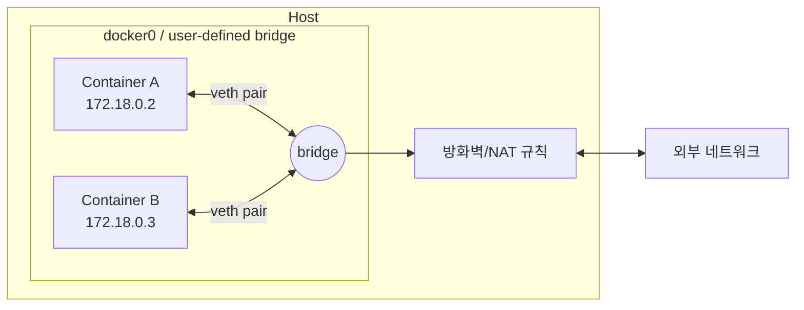

# 컨테이너 네트워킹

## 핵심 정의
컨테이너 네트워킹(container networking)은 컨테이너가 호스트, 다른 컨테이너, 외부 네트워크와 통신할 수 있도록 격리된 네트워크 환경을 구성하는 방식이다. Docker는 리눅스 커널의 네트워크 네임스페이스(network namespace)를 이용해 각 컨테이너에 독립된 네트워크 스택(자체 인터페이스, 라우팅 테이블, iptables 규칙)을 부여하고, 그 위에 브리지(bridge), 호스트(host), 오버레이(overlay) 등 여러 네트워크 드라이버(network driver)를 제공해 통신 범위와 격리 수준을 선택할 수 있게 한다.

같은 사용자 정의 브리지 네트워크에 속한 컨테이너끼리는 서비스 이름으로 서로를 찾을 수 있고(내장 DNS), 기본 NAT 모드에서 외부 송신에는 masquerading, 외부 수신에는 published port 등을 사용한다. routed gateway mode 등 다른 구성도 가능하다.

## 동작 원리 / 구조

### 기본 드라이버 종류

| 드라이버 | 격리 수준 | 용도 |
|---|---|---|
| bridge | 호스트 내 가상 네트워크로 격리, NAT로 외부 통신 | 단일 호스트에서 컨테이너 간 통신 (기본값) |
| host | 격리 없음, 호스트 네트워크 스택 직접 사용 | 최고 성능이 필요하거나 포트 매핑 오버헤드를 없애고 싶을 때 |
| none | 네트워크 인터페이스 없음(loopback만) | 완전한 네트워크 격리가 필요한 배치 작업 등 |
| overlay | 여러 호스트에 걸친 가상 네트워크(VXLAN 캡슐화) | Docker Swarm 등 멀티 호스트 클러스터 |
| macvlan | 컨테이너에 물리 네트워크상의 실제 MAC 주소 부여 | 컨테이너를 물리 네트워크의 독립 장치처럼 노출 |

### 브리지 네트워크 통신 흐름



각 컨테이너는 veth pair(가상 이더넷 쌍)로 브리지에 연결되며, 기본 NAT 모드에서 호스트 외부로 나가는 트래픽은 MASQUERADE 규칙을 통해 호스트 IP로 NAT되어 외부로 나간다. 외부에서 컨테이너로 들어오는 트래픽은 `-p 8080:8080` 같은 포트 매핑을 통해 호스트 포트에서 컨테이너 포트로 DNAT된다.

### 기본 브리지 vs 사용자 정의 브리지
Docker 설치 시 자동 생성되는 기본 브리지(`docker0`)는 컨테이너 이름 기반 DNS 해석을 지원하지 않아 컨테이너끼리 통신하려면 IP를 직접 알아야 한다. 반면 `docker network create`로 만든 사용자 정의 브리지(user-defined bridge)는 내장 DNS 서버를 통해 컨테이너 이름(또는 `docker-compose`의 서비스명)으로 서로를 찾을 수 있고, 네트워크 단위로 격리도 더 세밀하게 제어할 수 있다. 이 때문에 실무에서는 기본 브리지 대신 항상 사용자 정의 브리지(또는 Compose가 자동 생성하는 프로젝트 전용 네트워크)를 사용하는 것이 표준이다.

### Docker Compose와 네트워킹
`docker-compose.yml`로 여러 서비스를 띄우면 기본적으로 프로젝트 이름 기반의 단일 브리지 네트워크가 생성되고, 각 서비스는 서비스명을 호스트명으로 사용해 서로 통신한다.

```yaml
services:
  api:
    build: .
    ports:
      - "8080:8080"
    depends_on:
      - db
  db:
    image: postgres:16
    environment:
      POSTGRES_PASSWORD: ${POSTGRES_PASSWORD:?로컬 개발용 DB 비밀번호를 설정하세요}
```

`api` 컨테이너는 `db:5432`로 접속하면 되고, DNS 해석은 Compose가 만든 네트워크 내장 DNS가 처리한다.

본문 veth·bridge·NAT는 Linux Engine 기본 구성을 기준으로 하며 firewall backend는 iptables 또는 지원되는 nftables 설정에 따라 다르다. host/컨테이너 namespace 공유 모드는 localhost 의미가 달라진다. Docker Desktop4.34+의 host networking은 opt-in 기능이며 native Linux host 모드와 제약이 다르다. -p 8080:8080은 기본적으로 모든 호스트 주소에 노출하므로 로컬 개발 전용이면 127.0.0.1:8080:8080으로 바인딩한다. Compose 예제는 지정한 Postgres16 개발 환경으로 초기화 비밀번호가 필요하며 앱 연결 설정·재시도는 별도 구성한다. depends_on short 문법은 DB 준비 완료를 기다리지 않는다.

## 실무 관점
- **언제 host 네트워크를 쓰는가**: NAT/포트 매핑으로 인한 소폭의 지연조차 줄여야 하는 고성능 네트워킹 워크로드(예: 대량 트래픽 프록시, 일부 모니터링 에이전트)에서 사용한다. 다만 컨테이너가 호스트의 포트를 그대로 점유하므로 포트 충돌 위험이 생기고, 네트워크 격리가 사라져 보안 관점에서는 트레이드오프가 크다.
- **흔한 실수**: 기본 브리지 네트워크에서 컨테이너 이름으로 통신을 시도했다가 DNS 해석이 안 되는 문제(사용자 정의 브리지가 아니라서 발생). `localhost`로 다른 컨테이너에 접속하려는 실수(컨테이너는 각자 독립된 네트워크 네임스페이스를 가지므로 `localhost`는 자기 자신만 가리킨다). 여러 Compose 프로젝트가 같은 서브넷 대역을 사용해 네트워크 충돌이 나는 경우.
- **컨테이너-호스트 간 통신**: 컨테이너에서 호스트 서비스(예: 로컬에서 띄운 DB)에 접근해야 할 때는 `host.docker.internal`(Docker Desktop 환경) 같은 특수 DNS 이름을 사용하거나, Linux Engine에서는 extra_hosts의 host-gateway 매핑 등을 사용할 수 있다. 호스트 서비스도 접근 가능한 인터페이스에 bind되어 있어야 한다.
- **포트 매핑과 성능**: 기본 브리지 드라이버는 userland-proxy 또는 iptables DNAT을 거치므로 host 네트워크 대비 약간의 오버헤드가 있다. 대부분의 웹 애플리케이션 트래픽 규모에서는 무시할 수준이지만, 초고빈도 트래픽에서는 벤치마크가 필요하다.
- **튜닝/설정 포인트**: `docker network create --subnet`으로 서브넷을 명시적으로 지정해 여러 프로젝트 간 IP 대역 충돌을 방지. `docker network inspect`로 실제 연결된 컨테이너와 IP 확인. 컨테이너 간 통신을 애플리케이션 레벨에서 제한하고 싶다면 네트워크를 서비스군별로 분리(예: `frontend-net`, `backend-net`)해 DB 컨테이너는 `backend-net`에만 붙이는 방식으로 네트워크 세그멘테이션을 구성한다.

### 공개 포트의 차단은 실제 패킷 경로에서 검증한다

Linux Docker의 공개 포트는 목적지 NAT(DNAT)를 거쳐 전달될 수 있어, 호스트의 UFW INPUT/OUTPUT 규칙으로 차단했다고 생각한 포트가 컨테이너에는 도달할 수 있다. 호스트 방화벽 상태 화면만으로 결론을 내리지 말고 외부 클라이언트에서 실제 주소·포트로 접속해 확인한다. Desktop의 VM 경로와 Linux Engine의 방화벽 경로도 구분한다.

iptables 백엔드에서는 사용자 규칙을 적용하는 `DOCKER-USER` 체인이 Docker의 전달 허용 규칙보다 앞서 평가된다. 일반 FORWARD 체인 뒤에 덧붙인 규칙은 앞에서 이미 허용된 패킷을 막지 못할 수 있다. 다만 DOCKER-USER에 도착했을 때는 DNAT가 끝나 대상 주소·포트가 컨테이너 기준이다. 공개한 호스트의 원래 주소·포트로 제한하려면 conntrack의 원래 연결 정보를 고려해야 하며, 공식 문서는 이 조회의 성능 비용도 경고한다. 이 규칙을 nftables 백엔드에 그대로 복사하지 않고 사용 중인 백엔드부터 확인한다.

## 심화 Q&A

### Q. 같은 호스트에서 컨테이너 A가 컨테이너 B에 `localhost:5432`로 접속을 시도하면 왜 실패하는가?
A. 기본 bridge 구성에서는 각 컨테이너가 독립된 네트워크 네임스페이스를 가지므로 `localhost`(127.0.0.1)는 컨테이너 자기 자신의 loopback 인터페이스를 가리킨다. B가 자신의 컨테이너 안에서 5432 포트를 리스닝하고 있어도, A 입장에서는 그 주소가 전혀 다른 네트워크 네임스페이스이므로 연결할 수 없다. 같은 사용자 정의 브리지 네트워크에 두 컨테이너를 연결하고 B의 서비스명이나 컨테이너 IP로 접속해야 한다.

### Q. 기본 브리지와 사용자 정의 브리지의 격리 범위는 어떻게 다른가?
A. Linux Docker Engine의 bridge는 기본적으로 같은 네트워크 안의 통신을 허용하고 서로 다른 네트워크 사이의 직접 접근을 제한한다. 사용자 정의 브리지는 프로젝트별 네트워크 분리와 이름 기반 DNS를 제공한다. 네트워크가 달라도 기본 NAT 모드에서는 호스트에 publish한 주소·포트로 접근할 수 있으므로, `docker network connect`만이 유일한 통신 경로는 아니다. routed 등 gateway mode와 호스트 방화벽 설정에 따라 경로가 달라지며, firewall backend도 iptables 또는 nftables 구성에 따른다.

### Q. overlay 네트워크는 여러 호스트에 걸친 통신을 어떻게 구현하는가?
A. overlay 네트워크는 VXLAN(Virtual Extensible LAN) 캡슐화를 사용해 컨테이너 간 이더넷 프레임을 UDP 패킷으로 감싸 호스트 간 실제 네트워크(underlay)를 통해 전달한다. 각 호스트의 커널에 VXLAN 터널 인터페이스가 생성되고, Swarm의 경우 gossip 프로토콜 기반 컨트롤 플레인이 어떤 컨테이너가 어느 호스트에 있는지 분산 관리한다. 캡슐화 오버헤드(헤더 추가) 때문에 브리지 네트워크보다 약간의 성능 저하가 있을 수 있다.

### Q. 포트를 여러 개 매핑한 컨테이너에서 특정 포트만 외부에 노출하고 나머지는 내부 전용으로 두려면 어떻게 하는가?
A. `docker run -p`로 명시한 포트만 호스트에 바인딩되어 외부로 노출된다. EXPOSE는 메타데이터이며 이를 선언하지 않아도 같은 네트워크에서 리스닝 포트에 접근할 수 있다. -P는 EXPOSE 메타데이터를 이용해 publish한다. 즉 외부 노출이 필요 없는 포트(예: 관리용 액추에이터 포트)는 `-p`로 매핑하지 않고 `EXPOSE`만 선언해두면, 같은 네트워크에서 접근할 수 있고 기본 NAT 구성에서 외부 직접 접근은 제한된다. direct routing·routed mode·host networking에서는 별도 방화벽 확인이 필요하다.

### Q. 컨테이너 네트워크 격리가 애플리케이션 보안에 어떤 실질적 이득을 주는가, 그리고 한계는 무엇인가?
A. 네트워크를 서비스군별로 분리하면(예: DB 전용 네트워크에 API 컨테이너만 연결) 침해된 프론트엔드 컨테이너가 곧바로 DB 네트워크 전체를 스캔하지 못하게 막는 효과가 있다. 다만 이는 네트워크 계층의 격리일 뿐이며, 컨테이너 자체가 커널을 호스트와 공유하는 구조적 특성상 커널 취약점을 통한 컨테이너 이스케이프(escape)까지 막아주지는 못한다. 즉 네트워크 세그멘테이션은 심층 방어(defense in depth)의 한 계층이지 유일한 보안 경계가 아니다.

### Q. `docker-compose`에서 `depends_on`은 네트워크 연결 시점의 타이밍 문제를 해결해주는가?
A. 아니다. `depends_on`은 컨테이너 시작 순서만 보장할 뿐, 기본적으로는 해당 서비스의 프로세스가 완전히 준비(ready)될 때까지 기다려주지 않는다(예: DB 컨테이너는 떴지만 아직 커넥션을 받을 준비가 안 된 상태). `condition: service_healthy`와 healthcheck를 함께 정의해야 실제로 서비스가 응답 가능한 상태까지 기다린 뒤 의존 컨테이너를 시작시킬 수 있다.

## 관련 개념
- [[Docker 이미지와 레이어 구조]]
- [[리버스 프록시]]
- [[L4와 L7 로드밸런싱]]
- [[Spring Cloud Config와 서비스 디스커버리]]

## 참고 자료

- [Docker Bridge network](https://docs.docker.com/engine/network/drivers/bridge/) — user-defined DNS·격리·gateway mode. 확인: 2026-09-08.
- [Docker Packet filtering](https://docs.docker.com/engine/network/packet-filtering-firewalls/) — iptables/nftables backend. 확인: 2026-09-08.
- [Docker Port publishing](https://docs.docker.com/engine/network/port-publishing/) — binding·direct routing·NAT. 확인: 2026-09-08.
- [Docker Host network](https://docs.docker.com/engine/network/drivers/host/) — Linux·Desktop4.34+ opt-in. 확인: 2026-09-08.
- [Docker Compose Startup order](https://docs.docker.com/compose/how-tos/startup-order/) — depends_on·service_healthy. 확인: 2026-09-08.

부분 재검증: 2026-09-22. [Docker bridge](https://docs.docker.com/engine/network/drivers/bridge/)와 [port publishing](https://docs.docker.com/engine/network/port-publishing/)의 네트워크 간 published-port 접근·gateway mode를 대조했다. 노트 전체의 버전 의존 서술을 재검증한 것은 아니므로 `verified`는 유지했다.

부분 재검증: 2026-10-04. [Docker packet filtering](https://docs.docker.com/engine/network/packet-filtering-firewalls/)의 UFW 경계와 [Docker iptables](https://docs.docker.com/engine/network/firewall-iptables/)의 DOCKER-USER 순서·DNAT·conntrack 비용을 확인했다. 적용 범위는 Linux Docker Engine의 iptables 백엔드이며 [Engine 29 릴리스 노트](https://docs.docker.com/engine/release-notes/29/)의 별도 실험적 nftables 백엔드와 구분했다. 실제 방화벽 변경·공개 포트 접속·Desktop 네트워크 시험은 하지 않았고 `verified`는 유지했다.
