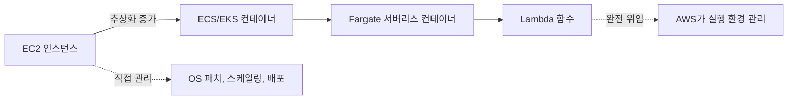
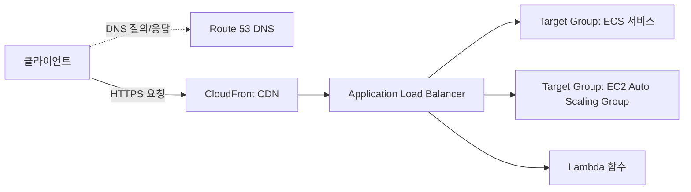

# AWS 핵심 컴퓨트와 네트워크 서비스

## 핵심 정의
AWS의 컴퓨트(compute) 서비스는 워크로드 실행 방식에 따라 크게 세 축으로 나뉜다. 가상 서버를 직접 다루는 EC2(Elastic Compute Cloud), 컨테이너 오케스트레이션을 위한 ECS(Elastic Container Service)/EKS(Elastic Kubernetes Service)와 서버리스 컨테이너 실행 환경인 Fargate, 그리고 함수 단위로 코드를 실행하는 Lambda다. 네트워크 서비스는 이 컴퓨트 자원 간, 그리고 외부 인터넷과의 트래픽을 제어하는 로드밸런서(ELB), DNS(Route 53), CDN(CloudFront), 사설 연결(Direct Connect, Transit Gateway) 등으로 구성된다. 서버 개발자 입장에서는 "어떤 실행 모델을 쓸 것인가"와 "트래픽이 어떤 경로로 내 애플리케이션까지 도달하는가"를 이해하는 것이 핵심이다.

## 동작 원리 / 구조

### 컴퓨트 서비스 스펙트럼

- EC2: 게스트 OS와 애플리케이션을 관리하며 물리 인프라·가상화는 AWS가 담당. 인스턴스 패밀리(범용 M, 컴퓨트 최적화 C, 메모리 최적화 R, 가속 컴퓨팅 P/G 등)와 세대(예: C7g, M7i, R8g)로 구분되며, Graviton4(Arm 기반 C8g/M8g/R8g)와 Graviton5를 구분한다. M9g/M9gd의 Graviton5 GA는 2026-06-10 발표로 확인했으며 리전·규모별 제공 여부를 조회해야 한다. 인텔/AMD 기반 x86 인스턴스와 Arm 기반 Graviton 인스턴스는 동일 워크로드에서도 가격 대비 성능 차이가 커서 신규 구축 시 Graviton 우선 검토가 일반적이다.
- 구매 옵션: On-Demand(온디맨드, 사용한 만큼 과금), Reserved Instance/Savings Plans(1~3년 약정 할인), Spot Instance(유휴 용량을 저가로, 회수 가능성 있음). 상시 운영 서버는 Savings Plans, 배치/비동기 워커는 Spot이 비용 효율적이다.
- ECS/EKS: 컨테이너 오케스트레이션. ECS는 AWS 자체 스케줄러로 학습 곡선이 낮고, EKS는 표준 쿠버네티스(Kubernetes) API를 그대로 쓰므로 이식성이 높다. 둘 다 실행 계층으로 EC2(직접 관리) 또는 Fargate(서버리스)를 선택할 수 있다.
- Lambda: 이벤트 기반 함수 실행. 콜드 스타트(cold start), 최대 실행 시간(15분) 제한, 동시성(concurrency) 제한이 설계 시 주요 고려사항이다.

### 트래픽 경로 (인터넷 → 애플리케이션)

- ALB(Application Load Balancer): L7(HTTP/HTTPS) 라우팅, 경로/호스트 기반 라우팅, WebSocket 지원. 마이크로서비스 백엔드에 가장 흔히 쓰임.
- NLB(Network Load Balancer): L4(TCP/UDP), 초저지연·고정 IP 필요 시, 정적 IP나 TLS passthrough가 필요한 gRPC 서비스 등에 사용.
- GWLB(Gateway Load Balancer): L3 트래픽을 방화벽/IDS 같은 어플라이언스로 투명하게 우회시키는 용도. Geneve 캡슐화로 원본 패킷을 전달한다.
- Route 53: DNS뿐 아니라 헬스체크 기반 장애 조치(failover), 지연 시간 기반 라우팅(latency-based routing), 가중치 라우팅(weighted routing) 등 트래픽 정책을 제공.
- CloudFront: 엣지 캐싱, TLS 종료(termination), Origin Shield로 오리진 부하 감소.

ALB도 gRPC target group을 지원하므로 gRPC라는 이유만으로 NLB를 선택하지 않는다. NLB의 TCP listener는 TLS passthrough, TLS listener는 TLS termination에 사용한다. CloudFront origin-facing prefix list는 다른 고객의 CloudFront도 포함하므로 자기 distribution 인증을 대신하지 않는다. VPC Origins는 조회 문서에서 gRPC를 지원하지 않는 등 기능·리전 제약이 있다. Fargate는 실행 인프라를 관리하지만 컨테이너 이미지 패치·IAM·태스크 수·리소스 설정은 사용자가 담당한다. ECS/EKS/Fargate는 단순한 추상화 순서라기보다 오케스트레이터와 실행 계층의 조합이다.

## 실무 관점
- 상시 트래픽이 있고 지연에 민감한 API 서버는 EC2/ECS + ALB 조합이 기본값이고, 트래픽이 간헐적이거나 이벤트 기반(파일 업로드 처리, 배치 트리거)이면 Lambda가 비용 효율적이다. 다만 Lambda는 실행 시간·메모리·동시성 한도가 있어 장시간 스트리밍이나 대용량 배치에는 부적합하다.
- ECS와 EKS 선택은 조직의 쿠버네티스 숙련도가 갈림길이다. 이미 온프레미스에서 K8s를 운영 중이면 EKS로 이식성을 확보하고, 신규 팀이거나 운영 부담을 줄이고 싶으면 ECS(특히 Fargate 조합)가 학습 비용이 낮다.
- Auto Scaling Group(ASG)과 ALB Target Group을 함께 쓸 때 헬스체크 설정(경로, 임계값, 간격)이 부실하면 배포 중 트래픽이 아직 준비되지 않은 인스턴스로 흘러가 5xx가 급증하는 장애가 흔하다. Deregistration delay(연결 드레이닝 시간)를 애플리케이션의 그레이스풀 셧다운 시간과 맞추는 것도 중요하다.
- Spot 중단 알림은 보통 2분 전이지만 best effort이며 hibernation은 즉시 시작되어 2분 유예가 없다. 따라서, 상태를 갖지 않는(stateless) 워커나 체크포인팅이 가능한 배치 등에 적용하고 알림 없이 장애가 나도 복구할 수 있어야 한다. 세션을 물고 있는 서비스에 무분별하게 적용하면 사용자 요청이 끊기는 장애로 이어진다.
- Lambda 콜드 스타트는 VPC 내부 리소스(RDS 등)에 연결할 때 ENI(Elastic Network Interface) 생성 지연으로 특히 커졌던 과거 이슈가 있었으나, Hyperplane ENI 공유 방식 개선으로 상당히 완화되었다. 그래도 초저지연이 필요한 동기 API 경로에는 프로비저닝된 동시성(provisioned concurrency)을 고려한다.
- CloudFront 캐시 무효화(invalidation)는 비용과 지연이 있으므로, 정적 자산에 버전이 붙은 파일명을 사용하고 응답을 실제로 바꾸는 쿼리/헤더만 cache key에 반영한다. 무분별한 key 확장은 hit ratio를 낮춘다.

### Lambda 동시성 예약과 실행 환경 사전 초기화를 구분한다

예약된 동시성(reserved concurrency)은 함수가 사용할 동시 실행 몫을 확보하면서 그 함수의 최대 동시 실행 수도 제한한다. 실행 환경을 미리 초기화하는 설정은 아니므로 콜드 스타트 해결책으로만 적용하지 않는다. 하위 DB·API를 보호하려고 상한을 낮추면 호출 경로에 따라 스로틀링·대기·재시도가 늘 수 있어 함께 관측한다.

프로비저닝된 동시성(provisioned concurrency)은 지정한 버전이나 별칭(alias)의 실행 환경을 미리 준비한다. `$LATEST`에는 적용할 수 없으며 호출 대상도 설정한 버전/별칭을 가리켜야 한다. 이 용량을 넘으면 허용된 전체 동시성 안에서 on-demand 실행으로 넘어갈 수 있어 콜드 스타트가 다시 나타날 수 있다. 사전 준비 용량과 함수 상한을 별도로 보고, 배포 시 별칭이 이동한 뒤에도 실제 호출 경로가 준비된 환경을 사용하는지 확인한다.

## 심화 Q&A

### Q. ALB와 NLB 중 어떤 것을 선택할지 판단 기준은?
A. HTTP 레벨 라우팅(경로/호스트 기반), 인증 통합(Cognito), WebSocket이 필요하면 ALB. 반대로 TCP/UDP 프로토콜 자체를 그대로 전달해야 하거나(예: 커스텀 프로토콜, gRPC의 TLS passthrough), 고정 IP가 필요하거나(방화벽 화이트리스트 연동), 극단적으로 낮은 지연과 높은 처리량이 필요하면 NLB를 선택한다. 두 개를 체이닝(ALB 앞에 NLB)해서 고정 IP와 L7 라우팅을 동시에 확보하는 패턴도 실무에서 쓰인다.

### Q. ECS Fargate와 EC2 기반 ECS의 트레이드오프는?
A. Fargate는 서버 관리(패치, 용량 계획, 스케일링 인프라)를 AWS에 위임하는 대신 자원 조합·할인·가동률에 따라 비용 구조가 다르며, 인스턴스 레벨 커스터마이징(특정 GPU, 커널 파라미터 튜닝, 로컬 캐시 데몬)이 제한적이다. 트래픽 변동이 크고 운영 인력이 적은 조직은 Fargate가 총소유비용(TCO) 관점에서 유리할 수 있고, 대규모로 안정적인 트래픽이 있고 인스턴스당 밀도를 최적화하고 싶은 조직은 EC2 기반이 유리하다.

### Q. Lambda의 동시성 제한이 걸렸을 때 왜 특정 요청만 실패하는가?
A. Lambda는 계정의 리전별 한도와 함수별 reserved concurrency 등에 의해 동시 실행(concurrent execution)이 제한되고, 한도를 초과하면 초과분 요청이 스로틀링(throttling, 429/Too Many Requests 또는 비동기 호출 시 재시도 큐)된다. 특정 함수가 트래픽을 독점하면 같은 계정의 다른 함수까지 영향을 받을 수 있어, 중요한 함수에는 예약된 동시성(reserved concurrency)을 설정해 격리하는 것이 일반적이다. 다만 예약된 동시성을 과도하게 배분하면 계정 전체 한도를 소모해 다른 함수의 가용 동시성이 줄어드는 트레이드오프가 있다.

### Q. Spot Instance를 상용 서비스에 안전하게 쓰려면 어떤 설계가 필요한가?
A. 최소 On-Demand 비율을 보장하는 Mixed Instance Policy(ASG 내 On-Demand/Spot 혼합), 여러 인스턴스 타입/AZ에 분산해 특정 풀의 회수 확률을 낮추는 다양화(diversification), 그리고 2분 전 인터럽션 통지를 감지해 연결 드레이닝과 워크 재배치를 트리거하는 훅(hook)이 필요하다. 세션 상태를 인스턴스 로컬에 두지 않고 외부 스토어(Redis, DynamoDB)로 분리하는 것이 전제 조건이다.

### Q. CloudFront와 ALB를 함께 쓸 때 오리진 검증(origin verification)이 왜 필요한가?
A. CloudFront 없이 ALB에 직접 요청을 보내는 우회 경로가 열려 있으면 CDN의 캐싱/WAF 보호를 건너뛸 수 있다. 전통적으로는 커스텀 헤더(비밀 값)를 CloudFront가 오리진 요청에 추가하고 ALB 리스너 규칙에서 해당 헤더를 검증하는 방식, 또는 ALB 보안 그룹에서 AWS 관리형 프리픽스 리스트(`com.amazonaws.global.cloudfront.origin-facing`)만 허용해 CloudFront 외 경로를 차단하는 방식을 함께 썼다. OAC는 S3뿐 아니라 Lambda function URL 등 지원 origin에서도 사용되지만 ALB에 직접 적용하는 기능은 아니다. , ALB/NLB를 완전히 프라이빗 서브넷에 두고 싶다면 CloudFront VPC Origins 기능을 사용해 퍼블릭 IP 없이 CloudFront와 VPC 내부 오리진을 직접 연결하는 방식이 더 근본적인 해법이다.

### Q. EC2 인스턴스 세대 업그레이드(예: M6 → M7 → M8) 시 성능 외에 무엇을 점검해야 하는가?
A. Nitro 시스템 버전에 따른 네트워크 카드/드라이버 호환성(ENA 드라이버 버전), 인스턴스 스토어 유무와 타입 변경(NVMe SSD 지원 여부), Arm(Graviton) 전환 시 애플리케이션과 의존 라이브러리의 아키텍처 호환성(멀티 아키텍처 컨테이너 이미지 빌드 필요 여부)을 함께 검토해야 한다. 단순 인스턴스 타입 교체만으로 끝나지 않는 경우가 많다.

## 관련 개념
- [[VPC 구조]]
- [[Kubernetes 핵심 오브젝트]]
- [[L4와 L7 로드밸런싱]]

## 참고 자료

- [AWS M9g/M9gd GA](https://aws.amazon.com/about-aws/whats-new/2026/06/ec2-m9g-m9gd-instances-graviton5-processors-available/) — 2026-06-10·Graviton5; 리전 가용성 별도. 확인: 2026-09-08.
- [AWS Lambda quotas](https://docs.aws.amazon.com/lambda/latest/dg/gettingstarted-limits.html) — 일반 함수 900초·계정/리전 동시성. 확인: 2026-09-08.
- [EC2 Spot interruption notices](https://docs.aws.amazon.com/AWSEC2/latest/UserGuide/spot-instance-termination-notices.html) — 2분·best effort·hibernate 예외. 확인: 2026-09-08.
- [Lambda VPC networking](https://docs.aws.amazon.com/lambda/latest/dg/configuration-vpc.html) — 공유 Hyperplane ENI. 확인: 2026-09-08.
- [NLB Listeners](https://docs.aws.amazon.com/elasticloadbalancing/latest/network/load-balancer-listeners.html) — TCP/TLS/UDP 계열 지원. 확인: 2026-09-08.
- [ALB Target groups](https://docs.aws.amazon.com/elasticloadbalancing/latest/application/load-balancer-target-groups.html) — HTTP/2·gRPC·대상 유형. 확인: 2026-09-08.
- [CloudFront Origin restrictions](https://docs.aws.amazon.com/AmazonCloudFront/latest/DeveloperGuide/private-content-restricting-access-to-origin.html) — OAC 호환origin. 확인: 2026-09-08.
- [CloudFront VPC origins](https://docs.aws.amazon.com/AmazonCloudFront/latest/DeveloperGuide/private-content-vpc-origins.html) — private origins·gRPC/리전 제약. 확인: 2026-09-08.

부분 재검증: 2026-10-04. [Lambda reserved concurrency](https://docs.aws.amazon.com/lambda/latest/dg/configuration-concurrency.html)의 전용 동시성 몫·상한과 [provisioned concurrency](https://docs.aws.amazon.com/lambda/latest/dg/provisioned-concurrency.html)의 사전 초기화·버전/별칭·$LATEST 제외·초과 트래픽 on-demand 실행을 대조했다. 적용 범위는 조회일 AWS Lambda 관리형 서비스 계약이며 계정별 한도·실행 시간·EC2 세대 등 다른 스펙 전체는 재검증하지 않았다. 실제 함수 배포·부하·스로틀링 시험은 하지 않았고 `verified`는 유지했다.
