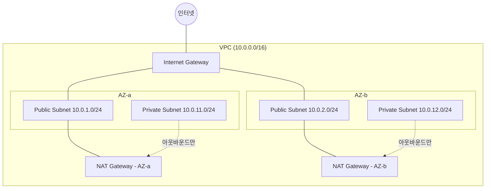

# VPC 구조

## 핵심 정의
VPC(Virtual Private Cloud)는 AWS 계정 안에 논리적으로 격리된 가상 네트워크다. IP 주소 대역(CIDR), 서브넷(subnet), 라우팅 테이블(route table), 게이트웨이(gateway)를 사용자가 직접 설계하며, 이 구조가 곧 애플리케이션의 네트워크 보안 경계와 트래픽 흐름을 결정한다. 서버 개발자가 인프라를 직접 설계하지 않더라도, 자신의 서비스가 어느 서브넷에 배치되고 어떤 경로로 외부와 통신하는지 이해하지 못하면 배포 실패나 보안 사고의 원인을 진단하기 어렵다.

## 동작 원리 / 구조

### 기본 구성 요소

- **CIDR 블록**: VPC 생성 시 IP 대역을 지정(예: 10.0.0.0/16). 서브넷은 이 대역을 AZ(Availability Zone)별로 쪼갠 하위 집합이다. 일반 IPv4 서브넷마다 5개 IP(네트워크 주소, VPC 라우터, DNS, 향후 예약, 브로드캐스트)는 AWS가 예약해 실제 사용 가능 IP 수는 CIDR 크기보다 적다.
- **퍼블릭 서브넷 vs 프라이빗 서브넷**: 인터넷 대상 트래픽에 대해 Internet Gateway(IGW)로 향하는 직접 경로(IPv4의 흔한 예: 0.0.0.0/0)가 있으면 퍼블릭, 없으면 프라이빗이다. 즉 "퍼블릭/프라이빗"은 서브넷 속성이 아니라 연결된 라우팅 테이블의 경로 설정으로 결정된다.
- **Internet Gateway(IGW)**: VPC와 인터넷 간 양방향 통신을 위한 관문. 리전 내 이중화되어 있으며 별도 IGW 병목을 만들지 않도록 수평 확장되지만 인스턴스·경로·서비스 한도까지 무제한이라는 뜻은 아니다.
- **NAT Gateway**: 프라이빗 서브넷의 리소스가 아웃바운드로만 인터넷에 나갈 수 있게 해주는 관리형 게이트웨이(예: 패치 다운로드, 외부 API 호출). zonal public NAT를 쓰는 구조에서는 AZ마다 배치해 AZ 간 의존성을 줄인다. 단일 zonal NAT를 여러 AZ가 공유하면 해당 AZ 장애 시 나머지 AZ의 아웃바운드까지 영향을 받는다.
- **라우팅 테이블(Route Table)**: 서브넷 단위로 연결되며, 목적지 CIDR별로 다음 홉(로컬, IGW, NAT, VPC Peering, Transit Gateway, VPC Endpoint)을 지정한다.

### 보안 계층: Security Group vs Network ACL
| 구분 | Security Group | Network ACL |
|---|---|---|
| 적용 단위 | ENI(인스턴스) | 서브넷 |
| 상태 | Stateful(응답 트래픽 자동 허용) | Stateless(인/아웃바운드 각각 명시 필요) |
| 규칙 방식 | Allow만 존재 | Allow/Deny 모두 가능 |
| 평가 순서 | 모든 규칙을 종합 평가 | 번호 순서대로 첫 매치 적용 |

- 보안 그룹은 기본적으로 인스턴스 단위 방화벽이고, NACL은 서브넷 경계의 2차 방어선이다. 실무에서는 보안 그룹만으로 충분한 경우가 많고, NACL은 특정 IP 대역을 서브넷 단위로 명시적 차단(deny)해야 할 때 추가한다.

### 리소스 간 연결 패턴
- **VPC Peering**: 두 VPC를 1:1로 연결. CIDR이 겹치면 불가능하고, 전이적(transitive) 라우팅이 안 되어 A-B, B-C를 연결해도 A-C는 직접 통신이 안 된다.
- **Transit Gateway**: 다수의 VPC/온프레미스 네트워크를 허브-스포크(hub-and-spoke) 구조로 중앙 연결. 피어링의 N² 연결 복잡도 문제를 해소한다.
- **VPC Endpoint**: 인터넷을 거치지 않고 AWS 서비스(S3, DynamoDB 등)에 접근. 대표적으로 Gateway Endpoint(라우팅 테이블 경로, S3/DynamoDB, endpoint 자체 추가요금 없음)와 Interface Endpoint(PrivateLink ENI, 지원 서비스별 시간·데이터 처리 과금)가 있다. GWLB Endpoint 등 다른 유형도 있다.
- **Direct Connect / Site-to-Site VPN**: 온프레미스 데이터센터와 VPC를 사설 회선(Direct Connect) 또는 IPsec 터널(VPN)로 연결.

그림은 zonal public NAT를 AZ별 public subnet에 배치한 IPv4 예다. Regional NAT Gateway는 VPC 단위로 생성하며 public subnet에 직접 배치하지 않고 워크로드 AZ로 자동 확장한다. 신규 AZ 확장에는 최대60분이 걸릴 수 있어 그동안 다른 AZ로 전달될 수 있고 private NAT는 zonal을 사용한다. Public subnet 경로만으로 모든 리소스가 공개되는 것은 아니며 IPv4 public 주소·SG·NACL·앱 listen 조건이 필요하다. IPv6는 주소/IGW와 egress-only IGW 모델을 별도로 다룬다. Direct Connect의 사설 회선은 기본 암호화를 의미하지 않으며 TLS·지원 MACsec·VPN을 검토한다.

## 실무 관점
- 애플리케이션 서버(EC2/ECS 태스크)는 프라이빗 서브넷에, 인터넷용 ALB와 zonal public NAT Gateway는 퍼블릭 서브넷에 두는 3-tier 구조가 기본값이다. DB(RDS)는 인터넷 경로 자체가 없는 별도의 프라이빗 서브넷(DB subnet group)에 격리하는 것이 일반적이다.
- 서브넷 CIDR을 처음부터 너무 작게 잡으면(예: /28) 나중에 ECS 태스크나 Lambda-in-VPC의 ENI가 IP를 소진해 스케일 아웃이 막히는 장애가 발생한다. Lambda는 subnet+security-group 조합별 Hyperplane ENI를 공유하며 ENI당 최대65,000 연결/포트를 지원한다. 동시 실행당 ENI 하나라는 계산은 틀리며 워크로드·ENI 조합·연결 수에 따라 주소 여유를 산정한다.
- NAT Gateway는 데이터 처리량 기반 과금이라 트래픽이 큰 워크로드(대량 외부 API 호출, 이미지 다운로드)에서 예상외로 비용이 커지는 경우가 흔하다. S3처럼 자주 쓰는 서비스는 Gateway Endpoint로 우회시켜 NAT 트래픽과 비용을 줄인다.
- 보안 그룹 규칙에서 소스를 0.0.0.0/0으로 열어두고 포트만 제한하는 실수가 잦다. 가능하면 소스를 다른 보안 그룹 ID로 지정(예: "ALB 보안 그룹에서 오는 트래픽만 허용")해 인스턴스 IP 변경에도 규칙이 깨지지 않게 한다.
- VPC Peering을 여러 개 맺다 보면 CIDR 설계 없이 확장한 조직에서 대역이 겹쳐 이후 Transit Gateway로 전환하지 못하는 경우가 있다. 초기부터 계정/환경별로 CIDR 대역을 겹치지 않게 사전 할당하는 IP 관리 정책이 필요하다.
- zonal NAT 구성에서 비용 절감을 위해 여러 AZ가 단일 NAT를 공유하면, 해당 NAT가 있는 AZ 장애 시 다른 AZ의 프라이빗 서브넷까지 아웃바운드가 끊기는 설계 결함이 될 수 있다. 비용과 가용성 사이의 트레이드오프를 팀 SLA 기준으로 명시적으로 결정해야 한다.

### Endpoint의 경로와 인가를 따로 확인

Interface Endpoint를 만들었다고 SDK 요청이 반드시 그 ENI로 향하는 것은 아니다. AWS 서비스의 기본 DNS 이름을 Endpoint로 해석하려면 private DNS 설정과 VPC의 DNS hostnames·DNS resolution을 함께 확인한다. 실제 실행 위치에서 이름이 어떤 주소로 해석되는지, 선택한 Endpoint ENI에 도달하는지, 그 보안 그룹이 호출을 허용하는지 순서대로 점검한다.

Endpoint policy는 Endpoint를 통한 서비스 접근을 제한하지만 identity policy나 리소스 정책을 대체하거나 덮어쓰지 않는다. 정책을 지정하지 않은 경우 기본 Endpoint policy는 전체 접근을 허용하며, 모든 서비스가 Endpoint policy를 지원하는 것도 아니다. 제한한 Endpoint가 있다는 사실만으로 공개 서비스 경로로의 접근까지 금지되지는 않으므로, 필요한 경우 리소스 정책의 VPC/Endpoint 조건과 실제 우회 경로를 함께 검토한다.

이 구분은 timeout과 AccessDenied를 나누는 데도 유용하다. DNS·라우팅·SG를 고쳐야 하는 연결 실패와, 요청은 서비스에 도달했지만 IAM·리소스·Endpoint 정책에서 거부된 경우를 같은 장애로 취급하지 않는다.

## 심화 Q&A

### Q. 같은 VPC 안에서 서브넷이 "퍼블릭"이라는 것이 실제로 무엇을 의미하는가?
A. 여기서는 일반 IPv4 인터넷 통신을 기준으로 한다. 서브넷의 인터넷 접근 분류는 라우팅으로 정해진다. 해당 서브넷에 연결된 라우팅 테이블에 0.0.0.0/0 → Internet Gateway 경로가 있고, 그 서브넷의 인스턴스가 퍼블릭 IP(또는 Elastic IP)를 실제로 할당받았을 때만 인터넷과 양방향 통신이 가능하다. 라우팅 테이블만 IGW로 향해 있어도 퍼블릭 IP가 없으면 외부에서 들어오는 트래픽은 도달할 방법이 없다.

### Q. NAT Gateway 없이 프라이빗 서브넷의 인스턴스가 S3에 접근하게 하려면?
A. Gateway VPC Endpoint를 만들어 프라이빗 서브넷의 라우팅 테이블에 S3 프리픽스 리스트로 향하는 경로를 추가하면 된다. 인터넷 IGW/NAT를 통하지 않으므로 해당 트래픽의 NAT 처리 과금을 피할 수 있다. 지연 우위는 환경에 따라 측정한다. 다만 Gateway Endpoint는 S3와 DynamoDB만 지원하며, 다른 서비스(SQS, Secrets Manager 등)는 Interface Endpoint(PrivateLink)가 필요하다.

### Q. VPC Peering이 전이적이지 않다는 것이 실무에서 왜 문제가 되는가?
A. Peering은 전이 라우팅을 지원하지 않으므로 A-B와 B-C만으로 A-C 중계가 되지 않으며 경로를 수동 추가해도 이 제약을 해소하지 못한다. VPC가 3개 이상으로 늘어나면 모든 VPC 쌍의 직접 연결이 필요하면 피어링 수가 N(N-1)/2로 조합 폭발이 일어나고 각 피어링마다 라우팅 테이블/보안 그룹을 개별 관리해야 한다. 이 문제 때문에 VPC가 일정 수를 넘어가면 Transit Gateway로 허브-스포크 구조로 전환하는 것이 표준적인 해법이다.

### Q. 보안 그룹은 stateful인데 NACL은 stateless인 것이 실제 트래픽에 어떤 차이를 만드는가?
A. 보안 그룹에서 인바운드 허용 규칙 하나만 넣으면 그에 대한 응답 트래픽은 아웃바운드 규칙 없이도 자동으로 나간다. 반면 NACL은 인바운드에서 특정 포트를 허용해도, 응답 트래픽이 임시 포트(ephemeral port, 보통 1024~65535)로 돌아오는 경로를 아웃바운드 규칙에 별도로 열어주지 않으면 차단된다. NACL 설정 시 클라이언트 임시 포트 범위를 아웃바운드에 허용하지 않아 특정 프로토콜만 간헐적으로 실패하는 문제가 흔한 원인 중 하나다.

### Q. Lambda를 VPC 안에 넣을지 말지는 어떤 기준으로 판단하는가?
A. RDS, ElastiCache처럼 VPC 내부에서만 접근 가능한 사설 리소스를 직접 호출해야 하면 VPC 연결이 필수다. 반대로 순수하게 다른 AWS 서비스(S3, DynamoDB, 외부 인터넷 API)만 호출한다면 VPC에 넣지 않는 것이 ENI 관리 오버헤드와 서브넷 IP 소모를 피하는 길이다. VPC에 넣어야 한다면 인터넷 접근이 필요한 경우 NAT Gateway 경로까지 함께 고려해야 하고, 그렇지 않다면 필요한 서비스에 대한 Interface Endpoint를 구성해 NAT 없이 처리하는 것도 가능하다.

### Q. 서브넷 CIDR 크기를 설계할 때 IP 고갈 외에 EKS/ECS 환경에서 특히 주의할 점은?
A. EKS의 기본 VPC CNI(Container Network Interface)는 파드(pod)마다 VPC 내 실제 IP를 하나씩 소비하는 구조라, 노드당 파드 밀도가 높아지면 일반 EC2보다 훨씬 빠르게 서브넷 IP가 고갈된다. 이런 환경에서는 서브넷을 더 크게 잡거나, 파드 전용 보조 CIDR(secondary CIDR, 예: 100.64.0.0/16 같은 별도 대역)을 추가해 기본 VPC 대역과 분리하는 구성이 흔히 쓰인다.

## 관련 개념
- [[AWS 핵심 컴퓨트와 네트워크 서비스]]
- [[L4와 L7 로드밸런싱]]
- [[Kubernetes 핵심 오브젝트]]

## 참고 자료

- [AWS VPC subnet sizing](https://docs.aws.amazon.com/vpc/latest/userguide/subnet-sizing.html) — 일반 IPv4 예약5주소·CIDR. 확인: 2026-09-08.
- [AWS Internet gateway](https://docs.aws.amazon.com/vpc/latest/userguide/VPC_Internet_Gateway.html) — IPv4 public주소·routing·SG. 확인: 2026-09-08.
- [AWS Regional NAT Gateway](https://docs.aws.amazon.com/vpc/latest/userguide/nat-gateways-regional.html) — regional/zonal·자동AZ확장·최대60분. 확인: 2026-09-08.
- [AWS NAT Gateway](https://docs.aws.amazon.com/vpc/latest/userguide/vpc-nat-gateway.html) — public/private NAT. 확인: 2026-09-08.
- [Lambda VPC](https://docs.aws.amazon.com/lambda/latest/dg/configuration-vpc.html) — subnet+SG 조합 Hyperplane ENI 공유. 확인: 2026-09-08.
- [AWS Gateway endpoints](https://docs.aws.amazon.com/vpc/latest/privatelink/gateway-endpoints.html) — S3/DynamoDB·endpoint 자체 추가요금없음. 확인: 2026-09-08.
- [VPC Security groups](https://docs.aws.amazon.com/vpc/latest/userguide/vpc-security-groups.html) — stateful allow·ENI. 확인: 2026-09-08.
- [VPC NACL](https://docs.aws.amazon.com/vpc/latest/userguide/vpc-network-acls.html) — stateless·번호순. 확인: 2026-09-08.
- [VPC Peering](https://docs.aws.amazon.com/vpc/latest/peering/vpc-peering-basics.html) — CIDR중복·nontransitive. 확인: 2026-09-08.
- [Direct Connect Encryption](https://docs.aws.amazon.com/directconnect/latest/UserGuide/encryption-in-transit.html) — 기본비암호화·MACsec/VPN. 확인: 2026-09-08.

부분 재확인: 2026-09-23. [AWS Interface Endpoint 설정](https://docs.aws.amazon.com/vpc/latest/privatelink/interface-endpoints.html)의 private DNS 전제와 [Endpoint policy](https://docs.aws.amazon.com/vpc/latest/privatelink/vpc-endpoints-access.html)의 기본 허용·서비스별 지원·다른 인가 정책과의 관계를 확인했다. 네트워크 경로별 진단은 이를 적용한 운영 절차다. 기존 NAT·Lambda·CIDR 한도 전체는 재검증하지 않아 `verified`는 유지한다.
