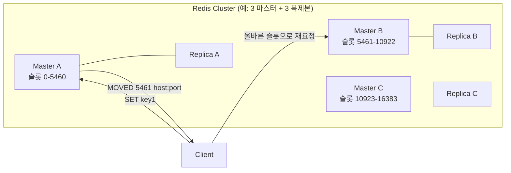

# Redis Cluster

## 핵심 정의

Redis Cluster는 데이터를 여러 노드에 자동으로 분산(샤딩, sharding)해 단일 인스턴스의 메모리/처리량 한계를 넘어서고, 노드 장애 시 자동 페일오버(failover)로 가용성을 확보하는 Redis의 공식 분산 운영 방식이다. 전체 키 공간(key space)을 16384개의 해시 슬롯(hash slot)으로 나누고, 각 마스터(master) 노드가 슬롯의 일부 구간을 소유하는 구조다. 클라이언트 요청 라우팅에 별도의 프록시나 중앙 코디네이터를 두지 않고, 클러스터에 참여한 노드들이 gossip 프로토콜로 서로의 상태를 공유하며 자율적으로 동작한다.

## 동작 원리 / 구조

**해시 슬롯 기반 샤딩**

- 키는 `CRC16(key) mod 16384` 연산으로 0~16383 사이의 슬롯에 매핑된다.
- `{}`로 감싼 해시 태그(hash tag)를 키에 포함시키면 첫 `{` 뒤 첫 `}` 사이가 비어 있지 않으면 그 부분만으로 슬롯을 계산해, 서로 다른 키를 같은 슬롯에 강제로 배치할 수 있다. 예: `user:{1000}:profile`과 `user:{1000}:orders`는 둘 다 `1000` 부분만으로 슬롯이 결정되어 같은 노드에 위치하므로, 두 키를 동시에 다루는 트랜잭션이나 MULTI-key 연산(예: Lua 스크립트)이 가능해진다.
- 클러스터가 안정 상태(stable)일 때는 슬롯 하나당 정확히 하나의 마스터가 서비스하며, 각 마스터는 0개 이상의 복제본(replica)을 둘 수 있다.

- 클라이언트가 잘못된 노드에 요청하면 `MOVED <slot> <ip>:<port>`(요청 노드가 해당 슬롯의 소유자가 아닌 경우) 또는 `ASK`(리샤딩 진행 중 일시적 리다이렉션) 응답을 받아 올바른 노드로 재요청한다. 대부분의 클러스터 지원 클라이언트 라이브러리는 슬롯-노드 매핑을 캐시해두고 자동으로 리다이렉션을 처리한다.

**장애 감지와 페일오버**

- 각 노드는 gossip 프로토콜(클러스터 버스, 기본적으로 클라이언트 포트+10000)로 주기적으로 다른 노드의 상태(PING/PONG)를 확인한다.
- 특정 노드가 일정 시간(`cluster-node-timeout`) 응답이 없으면 먼저 `PFAIL`(possibly fail, 주관적 실패)로 표시되고, 과반수 마스터가 동일 노드를 PFAIL로 보고하면 `FAIL`(객관적 실패)로 승격된다.
- FAIL로 확정된 마스터의 복제본 중 하나가 선거를 통해 새 마스터로 승격되고, 나머지 노드들은 슬롯 소유권 변경을 gossip으로 전파받는다.

**리샤딩과 확장**

노드 추가/제거 시 슬롯을 다른 노드로 옮기는 리샤딩(resharding)은 온라인 수행이 가능하지만 지연 증가와 일부 다중 키 명령의 `TRYAGAIN`을 처리해야 한다. 아래는 Redis 8.4에서 사용하는 전통적인 키 단위 슬롯 이동 설명이다. 이동 대상 슬롯의 키들을 하나씩 `MIGRATE` 명령으로 옮기며, 이동한 키는 `ASK`로 안내하며 아직 원본에 있는 키는 원본이 처리한다. Redis 8.4의 atomic slot migration은 별도의 개선된 이관 방식이므로 운영 도구의 사용 모드를 확인한다.

### 같은 노드와 같은 슬롯의 차이

서로 다른 슬롯이 우연히 같은 마스터에 있어도 단일 다중 키 명령의 같은 슬롯 조건을 충족하지 않는다. 노드를 기준으로 키를 묶으면 리샤딩 전에도 `CROSSSLOT`이 날 수 있다. 클라이언트가 여러 GET으로 쪼개 구현하는 API는 서버의 단일 MGET과 원자성·관찰 시점이 다르다.

접속용 seed 주소만 통한다고 운영 준비가 끝나지 않는다. `MOVED`와 `CLUSTER SHARDS`가 반환하는 각 노드의 주소·포트로 애플리케이션이 직접 접속할 수 있어야 한다. NAT·컨테이너 네트워크에서 내부 주소가 광고되면 최초 접속은 성공해도 다른 슬롯 조회나 페일오버 뒤 실패할 수 있다.

## 실무 관점

- 비동기 복제로 인해 승인된 쓰기도 failover 시 유실될 수 있다. `WAIT`는 위험을 줄이지만 강한 일관성 저장소로 바꾸지는 않는다. Cluster는 DB 0만 지원한다.

- 단일 인스턴스로 감당 안 되는 메모리/처리량이 필요할 때, 또는 고가용성(자동 페일오버)이 필수일 때 도입을 검토한다. 반대로 데이터 전체가 하나의 인스턴스에 충분히 들어가고 Sentinel 수준의 페일오버로 충분하다면 Cluster의 운영 복잡도를 감수할 필요는 없다.
- 멀티 키 연산(MGET, MSET, 트랜잭션, Lua 스크립트)은 관련된 모든 키가 같은 슬롯에 있어야 한다. 해시 태그 없이 서로 다른 슬롯의 키를 묶어 연산하면 `CROSSSLOT` 에러가 발생한다. 데이터 모델링 단계에서 함께 접근되는 키들의 해시 태그 전략을 미리 설계해야 한다.
- 흔한 실수: 해시 태그를 지나치게 넓게 잡아(예: 모든 키에 같은 태그) 특정 슬롯/노드에 데이터와 트래픽이 몰리는 핫스팟(hot partition)을 만드는 경우. 해시 태그는 "함께 접근해야 하는 최소 단위"로 좁게 설계해야 한다.
- 흔한 장애 패턴: `cluster-node-timeout`을 너무 짧게 잡으면 Redis 이벤트 루프 정지·CPU 스케줄링 지연·네트워크 지연에도 페일오버가 발생해 불필요한 마스터 전환이 반복된다(flapping). 반대로 너무 길면 실제 장애 시 복구가 느려진다.
- 클라이언트 라이브러리가 클러스터 토폴로지 변경을 얼마나 빠르고 정확하게 반영하는지가 실제 가용성에 큰 영향을 준다. MOVED/ASK 응답을 무시하거나 캐시 갱신 로직이 부실한 오래된 클라이언트는 리샤딩 중 다량의 에러를 낼 수 있다.
- 튜닝/운영 포인트: `cluster-node-timeout`, `cluster-require-full-coverage`(일부 슬롯이 커버되지 않을 때 전체 클러스터를 에러 상태로 둘지 여부), 복제본 수(하나의 마스터가 죽었을 때 즉시 대체할 복제본이 최소 1개는 있어야 실질적 고가용성 확보), 크로스 존/리전 배치 시 네트워크 지연이 gossip과 페일오버 판단에 미치는 영향.

## 심화 Q&A

### Q. Redis Cluster와 Redis Sentinel은 둘 다 고가용성을 제공하는데 근본적인 차이는 무엇인가?
Sentinel은 데이터를 샤딩하지 않는다. 하나의 마스터-복제본 세트 전체를 감시하다가 마스터 장애 시 복제본을 승격시키는 순수 페일오버 솔루션이며, 전체 데이터셋은 여전히 마스터 한 대의 메모리 용량 안에 들어가야 한다. Redis Cluster는 여기에 더해 데이터를 여러 마스터로 분산(샤딩)하므로 데이터셋 크기와 처리량을 수평으로 확장할 수 있다. 즉 "고가용성만 필요"하면 Sentinel, "확장성 + 고가용성"이 필요하면 Cluster를 선택하는 것이 기본 구분선이다.

### Q. 해시 태그를 쓰지 않고 여러 키에 걸친 트랜잭션이 필요하면 어떻게 해야 하는가?
Cluster 자체는 크로스 슬롯 트랜잭션을 지원하지 않는다. 해결책은 크게 두 가지다. 첫째, 데이터 모델을 바꿔 해당 키들이 항상 같은 슬롯에 위치하도록 해시 태그로 묶는다. 둘째, 애플리케이션 레벨에서 분산 트랜잭션이 필요한 범위를 재설계해 Redis 트랜잭션 경계를 좁히고, 여러 노드에 걸친 정합성은 애플리케이션(예: 보상 트랜잭션, 이벤트 기반 동기화)이 책임지도록 한다. Cluster는 애초에 강한 분산 트랜잭션을 목표로 설계되지 않았다.

### Q. 과반수(majority) 기반 FAIL 판정 로직 때문에 마스터 노드 수가 짝수일 때 어떤 위험이 생기는가?
클러스터의 페일오버 합의는 마스터 노드들의 투표로 이루어지는데, 네트워크 분할(split-brain) 상황에서 노드 수가 짝수로 정확히 절반씩 나뉘면 어느 쪽도 과반수를 얻지 못해 페일오버가 결정되지 않을 수 있다. 홀수 구성이 같은 장애 허용 수에서 투표자 수를 효율적으로 사용할 수 있지만, 짝수 마스터도 지원한다. 홀수라고 모든 분할에서 서비스가 유지되는 것은 아니며 슬롯 소유 마스터의 과반수와 장애 마스터를 대신할 복제본이 필요하다.

### Q. 리샤딩 도중 특정 키를 요청했는데 그 키가 아직 이전 노드에도, 새 노드에도 완전히 자리잡지 못한 경우 어떻게 처리되는가?
슬롯 이동 중(`MIGRATING`/`IMPORTING` 상태) 특정 키가 아직 옮겨지지 않았다면 원래 노드가 정상적으로 응답한다. 이미 옮겨진 키라면 원래 노드는 `ASK <새 노드>`로 리다이렉션을 보낸다. 클라이언트는 `ASK`를 받으면 새 노드에 `ASKING` 명령을 먼저 보낸 뒤(해당 노드가 아직 공식적으로 그 슬롯을 소유하지 않은 상태에서도 일시적으로 요청을 받아들이게 하기 위해) 원래 명령을 재전송한다. `ASK`는 해당 요청만의 우회이며 슬롯 캐시를 영구 변경하는 신호가 아니다. 일부 키가 양쪽에 나뉜 다중 키 요청은 `TRYAGAIN`이 가능하다.

### Q. Redis Cluster를 도입했을 때 애플리케이션 코드에서 반드시 점검해야 할 부분은?
멀티 키 명령(MGET, MSET, SUNION 등)과 트랜잭션/Lua 스크립트가 크로스 슬롯 키를 다루고 있지 않은지 전수 점검해야 한다. 단일 인스턴스나 Sentinel 환경에서는 문제없던 코드가 Cluster 전환 후 `CROSSSLOT` 에러로 대량 실패하는 경우가 흔하다. 또한 클라이언트 라이브러리가 클러스터 모드를 명시적으로 지원하는지(토폴로지 캐싱, MOVED/ASK 처리) 확인해야 한다. Cluster 지원 클라이언트가 서로 다른 노드로 명령을 나누는 파이프라이닝을 제공할 수 있지만, 지원 API와 부분 실패·재시도 동작을 확인해야 한다. 파이프라인 자체는 여러 명령의 원자성을 제공하지 않는다.

### Q. 클러스터의 노드 수를 늘리면 무조건 처리량이 선형으로 늘어나는가?
아니다. 핫키(hot key)나 핫슬롯(hot slot)이 존재하면 특정 노드에만 트래픽이 몰려 나머지 노드를 늘려도 병목이 해소되지 않는다. 또한 해시 태그를 광범위하게 사용해 여러 키를 한 슬롯에 억지로 묶으면 그 슬롯을 담당하는 노드가 사실상 샤딩되지 않은 것과 같아진다. 진정한 선형 확장을 얻으려면 키/트래픽 분포가 슬롯 전반에 고르게 퍼지도록 키 설계(파티션 키 카디널리티) 단계에서부터 고려해야 한다.

## 관련 개념
- [[Redis 자료구조]]
- [[싱글 스레드 모델과 이벤트 루프]]
- [[영속화 RDB와 AOF]]
- [[리플리케이션]]
- [[샤딩 전략]]

## 참고 자료

확인일: 2026-09-08. 아래 적용 범위에서 본문·Q&A·예제를 재검증했다. 예제는 문서와 대조했으며 별도 실행 검증은 하지 않았다.

- [Redis Cluster Specification](https://redis.io/docs/latest/operate/oss_and_stack/reference/cluster-spec/) — Redis Open Source Cluster: 슬롯·해시 태그·리다이렉션·투표·쓰기 유실 경계.
- [WAIT](https://redis.io/docs/latest/commands/wait/) — Redis 3.0+: 복제 확인과 강한 일관성의 차이.
- [Redis 8.4 redis.conf](https://raw.githubusercontent.com/redis/redis/8.4/redis.conf) — 8.4: cluster 설정과 버스 포트.
- [Redis 8.4 Release Features](https://redis.io/docs/latest/develop/whats-new/8-4/) — 8.4 atomic slot migration과 기존 key migration 경로 차이.

부분 재검증: 2026-09-23. Redis Open Source Cluster 명세의 같은 슬롯 제약·클라이언트 직접 라우팅·광고 주소를 확인했다. 8.4 리샤딩 모드 등 나머지 전체 검증일은 유지한다.

- [Redis Cluster Specification: Redirection](https://redis.io/docs/latest/operate/oss_and_stack/reference/cluster-spec/#redirection-and-resharding) — 슬롯 기반 요청 검사·MOVED 목적지·CLUSTER SHARDS 갱신. 여러 GET 분해의 원자성 차이는 이 명령 경계에서 도출한 설명이다.
