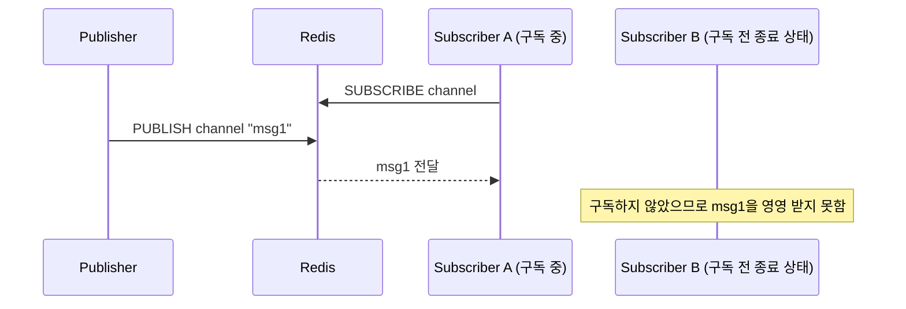
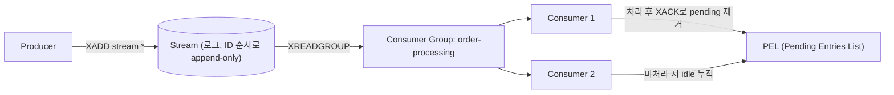

# Redis Pub-Sub와 Streams

## 핵심 정의

Redis Pub-Sub(`PUBLISH`/`SUBSCRIBE`)는 발행된 메시지를 저장하지 않고 그 순간 구독 중인 클라이언트에게만 즉시 전달하는 fire-and-forget 방식의 메시징 기능이다. Redis Streams(`XADD` 등 `X`로 시작하는 명령군)는 메시지를 메모리의 로그(log) 자료구조에 저장하고 영속화 설정에 따라 디스크에도 보존하며, 컨슈머 그룹(consumer group)을 통해 오프셋(offset) 기반으로 재생(replay)과 처리 확인(acknowledgement)까지 지원하는, Kafka와 유사한 철학의 자료구조다. 둘 다 Redis 안에서 메시징을 구현하는 수단이지만 안정성과 기능 수준이 근본적으로 다르며, Redis Streams가 나중에(Redis 5.0) 도입된 이유 자체가 Pub-Sub의 한계(구독 시점 이전 메시지 유실, 재처리 불가)를 보완하기 위해서다.

## 동작 원리 / 구조

### Pub-Sub

- 메시지는 재생 가능한 로그에 저장되지 않는다(전송 대기 출력 버퍼는 존재한다). `PUBLISH` 시점에 채널을 구독 중인 클라이언트에게만 인메모리로 즉시 전달되고 끝난다.
- `PSUBSCRIBE`로 글롭(glob) 패턴 구독이 가능하며, Redis Cluster 환경에서는 `SPUBLISH`/`SSUBSCRIBE`(Redis 7.0+ shard pub/sub)로 특정 샤드 내에서만 메시지를 전파해 클러스터 버스 전체에 브로드캐스트되는 부하를 줄일 수 있다.
- 확인(ack) 개념이 없다. 구독자가 메시지를 받고 처리에 실패해도 Redis는 이를 알 방법이 없고 재전달도 하지 않는다.

### Streams

- 각 엔트리는 `<milliseconds>-<sequence>` 형태의 증가 ID로 추가되며(자동 ID의 앞부분은 서버 시간을 바탕으로 하지만 업무 이벤트 시각과 같다고 보장하지 않음), `XADD`로 추가하고 `XRANGE`/`XREAD`로 구간 조회, 재생이 가능하다.
- 컨슈머 그룹(`XGROUP CREATE`)을 만들면 그룹 내 컨슈머들이 서로 다른 엔트리를 나눠 받는다(Kafka의 consumer group과 유사). 각 그룹은 자신이 마지막으로 읽은 위치(last-delivered-id)를 독립적으로 관리한다.
- `NOACK`을 쓰지 않는 새 메시지 조회에서 `XREADGROUP`이 전달한 엔트리는 처리 완료(`XACK`) 전까지 PEL(Pending Entries List)에 남는다. 컨슈머가 죽거나 처리에 실패하면 다른 컨슈머가 `XCLAIM`/`XAUTOCLAIM`으로 해당 엔트리의 소유권을 가져와 재처리할 수 있다.
- Redis 8.4부터는 `XREADGROUP`에 `CLAIM` 옵션을 함께 써서, 유휴 시간이 일정 이상인 pending 엔트리 회수와 새 메시지 읽기를 한 번의 호출로 처리할 수 있다(기존에는 `XPENDING`→`XCLAIM`/`XAUTOCLAIM`→`XREADGROUP` 조합의 여러 왕복이 필요했다). `CLAIM`은 `>`로 읽을 때 유효하며, 먼저 오래 유휴 상태인 pending을 가져오고 새 엔트리도 읽을 수 있다.
- 스트림 길이는 무한정 늘어나므로 `XADD ... MAXLEN ~ N` 또는 `MINID`로 오래된 엔트리를 트리밍(trim)해야 한다. 단순 MAXLEN/MINID는 미처리 엔트리도 삭제할 수 있다. Redis 8.2+는 KEEPREF/DELREF/ACKED로 PEL 참조 처리·모든 그룹의 ACK 조건을 선택할 수 있다.

### 그룹 생성 위치와 복구 루프

Redis 8.4에서 `XGROUP CREATE stream group $`는 생성 당시 스트림 끝을 시작점으로 잡아 기존 이력을 건너뛴다. 처음부터 남아 있는 이력을 읽으려면 `0`을 선택한다. `XREADGROUP ... STREAMS stream >`는 아직 그룹에 전달되지 않은 항목을 읽는 경로다. 같은 consumer 이름의 pending 복구는 `0` 등 ID로 조회하고, 죽은 다른 consumer의 항목은 claim 절차로 넘겨받는다. `>`만 반복한다고 오래된 PEL이 자동으로 처리되지는 않는다(8.4의 명시적 CLAIM 옵션은 별도).

`XAUTOCLAIM`은 한 번 호출해 빈 결과를 받았다고 스캔이 끝난 것이 아니다. 반환된 다음 시작 ID로 계속 진행하고 `0-0`이면 해당 순회를 마친다. 순회 이후 시간이 지나면 idle 조건을 새로 만족한 항목이 있으므로 주기적으로 다시 수행한다. Redis 7.0+의 삭제된 ID 반환 목록은 이미 trim된 원문이 복구되었다는 뜻이 아니라 PEL의 끊어진 참조를 정리했다는 뜻이다.

### 여러 Stream 조회의 반환량 제한

`XREAD`·`XREADGROUP`의 COUNT는 Stream별 개수이므로 N개 Stream에 COUNT C를 주면 최대 N×C개가 반환될 수 있다. Redis Open Source 8.10에서 추가한 MAXCOUNT는 명령 전체의 합계 개수를 제한하고, MAXSIZE는 전체 응답 바이트 예산을 둔다. COUNT와 MAXCOUNT를 함께 쓰면 MAXCOUNT는 COUNT 이상이어야 한다.

MAXSIZE는 무조건 지켜지는 메시지 크기 상한이 아니다. 읽을 항목이 있다면 적어도 하나는 내보내므로 단일 엔트리가 예산보다 크면 그 엔트리를 반환한다. 따라서 생산 단계의 메시지 크기 제한과 소비자 메모리 예산을 대체하지 않는다. 입력 Stream 순서대로 예산을 채울 수 있으므로 많은 Stream을 읽을 때 뒤쪽 Stream의 지연도 확인한다. 이 옵션들은 앞의 8.4 복구 예제에 그대로 추가할 수 있는 기능이 아니며 서버가 8.10 이상이어야 한다.

## 실무 관점

- **알림/실시간 브로드캐스트**(캐시 무효화 신호, 서버 간 로컬 캐시 갱신 알림, 채팅의 순간 전달, 분산 락 해제 알림 등 "지금 안 받으면 굳이 나중에 안 받아도 되는" 용도)에는 Pub-Sub이 적합하다. [[분산 락]]에서 Redisson이 락 해제를 기다리는 클라이언트에게 알릴 때 이 방식을 쓴다.
- **신뢰성 있는 작업 큐, 이벤트 로그, 재처리가 필요한 파이프라인**에는 Streams를 쓴다. 다만 Redis Streams는 Kafka만큼의 파티셔닝/장기 보관/디스크 기반 대용량 처리에 최적화되어 있지 않으므로, 이미 Kafka나 RabbitMQ를 운영 중인 조직이 대규모 이벤트 스트리밍을 위해 굳이 Streams를 새로 도입하는 경우는 드물다. Redis Streams는 "이미 Redis를 쓰고 있고, 가벼운 신뢰성 있는 큐가 필요한데 별도 메시지 브로커를 새로 구축하긴 부담스러운" 상황에 적합하다.
- 흔한 실수: Pub-Sub을 작업 큐처럼 쓰다가 배포/재시작 중 구독자가 잠시 끊긴 사이 발행된 메시지를 그대로 잃어버리는 경우. 반드시 재처리/재전송이 필요한 작업이면 처음부터 Streams나 별도 메시지 큐를 선택해야 한다.
- 흔한 실수: Streams를 쓰면서 `MAXLEN`/`MINID` 트리밍을 설정하지 않아 스트림이 무한히 커지고 메모리를 잠식하는 경우. `XACK`만으로는 처리 완료 엔트리가 삭제되지 않으므로 운영 정책으로 트리밍을 명시해야 한다.
- 흔한 실수: 컨슈머가 `XACK`을 호출하지 않고 죽는 경우 PEL에 엔트리가 쌓이는데, 이를 회수하는 `XAUTOCLAIM` 배치나 모니터링(`XPENDING`으로 오래된 pending 확인)이 없으면 그 메시지들은 영원히 처리되지 않은 채 방치된다.
- 튜닝/운영 포인트: Streams의 컨슈머 그룹 idle 임계치(회수 판단 기준), `MAXLEN` 트리밍 주기, Pub-Sub의 경우 클러스터 환경에서 전체 브로드캐스트 대신 `SPUBLISH`(shard pub/sub) 사용 여부, AOF/RDB에 Streams 데이터가 포함되므로(Pub-Sub 메시지는 영속화 대상이 아님) 영속화 전략도 함께 고려해야 한다.

### 죽은 consumer를 삭제하기 전에 pending을 넘긴다

`XGROUP DELCONSUMER`는 오래된 consumer 이름만 정리하는 무해한 관리 명령이 아니다. 해당 consumer의 미완료 항목은 삭제 후 일반 claim 경로로 가져올 수 없게 된다. 원문이 Stream에 남아 있어도 그룹은 이미 전달한 ID를 기억하므로 `XREADGROUP ... >`가 그 작업을 다시 발행해 주지 않는다. PEL이 줄었다는 관측을 업무 처리 완료와 혼동하지 않는다.

신규 전달을 중단한 consumer의 `XPENDING`을 확인하고, 미완료 작업은 새 consumer로 claim해 처리하거나 완료가 확인된 항목만 ACK한 뒤 consumer를 삭제한다. 단순 정리를 위해 아직 처리하지 않은 항목을 ACK하면 같은 유실 문제가 생긴다. 이미 삭제했다면 원문 보존 여부·업무 처리 기록을 대조한 별도 재생이 필요하며 중복 효과도 막아야 한다.

## 심화 Q&A

### Q. Redis를 재시작하면 Pub-Sub 메시지와 Streams 데이터는 각각 어떻게 되는가?
Pub-Sub 메시지는 애초에 저장되지 않으므로 재시작과 무관하게 이미 사라진 상태다(전달된 순간이 유일한 존재 시점). Streams는 일반 자료구조와 마찬가지로 RDB 스냅샷이나 AOF에 포함되어 영속화되므로, 적절한 영속화 설정이 되어 있다면 재시작 후에도 데이터와 컨슈머 그룹의 오프셋(last-delivered-id)까지 복구된다. 이는 큐로서의 신뢰성을 논할 때 핵심적인 차이다.

### Q. Streams의 컨슈머 그룹과 Kafka의 컨슈머 그룹은 어떤 점에서 다른가?
개념적으로는 유사하지만(그룹 내 분산 소비, 그룹 간 독립적 재생), Kafka의 일반 consumer group은 파티션을 소비자에게 할당하고 파티션 재할당(리밸런싱)이 그룹 단위로 일어나는 반면, Redis Streams는 파티션 개념이 없어 그룹 내 컨슈머들이 스트림 전체에서 개별 엔트리 단위로 나눠 받는다. 또한 Kafka는 디스크 기반 로그로 대용량/장기 보관에 최적화되어 있고 브로커 클러스터로 수평 확장하는 반면, Streams는 단일 Redis 인스턴스(또는 Cluster의 한 슬롯)의 메모리 용량 안에서 운용되는 것이 기본 전제라 규모의 한계가 더 뚜렷하다. 참고: [[파티션과 컨슈머 그룹]].

### Q. Pub-Sub 구독자가 네트워크 지연으로 메시지 처리가 느려지면 Redis 서버에 어떤 영향이 있는가?
Redis는 각 Pub-Sub 구독자에게 전달할 메시지를 클라이언트 출력 버퍼(output buffer)에 쌓는데, 구독자가 이를 충분히 빠르게 소비하지 못하면 이 버퍼가 계속 커진다. `client-output-buffer-limit pubsub`로 설정된 한도를 초과하면 Redis는 해당 클라이언트 연결을 강제로 끊어버린다. 즉 느린 구독자 하나가 서버 메모리를 과도하게 점유하는 것을 막기 위해 메시지를 유실시키는 방향으로 설계되어 있으며, 이는 Pub-Sub이 신뢰성보다 실시간성을 우선한다는 설계 철학을 보여준다.

### Q. XAUTOCLAIM으로 회수한 메시지를 다른 컨슈머가 처리하는 동안 원래 컨슈머가 뒤늦게 살아나 같은 메시지를 처리하면 어떻게 되는가?
Streams 자체는 이 상황(두 컨슈머가 같은 엔트리를 동시에 처리하는 것)을 막아주지 않는다. 즉 Streams에서 ACK·pending 회수를 구성하면 "적어도 한 번(at-least-once)" 전달을 구현할 수 있지만 "정확히 한 번(exactly-once)" 처리를 보장하지 않으며, 영속화 손실·미처리 엔트리 trim·키 eviction·`NOACK`까지 무시한 무조건적 보장은 아니다. [[오프셋 관리와 정확히 한 번 처리]]처럼 처리 결과 저장과 ACK 사이의 경계를 따로 설계해야 한다. 애플리케이션이 처리 로직을 멱등(idempotent)하게 만들거나, 처리 결과에 버전/토큰을 붙여 중복 적용을 걸러야 한다.

### Q. 소규모 서비스에서 굳이 Kafka/RabbitMQ 없이 Redis Streams만으로 이벤트 파이프라인을 구성해도 괜찮은가?
처리량과 보관 기간 요구사항이 크지 않고, 이미 Redis 인프라를 운영 중이며, 별도 메시지 브로커를 추가로 운영할 인력/비용 여유가 없다면 합리적인 선택이다. 다만 향후 처리량이 커지거나 여러 팀/서비스가 장기 보관된 이벤트를 각자 다른 시점에 재생해야 하는 요구가 커지면, Redis 인스턴스의 메모리 용량이 그대로 확장 한계가 되므로 이 지점에서 전용 메시지 브로커로의 이전을 검토해야 한다.

### Q. Pub-Sub 메시지를 여러 Sentinel/Cluster 노드에 걸쳐 안정적으로 브로드캐스트할 수 있는가?
Sentinel 구성에서는 일반 Pub-Sub이 마스터를 통해 전파되므로 페일오버 시 연결·재구독 사이 메시지가 유실될 수 있다. 이를 허용할 수 있는지는 업무 요구에 달려 있다. Cluster 환경에서는 기본 `PUBLISH`가 클러스터 버스를 통해 모든 노드에 전파되어 노드 수가 많을수록 오버헤드가 커지는데, 이를 줄이기 위해 도입된 것이 `SPUBLISH`/`SSUBSCRIBE`(Redis 7.0+ shard pub/sub)로, 메시지를 특정 슬롯이 속한 샤드 내로만 국한시킨다. 클러스터 전역 브로드캐스트가 실제로 필요한지, 특정 샤드 범위로 좁혀도 되는지를 설계 단계에서 판단해야 한다.

## 관련 개념
- [[분산 락]]
- [[Pub-Sub와 Point-to-Point]]
- [[파티션과 컨슈머 그룹]]
- [[오프셋 관리와 정확히 한 번 처리]]

## 참고 자료

확인일: 2026-09-08. 아래 적용 범위에서 본문·Q&A·예제를 재검증했다. 예제는 문서와 대조했으며 별도 실행 검증은 하지 않았다.

- [Redis Pub/Sub](https://redis.io/docs/latest/develop/pubsub/) — Pub/Sub at-most-once, 패턴·출력 버퍼, Redis 7.0+ sharded Pub/Sub.
- [XREADGROUP](https://redis.io/docs/latest/commands/xreadgroup/) — Redis 5.0+ 그룹·PEL·NOACK; 8.4 CLAIM 옵션 확인.
- [XAUTOCLAIM](https://redis.io/docs/latest/commands/xautoclaim/) — Redis 6.2+ pending 회수와 중복 처리 가능성.
- [XTRIM](https://redis.io/docs/latest/commands/xtrim/) — Redis 8.2+ KEEPREF/DELREF/ACKED와 approximate trim.
- [Redis Persistence](https://redis.io/docs/latest/operate/oss_and_stack/management/persistence/) — Redis Open Source: Streams도 RDB/AOF 설정의 손실 경계 적용.

부분 재검증: 2026-09-23. Redis 8.4 범위의 그룹 시작 위치·pending 복구·XAUTOCLAIM 커서 의미를 확인했다. 최신 명령 페이지에 더 나중 버전의 옵션도 함께 표시되므로 여기서는 그 옵션을 8.4 기능으로 적용하지 않았다.

- [XGROUP CREATE](https://redis.io/docs/latest/commands/xgroup-create/) — 그룹의 시작 ID 0과 $ 선택. XREADGROUP·XAUTOCLAIM 문서의 기존/새 항목 분리·다음 커서·삭제 ID도 재확인.

부분 재검증: 2026-09-23. 추가로 Redis Open Source 8.10 XREAD·XREADGROUP의 MAXCOUNT/MAXSIZE 및 단일 과대 엔트리 예외를 확인했다. 기존 8.4 그룹 복구 범위와 구분했으며 실제 Redis 8.10 실행 검증은 하지 않았다. 기존 전체 검증일은 유지한다.

- [XREAD](https://redis.io/docs/latest/commands/xread/) — Redis 8.10 누적 응답 예산·COUNT와의 관계·단일 엔트리 예외·Stream 순서.
- [XREADGROUP](https://redis.io/docs/latest/commands/xreadgroup/) — Redis 8.10의 누적 제한과 새 항목·PEL 읽기 적용.

부분 재검증: 2026-10-04. DELCONSUMER의 미완료 항목 소유권 제거를 공식 명령 문서와 Redis 8.10.2 소스로 확인했다. 실제 실행은 격리 Redis 6.2.11에서 수행했다. pending 1개인 consumer를 삭제하면 XPENDING이 0이 되고 XCLAIM·새 항목 읽기로는 복구되지 않으나 XLEN은 1이었다. 먼저 claim한 대조 실험에서는 새 소유자가 ACK할 수 있었다. Redis 8.10.2 서버 실행·영속화 손실 시험은 하지 않았고 기존 `verified`는 유지한다.

- [XGROUP DELCONSUMER](https://redis.io/docs/latest/commands/xgroup-delconsumer/) — Redis 5.0+ 명령의 삭제 전 claim/ACK 요구와 반환값.
- [Redis 8.10.2 t_stream.c](https://github.com/redis/redis/blob/8.10.2/src/t_stream.c) — streamDelConsumer의 그룹 PEL 참조 제거.
