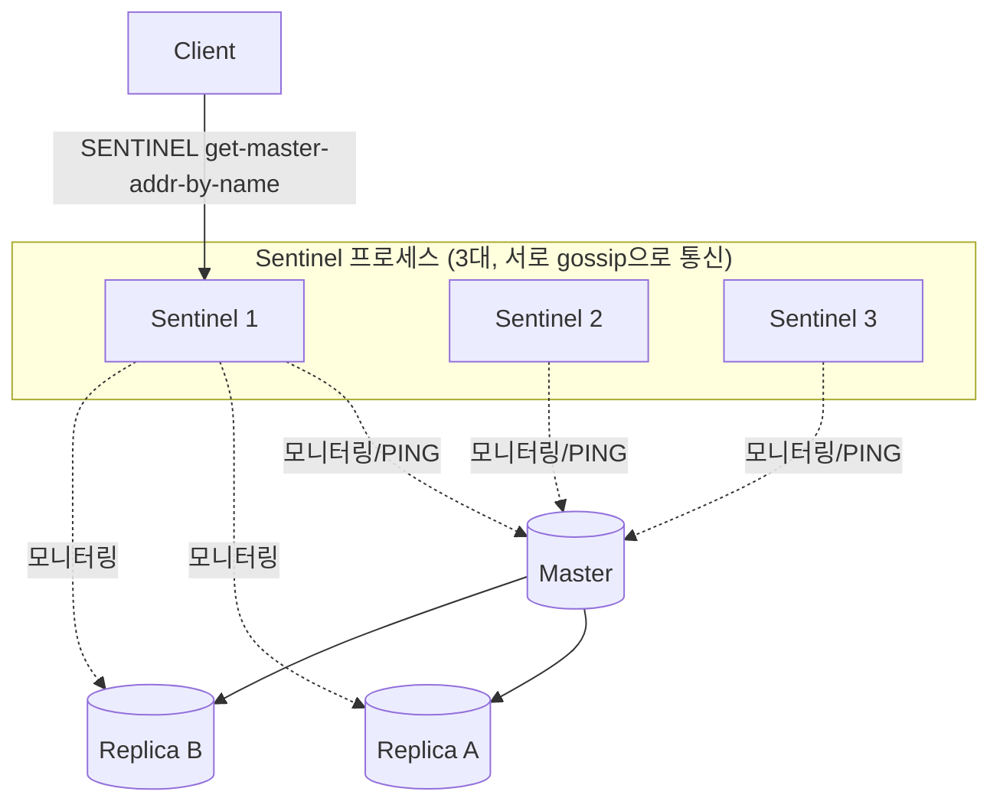

# Redis Sentinel

## 핵심 정의

Redis Sentinel은 하나의 마스터(master)-복제본(replica) 구성을 감시하다가 마스터 장애 시 복제본 중 하나를 새 마스터로 자동 승격시켜 고가용성(high availability)을 확보하는 Redis 공식 운영 도구다. 데이터를 샤딩(sharding)하지 않으므로 전체 데이터셋은 여전히 마스터 한 대의 메모리 용량 안에 들어가야 하며, 확장성이 아니라 오직 가용성(장애 감지 + 자동 페일오버 + 클라이언트에게 현재 마스터 알려주기)만을 목적으로 한다. Sentinel 자체도 여러 대(보통 3대 이상, 홀수)를 띄워 Sentinel 프로세스 자체의 단일 장애점을 없앤다.

## 동작 원리 / 구조

**구성 요소**

- 각 Sentinel은 독립적으로 마스터/복제본에 주기적으로 PING을 보내 상태를 확인하고, 다른 Sentinel과도 서로의 뷰를 공유(gossip)한다.
- 클라이언트는 먼저 Sentinel에게 `SENTINEL get-master-addr-by-name <name>`으로 현재 마스터 주소를 물어본 뒤 그 Redis에 직접 연결한다. Sentinel은 데이터 명령 프록시가 아니다. Lettuce, Jedis 등 주요 클라이언트 라이브러리는 이 조회와 페일오버 후 재연결을 자동 처리하는 Sentinel 지원 모드를 제공한다.

**장애 감지 2단계: S-DOWN → O-DOWN**

- 특정 Sentinel이 `down-after-milliseconds` 동안 마스터로부터 응답을 못 받으면 그 Sentinel 혼자만의 판단으로 `SDOWN`(subjectively down, 주관적 다운)으로 표시한다.
- `quorum`(예: 3대 중 2)으로 설정된 수 이상의 Sentinel이 동일 마스터를 SDOWN으로 본다는 사실을 서로 확인하면 `ODOWN`(objectively down, 객관적 다운)으로 승격된다. 즉 quorum은 "장애를 선언하는 데 필요한 최소 동의 수"다.

**페일오버 authorization: 과반수(majority) 투표**

ODOWN이 선언되었다고 바로 페일오버가 실행되는 것은 아니다. 실제 페일오버를 수행할 리더 Sentinel을 뽑기 위해 알려진 Sentinel의 과반수와 설정 quorum을 모두 충족하는 투표가 필요하다. quorum이 과반수보다 크면 그 수만큼의 승인이 필요하다. Sentinel은 에폭 단위 리더 선거를 수행하며, 각 Sentinel은 현재 에폭(epoch)에서 먼저 요청한 후보에게 투표한다. 즉 quorum(장애 판정 합의 수)과 majority(페일오버 실행 authorization)는 서로 다른 개념이며, quorum을 2로 낮게 잡아도 전체 Sentinel의 과반수가 살아있지 않으면 페일오버 자체가 시작되지 않는다.

**페일오버 절차**

1. 리더로 뽑힌 Sentinel이 복제본 중 승격 대상을 선정한다(우선순위 `replica-priority`, 복제 오프셋 최신 여부, 실행 ID 등 기준).
2. 선정된 복제본에 `REPLICAOF NO ONE`을 보내 마스터로 승격시킨다.
3. 나머지 복제본들을 새 마스터를 바라보도록 `REPLICAOF`로 재설정한다.
4. 모든 Sentinel이 설정을 갱신하고, 이후 클라이언트의 `get-master-addr-by-name` 조회에 새 마스터 주소를 반환한다.
5. 죽었던 옛 마스터가 복구되면 자동으로 새 마스터의 복제본으로 강등(demote)되어 재합류한다.

### 서버 승격과 클라이언트 복구를 따로 확인

Sentinel이 새 마스터를 선정한 시간과 애플리케이션이 정상 쓰기를 재개한 시간은 다르다. 공식 클라이언트 절차는 주소 조회 후 대상 Redis의 `ROLE`을 검사하며, 재연결할 때 주소를 다시 확인한다. 풀이 마스터 변경을 감지했다면 기존 마스터를 향한 연결 전체를 교체해야 한다. 일부 연결만 바꾸면 요청마다 다른 서버를 사용한다.

복구 훈련에서는 프로세스 종료뿐 아니라 마스터·Sentinel·애플리케이션 사이의 부분 네트워크 단절도 구분한다. 승격 성공, 클라이언트 재탐색·재연결, 실제 쓰기 성공, 승인된 쓰기의 보존 여부를 각각 관측한다. 역할 조회의 성공이 이후 영구적인 단일 쓰기 노드나 무손실을 보장하는 것은 아니다.

## 실무 관점

- 데이터셋이 마스터 한 대의 메모리에 충분히 들어가고, 필요한 것이 "확장성"이 아니라 "장애 시 자동 복구"뿐이라면 Redis Cluster보다 운영이 단순한 Sentinel을 선택한다. 샤딩까지 필요하면 [[Redis Cluster]]로 간다.
- Sentinel은 최소 3개를 서로 독립된 장애 영역에 두는 것이 권장된다. 짝수도 지원하며 공식 문서에는 4개 구성 예시가 있다. 네트워크 분할(split-brain) 시 정확히 절반씩 나뉘면 과반수를 얻을 수 없어 페일오버가 멈춘다. 최소 3대, 서로 다른 가용 영역(availability zone)/물리 노드에 분산 배치해야 한 노드/AZ 장애가 곧 Sentinel 과반수 상실로 이어지지 않는다.
- `down-after-milliseconds`를 너무 짧게 잡으면 Redis 프로세스·호스트의 순간 정지나 네트워크 지연에도 페일오버가 발동해 불필요한 마스터 전환(flapping)이 반복된다. 너무 길게 잡으면 실제 장애 시 복구가 느려 그 사이 쓰기가 실패하거나 유실된다. 임계치는 목표 복구 시간과 실제 지연 분포를 측정해 정한다. 5~10초를 공식 기본값이나 보편 권장값으로 보지 않는다.
- 복제(replication)가 기본적으로 비동기(async)이므로, 마스터가 죽는 순간 아직 복제본에 반영되지 않은 최근 쓰기는 페일오버 후 유실될 수 있다. `min-replicas-to-write`, `min-replicas-max-lag`로 "복제 지연이 일정 수준을 넘으면 마스터가 쓰기 자체를 거부"하게 해 유실 폭을 줄일 수 있지만, 대신 가용성이 낮아지는 트레이드오프가 있다.
- 흔한 장애 패턴: 애플리케이션이 Sentinel을 거치지 않고 Redis 마스터 IP를 하드코딩해 직접 연결하는 경우. 페일오버가 일어나도 애플리케이션은 여전히 죽은(혹은 강등된) 옛 마스터를 바라보며 쓰기 실패가 계속된다. 클라이언트 라이브러리의 Sentinel 지원 연결 모드를 반드시 사용해야 한다.
- 튜닝 포인트: `quorum`, `down-after-milliseconds`, `failover-timeout`(재시도 간격·잘못된 복제 대상 교정·일부 페일오버 상태의 시간 제한 등에 쓰이며 전체 복구 시간의 단일 상한은 아님), `parallel-syncs`(승격 후 몇 개의 복제본을 동시에 재동기화시킬지 — 너무 크면 동시 풀 재동기화로 네트워크/디스크 부하 폭증).

### 영속화를 끈 마스터의 자동 재시작

마스터의 영속화(persistence)를 끄고 복제본에만 사본을 남긴 구성에서는 프로세스 자동 재시작이 데이터 보호와 충돌할 수 있다. 마스터가 빈 데이터셋으로 빠르게 다시 뜨면 Sentinel이 장애를 판정하기 전에 정상 응답을 재개하고, 복제본들이 그 빈 마스터와 재동기화해 기존 데이터를 잃을 수 있다. 복제본을 여러 개 두었다는 사실만으로 이 경계를 막지는 못한다.

데이터 보존이 필요한 구성에서는 마스터·복제본의 영속화와 재시작 정책을 함께 설계한다. 영속화를 끈 마스터를 사용해야 한다면 무조건적인 자동 재시작을 피하고 남아 있는 복제본의 상태·승격·재합류 순서를 확인하는 복구 절차가 필요하다. 순수 조회 캐시라서 전체 소실을 허용하더라도 동시에 원본 DB로 쏠리는 재적재 부하는 별도로 고려한다. [[영속화 RDB와 AOF]]의 백업·복원 판단과 연결되는 문제다.

## 심화 Q&A

### Q. quorum을 2로 설정했는데 Sentinel이 5대이고 그중 3대만 살아있다면 페일오버가 되는가?
장애 판정(ODOWN) 자체는 quorum(2) 이상의 Sentinel이 동의하면 성립하므로 3대 중 2대만으로도 가능하다. 하지만 실제 페일오버를 실행하려면 전체 Sentinel(5대) 기준 과반수(3대) 이상의 투표가 필요하다. 살아있는 3대가 모두 한 후보에게 투표하면 정확히 과반수(3/5)를 만족하므로 페일오버는 진행된다. 만약 살아있는 Sentinel이 2대뿐이었다면 quorum 조건은 만족해도 과반수(3대 이상)를 채울 수 없어 페일오버가 멈춘다.

### Q. 비동기 복제 때문에 생기는 데이터 유실을 완전히 막을 수 있는가?
Sentinel 자체는 이를 막을 수 없다. `min-replicas-to-write N`과 `min-replicas-max-lag M`을 설정하면 최근 M초 이내 ACK를 보낸 복제본이 최소 N개보다 적을 때 쓰기를 거부하게 만들어 유실 가능 폭을 줄일 수 있지만, 이는 결국 "쓰기 가용성을 희생해 유실 위험을 낮추는" 트레이드오프다. 절대적인 강한 일관성(strong consistency)이 필요하다면 Redis 대신 동기 복제나 쿼럼 기반 커밋을 지원하는 다른 저장소를 고려해야 한다.

### Q. Sentinel과 Redis Cluster를 동시에 쓸 수 있는가, 혹은 왜 안 쓰는가?
Redis Cluster는 자체적으로 gossip 기반 장애 감지와 복제본 승격 메커니즘을 내장하고 있어 Sentinel이 필요 없다. 반대로 Sentinel은 샤딩되지 않은 단일 마스터-복제본 세트를 전제로 설계되어 Cluster의 슬롯 분산 구조와 맞지 않는다. 즉 둘은 같은 문제(고가용성)를 다른 스케일에서 푸는 대안 관계이지, 함께 조합해 쓰는 구성 요소가 아니다.

### Q. 새로 승격된 마스터로 클라이언트들이 즉시 전환되지 않으면 어떤 문제가 생기는가?
페일오버 후 옛 마스터가 이미 읽기 전용 복제본으로 강등되었다면 기존 연결의 쓰기는 `READONLY`로 실패한다. 하지만 네트워크 분할로 옛 마스터가 아직 강등 명령을 받지 않았다면 쓰기를 받아들일 수도 있다. 이 변경은 새 마스터에 합쳐지지 않으며 옛 마스터가 재합류할 때 유실될 수 있다. Sentinel 지원 클라이언트는 재연결 시 주소를 재조회하고 역할을 확인해야 한다. Pub/Sub `+switch-master` 구독은 전환을 빠르게 하는 보조 수단이며 유실될 수 있어 이것만으로 즉시 갱신을 보장하지 않는다.  이를 지원하지 않는 커넥션 풀 설정이나 커스텀 커넥션 캐싱 로직이 있다면 수동으로 재연결 로직을 넣어야 한다.

### Q. Sentinel이 마스터를 잘못 판단해 정상 마스터인데도 페일오버를 일으키는(false positive) 상황은 어떻게 발생하고 어떻게 줄이는가?
Sentinel과 마스터 사이의 네트워크 구간에만 일시적 장애가 있고 마스터 자체는 정상인 경우, 그 Sentinel은 SDOWN으로 판단하지만 quorum을 채우지 못하면 ODOWN으로 승격되지 않아 실제 페일오버로 이어지지는 않는다. 문제는 Sentinel들이 마스터와 유사한 네트워크 경로를 공유해 동시에 장애를 겪는 경우인데, 이때는 quorum을 채워 정상 마스터에 대해 불필요한 페일오버가 발생할 수 있다. Sentinel을 마스터와 다른 네트워크 경로/가용 영역에 분산 배치하고, `down-after-milliseconds`를 너무 공격적으로 짧게 잡지 않는 것이 완화책이다.

### Q. 승격 대상 복제본은 어떤 기준으로 선정되는가?
`replica-priority`가 0이 아닌 복제본 중에서, 마스터와의 연결이 오래 끊겨 있지 않았던(즉 최근까지 정상 복제 중이었던) 것을 우선하고, 부적합 후보를 제외한 뒤 `replica-priority` 값이 더 작은 복제본을 우선한다. 우선순위가 같으면 복제 오프셋(replication offset)이 가장 앞선(가장 최신 데이터를 가진) 복제본을 선택한다. 동률이면 실행 ID(run ID)가 사전순으로 작은 쪽이 선택된다. 특정 복제본을 절대 승격 대상에서 제외하고 싶다면(예: 분석 전용 읽기 복제본) `replica-priority 0`으로 설정한다.

## 관련 개념
- [[Redis Cluster]]
- [[분산 락]]
- [[캐시와 DB 정합성]]

## 참고 자료

확인일: 2026-09-08. 아래 적용 범위에서 본문·Q&A·예제를 재검증했다. 예제는 문서와 대조했으며 별도 실행 검증은 하지 않았다.

- [High Availability with Redis Sentinel](https://redis.io/docs/latest/operate/oss_and_stack/management/sentinel/) — Redis Open Source Sentinel: quorum·과반수, 4개 구성, 복제본 선정 순서와 설정.
- [Sentinel Client Specification](https://redis.io/docs/latest/develop/reference/sentinel-clients/) — Sentinel 클라이언트: 직접 연결·주소 재조회·역할 확인·알림 유실.
- [Redis 8.4 Configuration](https://raw.githubusercontent.com/redis/redis/8.4/redis.conf) — Redis 8.4: min-replicas 설정 의미.

부분 재검증: 2026-09-23. Redis Sentinel 공식 문서의 네트워크 분할 중 옛 마스터 쓰기 유실과 클라이언트 명세의 ROLE 검사·풀 연결 교체를 확인했다. 적용 범위는 Redis Open Source Sentinel이며 나머지 설정 전체는 재검증하지 않았다.

- [Sentinel Client Specification: Connection Pools](https://redis.io/docs/latest/develop/reference/sentinel-clients/#connection-pools) — 재탐색·ROLE 확인과 마스터 변경 시 기존 연결 폐기. 위 Sentinel 운영 문서의 분할 시나리오도 재확인.

부분 재검증: 2026-10-04. Redis Open Source 복제 공식 문서의 영속화 비활성 마스터·자동 재시작·Sentinel 감지 이전 복제본 소실 경계를 확인했다. 특정 관리형 Redis 제품의 재시작 정책을 가정하지 않는다. 실제 Sentinel failover·빈 마스터 재동기화 시험은 하지 않았고 기존 `verified`는 유지한다.

- [Redis Replication: Persistence Turned Off](https://redis.io/docs/latest/operate/oss_and_stack/management/replication/#safety-of-replication-when-master-has-persistence-turned-off) — 빈 마스터 재시작과 복제본 재동기화, Sentinel이 감지하지 못할 수 있는 순서.
