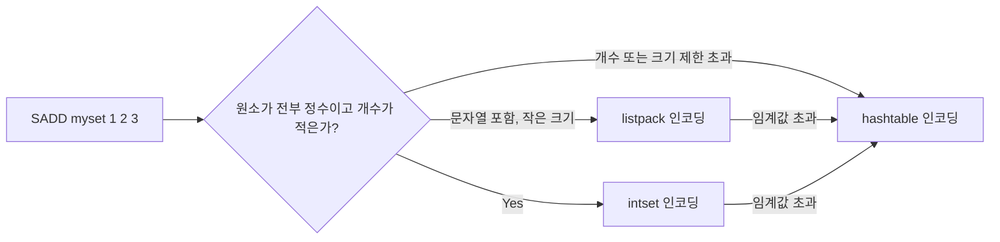

# Redis 자료구조

## 핵심 정의

Redis는 단순 키-값(Key-Value) 저장소가 아니라, 값(value) 자체가 여러 형태의 자료구조가 될 수 있는 인메모리 데이터 구조 서버(in-memory data structure server)다. 기본 제공 자료구조는 String, List, Hash, Set, Sorted Set(ZSet)이며, 여기에 Bitmap, HyperLogLog, Geospatial, Stream까지 더해 하나의 서버로 캐시, 큐, 랭킹, 카운터, 이벤트 로그 등 다양한 용도를 커버한다. 각 자료구조는 내부적으로 서로 다른 인코딩(encoding)을 사용해 데이터 크기와 접근 패턴에 따라 메모리 효율과 연산 복잡도가 달라진다.

## 동작 원리 / 구조

**주요 자료구조와 내부 인코딩 (Redis Open Source 8.4 소스 기준)**

| 자료구조 | 설명 | 소규모 인코딩 | 대규모 인코딩 | 대표 명령 |
|---|---|---|---|---|
| String | 텍스트/바이너리/정수 | int(정수) / embstr(44바이트 이하 문자열) | raw(큰 문자열 또는 변경 연산 등) | GET, SET, INCR |
| List | 순서 있는 시퀀스 | listpack | quicklist(listpack 노드들의 연결 리스트) | LPUSH, RPOP, LRANGE |
| Hash | 필드-값 집합 | listpack | hashtable | HSET, HGET, HGETALL |
| Set | 중복 없는 집합 | intset(정수만) / listpack | hashtable | SADD, SISMEMBER, SINTER |
| Sorted Set | score로 정렬된 집합 | listpack | skiplist + hashtable | ZADD, ZRANGE, ZINCRBY |

- 소규모 컬렉션은 메모리를 아끼기 위해 배열 기반의 압축 구조(listpack, 과거 ziplist)를 쓰다가, 원소 개수나 크기가 임계값(예: hash-max-listpack-entries, set-max-listpack-entries 등)을 넘으면 해시 테이블이나 skiplist 같은 일반 구조로 자동 전환(convert)된다.
- Sorted Set은 skiplist로 탐색 O(log N), M개 반환을 포함한 범위 조회 O(log N + M)을, hashtable로 O(1) member→score 조회를 동시에 제공하는 이중 구조다.

**부가 자료구조**
- Bitmap: String을 비트 배열처럼 다루는 명령(SETBIT/GETBIT/BITCOUNT) 집합. 출석 체크, 플래그 집합에 사용.
- HyperLogLog: 근사 카디널리티(unique count) 추정 구조. 표준 오차 약 0.81%로 추정하며 dense 레지스터가 12 KiB이고 키·객체 등 추가 오버헤드가 있다. 오차의 절대 상한을 뜻하지 않는다.
- Geospatial: Sorted Set 위에 geohash를 얹은 구조로 위치 기반 반경 검색(GEOSEARCH) 지원.
- Stream: 로그 형태로 append되는 자료구조. Consumer Group을 지원해 메시지 큐처럼 사용 가능.

### Sorted Set의 점수 정밀도와 동점 순서

Redis 8.4의 Sorted Set 점수(score)는 64비트 부동소수점(double)이다. 정수를 빠짐없이 정확하게 표현하는 범위는 `-2^53`부터 `2^53`까지다. 현재 시각의 Unix 나노초나 큰 64비트 ID를 그대로 점수에 넣으면 서로 다른 정수가 같은 점수로 반올림될 수 있다. 금액·정밀 시각·복합 순번을 하나의 점수로 압축할 때도 범위를 계산해야 한다.

동점인 멤버는 삽입 순서가 아니라 멤버 문자열의 바이트 사전순으로 정렬한다. 따라서 같은 실행 시각을 가진 지연 작업이 FIFO로 나온다고 가정하면 안 된다. FIFO가 필요하면 고정 폭 순번을 포함하는 멤버 인코딩 등 명시적인 동점 규칙을 설계한다. 같은 멤버를 다시 ZADD하면 별도 이벤트가 추가되는 것이 아니라 점수와 위치가 갱신되므로, 작업별 고유 ID와 업무 객체 ID도 구분한다.

### Redis 8.10의 Hash 인코딩 확장

위 인코딩 표는 8.4의 구현 범위다. Redis Open Source 8.10은 같은 스키마를 공유하는 Hash 키들의 필드명을 공통으로 저장하는 compact hash 인코딩과 대량 삽입용 `HIMPORT`를 추가했다. 따라서 업그레이드 후 Hash 메모리를 8.4의 listpack/hashtable 두 경우만으로 설명하면 빠지는 경로가 생긴다. 압축 효과는 필드명 공유와 데이터 형태에 따라 달라지므로 실제 키의 인코딩·메모리와 쓰기 비용을 측정하고, 새 명령의 서버·클라이언트 호환성을 확인한다.

## 실무 관점

- 단순 캐시라도 무조건 String을 쓰기보다, 객체의 일부 필드만 자주 갱신된다면 Hash로 모델링해 불필요한 직렬화/역직렬화 비용을 줄인다.
- List는 큐로 쓸 때 편리하지만(LPUSH+BRPOP), 중간 인덱스 접근이나 대량 데이터의 앞뒤가 아닌 위치 삽입은 O(N)이므로 대기열 이외 용도로는 주의한다.
- Set의 SINTER/SUNION 연산은 두 집합이 크면 CPU를 오래 점유해 싱글 스레드 이벤트 루프를 블로킹할 수 있다. 대용량 집합 연산은 SINTERCARD로 반환량을 줄이거나 LIMIT으로 조기 종료하고, SCAN 계열로 작업을 나누는 방식을 고려한다.
- Sorted Set은 실시간 랭킹, 지연 큐(score를 실행 시각으로), 슬라이딩 윈도우 rate limiter 구현에 자주 쓰인다.
- 흔한 실수: KEYS *로 운영 환경에서 전체 키를 조회하다 이벤트 루프를 장시간 블로킹시키는 장애. 운영 순회는 SCAN 계열을 우선한다. COUNT는 엄격한 결과 개수 제한이 아니고 중복·변경 중인 원소의 관찰 가능성도 처리해야 한다.
- 흔한 실수: Hash 필드 하나만 갱신하면 되는데 애플리케이션에서 객체 전체를 GET → 역직렬화 → 필드 수정 → 직렬화 → SET하는 패턴. HSET으로 필드 단위 갱신이 가능하면 네트워크 왕복과 직렬화 비용을 크게 줄일 수 있다.
- 튜닝 포인트: `hash-max-listpack-entries`, `hash-max-listpack-value`, `set-max-listpack-entries`, `set-max-intset-entries`, `zset-max-listpack-entries` 등 인코딩 전환 임계값을 데이터 특성에 맞게 조정하면 메모리와 CPU 트레이드오프를 제어할 수 있다.

## 심화 Q&A

### Q. listpack에서 hashtable로 인코딩이 자동 전환된 뒤, 원소를 다시 삭제해서 임계값 아래로 내려가면 listpack으로 되돌아가는가?
자료형·버전·연산에 따라 다르므로 모든 전환을 단방향으로 단정하면 안 된다. Redis 8.4의 List에는 원소 삭제 후 quicklist를 listpack으로 축소하는 코드가 있다. Hash/Set/ZSet 역시 삭제만으로 항상 작은 인코딩으로 되돌아온다고 기대하지 말고 `OBJECT ENCODING`과 메모리를 확인한다. 필요하면 원소를 새 키에 재삽입해 인코딩을 다시 선택하게 하되, DUMP/RESTORE가 항상 압축 인코딩 재선택을 보장하지는 않는다.

### Q. Set과 Sorted Set 중 "정렬된 유니크 목록"이 필요할 때 어떤 기준으로 선택하는가?
단순히 멤버십 여부(포함 여부)만 중요하고 순서가 필요 없다면 Set이 메모리와 연산 모두 가볍다. score 기반 정렬, 범위 조회(ZRANGEBYSCORE), 순위 조회(ZRANK)가 필요하면 Sorted Set을 쓴다. 다만 Sorted Set은 skiplist+hashtable 이중 구조라 Set보다 메모리 오버헤드가 크므로, 정렬이 필요 없는데 습관적으로 ZSet을 쓰는 것은 낭비다.

### Q. HyperLogLog로 카디널리티를 추정할 때 발생하는 오차는 어떤 상황에서 문제가 되는가?
약 0.81% 표준 오차는 대부분의 유니크 방문자 집계, 로그 중복 제거 통계에는 무해하지만, 정산이나 과금처럼 정확한 카운트가 법적/금전적 의미를 갖는 도메인에는 부적합하다. PFMERGE는 원소 집합의 합집합을 추정하도록 레지스터를 합치며, 병합 횟수만큼 오차가 계속 더해지는 구조가 아니다. 근사치가 허용되는지 정확한 표본 집계와 비교해 판단한다.

### Q. Stream과 List+Pub/Sub 조합으로 메시지 큐를 구현하는 것의 차이는 무엇인가?
List 기반 큐(LPUSH/BRPOP)는 한 번 소비되면 메시지가 사라지고, 소비자가 다운되면 처리 중이던 메시지가 유실될 수 있다. Pub/Sub은 구독 시점 이후 메시지만 받고 영속성이 전혀 없다. Stream은 메시지를 로그 자료구조에 저장하고 RDB/AOF 설정에 따라 지속화하며 Consumer Group으로 여러 소비자에게 분산하며, PEL(Pending Entries List)로 처리 확인(ack) 전 메시지를 추적할 수 있어 최소 한 번 전달(at-least-once) 보장에 가깝다. 다만 Kafka 같은 전용 메시징 시스템 대비 파티셔닝, 장기 보관, 리텐션 정책 관리 기능은 제한적이다.

### Q. Bitmap으로 대규모 사용자 플래그(예: 1억 명의 출석 여부)를 관리할 때 메모리 관점에서 주의할 점은?
Bitmap은 오프셋(offset)이 곧 메모리 위치이므로, 사용자 ID가 매우 크거나 희소(sparse)하면 실제 사용하는 비트 수보다 훨씬 큰 연속 메모리를 할당하게 된다. 예를 들어 SETBIT key 100000000 1 한 번만 호출해도 그 오프셋까지의 메모리가 즉시 확보된다. 사용자 ID를 0부터 재매핑하거나, 키를 시간/구간 단위로 분할(예: 일자별 키)해 희소성을 줄이는 설계가 필요하다.

### Q. List를 quicklist로 인코딩하는 이유는 무엇이고, 단일 listpack만으로 List를 표현하지 않는 이유는?
List는 양쪽 끝에서의 push/pop이 빈번하고 크기가 무한정 커질 수 있는 자료구조다. 단일 listpack은 연속 메모리 블록이라 커지면 재할당(realloc)·원소 이동 비용이 증가한다. 연속 배치 자체의 캐시 지역성은 장점이다. quicklist는 listpack 여러 개를 이중 연결 리스트로 묶어, 각 노드는 작게 유지하면서 전체적으로는 큰 리스트를 표현해 삽입/삭제 시 영향받는 범위를 국소화한다.

## 관련 개념
- [[싱글 스레드 모델과 이벤트 루프]]
- [[영속화 RDB와 AOF]]
- [[Redis Cluster]]
- [[NoSQL 데이터 모델 비교]]

## 참고 자료

확인일: 2026-09-08. 아래 적용 범위에서 본문·Q&A·예제를 재검증했다. 예제는 문서와 대조했으며 별도 실행 검증은 하지 않았다.

- [Redis Data Types](https://redis.io/docs/latest/develop/data-types/) — 대표 자료형과 명령; 전체 타입 목록이 아닌 기초 자료구조 비교.
- [Redis 8.4 object.c](https://raw.githubusercontent.com/redis/redis/8.4/src/object.c) — 문자열 int/embstr/raw 및 44바이트 구현 임계값.
- [Redis 8.4 t_list.c](https://raw.githubusercontent.com/redis/redis/8.4/src/t_list.c) — listpack/quicklist 전환과 삭제 후 축소.
- [Redis 8.4 t_set.c](https://raw.githubusercontent.com/redis/redis/8.4/src/t_set.c) — intset/listpack/hashtable과 인코딩 전환.

링크 확인: 2026-09-22. 위 소스 URL에서 누락된 `src/` 경로를 수정하고 접근을 확인했다. 본문 전체의 기술 재검증 날짜는 변경하지 않았다.

- [Redis HyperLogLog](https://redis.io/docs/latest/develop/data-types/probabilistic/hyperloglogs/) — 표준 오차·레지스터 메모리.
- [PFMERGE](https://redis.io/docs/latest/commands/pfmerge/) — HLL 합집합 추정, 병합 오차 누적 오해.
- [SCAN](https://redis.io/docs/latest/commands/scan/) — 순회 중복과 COUNT 힌트.
- [SINTERCARD](https://redis.io/docs/latest/commands/sintercard/) — Redis 7.0+: 교집합 카디널리티와 LIMIT.

부분 재검증: 2026-09-23. Redis 8.4 Sorted Set의 double 점수 표현을 소스로 확인하고 공식 ZADD 문서의 정수 정밀도·동점 순서·멤버 갱신 계약을 대조했다. 다른 자료구조의 전체 검증일은 유지한다.

- [Redis ZADD](https://redis.io/docs/latest/commands/zadd/) — 정수 점수 범위·바이트 사전순·기존 멤버 갱신.
- [Redis 8.4 t_zset.c](https://raw.githubusercontent.com/redis/redis/8.4/src/t_zset.c) — double score와 동일 점수의 멤버 비교.

부분 재검증: 2026-09-23. 추가로 Redis Open Source 8.10의 compact hash·HIMPORT 도입을 확인했다. 8.4 내부 인코딩 표를 8.10 전체의 소스 검증 결과로 바꾸지 않았다. 기존 전체 검증일은 유지한다.

- [Redis 8.10 What's New](https://redis.io/docs/latest/develop/whats-new/8-10/) — compact hash의 필드명 공유와 HIMPORT 추가.
