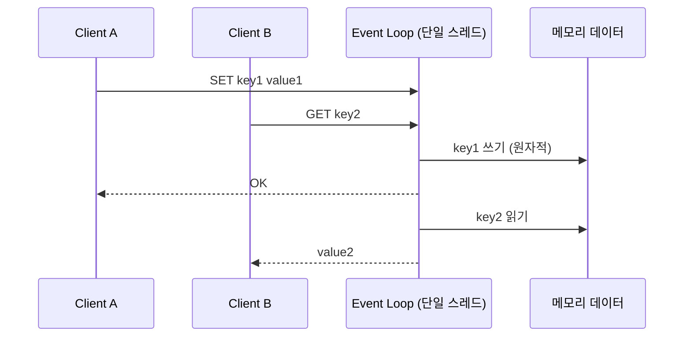

# 싱글 스레드 모델과 이벤트 루프

## 핵심 정의

Redis Open Source 8.4의 GET/SET/INCR 등 핵심 키 명령은 주로 메인 스레드에서 직렬 실행한다. 검색 엔진·모듈 작업 등까지 모두 같은 실행 모델로 일반화하지 않는다. 락(lock) 없이 데이터를 조작할 수 있어 원자성(atomicity) 보장이 단순해지고, 명령 실행을 다수 작업 스레드로 나누는 데 따른 컨텍스트 스위칭·락 경합 비용을 줄인다는 것이 핵심 장점이다. 다만 "Redis는 완전히 싱글 스레드다"는 표현은 부정확하다. 실제로는 명령 처리 루프가 단일 스레드지만, 백그라운드 저장(fork 기반 RDB/AOF rewrite), 지연 메모리 해제(lazy free), 그리고 Redis 6부터는 네트워크 I/O 일부를 멀티스레드로 처리하는 I/O threading이 함께 동작한다.

## 동작 원리 / 구조

**이벤트 루프 기반 처리**

Redis는 다중 클라이언트 연결을 epoll/kqueue 같은 OS의 I/O 멀티플렉싱(multiplexing) 메커니즘 위에 만든 이벤트 루프(event loop, 내부적으로 ae 라이브러리)로 처리한다. 하나의 스레드가 이벤트 루프를 돌며 "읽기 가능한 소켓이 있는가 → 명령 파싱 → 실행 → 응답 쓰기"를 순차적으로 반복한다.

- INCR 같은 핵심 명령의 데이터 변경은 다른 클라이언트 명령과 직렬화된다. 이것이 INCR 같은 연산이 별도 락 없이도 원자적인 이유다.
- 반대로 하나의 명령이 오래 걸리면(대용량 SORT, KEYS *, 큰 컬렉션에 대한 SUNION 등) 그 시간만큼 다른 모든 클라이언트가 대기한다. 이는 서버 메인 루프를 점유하는 지연이다. BLPOP/XREAD BLOCK 같은 차단형 명령은 해당 클라이언트를 대기시키며 다른 클라이언트의 실행을 막지 않으므로 구분해야 한다.

**멀티스레드 요소 (Redis 6+)**

| 구성 요소 | 스레드 방식 | 목적 |
|---|---|---|
| 명령 실행(Command execution) | 단일 스레드 | 원자성, 단순성 |
| I/O threading (읽기/쓰기 소켓 처리) | 멀티스레드 (옵션, `io-threads`) | 네트워크 파싱/응답 병렬화로 처리량 향상 |
| RDB 저장, AOF rewrite | fork된 자식 프로세스 | 부모 프로세스 블로킹 방지 |
| Lazy free (UNLINK, expired key 삭제) | 백그라운드 스레드 | 큰 객체 삭제 시 메인 루프 블로킹 방지 |
| Redis 8.4 atomic slot migration 후 정리 | 백그라운드 또는 메인 루프 점진 정리 | 이전 슬롯 데이터 제거 |

I/O threading은 소켓에서 바이트를 읽고 프로토콜을 파싱하는 단계와 응답을 소켓에 쓰는 단계만 병렬화하며, 실제 명령 실행(데이터 접근)은 여전히 메인 스레드가 순차적으로 수행한다. 따라서 INCR 등 기존 명령의 원자적 변경 계약은 유지된다. 원자 실행은 오류 시 이전 변경을 되돌리는 롤백이나 장애 시 지속성까지 뜻하지 않는다.

### 서버 실행 시간과 클라이언트 지연의 차이

SLOWLOG는 명령 자체의 실행 시간을 측정하며 클라이언트와 통신하거나 응답을 보내는 I/O 시간은 포함하지 않는다. 따라서 SLOWLOG가 비어 있어도 연결 풀 대기·다른 명령 뒤의 대기·네트워크·클라이언트 역직렬화 때문에 요청의 p99가 높을 수 있다. 애플리케이션 전체 지연을 서버 실행 시간과 같은 값으로 취급하지 말고, 클라이언트 계측과 LATENCY 이벤트를 함께 비교한다.

Redis 8.4의 `busy-reply-threshold`(이전 이름 `lua-time-limit`도 별칭)는 오래 실행되는 스크립트를 자동으로 종료하는 제한이 아니다. 임계값을 넘으면 일반 명령에 BUSY 오류를 반환할 수 있지만 스크립트는 계속 실행된다. `SCRIPT KILL`도 쓰기 명령을 이미 실행한 스크립트는 중단할 수 없다. 스크립트 내부의 입력 크기·반복 횟수를 제한하고 큰 작업은 실행 단위를 나눠야 한다. 단위를 나누면 전체 작업의 원자성은 별도로 설계한다.

## 실무 관점

- 단일 스레드 모델 덕분에 애플리케이션 레벨에서 별도 분산 락 없이 INCR, HINCRBY, SETNX(현재는 SET ... NX) 같은 명령만으로 카운터, 유니크 처리, 간단한 분산 락(SET NX PX)을 구현할 수 있다.
- 블로킹 명령이 장애의 핵심 원인이 되는 경우가 많다. KEYS *, 큰 컬렉션에 대한 SORT/SMEMBERS/HGETALL, 대량 SDIFF/SINTER 등은 프로덕션에서 지양하고 SCAN/HSCAN/SSCAN/ZSCAN 계열로 대체한다.
- Lua 스크립트(EVAL)나 트랜잭션(MULTI/EXEC)도 결국 이벤트 루프 위에서 원자적으로 실행되므로, 스크립트 안에 무거운 루프를 넣으면 전체 서버가 그 시간만큼 멈춘다.
- 흔한 장애 패턴: 운영 중 실수로 큰 Hash나 Sorted Set에 DEL을 호출했는데, 동기 삭제라 메인 스레드가 수백 ms~수 초간 블로킹되어 다른 모든 요청이 지연되는 사례. Redis 4 이상에서는 UNLINK(비동기 삭제) 또는 `lazyfree-lazy-*` 설정으로 완화할 수 있다.
- CPU 코어를 늘려도 명령 처리 자체의 처리량(throughput)은 크게 늘지 않는다. 스케일 아웃은 Redis Cluster로 샤딩(sharding)하거나, 읽기 부하는 복제본(replica)으로 분산하는 방식이 기본 전략이다.
- 튜닝 포인트: `io-threads`(네트워크 병목이 있는 고처리량 환경에서 유효, CPU 바운드 워크로드에는 효과 제한적), `lazyfree-lazy-expire`/`lazyfree-lazy-eviction`/`lazyfree-lazy-server-del`, `slowlog-log-slower-than`으로 느린 명령 모니터링.

## 심화 Q&A

### Q. Redis가 싱글 스레드인데도 초당 수십만 건의 처리량을 낼 수 있는 이유는?
핵심 데이터 접근이 메모리에서 이루어져 일반 읽기의 디스크 I/O 의존성이 작고, 자료구조 연산 대부분이 O(1)~O(log N)으로 매우 가볍기 때문이다. 명령 실행 스레드 사이의 컨텍스트 스위칭·락 경합을 줄여 CPU 캐시 지역성도 좋다. 병목은 대개 CPU 연산량이 아니라 네트워크 I/O(패킷 파싱/왕복)인 경우가 많았고, 이 부분을 Redis 6의 I/O threading이 보완한다.

### Q. MULTI/EXEC 트랜잭션과 Lua 스크립트(EVAL)는 원자성 관점에서 어떤 차이가 있는가?
MULTI/EXEC는 큐에 쌓인 명령들을 EXEC 시점에 중간에 다른 클라이언트 명령이 끼어들지 않고 순차 실행되도록 보장하지만, 명령 하나하나의 조건부 로직(예: 값을 읽고 그 값에 따라 분기)은 클라이언트-서버 왕복 없이는 표현하기 어렵다. Lua 스크립트는 서버 내부에서 조건 분기, 반복문까지 포함해 하나의 원자적 단위로 실행할 수 있어 "읽고 판단하고 쓰는" 로직의 원자성이 필요할 때 더 적합하다. 두 방식 모두 오래 실행되면 다른 요청을 지연시킨다. MULTI/EXEC의 실행 중 오류는 다른 큐 명령을 모두 롤백하지 않으며, Lua도 오류 전에 쓴 값이 자동 복구되지 않는다. 실패 경로까지 설계해야 한다.

### Q. fork 기반 RDB 스냅샷이 메인 스레드를 블로킹하지 않는다면서, 왜 대용량 인스턴스에서 fork 자체가 지연을 유발한다고 하는가?
fork() 시스템 콜은 프로세스의 메모리 페이지 테이블을 복사해야 하는데, 이 테이블 크기는 사용 메모리에 비례한다. 실제 데이터는 Copy-on-Write(CoW)로 공유되어 즉시 복사되지 않지만, 페이지 테이블 복사 자체가 수십 GB 인스턴스에서는 수십~수백 ms가 걸릴 수 있고 이 순간은 메인 스레드도 정지한다(Redis 메인 스레드가 fork 호출을 완료할 때까지 요청 처리를 못 하므로). 이후 자식 프로세스가 스냅샷을 쓰는 동안 부모(메인 스레드)는 다시 정상 처리하되, 쓰기가 발생한 페이지는 CoW로 복제되어 메모리 사용량이 일시적으로 늘어난다.

### Q. I/O threading을 활성화하면 INCR 같은 단순 카운터 연산의 원자성이 깨질 위험은 없는가?
없다. I/O threading은 소켓 읽기(파싱)와 소켓 쓰기(응답 전송) 단계만 여러 스레드가 나눠 처리하고, 실제 데이터에 접근하는 명령 실행 단계는 여전히 메인 스레드가 순서대로 처리한다. 즉 "네트워크 계층의 병렬화"이지 "데이터 접근의 병렬화"가 아니므로 기존의 원자성 보장은 그대로 유지된다.

### Q. 블로킹 명령으로 인한 지연을 사전에 탐지하려면 어떤 방법을 쓰는가?
SLOWLOG로 설정한 임계값(`slowlog-log-slower-than`, 마이크로초 단위)을 넘긴 명령을 기록해 사후 분석할 수 있고, `latency-monitor-threshold`를 설정하면 LATENCY 명령으로 이벤트 루프 지연 원인(fork, command, expire-cycle 등)을 카테고리별로 확인할 수 있다. 운영 초기에 큰 컬렉션 접근 명령을 코드 리뷰 단계에서 걸러내는 것이 재발 방지에 더 효과적이다.

### Q. 클라이언트 사이드에서 파이프라이닝(pipelining)을 쓰면 서버의 싱글 스레드 처리량에 어떤 영향을 주는가?
파이프라이닝은 여러 명령을 왕복(RTT) 없이 한 번에 전송하는 클라이언트 최적화 기법으로, 서버의 명령 실행 자체는 여전히 순차적이다. 다만 네트워크 왕복 횟수를 줄여 명령별 RTT 대기를 줄이므로, 짧은 명령을 대량으로 보낼 때 전체 처리량을 크게 끌어올릴 수 있다. 단, 파이프라인 안의 각 명령이 서로 원자적으로 묶이는 것은 아니므로(다른 클라이언트 명령이 그 사이에 끼어들 수 있음) 원자성이 필요하면 MULTI/EXEC나 Lua와 함께 써야 한다. 서버는 아직 읽히지 않은 응답도 메모리에 보관하므로 무제한으로 명령을 쌓지 않는다. 응답 바이트 크기를 고려한 제한된 배치를 보내고 결과를 읽은 다음 다음 배치를 전송한다.

## 관련 개념
- [[Redis 자료구조]]
- [[영속화 RDB와 AOF]]
- [[Redis Cluster]]

## 참고 자료

확인일: 2026-09-08. 아래 적용 범위에서 본문·Q&A·예제를 재검증했다. 예제는 문서와 대조했으며 별도 실행 검증은 하지 않았다.

- [Redis 8.4 Configuration](https://raw.githubusercontent.com/redis/redis/8.4/redis.conf) — I/O 스레드와 lazyfree 설정의 적용 범위.
- [Diagnosing Latency](https://redis.io/docs/latest/operate/oss_and_stack/management/optimization/latency/) — 명령·fork·CoW·SLOWLOG·LATENCY.
- [Redis Transactions](https://redis.io/docs/latest/develop/using-commands/transactions/) — MULTI/EXEC 직렬 실행과 롤백 부재.
- [Scripting with Lua](https://redis.io/docs/latest/develop/programmability/eval-intro/) — Lua 원자 실행과 서버 블로킹.
- [Atomic Slot Migration with Redis 8.4](https://redis.io/blog/atomic-slot-migration/) — 8.4: 이관 후 async/active trimming의 구분.
- [Redis 8.4 Release Features](https://redis.io/docs/latest/develop/whats-new/8-4/) — 8.4 atomic slot migration.

부분 재검증: 2026-09-23. Redis 8.4 설정·스크립트 소스와 공식 문서로 시간 임계값의 의미와 중단 조건을 확인했다. SLOWLOG의 I/O 제외와 파이프라인 응답 메모리도 대조했다. 전체 검증일은 유지하며 실제 Redis 서버 실행 검증은 하지 않았다.

- [Redis SLOWLOG GET](https://redis.io/docs/latest/commands/slowlog-get/) — 명령 실행 시간과 클라이언트 I/O 구분.
- [Redis Programmability](https://redis.io/docs/latest/develop/programmability/#maximum-execution-time) · [SCRIPT KILL](https://redis.io/docs/latest/commands/script-kill/) — 임계값 이후 BUSY와 쓰기 후 중단 불가.
- [Redis 8.4 script.c](https://raw.githubusercontent.com/redis/redis/8.4/src/script.c) — SCRIPT_WRITE_DIRTY에 따른 중단 거부. 위 8.4 Configuration의 설정 별칭도 재확인.
- [Redis Pipelining](https://redis.io/docs/latest/develop/using-commands/pipelining/) — 응답 버퍼와 제한된 배치.
