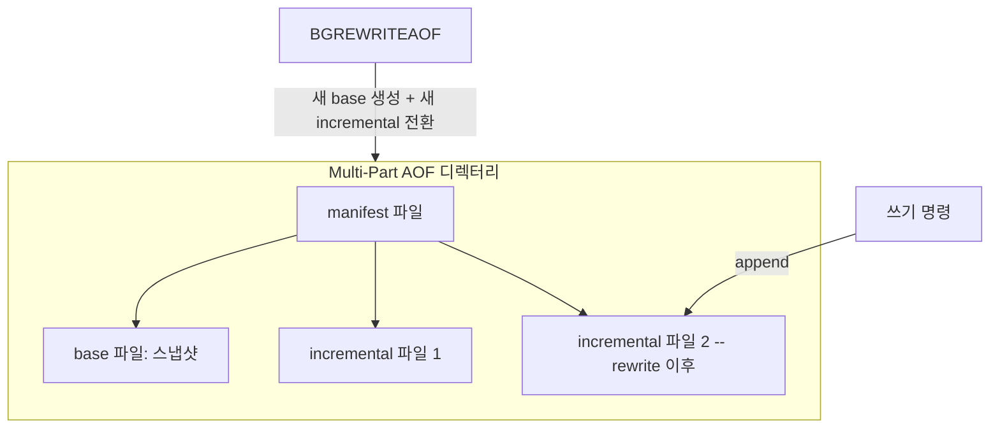

# 영속화 RDB와 AOF

## 핵심 정의

Redis는 인메모리 저장소지만 프로세스 재시작이나 장애 후 데이터를 복구할 수 있도록 두 가지 영속화(persistence) 방식을 제공한다. RDB(Redis Database)는 특정 시점의 전체 데이터셋을 바이너리 스냅샷(snapshot)으로 디스크에 저장하는 방식이고, AOF(Append Only File)는 데이터를 변경하는 모든 쓰기 명령을 로그처럼 순차 기록해 재실행(replay)으로 상태를 복원하는 방식이다. 둘은 성능, 복구 정밀도, 파일 크기 측면에서 트레이드오프가 명확히 갈리며, 필요한 손실 허용 범위와 복구 시간에 맞게 단독 또는 함께 사용한다.

## 동작 원리 / 구조

**RDB: 시점 스냅샷**

- 마지막 저장 이후 경과 시간과 변경 수를 함께 보는 `save <초> <변경수>` 조건(Redis 8.4 기본: `3600 1`, `300 100`, `60 10000` 중 하나 충족)을 만족하면 자동으로 스냅샷을 만들거나, `BGSAVE`로 수동 트리거한다.
- 스냅샷 생성 시 메인 프로세스가 `fork()`로 자식 프로세스를 만들고, 자식이 Copy-on-Write(CoW) 메모리 위에서 전체 데이터를 파일로 직렬화하는 동안 부모는 정상적으로 요청을 처리한다.
- 장점은 파일이 작고 로딩(재시작 시 복구)이 AOF보다 빠르다는 것. 단점은 마지막 저장 시점 이후의 데이터는 장애 시 모두 유실된다는 것.

**AOF: 명령 로그 재실행**

- 쓰기 명령이 실행될 때마다 AOF 버퍼에 기록되고, `appendfsync` 정책에 따라 디스크로 flush된다.

| appendfsync 값 | 동작 | 특징 |
|---|---|---|
| always | AOF 추가 배치마다 응답 전 fsync(여러 명령이 묶일 수 있음) | 지속성 우선, I/O 비용 큼 |
| everysec (기본값) | 1초마다 백그라운드 스레드가 fsync | 성능과 안전성의 균형, 통상 약 1초 손실 창; 지연·설정에 따른 예외 존재 |
| no | OS에 flush 위임 | fsync 비용을 줄임, 손실 창은 OS·스토리지 flush에 의존 |

- 파일이 계속 커지는 문제를 해결하기 위해 AOF rewrite(BGREWRITEAOF)로 현재 데이터셋을 표현하는 base 파일로 다시 기록한다. RDB preamble을 쓰면 명령 목록이 아니라 RDB 포맷이다.
- Redis 7.0부터는 Multi-Part AOF 구조를 사용한다. base 파일(RDB 또는 AOF 포맷의 스냅샷)과 이후의 incremental 파일들을 manifest 파일이 추적하며, rewrite 시 새 incremental 파일로 원자적으로 전환한다.

**RDB + AOF 혼합**

Redis 4.0부터 `aof-use-rdb-preamble` 옵션으로 AOF rewrite 시 base 파일을 RDB 포맷(더 작고 로딩이 빠름)으로 만들고, 그 이후 변경분을 AOF로 기록하는 하이브리드 방식을 지원한다. Redis 8.4에서 이 옵션의 기본값은 yes이고 AOF 자체의 기본 활성화는 별도(`appendonly no`)다. 재시작 시 base(RDB) 로드 후 incremental(AOF) 재실행으로 복구한다.

### RDB에서 AOF로 전환하고 백업하기

RDB로 운영하던 데이터를 AOF로 바꿀 때는 설정 파일에 `appendonly yes`만 적고 곧바로 재시작하지 않는다. RDB 백업을 확보한 뒤 살아 있는 인스턴스에서 AOF를 활성화해 현재 데이터로 로그를 만들고, `INFO persistence`의 `aof_rewrite_in_progress=0`·`aof_rewrite_scheduled=0`·`aof_last_bgrewrite_status=ok`를 확인한다. 다음 시작에도 적용될 설정을 저장하고 복구 데이터를 검증한다. 런타임 CONFIG 변경과 시작 설정의 일치가 필요하다.

Redis 7.0+ Multi-Part AOF 백업은 base 하나가 아니라 `appenddirname` 안의 manifest와 관련 파일 집합을 대상으로 한다. 일반 파일 복사 중 rewrite가 파일 집합을 바꾸면 불완전한 백업이 될 수 있어, 자동·수동 rewrite와 복사 시점을 조정하고 완료 후 기존 rewrite 설정을 복원한다.

### Redis 8.10의 BACKUP 명령

Redis Open Source 8.10은 `BACKUP START` → 상태 확인 → `BACKUP SEAL` → 파일 복사 → `BACKUP CLEANUP` 절차를 제공한다. START로 BASE를 만들고 이후 쓰기를 INCR에 모은다. SEAL은 INCR을 flush·fsync하고 불변의 BASE·INCR·manifest 집합을 확정한다. 복구 시점은 처음 BASE를 뜬 때가 아니라 **SEAL 경계**다. `BACKUP LIST`의 완성된 파일들을 외부 저장소로 복사한 뒤 정리한다.

이 기능은 AOF 비활성 상태에서도 임시 AOF 처리를 사용하지만 configured `appendonly` 값 자체를 켜지는 않는다. 한 번에 하나의 백업만 진행하며 시작 시 백업 디렉터리는 비어 있어야 한다. 노드 단위 절차이므로 여러 샤드를 각각 백업하는 것만으로 애플리케이션의 전역 일관 시점이 자동 확보된다고 판단하지 않는다. 앞의 Redis 8.4 설정 설명과 달리 이 명령은 8.10 이상에 해당한다.

## 실무 관점

- **복제본만 영속화해도 원본 자동 재시작에 안전한 것은 아니다.** 영속화를 끈 원본이 빈 데이터셋으로 빠르게 재시작하면 복제본이 다시 동기화하며 기존 데이터를 비울 수 있다. Sentinel이 장애를 감지하기 전에 일어날 수도 있다. 이런 구성은 자동 재시작·승격 순서와 복원 절차를 함께 설계한다.

- 캐시 전용(원본 데이터가 DB에 따로 있고 Redis는 조회 성능 향상 목적)이라면 영속화를 아예 끄거나 RDB만 최소 설정으로 두는 것도 합리적인 선택이다. 데이터 유실이 곧 서비스 장애로 이어지는 세션 스토어, 큐, 랭킹 등은 AOF everysec 이상을 기본으로 검토한다.
- RDB만 쓰면 마지막 스냅샷 이후 데이터가 통째로 날아갈 수 있고, AOF는 선택한 base 형식과 incremental 크기에 따라 복구 시간이 달라진다. 실무에서는 RDB(빠른 백업/마이그레이션용) + AOF everysec(장애 복구용)를 함께 켜는 조합이 일반적이다.
- 흔한 장애 패턴: 대용량 인스턴스에서 BGSAVE/BGREWRITEAOF가 fork를 유발하는데, 이때 fork 이후 쓰기로 CoW 페이지 복사가 누적돼 메모리가 원본 데이터셋의 2배에 가까워질 수 있어 `maxmemory` 근처에서 운영하던 인스턴스가 OOM으로 죽는 사례. fork 시점의 메모리 여유분을 항상 확보해야 한다.
- 흔한 실수: `appendfsync always`를 "가장 안전하니까"라는 이유로 프로덕션에 적용했다가 쓰기 처리량이 급격히 떨어지는 경우. everysec의 손실 가능성이 허용되는지는 업무 요구와 장애 모델로 판단한다.
- 복제(replication) 구성에서는 복제본 동기화 시 RDB 스냅샷을 전송하는 것이 기본 방식이므로, `save ""`로 주기 저장을 꺼도 full resync에는 RDB 생성이 필요할 수 있다. 디스크 기반 또는 diskless 전송 방식을 별도로 설정한다.
- 튜닝 포인트: `save` 지시자 조합(쓰기가 매우 잦은 서비스는 오히려 RDB 자동 저장을 끄고 AOF에 의존하는 경우도 있음), `appendfsync`, `auto-aof-rewrite-percentage`/`auto-aof-rewrite-min-size`(AOF 파일이 얼마나 커지면 자동 rewrite할지), `aof-use-rdb-preamble`, `rdb-key-save-delay`(테스트/디버깅용).

## 심화 Q&A

### Q. WAIT와 WAITAOF는 영속화 보장을 어떻게 다르게 확인하는가?
`WAIT`는 같은 연결의 앞선 쓰기가 지정 수 복제본에 반영되었는지를 확인하며 AOF의 디스크 동기화 완료까지 뜻하지 않는다. Redis 7.2+의 `WAITAOF numlocal numreplicas timeout`은 같은 연결의 앞선 쓰기에 대해 로컬·복제본의 AOF fsync를 기다린다. 예를 들어 `WAITAOF 1 1 1000`의 반환 배열이 `[1, 0]`이면 로컬만 충족했다. 시간 초과에도 실제 확인 수를 반환하므로 두 값을 검사해야 하고, 앞선 쓰기가 롤백되는 것은 아니다.

`numlocal=1`은 로컬 AOF 활성화가 필요하며 replica에 이 명령을 보낼 수 없다. `MULTI`·스크립트 안에서는 기다리지 않고 현재 확인 수만 반환한다. fsync 확인을 추가해도 장애 후 승격될 노드와 데이터 보존 범위가 자동으로 일치하거나 Redis가 선형화 가능한 저장소가 되는 것은 아니다.

### Q. RDB와 AOF를 동시에 켰을 때 재시작 시 Redis는 어떤 파일로 복구하는가?
AOF가 활성화되어 있으면 AOF(정확히는 Multi-Part AOF의 base+incremental)를 우선 사용해 복구한다. AOF가 RDB보다 최신 데이터를 더 적게 유실하기 때문이다. AOF가 꺼져 있을 때만 RDB 파일로 복구한다. 따라서 두 방식을 함께 켜는 것은 "RDB로 빠른 백업/마이그레이션, AOF로 정확한 복구"라는 서로 다른 목적을 분리해서 챙기는 전략이다.

### Q. everysec 정책에서 정확히 "최대 1초 유실"이라는 말의 전제 조건은 무엇인가?
fsync를 수행하는 백그라운드 스레드가 정상적으로 1초마다 디스크에 flush를 완료할 수 있다는 전제다. 만약 디스크 I/O 자체가 느려서(예: 네트워크 스토리지 지연) fsync가 1초 이상 걸리면, Redis 8.4는 진행 중 fsync 때문에 AOF 버퍼의 write를 약 2초까지 미룰 수 있다. 이후에는 기존 fsync 완료를 기다리지 않고 write를 시도해 그 I/O에서 메인 스레드가 지연될 수 있다(`no-appendfsync-on-rewrite`와 별개로 내부 지연 로직 존재). 즉 디스크 성능이 나쁜 환경에서는 "최대 1초 유실"이 보장되지 않을 수 있다.

### Q. BGREWRITEAOF 도중 새로 들어오는 쓰기 명령은 어떻게 처리되는가?
자식 프로세스가 현재 데이터셋으로부터 새로운 base 파일을 만드는 동안, 부모 프로세스는 rewrite 시작 시 새 incremental 파일을 열어 후속 쓰기를 append한다(Multi-Part AOF 구조 덕분에 rewrite 전용 버퍼를 따로 관리할 필요가 없다). rewrite가 끝나면 manifest를 원자적으로 갱신해 "새 base + 새 incremental" 조합으로 전환하고, 이전 파일들은 정리된다. 자식의 전체 rewrite가 끝날 때까지 모든 요청을 멈추지는 않지만 fork·I/O 때문에 지연될 수 있고, 자식 프로세스의 디스크 쓰기가 부모의 I/O 대역폭과 경합해 지연이 늘어날 수 있다.

### Q. RDB 스냅샷 생성 중 fork로 인한 메모리 급증을 최소화하는 방법이 있는가?
근본적으로 CoW 특성상 쓰기 비율이 높을수록(스냅샷 도중 변경되는 페이지가 많을수록) 메모리 증가폭이 커진다. 완화책으로는 스냅샷 빈도를 낮춰 fork 자체를 덜 발생시키거나, 트래픽이 낮은 시간대에 BGSAVE를 예약 실행하거나, 여유 메모리를 `maxmemory` 대비 충분히 확보(CoW·복제 버퍼·AOF 버퍼·OS 사용량을 실측해 maxmemory 상한 결정)하는 방식이 일반적이다. THP(Transparent Huge Pages)가 활성화된 리눅스 환경에서는 CoW 단위가 커져 지연이 악화될 수 있어 비활성화가 권장된다.

### Q. 어떤 상황에서 영속화를 완전히 끄는 것이 합리적인 선택이 되는가?
Redis가 진실의 원천(source of truth)이 아니라 순수 캐시로만 쓰이고, 캐시가 비었을 때 원본 DB에서 재구축(cache warm-up)하는 로직이 이미 있다면 영속화 중단을 검토할 수 있다. 재구축 부하와 복구 시간을 감당하는지 확인해야 한다. 오히려 영속화를 끄면 정기 영속화로 인한 fork·디스크 I/O 경합을 줄여 순수 성능과 운영 단순성 측면에서 이득이다. 다만 재시작 시마다 캐시가 완전히 비어 원본 DB에 순간적으로 부하가 몰리는 캐시 스탬피드(cache stampede) 가능성은 별도로 대비해야 한다.

### Q. AOF 파일이 손상되었을 때(예: 디스크 장애로 마지막 줄이 잘림) Redis는 어떻게 대응하는가?
Redis는 시작 시 AOF 파일의 무결성을 검사하며, 마지막 명령이 불완전하게 잘린 경우(정상적인 truncation 패턴) 기본적으로 해당 부분을 무시하고 그 이전까지의 데이터로 복구를 진행한다(`aof-load-truncated` 기본값 yes). 그러나 파일 중간이 손상된 경우는 자동 복구 대상이 아니며, 원본 파일을 보관한 뒤 `redis-check-aof`로 검사하고 필요한 경우 `--fix`로 손상 이후 데이터를 잘라내는 복구를 검토한다. Multi-Part AOF의 manifest와 관련 파일 전체를 다뤄야 한다. 프로덕션에서는 이런 상황을 대비해 RDB 백업을 별도로 병행하는 것이 안전하다.

## 관련 개념
- [[Redis 자료구조]]
- [[싱글 스레드 모델과 이벤트 루프]]
- [[Redis Cluster]]
- [[리플리케이션]]
- [[Redis 메모리와 축출 정책]]

## 참고 자료

부분 재확인: 2026-09-22. 영속화가 없는 원본의 자동 재시작 위험과 Redis 7.2+ WAITAOF의 연결·fsync·시간 초과·일관성 한계를 확인했다. 기존 전체 확인일은 유지한다.

- [WAITAOF](https://redis.io/docs/latest/commands/waitaof/) — 로컬·복제본 fsync 확인, 반환 수 검사, 트랜잭션·스크립트·페일오버 제약.
- [WAIT](https://redis.io/docs/latest/commands/wait/) — 복제 확인과 영속화·강한 일관성의 차이.

확인일: 2026-09-08. 아래 적용 범위에서 본문·Q&A·예제를 재검증했다. 예제는 문서와 대조했으며 별도 실행 검증은 하지 않았다.

- [Redis Persistence](https://redis.io/docs/latest/operate/oss_and_stack/management/persistence/) — RDB/AOF 선택·Redis 7.0+ Multi-Part AOF·복구 우선순위.
- [Redis 8.4 redis.conf](https://raw.githubusercontent.com/redis/redis/8.4/redis.conf) — save 기본값·appendonly/appendfsync·preamble·truncated 설정.
- [Redis 8.4 AOF Source](https://raw.githubusercontent.com/redis/redis/8.4/src/aof.c) — flushAppendOnlyFile의 fsync 진행 중 write 지연 동작.
- [Redis Replication](https://redis.io/docs/latest/operate/oss_and_stack/management/replication/) — 주기 RDB를 꺼도 full resync 생성 가능·diskless 옵션.
- [Diagnosing Latency](https://redis.io/docs/latest/operate/oss_and_stack/management/optimization/latency/) — fork·CoW·THP·AOF I/O 경합.

부분 재검증: 2026-09-23. Redis 공식 영속화 문서로 AOF 전환·7.0+ 파일 백업 경계를, 8.10 명령 문서로 BACKUP 상태와 SEAL 복원 시점을 확인했다. Redis 8.10.2 릴리스도 확인했으나 기존 8.4 기본값 전체를 8.10에 대해 재검증한 것은 아니다. 실행 중인 Redis에 대한 전환·복원 시험은 하지 않았다. 기존 전체 검증일은 유지한다.

- [Redis Persistence](https://redis.io/docs/latest/operate/oss_and_stack/management/persistence/) — RDB→AOF 전환, rewrite 완료 확인, Multi-Part AOF 백업.
- [BACKUP START](https://redis.io/docs/latest/commands/backup-start/) — Redis Open Source 8.10.0+, 임시 AOF·BASE 생성·단일 백업·빈 디렉터리.
- [BACKUP SEAL](https://redis.io/docs/latest/commands/backup-seal/) — Redis Open Source 8.10.0+, immutable 파일 집합과 seal 시점 복원.
- [Redis 8.10.2 release](https://github.com/redis/redis/releases/tag/8.10.2) — 2026-09-17 공개 버전 확인.
