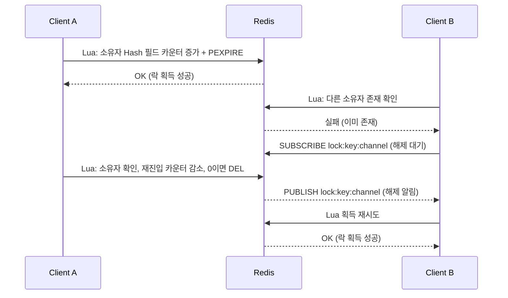

# 분산 락

## 핵심 정의
분산 락(distributed lock)은 여러 프로세스나 서버 인스턴스가 하나의 공유 자원에 동시에 접근하는 것을 막기 위해, 단일 JVM 내부의 `synchronized`나 `ReentrantLock`으로는 해결할 수 없는 다중 서버 환경의 동시성 문제를 외부 저장소(Redis, ZooKeeper, DB 등)를 매개로 조율(coordination)하는 메커니즘이다.

핵심은 참여자들이 같은 외부 락 프로토콜을 따르는 판단이다. 락 서비스 선택만으로 해결되지 않으며 보호 자원이 오래된 토큰을 실제 거부해야 한다. Redis 명령을 직접 조합하면 소유자 검증·만료·대기·재연결을 직접 구현해야 한다. Redisson의 RLock은 재진입과 Pub/Sub 기반 대기를 제공해 구현 부담을 줄인다. 다만 Pub/Sub가 모든 부하에서 더 효율적이거나 RLock이 요청 순서를 보장하는 것은 아니다.

## 동작 원리 / 구조

### Redisson RLock 기본 흐름



Redisson 3.52.0 RLock은 Hash에 클라이언트/스레드 소유자와 재진입 횟수를 기록하고 Lua로 획득·해제를 처리한다. 위 그림은 이 흐름의 개념도다. 단순 비재진입 락의 `SET key token NX PX ttl`과 저장 구조가 다르다. 예를 들어 해제 시에는 "내가 설정한 값과 현재 값이 같을 때만 삭제"하는 CAS(compare-and-swap) 방식을 Lua로 원자적으로 수행해, 이미 만료되어 다른 클라이언트가 잡은 락을 실수로 지우는 것을 방지한다.

### Watchdog(감시견)에 의한 자동 락 연장
락의 유효 시간(leaseTime)을 명시하지 않으면(기본값 -1) Redisson은 내부적으로 기본 30초의 만료 시간을 설정하고, 락을 보유한 클라이언트가 살아있는 동안 백그라운드 스레드가 주기적으로(3.52.0 소스 기준 watchdog timeout의 1/3 주기로 예약, 기본 설정이면 약 10초마다) TTL을 갱신(연장)한다. 이를 통해 "작업이 예상보다 오래 걸려 락이 중간에 만료되고 다른 클라이언트가 락을 획득하는" 문제를 완화한다.

```java
RLock lock = redissonClient.getLock("stock:item:" + itemId);
boolean acquired = false;
try {
    acquired = lock.tryLock(3, 10, TimeUnit.SECONDS); // waitTime, leaseTime
    if (!acquired) {
        throw new LockAcquisitionException("락 획득 실패");
    }
    // 비즈니스 로직 (재고 차감 등)
} catch (InterruptedException e) {
    Thread.currentThread().interrupt();
    throw new RuntimeException(e);
} finally {
    if (acquired) { // lease 만료 등 소유권 상실 시 unlock 예외도 관찰해야 함
        lock.unlock();
    }
}
```
leaseTime을 명시하면 Watchdog은 동작하지 않으므로, 작업 시간이 leaseTime을 초과할 가능성이 있다면 명시적 leaseTime 대신 Watchdog(기본값)에 맡기거나 작업 시간을 보수적으로 추정해야 한다.

### 트랜잭션과 락 범위의 결합 문제
Spring의 `@Transactional`과 분산 락을 함께 쓸 때, 락 해제가 트랜잭션 커밋보다 먼저 일어나면 락이 풀린 직후부터 커밋 완료 전까지의 틈에 다른 스레드가 아직 반영되지 않은(커밋 전) 데이터를 읽을 수 있다. 이를 막기 위해 AOP 등의 바깥 경계에서 락 획득 → 별도 프록시/TransactionTemplate에서 비즈니스 트랜잭션 실행 및 커밋 → 락 해제 순서를 강제하는 패턴이 널리 쓰인다.


`REQUIRES_NEW`는 기존 트랜잭션이 있을 때 이를 분리해야 하는 경우의 선택이다. 외부 트랜잭션 롤백과 내부 커밋의 불일치·추가 커넥션 비용이 있으므로 무조건 적용하지 않는다.

### Redlock 알고리즘과 그 한계
단일 Redis 노드 장애에 대비해 다수의 독립된 Redis 인스턴스(예: 5개) 중 과반수에서 락 획득에 성공해야 유효하다고 보는 Redlock 알고리즘이 제안된 바 있다. 그러나 Martin Kleppmann은 이 알고리즘이 fencing token(락 획득마다 단조 증가하는 토큰) 부재, 제한된 시계 드리프트·유효 시간 및 프로세스 지연 가정, GC 정지(stop-the-world pause) 등 프로세스 지연 상황에서 안전성을 보장하지 못한다고 비판했다. Redis 공식 문서도 여전히 이 논쟁을 명시적으로 언급하며, 따라서 요구하는 장애 모델에 따라 판단해야 하며, "Redlock/Redis 기반 락은 성능 최적화나 최선 노력(best-effort) 수준의 락에는 적합하지만, 데이터 정합성을 절대적으로 보장해야 하는 correctness-critical한 조율에는 ZooKeeper(Zab)나 etcd(Raft) 같은 합의 기반 시스템과 fencing token을 함께 쓰는 것이 더 안전하다"는 판단이다. 락 서비스 선택만으로 해결되지 않으며 보호 자원이 오래된 토큰을 실제 거부해야 한다.

## 실무 관점

### Fencing 토큰은 획득 응답에서 받은 값을 유지한다

Redisson 3.52.0의 `RFencedLock` 구현은 락 획득 때 공유 카운터를 증가시키고 `lockAndGetToken()` 계열로 그 값을 반환한다. 반면 `getToken()`은 공유 카운터의 현재 값을 읽는다. 작업 재개 시 `getToken()`을 호출해 얻은 값을 “내가 획득한 토큰”으로 사용하면 안 된다.

예를 들어 A가 토큰 41을 받은 뒤 정지하고, 임대가 만료되어 B가 토큰 42로 자원을 갱신했다고 하자. A가 원래의 41을 보내면 자원 측 검사가 거부할 수 있다. A가 공유 카운터를 다시 읽어 42를 보내면 오래된 소유자임을 구분하는 근거를 스스로 없앤다. 획득 결과를 해당 작업에 고정해 전달하고, 보호 자원은 마지막 허용 토큰과의 비교 및 쓰기를 원자적으로 수행해야 한다.

토큰이 같거나 더 크다는 검사만으로 동일 작업의 중복 실행이 제거되지는 않는다. 외부 결제·누적 차감 같은 효과에는 별도의 요청 멱등키도 필요하다. 또한 구현 클래스의 `delete()`는 락 키와 토큰 카운터를 함께 삭제하므로 일반 `unlock()`을 대체하는 정리 작업으로 쓰지 않는다. 카운터 초기화·유실을 허용하면 단조 증가 전제와 복구 정책을 다시 설계해야 한다.

- **적용 대상**: 재고 차감, 쿠폰 발급, 선착순 이벤트, 정산 배치의 중복 실행 방지 등 "동시에 여러 인스턴스가 같은 자원을 다뤄서는 안 되는" 시나리오에 사용한다. 단순 조회 성능 문제는 락이 아니라 캐시나 큐로 해결해야 한다.
- **락 범위는 최소한으로**: 락을 잡은 채로 외부 API 호출이나 긴 I/O를 수행하면 락 보유 시간이 늘어나 처리량(throughput)이 급감한다. 락 안에서는 꼭 필요한 임계 구역(critical section)만 남기고 나머지는 락 밖에서 처리한다.
- **leaseTime과 Watchdog 선택**: leaseTime을 명시적으로 짧게 주면 락 해제가 빠르지만 작업이 지연될 경우 락이 먼저 풀려 동시성 이슈가 재발할 수 있다. Watchdog도 긴 프로세스 정지·네트워크 단절 중 갱신을 보장하지 못하며 락을 든 인스턴스가 비정상 종료(kill -9 등)될 경우 감시 스레드도 함께 죽어 락이 남아 있다가 결국 TTL로 해제된다는 점을 감안해야 한다.
- **흔한 장애 패턴**: `unlock()`을 `finally` 블록에서 호출하지 않아 예외 발생 시 락이 방치되는 경우, 락을 획득한 스레드와 다른 스레드가 `unlock()`을 호출해 `IllegalMonitorStateException`이 발생하는 경우(Redisson은 기본적으로 락 소유자 검증을 한다), 트랜잭션 커밋 전에 락을 풀어 커밋 전 데이터가 노출되는 경우가 대표적이다.
- **튜닝 포인트**: `waitTime`(락 획득 대기 시간)은 사용자 응답 시간(SLA)을 고려해 설정하고, 대기 실패 시 즉시 실패시킬지(fail-fast) 큐잉할지 결정한다. 락 키(key) 설계 시 지나치게 넓은 범위(예: 전체 테이블 단위)로 잡으면 병목이 되므로 최소 단위(예: 개별 상품 ID)로 세분화한다.
- **DB 락과의 비교**: 비관적 락(pessimistic lock, `SELECT ... FOR UPDATE`)은 트랜잭션 격리 수준과 DB 커넥션 풀에 의존하므로 다중 서비스/다중 DB 환경에서는 한계가 있다. 반면 분산 락은 DB와 독립적으로 여러 서비스 간 조율이 가능하지만, 인프라(Redis 등)에 대한 추가 의존성과 장애 지점이 생긴다.

## 심화 Q&A

### Q. Redisson의 Watchdog이 락 만료 문제를 "완전히" 해결하지 못하는 시나리오는?
JVM이 살아 있어도 긴 stop-the-world GC, CPU 정지, 네트워크 단절 때문에 TTL 갱신이 늦으면 락이 만료될 수 있다. 다른 클라이언트가 새 락을 얻은 뒤 기존 작업이 재개되면 동시 쓰기가 가능하다. 비정상 종료 후 TTL 해제는 가용성 회복 장치일 뿐 이 stale holder 문제를 해결하지 않는다. 자원 측 버전 검사·fencing이 필요하다.

### Q. 락을 해제할 때 단순히 `DEL key`를 호출하면 안 되는 이유는?
자신이 설정한 락의 TTL이 만료되어 다른 클라이언트가 이미 새로운 락을 획득한 상태에서, 원래 클라이언트가 뒤늦게 `DEL`을 호출하면 남의 락을 삭제해버리는 문제가 생긴다. 이를 막기 위해 락 값(보통 UUID나 스레드 식별자)을 비교한 뒤 일치할 때만 삭제하는 CAS 연산을 Lua 스크립트로 원자적으로 수행해야 한다.

### Q. 분산 락과 낙관적 락(optimistic lock, 버전 컬럼 기반)의 트레이드오프는 무엇인가?
낙관적 락은 충돌이 드문 상황에서 락 없이 버전 검증만으로 처리하므로 처리량이 높지만, 충돌이 잦으면 재시도 비용이 누적되어 오히려 비효율적이다. 분산 락은 충돌이 잦은 상황(선착순, 재고 소진 임박 등)에서 상호 배제를 시도하지만 일반 RLock은 FIFO 순서를 보장하지 않으며, 락 자체의 획득/해제 오버헤드와 대기 시간이 발생한다. 트래픽 패턴(충돌 빈도)을 기준으로 선택해야 한다.

### Q. Redlock의 fencing token 부재 문제가 실제로 어떤 장애로 이어지는가?
클라이언트 A가 락을 획득했지만 긴 GC pause로 잠시 정지된 사이 TTL이 만료되어 클라이언트 B가 같은 락을 획득해 자원을 변경한다. 이후 A가 깨어나 자신이 여전히 락을 갖고 있다고 착각한 채 자원을 변경하면, B의 변경 사항이 A에 의해 덮어써지는 데이터 손상이 발생한다. fencing token(단조 증가 값)이 있으면 자원 쪽에서 "더 낮은 토큰의 쓰기는 거부"하는 방식으로 이를 막을 수 있지만, Redlock 자체는 이런 토큰 발급 메커니즘을 제공하지 않는다.

### Q. 락 획득에 실패했을 때 무한 재시도 대신 어떤 대안을 고려해야 하는가?
`waitTime`을 짧게 주고 실패 시 사용자에게 즉시 실패를 반환하거나(fail-fast), 메시지 큐에 요청을 적재해 순차적으로 소비하는 방식으로 전환하는 것이 일반적이다. 특히 대량 트래픽이 짧은 시간에 몰리는 선착순 이벤트라면 락으로 순서를 제어하기보다 Redis의 원자적 연산(`INCR`, Sorted Set)이나 큐 기반 처리로 아키텍처 자체를 바꾸는 것이 더 확장성 있는 해법이다.

### Q. 단일 Redis 인스턴스 기반 락과 Redis Cluster/Sentinel 환경의 락은 안전성 측면에서 어떻게 다른가?
단일 인스턴스에서는 마스터가 살아있는 동안은 락의 원자성이 보장되지만 그 자체가 단일 장애점이다. Sentinel/Cluster의 마스터-레플리카(replica) 구성에서는 마스터가 락을 기록한 직후 장애가 나서 아직 레플리카에 복제되기 전에 페일오버(failover)가 일어나면, 새로 승격된 마스터에는 해당 락 정보가 없어 다른 클라이언트가 같은 락을 획득할 수 있다. 이는 단순 비동기 복제 락의 한계다. Redisson은 `checkLockSyncedSlaves`와 동기화 timeout으로 연결된 복제본 반영을 확인하는 보호를 제공하지만, 장애 시 토큰·락 상태 보존과 TTL 중 작업 완료까지 무조건 보장하는 것은 아니다.  Redlock은 이를 유효 시간 안에 여러 독립 인스턴스의 과반수에서 락을 획득하는 방식으로 완화하려 했으나 앞서 언급한 시계/지연 문제로 완전한 해법은 아니다.

## 관련 개념
- [[캐시와 DB 정합성]]
- [[락의 종류]]
- [[캐시 스탬피드]]

## 참고 자료

부분 재확인: 2026-09-22. Redis 공식 Distributed Locks 문서에서 Redlock의 독립 인스턴스·과반수 획득·유효 시간 조건을 재확인했다. 합의 로그 프로토콜과 혼동하지 않도록 표현을 수정했으며 Redisson 전체 구현의 재검증은 아니므로 기존 `verified`를 유지했다.

확인일: 2026-09-08. 아래 적용 범위에서 본문·Q&A·예제를 재검증했다. 예제는 문서와 대조했으며 별도 실행 검증은 하지 않았다.

- [Distributed Locks with Redis](https://redis.io/docs/latest/develop/clients/patterns/distributed-locks/) — Redis 단일 락·Redlock의 시간 가정과 복제·fencing 경계.
- [Redisson Locks and Synchronizers](https://redisson.pro/docs/data-and-services/locks-and-synchronizers/) — 현행 RLock·watchdog·동기 복제 확인·RFencedLock 범위.
- [RedissonLock Source](https://raw.githubusercontent.com/redisson/redisson/redisson-3.52.0/redisson/src/main/java/org/redisson/RedissonLock.java) — Redisson 3.52.0: Hash·재진입 카운터·Lua 획득/해제.
- [RenewalTask Source](https://raw.githubusercontent.com/redisson/redisson/redisson-3.52.0/redisson/src/main/java/org/redisson/renewal/RenewalTask.java) — Redisson 3.52.0: timeout/3 갱신 예약.
- [How to Do Distributed Locking](https://martin.kleppmann.com/2016/02/08/how-to-do-distributed-locking.html) — 원저자 비평: lease·GC 정지·자원 측 fencing.

부분 재검증: 2026-10-04. Redisson 3.52.0 고정 소스에서 RFencedLock의 획득 토큰 반환·공유 카운터 조회·delete 범위를 확인했다. 41/42 경합 예시와 멱등성 분리는 해당 계약에서 도출한 설계 판단이다. 아래 조합에서 토큰 경계만 추가 실행했으며 다른 버전의 동일 구현을 가정하지 않는다. 기존 `verified`는 유지한다.

- [RedissonFencedLock 3.52.0 Source](https://github.com/redisson/redisson/blob/redisson-3.52.0/redisson/src/main/java/org/redisson/RedissonFencedLock.java) — tryLockInnerAsync의 INCR·반환, getTokenAsync의 GET, deleteAsync의 두 키 제거.

추가 실행 확인: 2026-10-04. Redis 6.2.11 실제 단일 서버를 격리해 Redisson 3.52.0의 독립 클라이언트 둘로 재현했다. A가 `tryLockAndGetToken(wait, lease, unit)`으로 1을 받은 뒤 명시적 lease가 만료되고 B가 2를 얻자, 소유권을 잃은 A의 `getToken()`도 2를 반환했다. 일반 unlock 뒤 카운터는 유지되었고, 구현 클래스의 delete 뒤에는 토큰 키가 사라져 다음 획득이 1부터 다시 시작했다. 외부 DB의 원자적 토큰 비교·쓰기, 실제 GC 정지·네트워크 분할·복제 failover는 시험하지 않았다. 실행 파일의 실제 버전 출력과 Redis INFO로 버전을 확인했으며 Redis 8.10.2에서의 실행 결과로 취급하지 않는다.
