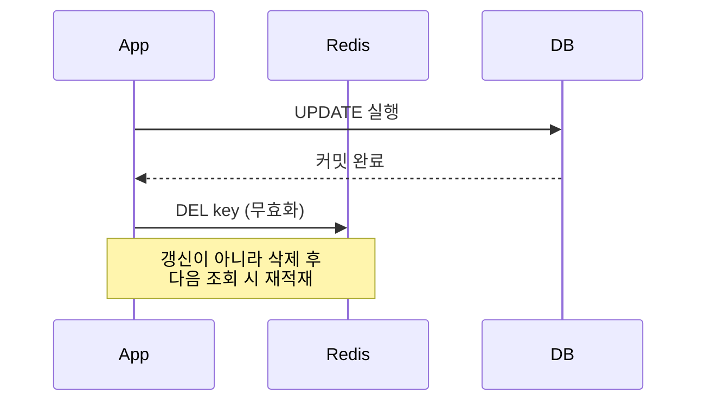
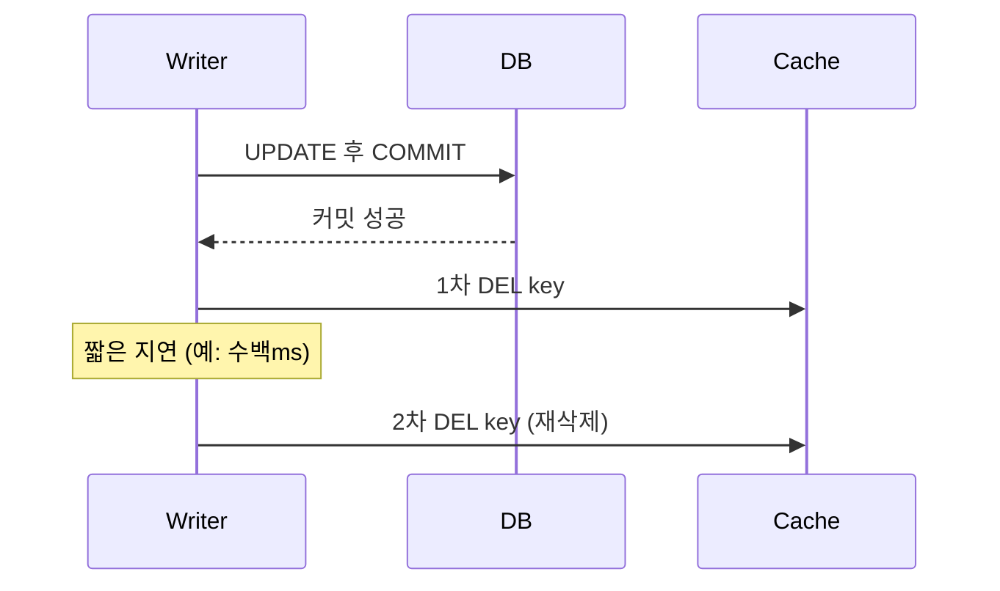

# 캐시와 DB 정합성

## 핵심 정의
캐시와 DB 정합성(consistency)이란 캐시에 저장된 데이터와 원본 데이터베이스(DB)의 데이터가 서로 다른 값을 가리키는 상태(stale data)를 얼마나 허용하고 어떻게 해소할 것인가에 대한 문제다. 캐시는 본질적으로 DB 데이터의 복제본이므로 쓰기(write)가 발생하는 순간부터 두 저장소 간에 시간차(time window)가 생기고, 이 시간차 동안 조회되는 데이터는 항상 정합성 위험을 안고 있다.

강한 일관성(strong consistency)이 필요하면 캐시를 포함한 읽기·쓰기 프로토콜 전체를 검증해야 한다. 두 저장소의 쓰기를 원자적으로 묶는 것만으로 모든 읽기 경쟁이 해결되지는 않는다. 권위 있는 DB에서 조건을 검사하거나 버전·lease로 오래된 캐시 채우기를 거부하는 방법도 있다. 일반적인 비동기 무효화 캐시는 일정한 stale window를 허용한다.

## 동작 원리 / 구조

### 대표 패턴 비교

| 패턴 | 쓰기 흐름 | 정합성 | 장애 시 영향 |
|---|---|---|---|
| Cache-Aside (Look-Aside) | DB 갱신 → 캐시 삭제(또는 갱신) | 짧은 stale window 존재 | 캐시 장애 시 DB로 폴백 가능 |
| Write-Through | 캐시에 쓰면 캐시가 동기적으로 DB에 씀 | 두 저장소 반영·읽기 프로토콜에 의존; 자동 strong consistency 아님 | 캐시 장애 시 쓰기 자체 실패 |
| Write-Behind (Write-Back) | 캐시에 먼저 쓰고 비동기로 DB 반영 | 약함, 유실 위험 | 캐시 장애 시 데이터 유실 가능 |
| Read-Through | (쓰기 자체는 정의하지 않음, 보통 Write-Through와 결합) 읽기 미스 시 캐시가 직접 DB 조회 후 채움 | Cache-Aside와 유사 | 캐시 계층에 로직 위임 |

Spring 생태계에서 가장 널리 쓰이는 조합은 Cache-Aside다.

### 왜 "갱신"이 아니라 "삭제"인가
캐시를 갱신(update)하는 대신 삭제(invalidate) 후 다음 읽기 시점에 재적재(lazy loading)하는 방식을 권장하는 이유는, 동시에 여러 쓰기가 들어올 때 캐시에 쓰는 순서가 DB 커밋 순서와 뒤바뀌면 최종적으로 캐시에 더 오래된 값이 남는 레이스 컨디션(race condition)이 발생하기 때문이다. 삭제끼리는 멱등(idempotent)이어서 오래된 값으로 덮어쓰는 문제를 줄인다. 그러나 진행 중인 읽기의 재적재와 경쟁하면 아래와 같이 구값이 살아날 수 있어 삭제만으로 수렴이 보장되지는 않는다.

### 대표적인 정합성 붕괴 시나리오 (Cache-Aside)
1. 요청 A: 캐시 미스 → DB에서 값 조회(구값) 시작
2. 요청 B: 같은 키에 대해 DB 값 갱신 후 캐시 삭제
3. 요청 A: 방금 조회한 구값을 캐시에 채움(set)

결과적으로 캐시에는 갱신 이전의 값이 TTL·후속 무효화가 없으면 계속 남는다. 이를 줄이기 위한 대표 기법이 아래의 지연 이중 삭제(delayed double delete)다.

### 트랜잭션 커밋 이전 무효화 문제
DB 갱신과 캐시 삭제를 같은 트랜잭션 내부에서 실행하면, 트랜잭션 롤백(rollback) 시 캐시만 먼저 지워진 상태가 남거나, 반대로 커밋 전에 다른 스레드가 캐시를 재적재해 구값이 다시 채워질 수 있다. 이 때문에 캐시 삭제는 트랜잭션 커밋 이후(after commit)에 수행하는 것이 안전하며, Spring에서는 `TransactionSynchronizationManager.registerSynchronization`으로 커밋 이후 콜백에 캐시 삭제 로직을 넣거나, 이벤트 기반(`@TransactionalEventListener(phase = AFTER_COMMIT)`)으로 분리할 수 있다. 단, 프로세스 내부 after-commit 콜백은 커밋 직후 프로세스 종료 시 유실될 수 있으므로 필요한 무효화 이벤트는 outbox/CDC와 재시도로 전달한다.

## 실무 관점
- **TTL은 허용된 stale 기간을 관리하는 수단**이다. 강한 일관성을 보장하지 않지만 요구에 따라 TTL 기반 정책 자체가 적합할 수 있다. TTL만 믿고 명시적 무효화를 생략하면 TTL 동안 stale data가 노출된다. 재적재가 다시 지연 복제본의 구값을 읽거나 TTL을 반복 연장하면 DB 커밋 기준 stale 상한은 더 길어질 수 있다. 허용 최신성·재적재 비용에 맞춰 TTL을 정한다.
- **Cache-Aside + 커밋 후 삭제**는 DB를 원본으로 삼는 경로에서 검토할 수 있다. Write-Through/Write-Behind는 업무 원장의 내구성·허용 지연·캐시 장애·쓰기 실패 후 복구 요구에 따라 선택한다. 비동기 반영을 쓰면 승인된 쓰기의 내구성 있는 보관과 재시도·중복 처리를 설계한다.
- **분산 환경에서의 이중 삭제**: 여러 인스턴스가 동시에 같은 키를 갱신할 때 지연 이중 삭제의 지연 시간(delay)을 얼마로 잡을지가 튜닝 포인트다. 너무 짧으면 늦은 재적재를 놓치고, 너무 길면 이미 채워진 정상 캐시를 뒤늦게 삭제해 추가 미스를 만들 수 있다. 지연 시간 하나로 모든 reader의 완료 시점을 포괄한다고 가정하지 않는다.
- **흔한 실수**: 캐시 삭제 실패(네트워크 타임아웃 등)를 무시하고 넘어가는 코드. DB는 커밋됐는데 캐시 삭제가 실패하면 캐시에는 TTL·후속 무효화가 없으면 구값이 계속 남는다. 재시도 큐(retry queue)나 메시지 브로커(Kafka 등)를 통한 비동기 무효화 이벤트 발행으로 보완해야 한다.
- **캐시 스탬피드(cache stampede)와의 혼동 주의**: 정합성 문제(잘못된 값)와 스탬피드(대량 미스로 인한 부하 폭증)는 다른 문제다. 뮤텍스나 분산 락으로 스탬피드를 막더라도 정합성 문제는 별도로 설계해야 한다.
- **모니터링 포인트**: 캐시 히트율(hit ratio)뿐 아니라 "무효화 실패율", "무효화 후 재적재까지의 지연"을 별도로 관측해야 정합성 붕괴를 조기에 감지할 수 있다.

## 심화 Q&A

### Q. Cache-Aside 패턴에서 캐시를 삭제하지 않고 갱신(update)하는 방식을 쓰면 안 되는 이유는?
동시 쓰기 상황에서 캐시에 값을 쓰는 순서가 보장되지 않기 때문이다. 두 요청이 거의 동시에 DB를 갱신하고 각자 캐시에 자신의 값을 쓰면, 나중에 DB에 반영된 값과 무관하게 캐시 쓰기 순서에 따라 최종 캐시 값이 결정되어 DB와 어긋날 수 있다. 삭제는 쓰기 순서 역전 문제를 줄이지만 재적재 경쟁은 남는다. 버전 조건부 갱신도 가능하므로 캐시 update 자체를 금지할 이유는 없다.

### Q. 지연 이중 삭제(delayed double delete)로도 완벽히 막지 못하는 경우는?
1차 삭제와 재적재 사이에 지연 시간보다 더 긴 지연을 가진 리더(reader)가 존재하거나, DB 자체가 읽기 전용 복제본(read replica)에서 읽고 있어 복제 지연(replication lag)이 지연 삭제 시간보다 길 경우다. 고정 지연은 이러한 경쟁의 확률을 줄일 뿐 상한 없는 지연을 해결하지 못한다. 더 강한 보장이 필요하면 버전·lease 기반 stale set 방지나 권위 있는 DB 읽기를 설계한다.

### Q. Write-Through 방식이 Cache-Aside보다 정합성이 강하다고 하는데, 왜 실무에서 덜 쓰이는가?
Write-Through는 캐시 계층이 DB 쓰기까지 담당하므로 캐시 장애 시 쓰기 자체가 막히고, 캐시가 트랜잭션 경계에 강하게 결합된다. 쓰기 시 캐시에 적재하는 구현은 읽기 요청이 드문 콜드 데이터도 채워 용량 효율이 낮아질 수 있다. 미적재 키의 쓰기는 DB에만 반영하는 no-write-allocate 정책 등 구성별 예외가 있다. 반면 Cache-Aside는 캐시 장애 시 DB로 폴백 가능해 가용성 측면에서 유리하다.

### Q. 트랜잭션 커밋 전에 캐시를 삭제하면 어떤 문제가 생기는가?
롤백이 발생하면 DB는 변경되지 않았는데 캐시만 지워진 상태가 되어, 이후 조회가 DB의 원래(정상) 값을 재적재하므로 결과적으로는 큰 문제가 안 될 수도 있다. 하지만 더 위험한 경우는 커밋 전 삭제 직후 다른 트랜잭션이 구값을 재조회해 캐시에 채우는 레이스로, 이후 원래 트랜잭션이 커밋되어도 캐시에는 구값이 TTL·후속 무효화까지 남는다. 그래서 반드시 커밋 이후 삭제(after commit)를 기본 원칙으로 삼는다.

### Q. 강한 일관성이 꼭 필요한 데이터(잔액, 재고 등)는 캐시를 아예 쓰면 안 되는가?
표시용 캐시는 사용할 수 있지만 잔액·재고의 최종 판단은 권위 있는 저장소에서 조건부 UPDATE·제약·적절한 격리로 수행하는 것이 한 방법이다. Redis 선차감 후 DB 비동기 반영은 별도의 쓰기 원장 설계이며, Redis failover 유실·중복 이벤트·재처리·대사까지 해결해야 한다. DECR의 단일 명령 원자성과 주기적 대사만으로 DB와의 강한 일관성이 생기지 않는다.

### Q. 메시지 브로커(Kafka 등)를 이용한 이벤트 기반 무효화가 폴링/직접 삭제 방식보다 나은 점은?
DB 변경 이벤트(CDC, Change Data Capture)를 기반으로 캐시 무효화를 트리거하면 애플리케이션 코드에서 무효화 로직을 누락할 위험이 줄고, 여러 서비스/인스턴스가 동일한 이벤트를 구독해 각자 캐시를 정리할 수 있어 멀티 캐시 계층 환경에서 일관성 전파가 쉬워진다. 다만 이벤트 발행 지연만큼 stale window가 늘어나는 트레이드오프가 있다.

### Q. 캐시 값에 버전만 붙이면 오래된 재적재를 모두 막을 수 있는가?
A. 아니다. 현재 캐시 버전과 비교해 더 큰 버전만 쓰는 방식도 키가 삭제·축출된 뒤에는 비교 기준이 사라진다. 예를 들어 DB 버전 12의 무효화로 키가 지워진 뒤 지연된 버전 11 조회가 빈 키를 채우면 다시 구값이다. 무효화 세대(generation)나 최소 허용 버전을 별도로 유지하고, 읽기 시작 시 받은 세대와 적재 직전 세대가 같은지 원자적으로 검사하는 설계가 가능하다. 세대 정보의 만료·축출·failover 유실도 다뤄야 한다.

Redis의 client-side caching 문서는 조회 중임을 나타내는 표시를 먼저 두고 무효화가 그 표시를 지우면 뒤늦은 응답을 적재하지 않는 방법을 설명한다. 이를 DB 캐시에 적용하려면 DB 변경과 무효화 전달 경계까지 추가로 검증해야 하며, 이 표시만으로 강한 일관성이 완성되지는 않는다.

## 관련 개념
- [[분산 락]]
- [[캐시 스탬피드]]
- [[CQRS 패턴]] / [[이벤트 소싱]]

## 참고 자료

확인일: 2026-09-08. 아래 적용 범위에서 본문·Q&A·예제를 재검증했다. 예제는 문서와 대조했으며 별도 실행 검증은 하지 않았다.

- [Cache-Aside Pattern](https://learn.microsoft.com/en-us/azure/architecture/patterns/cache-aside) — 패턴 정의·정합성 비보장·DB 갱신 후 무효화.
- [Scaling Memcache at Facebook](https://www.usenix.org/system/files/conference/nsdi13/nsdi13-final170_update.pdf) — NSDI 2013 원논문: stale set 경쟁과 lease.
- [Transaction-bound Events](https://docs.spring.io/spring-framework/reference/data-access/transaction/event.html) — Spring Framework: AFTER_COMMIT와 트랜잭션 이벤트.
- [Transactional Outbox Pattern](https://docs.aws.amazon.com/prescriptive-guidance/latest/cloud-design-patterns/transactional-outbox.html) — DB·이벤트 이중 쓰기, 재시도와 멱등 소비.
- [Redis Replication](https://redis.io/docs/latest/operate/oss_and_stack/management/replication/) — 비동기 복제와 failover 유실.

부분 재검증: 2026-09-23. Redis 공식 client-side caching의 늦은 응답·무효화 경쟁과 방어 절차를 확인했다. DB 버전·무효화 세대 예시는 해당 경쟁을 DB 캐시에 적용한 설계 분석이며 특정 제품의 자동 보장으로 제시하지 않는다. 전체 verified는 유지한다.

- [Redis Client-side Caching: Avoiding Race Conditions](https://redis.io/docs/latest/develop/reference/client-side-caching/#avoiding-race-conditions) — 무효화보다 늦은 GET 응답과 적재 중 표시의 제거.
