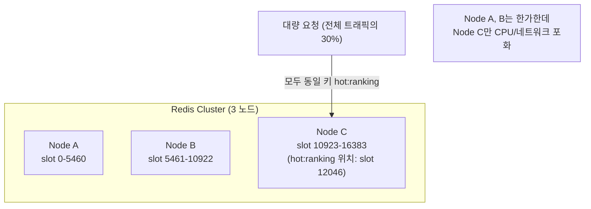
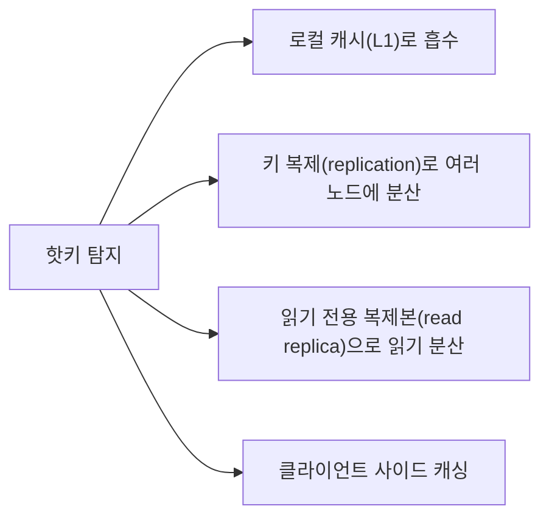

# Hot Key 대응 전략

## 핵심 정의
핫키(hot key)는 특정 캐시 키 하나에 요청이 비정상적으로 집중되는 현상, 또는 그 대상이 되는 키 자체를 가리킨다. 인기 상품 상세, 실시간 랭킹, 유명인의 게시물, 이벤트 쿠폰처럼 특정 데이터에 트래픽이 몰리는 경우 흔히 발생한다. Redis 같은 분산 캐시는 일반적으로 키를 해시 슬롯(hash slot)에 분산해 여러 노드가 부하를 나눠 갖지만, 하나의 키는 항상 하나의 슬롯 프라이머리에 쓰기가 모이므로(복제본에는 사본이 존재) 핫키 트래픽은 클러스터 규모와 무관하게 특정 노드 하나에 집중된다. 이 때문에 클러스터 전체 처리량에는 여유가 있어도 그 노드만 CPU/네트워크 포화로 병목이 되는 것이 핫키 문제의 핵심이다.

## 동작 원리 / 구조

### 왜 샤딩(sharding)만으로는 해결되지 않는가



키 단위 샤딩은 "서로 다른 키"들의 부하를 분산할 뿐, "같은 키에 대한 반복 요청"은 절대 분산시키지 못한다. 이것이 일반적인 부하 분산과 핫키 문제가 근본적으로 다른 지점이다.

### 탐지 (Detection)

- **`redis-cli --hotkeys`**: LFU(Least Frequently Used) 기반 접근 빈도 카운터를 샘플링해 상위 빈도 키를 찾는 레거시 방식. `maxmemory-policy`가 `allkeys-lfu` 또는 `volatile-lfu`로 설정돼 있어야 동작한다.
- **`HOTKEYS` 명령 계열**(Redis 8.6에서 도입된 서버 사이드 추적 기능): `HOTKEYS START METRICS <count> [CPU] [NET] [COUNT k] [DURATION seconds] [SAMPLE ratio] [SLOTS count slot [slot ...]]`로 일정 시간 동안 키별 CPU 점유 시간/네트워크 사용 바이트를 `SAMPLE ratio`의 `1/ratio` 확률로 확률적으로 샘플링해 추적하고, `HOTKEYS GET`으로 상위 K개 키를 조회한 뒤 `HOTKEYS STOP`으로 추적을 종료한다. 클러스터 환경에서는 `SLOTS` 옵션으로 특정 해시 슬롯만 지정해 추적할 수도 있다. LFU 정책 설정에 의존하지 않는다. 오버헤드는 SAMPLE·키 분포·추적 지표에 따라 측정해야 한다. Redis 8.6 미만 버전에는 이 명령이 없으므로 배포된 Redis 버전을 반드시 먼저 확인한다.
- **애플리케이션 레벨 탐지**: 특정 캐시 키 접근을 Micrometer 등으로 카운팅하거나, AOP로 캐시 조회 지점에 접근 로그를 남겨 임계치를 넘는 키를 알람으로 감지하는 방식. 반영 속도는 수집·집계 방식에 달리며 Redis 버전에 의존하지 않는다. 키 자체를 지표 label로 모두 넣으면 높은 카디널리티로 관측 시스템이 과부하될 수 있어 top-K·샘플링을 사용한다.

### 대응 기법



**1. 로컬 캐시(L1)로 흡수**
가장 효과적인 대응이다. 읽기 위주 키이며 인스턴스별 동시 미스를 합친다는 전제에서, 각 애플리케이션 인스턴스가 짧은 TTL의 로컬 캐시(Caffeine 등)에 값을 담아두면 Redis로 가는 요청 자체가 인스턴스 수 × (1/로컬 캐시 TTL) 수준으로 줄어든다. 자세한 구조는 [[로컬 캐시와 멀티레벨 캐시]] 참고.

**2. 키 복제(key replication, 키 샤딩)**
하나의 논리적 키를 `hot:ranking:0` ~ `hot:ranking:9`처럼 물리적으로 N개의 키로 복제해 슬롯에 분산 저장하고(서로 다른 슬롯도 같은 노드에 배치될 수 있어 토폴로지 확인 필요), 클라이언트가 요청마다 무작위 또는 라운드로빈으로 하나를 골라 조회한다. 쓰기 시에는 N개 사본을 갱신해야 한다. 아래 코드는 순차 갱신 개념 예시이며 전체 원자성·실패 복구·동시 갱신 순서를 보장하지 않는다. `RedisTemplate<String, Ranking>`과 직렬화 설정이 필요하다.

```java
private static final int SHARD_COUNT = 10;

public Ranking getRanking() {
    int shard = ThreadLocalRandom.current().nextInt(SHARD_COUNT);
    return redisTemplate.opsForValue().get("hot:ranking:" + shard);
}

public void updateRanking(Ranking ranking) {
    for (int i = 0; i < SHARD_COUNT; i++) {
        redisTemplate.opsForValue().set("hot:ranking:" + i, ranking, Duration.ofMinutes(1));
    }
}
```

읽기 트래픽을 분산할 기회를 얻는 대신, 쓰기 비용이 N배로 늘어나고 읽는 시점에 N개 복제본 간 미세한 갱신 시차가 생길 수 있다는 트레이드오프가 있다.

**3. 읽기 전용 복제본 활용**
Redis 복제본(replica)에 읽기 트래픽을 분산해 프라이머리(primary)의 부담을 던다. 다만 복제 지연(replication lag)만큼 최신성이 떨어질 수 있고, 애초에 클러스터 모드에서 특정 슬롯이 핫키면 그 슬롯을 담당하는 프라이머리-복제본 세트 자체가 몰릴 수 있어 근본 해법이 아니라 보조 수단에 가깝다.

**4. 클라이언트 사이드 캐싱(client-side caching)**
Redis 클라이언트가 자체적으로 응답을 캐싱하고, 서버가 무효화가 필요한 키를 클라이언트에 알려주는 방식(Redis의 클라이언트 사이드 캐싱, RESP3 프로토콜의 invalidation push 기능 활용). 애플리케이션 코드 변경 없이 클라이언트 라이브러리 차원에서 핫키 부하를 흡수할 수 있지만, 클라이언트 라이브러리와 Redis 버전의 지원 여부를 사전에 확인해야 한다.

## 실무 관점
- **탐지가 선행되어야 한다**: 핫키 대응은 "어떤 키가 핫키인지"를 먼저 알아야 시작된다. 사후 장애 대응으로 `--hotkeys`나 `HOTKEYS` 명령을 그때 처음 돌리기보다, 평상시 모니터링 대시보드에 노드별 CPU/네트워크 불균형 지표를 두고 특정 노드만 튀는 패턴을 조기에 감지하는 것이 이상적이다.
- **예측 가능한 핫키는 사전 대응**: 이벤트 오픈, 티켓 예매 시작 시각처럼 핫키 발생이 예상되는 경우, 사후 탐지가 아니라 사전에 로컬 캐시나 키 복제를 미리 적용해두는 것이 안전하다. [[캐시 워밍 전략]]과 결합해 이벤트 시작 전에 이미 로컬 캐시가 채워진 상태로 트래픽을 받게 만든다.
- **흔한 실수**: 핫키 문제를 일반적인 [[캐시 스탬피드]]와 혼동해 분산 락만 적용하는 경우. 스탬피드는 "만료 순간의 동시 미스"가 문제이므로 락으로 해결되지만, 핫키는 "정상적으로 캐시에 값이 있어도 그 값을 읽는 요청량 자체가 한 노드의 처리 한계를 넘는 것"이 문제라서 락은 오히려 병목만 키운다. 핫키에는 부하 자체를 분산(로컬 캐시, 키 복제)하는 접근이 필요하다.
- **키 복제 방식의 함정**: 복제된 키 중 일부만 갱신에 실패하면 클라이언트가 조회하는 샤드에 따라 다른 값을 보게 되는 불일치가 생긴다. 갱신은 반드시 전체 샤드에 대해 성공/실패를 확인하고, 실패한 샤드는 재시도 또는 최소한 로그로 남겨 추적해야 한다.
- **클러스터 리샤딩으로는 해결 안 됨**: Redis Cluster의 슬롯 재분배(resharding)는 서로 다른 키들의 분포를 조정할 뿐, 이미 핫키인 특정 키 하나의 트래픽 집중 자체를 줄여주지 않는다. 오히려 리샤딩 도중 해당 슬롯이 마이그레이션 상태(`MIGRATING`/`IMPORTING`)에 들어가면 그 핫키에 대한 모든 요청이 일시적으로 더 느려질 수 있다.
- **모니터링 포인트**: 노드별 CPU 사용률 편차, 노드별 네트워크 인바운드/아웃바운드 바이트, 슬롯별 명령 처리량을 함께 봐야 "클러스터 평균은 정상인데 특정 노드만 과부하"인 핫키 패턴을 놓치지 않는다.

## 심화 Q&A

### Q. 복제 키에 같은 hash tag를 붙여 한 번에 갱신하면 읽기 부하도 분산되는가?
`hot:{ranking}:0`, `hot:{ranking}:1`처럼 같은 해시 태그(hash tag)를 쓰면 중괄호 안의 `ranking`만 해싱하므로 모든 사본이 같은 슬롯에 놓인다. Redis 8.10.2에서도 이 규칙은 동일하다. 하나의 MSET 등으로 원자적 갱신을 할 수 있는 배치가 되지만, 같은 슬롯의 프라이머리 하나에 요청이 모여 여러 노드로 읽기를 나누려는 목적은 달성하지 못한다.

여러 노드로 분산할 사본은 서로 다른 슬롯과 실제 소유 노드에 배치되는지 확인해야 한다. 이 경우 사본 전체에 걸친 하나의 원자적 다중 키 연산은 사용할 수 없으며 pipeline으로 묶어도 원자성이 생기지 않는다. 사본별 갱신 상태·버전·실패 복구와 허용할 최신성 차이를 설계한다. 단일 원본 값의 엄격한 최신성이 필요해 이러한 비용을 감당할 수 없다면, 키 사본 수를 늘리기보다 허용 범위 내 L1 캐시·요청 병합이나 데이터 모델 변경을 검토한다([[Redis Cluster]]).

### Q. 로컬 캐시(L1)로 핫키를 흡수하는 방식과 키 복제 방식 중 어떤 상황에서 무엇을 선택하는가?
읽기 전용이거나 최신성 요구가 느슨한 데이터(랭킹, 인기 게시물)는 로컬 캐시가 구현이 단순하고 Redis 부하를 가장 크게 줄이므로 우선 검토 대상이다. 반면 각 인스턴스의 로컬 메모리·CPU 제약이 크거나, 여러 서비스/언어가 같은 Redis를 공유해 로컬 캐시를 일관되게 두기 어려운 환경이라면 Redis 레벨에서 해결하는 키 복제가 더 적합하다. 두 방식은 배타적이지 않고, 로컬 캐시를 1차 방어선으로 두고 로컬 캐시 미스분에 대해서만 키 복제된 Redis를 조회하는 조합도 가능하다.

### Q. 키 복제 방식에서 샤드 개수(N)를 늘리면 늘릴수록 항상 좋은가?
아니다. 샤드 수를 늘리면 읽기 분산 효과는 커지지만, 쓰기 시 갱신해야 할 키 수도 그만큼 늘어나 쓰기 지연시간과 실패 가능성이 커진다. 또한 각 샤드가 서로 다른 순간에 갱신되면(원자적으로 전체를 갱신하지 못하면) 조회 시점에 따라 다른 클라이언트가 서로 다른 버전의 값을 보는 창(window)이 넓어진다. 쓰기 빈도가 낮고 읽기 트래픽이 매우 높은 데이터일수록 샤드 수를 늘리는 이득이 크고, 쓰기가 잦은 데이터는 샤드 수를 늘리는 것 자체가 부담이 된다.

### Q. Redis Cluster 환경에서 왜 특정 노드만 부하가 몰리는 현상이 슬롯 분포가 균등해도 발생하는가?
슬롯 분포의 균등성은 노드별 슬롯 수가 비슷하다는 뜻이며 키 개수·값 크기·요청 빈도까지 균등하다는 뜻은 아니다. 16384개 슬롯에 키가 고르게 분산되어 있어도, 그중 단 하나의 키가 전체 트래픽의 상당 부분을 차지하면 그 키가 속한 슬롯을 담당하는 노드만 부하가 집중된다. 슬롯/키 개수 기준의 균형과 트래픽 기준의 균형은 별개의 문제이므로, 클러스터 설계 시 키 개수뿐 아니라 예상 접근 빈도까지 고려해야 한다.

### Q. 클라이언트 사이드 캐싱과 애플리케이션이 직접 두는 로컬 캐시(L1)의 차이는 무엇인가?
애플리케이션이 직접 두는 로컬 캐시는 무효화 로직(TTL, Pub-Sub 전파 등)을 애플리케이션이 책임지고 관리해야 하는 반면, 클라이언트 사이드 캐싱은 Redis 서버가 클라이언트에게 "이 키가 변경되었다"는 무효화 신호를 프로토콜 차원에서 push해주므로 서버 변경 추적을 활용한다는 차이가 있다. 연결 단절 시 캐시 폐기·재동기화, 늦게 도착한 응답의 재적재 경쟁, 로컬 용량 관리까지 지원하는 클라이언트가 필요하다. 다만 이 기능은 클라이언트 라이브러리와 Redis 버전의 지원 여부에 의존하므로, 도입 전 사용 중인 클라이언트(Lettuce, Jedis 등)와 Redis 버전의 실제 지원 범위를 확인해야 한다.

### Q. 핫키 탐지를 실시간으로 하지 않고 사후에 로그 분석으로만 하면 어떤 위험이 있는가?
핫키로 인한 노드 과부하는 초 단위로 빠르게 전체 응답 지연시간에 영향을 주는 반면, 로그 배치 분석은 보통 수 분~수십 분의 지연을 갖는다. 그 사이 특정 노드가 포화되어 타임아웃이 연쇄적으로 발생하면 이미 장애가 사용자에게 노출된 이후에야 원인 키를 특정하게 된다. 실시간에 가까운 탐지(`HOTKEYS` 추적, 노드별 리소스 알람)를 갖추지 않으면 핫키 대응이 항상 사후 대응(reactive)에 머물게 된다.

### Q. 이벤트성 트래픽 폭증이 예상되는 핫키에 대해, 어느 정도 여유를 두고 사전 대응을 해야 하는가?
정답은 없지만 실무적으로는 예상 피크 트래픽을 기준으로 "로컬 캐시가 흡수하는 비율"과 "그래도 Redis로 새는 트래픽"을 역산해, 새는 트래픽만으로도 단일 노드가 감당 가능한지 부하 테스트로 검증하는 절차가 일반적이다. 로컬 캐시 TTL을 얼마나 짧게(또는 길게) 둘지도 이 역산 결과에 따라 결정하며, 여유가 부족하다고 판단되면 이벤트 시작 전에 키 복제 샤드 수를 늘리거나 별도의 전용 캐시 노드를 임시로 증설하는 방식으로 보강한다.

## 관련 개념
- [[캐시 스탬피드]]
- [[로컬 캐시와 멀티레벨 캐시]]
- [[Redis Cluster]]
- [[캐시 워밍 전략]]

## 참고 자료

확인일: 2026-09-08. 아래 적용 범위에서 본문·Q&A·예제를 재검증했다. 예제는 문서와 대조했으며 별도 실행 검증은 하지 않았다.

- [HOTKEYS START](https://redis.io/docs/latest/commands/hotkeys-start/) — Redis 8.6+: METRICS·COUNT·SAMPLE 확률·SLOTS 구문.
- [Client-side Caching Reference](https://redis.io/docs/latest/develop/reference/client-side-caching/) — Redis 6.0+: tracking·무효화·연결 단절 시 캐시 처리.
- [Cluster Specification](https://redis.io/docs/latest/operate/oss_and_stack/reference/cluster-spec/) — 슬롯/노드 분배, 단일 키의 확장 제약.
- [Scaling Memcache at Facebook](https://www.usenix.org/system/files/conference/nsdi13/nsdi13-final170_update.pdf) — NSDI 2013: hot key·클라이언트 부하 및 복제 설계.

부분 재검증: 2026-10-04. Redis Cluster 사양과 Redis 8.10.2 고정 소스에서 해시 태그의 슬롯 계산을 확인했다. 사본 분산과 다중 키 원자성의 선택은 해당 슬롯 제약에서 도출했다. 실제 Cluster 배치·부하 테스트는 실행하지 않았고 HOTKEYS 명령 등 나머지 내용의 `verified`는 유지한다.

- [Redis Cluster Specification: Hash tags](https://redis.io/docs/latest/operate/oss_and_stack/reference/cluster-spec/#hash-tags) — 같은 태그의 같은 슬롯 배치와 multi-key 제약.
- [Redis 8.10.2 cluster.h](https://github.com/redis/redis/blob/8.10.2/src/cluster.h) — keyHashSlot의 중괄호 내부 해싱 규칙.
