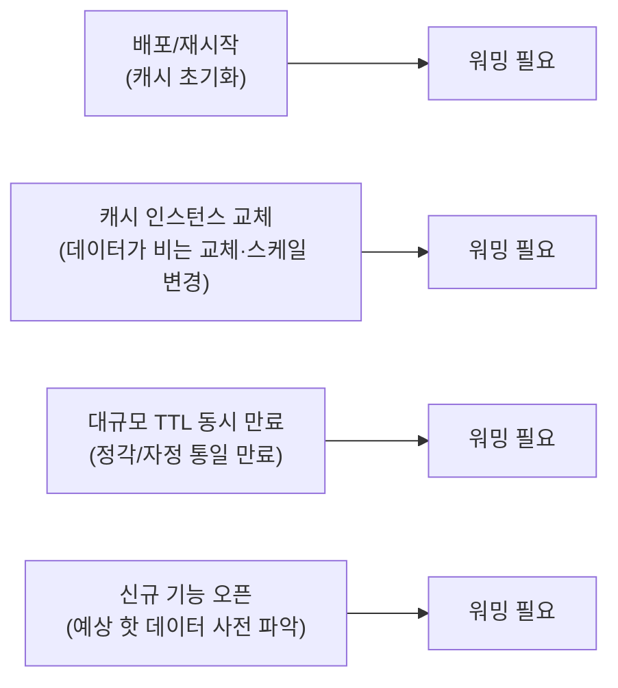
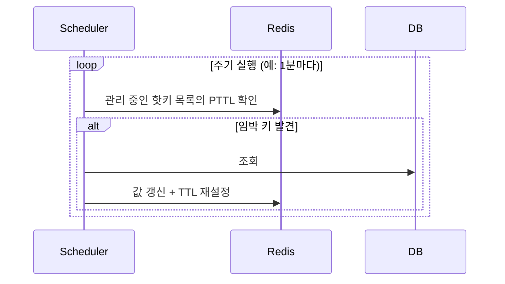

# 캐시 워밍 전략

## 핵심 정의
캐시 워밍(cache warming)은 실제 트래픽이 유입되기 전에 자주 조회되는 데이터를 미리 캐시에 채워두는 작업이다. 배포 직후, 캐시 인스턴스 교체 직후, 대규모 TTL 만료 직전처럼 캐시가 비어 있거나(cold cache) 곧 비워질 시점에 요청이 몰리면 캐시 미스가 동시다발적으로 발생해 원본 저장소(DB)에 부하가 집중된다. 워밍은 이 콜드 스타트(cold start) 구간을 없애거나 짧게 만들어 트래픽 유입 시점부터 안정적인 히트율(hit ratio)을 확보하는 것이 목적이다.

## 동작 원리 / 구조

### 워밍이 필요한 시점



### 워밍 방식 비교

| 방식 | 트리거 시점 | 장점 | 단점 |
|---|---|---|---|
| 배치 사전 적재(eager warming) | 배포 파이프라인의 일부로 실행 | 트래픽 유입 전 완료, 예측 가능 | 워밍 목록 관리 필요, 워밍 자체가 원본에 부하 |
| 트래픽 미러링/섀도잉 | 신규 인스턴스에 운영 트래픽을 복제해 흘려보냄 | 실제 접근 패턴 그대로 반영 | 인프라 구성 복잡, 부작용 있는 쓰기 요청은 제외 필요 |
| 점진적 트래픽 전환 | 카나리/블루-그린 배포로 신규 인스턴스에 트래픽을 서서히 증가 | 자연스러운 워밍, 별도 배치 불필요 | 전환 초반 일부 요청이 캐시 미스를 그대로 겪음 |
| 스케줄 기반 선제 갱신 | 만료 임박 핫키를 주기적으로 스캔해 미리 갱신 | 만료 시점의 캐시 미스 집중 완화 | 접근 빈도 추적 로직 필요 |

### 배치 사전 적재 예시

```java
@Component
@RequiredArgsConstructor
public class CacheWarmer implements ApplicationRunner {

    private final ProductRepository productRepository;
    private final RedisTemplate<String, Product> redisTemplate;

    @Override
    public void run(ApplicationArguments args) {
        // 조회량 상위 N개 상품만 선별 (전체 데이터를 다 채우면 워밍 자체가 부하)
        List<Product> hotProducts = productRepository.findTop500ByOrderByViewCountDesc();

        hotProducts.forEach(p ->
            redisTemplate.opsForValue().set(
                "product:" + p.getId(), p, Duration.ofSeconds(1800 + ThreadLocalRandom.current().nextInt(301))
            )
        );
    }
}
```

동기 `ApplicationRunner`가 끝난 뒤 Spring Boot는 ApplicationReadyEvent와 ACCEPTING_TRAFFIC 상태를 발행한다. 이 readiness를 실제 readiness probe/LB가 사용해야 트래픽 유입을 막을 수 있다. 포트가 열렸는지 보는 검사나 liveness만으로는 보장되지 않는다. 예제의 Repository·Product·Lombok·Redis 직렬화 설정은 애플리케이션에 준비되어 있어야 한다. 워밍 대상이 크면 별도 배치 잡(스케줄러, 배포 파이프라인의 사전 훅)으로 분리해 애플리케이션 기동 시간에 영향을 주지 않게 한다.

### 만료 임박 키 선제 갱신



Redis에는 전체 키에서 TTL 범위로 바로 조회하는 인덱스가 없으므로 관리 중인 목록을 배치 조회하거나 별도 만료 인덱스를 유지한다. 갱신은 동시 쓰기의 최신 버전을 덮어쓰지 않게 검증해야 한다.

이는 [[캐시 스탬피드]]에서 다루는 확률적 조기 갱신(probabilistic early expiration)과 목적이 같지만, 워밍은 "요청이 트리거"가 아니라 "스케줄러가 선제적으로" 갱신한다는 점에서 다르다. 요청량과 무관하게 갱신 비용이 일정하다는 장점이 있는 대신, 조회되지 않는 키까지 갱신할 수 있어 낭비가 생길 수 있다.

## 실무 관점
- **워밍 대상 선정이 핵심**: 전체 데이터를 다 채우려 하면 워밍 자체가 원본 저장소에 큰 부하를 주고 배포 시간을 늘린다. 접근 로그, 조회수 통계 등으로 상위 트래픽을 차지하는 키(파레토 법칙상 소수의 키가 대다수 트래픽을 차지하는 경우가 많음)만 우선순위를 매겨 선별한다.
- **배포 파이프라인과의 결합**: 워밍을 배포 스크립트의 필수 단계로 넣지 않으면 담당자가 잊고 배포해 콜드 캐시 상태로 트래픽을 받는 사고가 반복된다. 헬스체크(readiness probe)가 "워밍 완료"를 조건으로 통과하도록 만들어 로드밸런서 편입을 워밍 완료 이후로 지연시키는 것이 안전하다.
- **원본 저장소 보호**: 워밍 배치 자체가 짧은 시간에 DB를 대량 조회하는 또 다른 형태의 부하이므로, 배치 조회에 커넥션 풀 제한이나 처리량 제한(rate limiting), 페이지네이션을 적용해 정상 트래픽과 자원을 다투지 않게 해야 한다.
- **다중 인스턴스 환경**: 여러 인스턴스가 동시에 기동하며 각자 동일한 워밍 배치를 실행하면 중복 조회로 DB에 오히려 순간 부하를 줄 수 있다. 분산 락으로 워밍 작업을 한 인스턴스만 수행하게 하거나, 배포 파이프라인의 별도 단계(예: 배포 전 원샷 잡)로 분리해 애플리케이션 인스턴스 수와 무관하게 한 번만 실행되게 한다.
- **로컬 캐시(L1)의 워밍**: [[로컬 캐시와 멀티레벨 캐시]] 구조에서는 L1이 인스턴스마다 독립적이므로, L2(Redis)만 워밍해서는 배포 직후 각 인스턴스의 L1은 여전히 비어 있다. 인스턴스별로 자체 워밍을 수행하거나, 점진적 유입과 키별 요청 병합으로 초기 미스 구간을 감수하는 절충이 필요하다.
- **워밍 실패에 대한 관찰**: 워밍 실패 시 DB가 직접 부하를 감당하면 부분 준비 상태로 유입시키고, 필수 캐시 없이는 위험하면 readiness를 지연시키는 등 정책을 정하되, 실패율을 지표로 남겨 워밍 커버리지가 떨어지고 있는지 추적한다.

## 심화 Q&A

### Q. Redis SCAN이 끝났으면 같은 시점의 모든 키를 워밍했다고 볼 수 있는가?
아니다. Redis `SCAN`은 순회하는 동안 계속 존재한 요소를 전체 순회에서 반환하지만 중복 반환이 가능하고, 중간에 추가·삭제된 요소의 포함 여부는 보장하지 않는다. 빈 결과를 받더라도 반환 커서가 0이 아니면 끝난 것이 아니다. `COUNT`도 반환 개수나 작업 시간의 엄격한 상한이 아닌 작업량 힌트다.

따라서 기존 캐시에서 키를 열거해 새 캐시를 채우거나 워밍 커버리지를 점검할 때 SCAN 결과 수를 스냅샷의 전체 건수로 취급하지 않는다. 중복 적재를 안전하게 처리하고, 열거 후 실제 GET 사이의 만료·변경도 정상 경합으로 다룬다. 한 번의 COUNT만으로 DB 조회량을 제한하지 말고 별도 배치 크기·동시성·요청 기한을 둔다. 정확한 대상 목록이 필요한 워밍은 원본 DB에서 정의한 버전별 목록 등 별도 기준을 사용하고, 적재 시 최신값을 덮어쓰지 않는 검사는 [[캐시와 DB 정합성]]의 원칙을 따른다.

### Q. 캐시 워밍과 확률적 조기 갱신(XFetch) 같은 스탬피드 방어 기법의 관계는?
목적은 겹치지만 트리거 주체가 다르다. 워밍은 트래픽 유입 이전 시점에 운영자/배치가 선제적으로 캐시를 채우는 것이고, 확률적 조기 갱신은 트래픽이 이미 들어오는 상태에서 만료 임박 시점에 요청 자체가 갱신을 트리거하는 기법이다. 배포 직후처럼 트래픽이 아직 없는 콜드 스타트 구간은 사전 워밍·점진적 유입·요청 병합 등으로 완화할 수 있고, 서비스 운영 중 발생하는 정상 만료 주기의 스탬피드는 조기 갱신이나 분산 락으로 방어한다. 둘은 상호 보완적이며 함께 쓰는 것이 일반적이다.

### Q. 워밍 대상을 전체 데이터가 아니라 상위 N개로 제한했을 때, 나머지 키에 대한 요청은 어떻게 처리되는가?
워밍 대상 밖의 키는 여전히 첫 요청에서 캐시 미스를 겪고 Cache-Aside 방식으로 채워진다([[Cache-Aside와 Write-Through-Behind]] 참고). 워밍의 목표는 "전체 미스를 없애는 것"이 아니라 "트래픽의 대다수를 차지하는 소수 핫키의 콜드 미스를 없애 DB 부하 폭증을 방지하는 것"이므로, 롱테일 키의 개별 미스는 DB가 감당 가능한 수준이라는 전제 하에 의도적으로 감수한다.

### Q. 트래픽 미러링으로 워밍할 때 주의해야 할 점은?
운영 트래픽을 그대로 복제해 신규 인스턴스에 흘려보내는 방식은 조회처럼 보여도 부수 효과·DB 추가 부하를 확인해야 하며, 쓰기/결제/알림 발송처럼 부작용(side effect)이 있는 요청을 그대로 재실행하면 중복 처리(중복 결제, 중복 알림) 사고로 이어진다. 미러링 대상은 부수 효과가 없는 요청 또는 부수 효과를 차단한 경로로 한정하고, 쓰기 요청은 미러링 경로에서 걸러내거나 실제로 실행되지 않는 섀도 모드로 처리해야 한다.

### Q. 워밍 배치를 인스턴스 기동 시점에 동기로 실행하면 어떤 문제가 생길 수 있는가?
워밍 대상 규모가 크면 애플리케이션 기동 시간과 헬스체크 통과 시점이 그만큼 늦어져, 배포 파이프라인 전체의 롤아웃 속도가 느려지거나 배포 타임아웃에 걸릴 수 있다. 또한 여러 인스턴스가 동시에 배포되면 각 인스턴스가 동시에 동일한 워밍 조회를 DB에 던져 오히려 배포 시점에 부하가 집중된다. 워밍 규모가 크다면 기동과 분리된 별도 배치/파이프라인 단계로 실행하고, 애플리케이션은 이미 채워진 캐시를 전제로 빠르게 기동하는 구조가 낫다.

### Q. 캐시 워밍이 오히려 해로울 수 있는 경우는?
워밍 대상 선정이 실제 트래픽 패턴과 어긋나면(예: 조회수 통계가 오래돼 실제로는 인기가 식은 상품을 계속 워밍), 쓸모없는 데이터로 캐시 용량만 차지하고 정작 새로 뜨는 핫키를 위한 공간을 빼앗아 축출(eviction)을 유발할 수 있다. 워밍 목록은 정적으로 고정하지 말고 주기적으로 최신 접근 통계를 반영해 갱신해야 한다.

### Q. 신규 기능 오픈처럼 과거 접근 통계가 없는 경우 워밍 대상을 어떻게 정하는가?
과거 데이터가 없으므로 배치 워밍의 근거 자체가 약하다. 이런 경우에는 점진적 트래픽 전환(카나리 배포)으로 실제 트래픽을 조금씩 흘려보내며 자연스럽게 캐시를 채우는 방식이 더 안전하고, 초반 트래픽 비율이 낮을 때는 일부 미스가 발생해도 전체 시스템에 주는 영향이 제한적이다. 오픈 이후 수집된 초기 접근 로그를 바탕으로 다음 배포부터는 배치 워밍 목록을 구성할 수 있다.

## 관련 개념
- [[캐시 스탬피드]]
- [[TTL과 캐시 무효화 전략]]
- [[Cache-Aside와 Write-Through-Behind]]
- [[로컬 캐시와 멀티레벨 캐시]]

## 참고 자료

확인일: 2026-09-08. 아래 적용 범위에서 본문·Q&A·예제를 재검증했다. 예제는 문서와 대조했으며 별도 실행 검증은 하지 않았다.

- [SpringApplication](https://docs.spring.io/spring-boot/reference/features/spring-application.html) — Spring Boot 공식 현행 문서: ApplicationRunner·ReadyEvent·readiness 순서.
- [Cache-Aside Pattern](https://learn.microsoft.com/en-us/azure/architecture/patterns/cache-aside) — prepopulation·캐시 용량·원본 부하와 만료.
- [SCAN](https://redis.io/docs/latest/commands/scan/) — 키 순회는 TTL 조건 인덱스가 아님.
- [Scaling Memcache at Facebook](https://www.usenix.org/system/files/conference/nsdi13/nsdi13-final170_update.pdf) — NSDI 2013: cold cluster warmup·DB 보호·stale refill 경쟁.

부분 재검증: 2026-10-04. Redis SCAN의 전체 순회·중복·변경 중 요소·커서 종료·COUNT 계약을 확인했다. 명령은 Redis 2.8.0부터 제공되며 8.10.2 명령 정의도 대조했다. 워밍 목록/부하 제어는 이 계약에서 도출한 운영 판단이다. Redis 순회·Spring Boot 기동은 실행하지 않았고 기존 `verified`는 유지한다.

- [Redis SCAN](https://redis.io/docs/latest/commands/scan/#scan-guarantees) — Scan guarantees·COUNT option·커서 0 종료 조건.
- [Redis 8.10.2 SCAN command definition](https://github.com/redis/redis/blob/8.10.2/src/commands/scan.json) — cursor·MATCH·COUNT·TYPE의 명령 구조와 SCAN 도입 버전.
