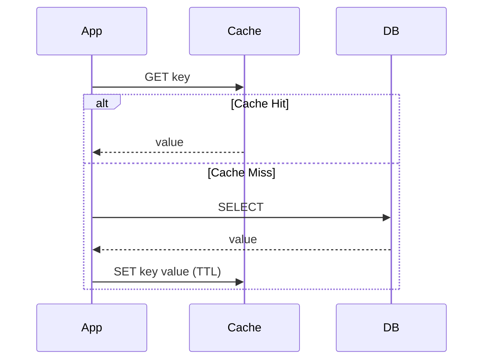
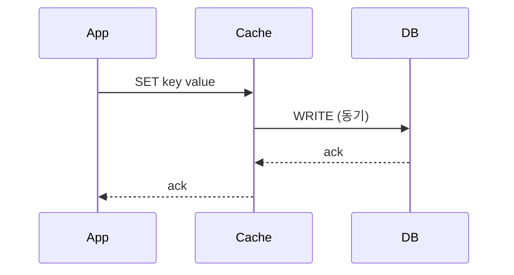
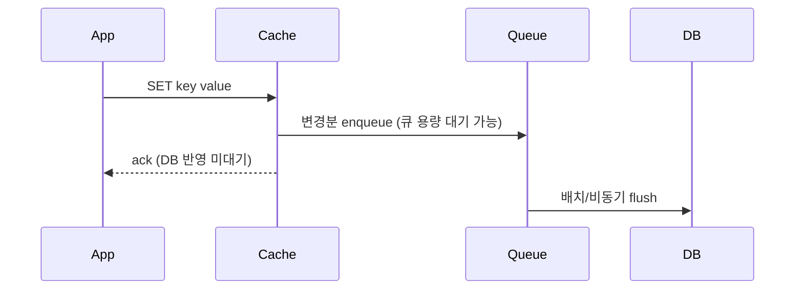

# Cache-Aside와 Write-Through-Behind

## 핵심 정의
캐시와 원본 저장소(source of truth, 보통 DB) 사이의 데이터 동기화 책임을 누가, 언제 지느냐에 따라 캐싱 전략이 나뉜다. Cache-Aside(Lazy Loading)는 애플리케이션이 캐시와 DB를 각각 직접 제어하는 방식이고, Write-Through와 Write-Behind(Write-Back)는 쓰기 시점에 캐시 계층이 DB 동기화까지 책임지는 방식이다. 세 전략 모두 "캐시 미스 시 무엇을 하고, 쓰기 시 무엇을 하는가"라는 두 축으로 구분하면 이해하기 쉽다.

## 동작 원리 / 구조

### Cache-Aside (Lazy Loading)
읽기와 쓰기를 애플리케이션 코드가 직접 오케스트레이션한다.



쓰기 시에는 보통 "DB를 먼저 갱신하고 캐시를 무효화(invalidate)"하는 순서를 따른다.

```java
public User getUser(Long id) {
    User cached = cache.get(id);
    if (cached != null) return cached;
    User user = userRepository.findById(id).orElseThrow();
    cache.put(id, user, Duration.ofMinutes(10));
    return user;
}

@Transactional
public void updateUser(User user) {
    userRepository.save(user);
    Long id = user.getId();
    TransactionSynchronizationManager.registerSynchronization(
        new TransactionSynchronization() {
            @Override
            public void afterCommit() {
                cache.evict(id); // 실제 DB 커밋 이후 무효화
            }
        });
}
```

`cache`는 TTL을 받는 애플리케이션 래퍼 예시이며 Spring Cache의 표준 put 시그니처가 아니다. `@Transactional`은 프록시를 통해 호출되어야 한다. afterCommit만으로 프로세스 종료 시 전달을 보장하지 않으므로 중요 무효화는 outbox/CDC 재시도를 결합한다.

캐시를 갱신(update)하지 않고 삭제(evict)하는 이유: 동시에 여러 쓰기가 들어오면 캐시에 stale한 값이 남을 위험이 update 방식보다 evict 방식에서 훨씬 낮다.

### Write-Through
쓰기 요청이 캐시로 들어가고, 캐시가 동기적으로 DB에도 반영한 뒤 응답한다. 애플리케이션은 캐시만 바라본다.



정상 성공 경로에서 두 쓰기 완료를 기다리지만 외부 DB 쓰기·경쟁·부분 실패까지 자동으로 일치하는 것은 아니며, 쓰기 지연시간(latency)이 DB 쓰기 시간만큼 늘어난다.

### Write-Behind (Write-Back)
쓰기 요청은 캐시와 비동기 쓰기 큐에 반영하며, DB 반영 완료를 기다리지 않고 응답한다. 큐가 차면 캐시 쓰기도 대기할 수 있으므로 응답 시간이 항상 짧다는 보장은 아니다.



배치·병합으로 DB 쓰기 처리량(throughput)을 높이고 호출자의 대기를 줄일 수 있지만, 큐 적체 시 역압력이 생기며 캐시 노드 장애 시 아직 DB에 반영되지 않은 데이터 유실 위험이 있다.

| 전략 | 읽기 미스 처리 | 쓰기 경로 | 일관성 | 지연시간 |
|---|---|---|---|---|
| Cache-Aside | App이 DB 조회 후 캐시 채움 | App -> DB commit -> Cache evict(갱신 아님) | 무효화·TTL에 따른 stale 가능 | 미스 시 DB 조회 비용 추가 |
| Write-Through | 별도 read 정책 필요 | App -> Cache -> DB(동기) | 동기 반영, 격리·원자성은 별도 | DB 쓰기 완료 대기 |
| Write-Behind | (동일) | App -> Cache/Queue, Cache -> DB(비동기) | 약함, 유실 위험 | DB 완료 미대기, 큐 역압력 가능 |

## 실무 관점
- **가장 널리 쓰이는 것은 Cache-Aside**다. 구현이 단순하고, 캐시 장애 시 DB 폴백(fallback)을 별도로 구현할 수 있다. DB 용량·동시성 제한도 필요하다. Redis, Memcached 앞단에서 Spring의 `@Cacheable`/`@CacheEvict`도 사실상 Cache-Aside 패턴을 어노테이션으로 표현한다. 기본 오류 처리기가 캐시 예외를 전파하므로 자동 DB 폴백을 가정하면 안 된다.
- Write-Through는 캐시 계층(예: Redis 모듈, DB 자체 캐시 기능)이 DB 쓰기까지 책임지는 인프라가 갖춰져야 자연스럽다. 일반적인 Redis + RDB 조합에서는 애플리케이션이 직접 캐시와 DB에 순차적으로 써서 Write-Through를 흉내내는 경우가 많다.
- Write-Behind는 쓰기 폭주 구간(예: 카운터, 좋아요 수, 조회수 집계)에서 DB 부하를 줄이기 위해 쓴다. 다만 유실 허용 범위를 반드시 사전에 정의해야 한다 — 정합성이 중요한 결제/재고 데이터에는 부적합하다.
- **흔한 실수**: Cache-Aside에서 "DB 갱신 -> 캐시 갱신" 순서로 짜면, 두 쓰기 스레드가 경쟁할 때 늦게 끝난 DB 쓰기의 값이 먼저 캐시에 반영되고 이후 먼저 끝난 쓰기의 stale 값이 캐시를 덮어써서 정합성이 깨질 수 있다(read-then-write race). "DB 커밋 -> 캐시 삭제(evict)"는 위험을 줄이지만 오래된 읽기의 재적재 경쟁은 남는다.
- **또 다른 실수**: 캐시 삭제(evict)와 DB 커밋 사이에 트랜잭션 경계를 잘못 잡아, DB 트랜잭션이 롤백됐는데 캐시는 이미 지워진 상태가 되거나, 반대로 DB 커밋 전에 캐시를 지워서 그 사이 들어온 읽기가 stale한 DB 값을 다시 캐싱해버리는(cache 재오염) 경우가 있다. 캐시 무효화는 트랜잭션 커밋 이후(after commit)에 수행하는 것이 안전하다.
- 튜닝 포인트: Write-Behind의 배치 flush 주기, 큐 적재량 임계치, 캐시 노드 장애 시 재처리(replay) 로직(WAL, Kafka 등)을 함께 설계해야 한다.

## 심화 Q&A

### Q. Write-Behind의 병합과 재시도가 업무 결과를 바꾸는 경우는?
Ehcache 3.11의 쓰기 병합(coalescing)은 한 배치에서 같은 키의 마지막 변경만 `CacheLoaderWriter`에 전달한다. `조회수=101 → 102 → 103`처럼 누적된 **최종 상태**를 저장하려는 경우에는 중간 값을 생략할 수 있다. 반대로 각각 독립된 `+1` 이벤트나 감사 기록을 세 번 전달하려는 경우 이를 마지막 한 건으로 줄이면 의미가 달라진다. 같은 키·값 형식만 보고 병합 가능성을 판단하지 않는다.

또한 Ehcache 3.11의 write-behind wrapper는 실패한 쓰기를 자동 재시도하지 않는다. 필요한 재시도는 writer와 운영 복구 경로에 구현해야 한다. 비동기 실패를 관측하지 않으면 캐시 쓰기 성공 응답 뒤 DB 누락이 남을 수 있다. DB 처리량보다 적재가 계속 빠르면 제한된 큐가 차면서 캐시 연산에 역압력(backpressure)이 전달되므로 “항상 즉시 반환”도 아니다. 대기 시간·미반영 건수·가장 오래된 변경의 나이를 함께 본다. 이 계약은 Ehcache 3.11에 한정되며 Redis 자체가 동일한 write-behind 큐를 제공한다는 뜻은 아니다.

### Q. Cache-Aside에서 "DB 갱신 후 캐시 갱신(update)"이 아니라 "캐시 삭제(evict)"를 권장하는 이유는?
동시성 상황에서 두 쓰기 요청이 겹치면 update 방식은 늦게 도착한 쓰기의 값이 먼저 캐시에 반영된 뒤, 나중에 완료된 이전 요청의 값이 캐시를 덮어써 최신 값이 유실될 수 있다. evict 방식은 다음 읽기가 DB에서 최신 값을 다시 채우므로 캐시 쓰기끼리의 역전을 줄인다. 무효화 뒤 진행 중 읽기가 구값을 채우는 stale refill 문제는 별도다.

### Q. Cache-Aside에서 "캐시 삭제 -> DB 갱신" 순서로 하면 왜 위험한가?
캐시를 먼저 지우고 DB를 갱신하는 그 짧은 틈에 다른 스레드가 읽기 요청을 보내면, 아직 갱신 전인 stale DB 값을 읽어 그대로 캐시에 다시 채워 넣을 수 있다. 이후 DB 갱신이 끝나도 캐시에는 오래된 값이 TTL이 만료될 때까지 남는다. 그래서 순서는 반드시 "DB 갱신 먼저, 캐시 삭제 나중"이어야 하며, 그래도 완전히 막지는 못하므로(아주 좁은 race는 여전히 가능) 짧은 TTL이나 버전 태그를 함께 쓰는 것이 안전하다.

### Q. Write-Behind를 쓸 때 캐시 노드가 죽으면 어떤 문제가 생기고, 어떻게 완화하나?
DB에 아직 flush되지 않은 변경분이 캐시 메모리에만 있었다면 그대로 유실된다. 완화책으로는 캐시 변경분을 Kafka 같은 영속 큐에 먼저 append(WAL 유사 패턴)하고 캐시는 그 큐를 소비해 반영하도록 하거나, 캐시 자체를 복제(replica)해서 장애 시에도 미반영분을 복구할 수 있게 하는 방법이 있다. 근본적으로 Write-Behind는 "유실 가능"을 전제로 도입 여부를 판단해야 한다.

### Q. Write-Through와 Cache-Aside의 쓰기 성능 차이는 어디서 오는가?
Write-Through는 매 쓰기마다 캐시와 DB 쓰기가 동기적으로 이어지므로 쓰기 지연시간이 항상 DB 쓰기 시간을 포함한다. Cache-Aside는 쓰기 시 보통 캐시를 evict만 하므로(값을 다시 채우지 않음) 쓰기 경로에는 DB 커밋과 캐시 삭제의 네트워크 비용이 포함되고, 그 다음 읽기에서만 캐시 미스 비용을 지불한다. 즉 비용을 쓰기 시점에 지불하느냐, 다음 읽기 시점에 분산해서 지불하느냐의 차이다.

### Q. 캐시와 DB 간 최종 일관성(eventual consistency)이 실무에서 허용되는 기준을 어떻게 잡는가?
비즈니스적으로 "잠깐의 stale 값이 노출돼도 되는가"를 기준으로 판단한다. 상품 조회수, 추천 목록처럼 stale해도 큰 문제가 없는 데이터는 Cache-Aside + 적당한 TTL로 충분하다. 반면 잔액, 재고, 주문 상태처럼 stale이 곧 비즈니스 오류로 이어지는 데이터는 캐시를 아예 안 쓰거나, 쓰기 시 강한 동기화(Write-Through 유사 패턴)나 분산 락, 버전 체크를 곁들인다.

### Q. 다중 인스턴스 환경에서 Cache-Aside의 evict가 로컬 캐시(Caffeine 등)일 때와 원격 캐시(Redis)일 때 무엇이 달라지는가?
로컬 캐시는 인스턴스마다 별도 메모리이므로 한 인스턴스에서 evict해도 다른 인스턴스의 로컬 캐시는 여전히 stale한 값을 들고 있다. 이를 해결하려면 Redis Pub/Sub이나 메시지 브로커로 무효화 이벤트를 전 인스턴스에 브로드캐스트해야 한다(예: Spring의 `CacheManager`를 감싸 무효화 시 이벤트 발행). 원격 캐시(Redis)는 단일 저장소이므로 원본 Redis 키의 evict는 공유되지만 읽기 복제본의 지연·진행 중 응답·L1 사본·재적재 경쟁까지 즉시 제거하지는 않는다.

## 관련 개념
- [[TTL과 캐시 무효화 전략]]
- [[캐시 스탬피드]]
- [[캐시와 DB 정합성]]

## 참고 자료

확인일: 2026-09-08. 아래 적용 범위에서 본문·Q&A·예제를 재검증했다. 예제는 문서와 대조했으며 별도 실행 검증은 하지 않았다.

- [Cache-Aside Pattern](https://learn.microsoft.com/en-us/azure/architecture/patterns/cache-aside) — 패턴·일관성·폴백 설계.
- [Ehcache Cache Loaders and Writers](https://www.ehcache.org/documentation/3.11/writers.html) — Ehcache 3.11: write-through/behind 책임·비동기 큐.
- [Spring Caching Annotations](https://docs.spring.io/spring-framework/reference/integration/cache/annotations.html) — Spring Framework 7.0.9: @Cacheable/@CacheEvict.
- [Transaction-bound Events](https://docs.spring.io/spring-framework/reference/data-access/transaction/event.html) — Spring Framework: commit 경계.
- [Transactional Outbox](https://docs.aws.amazon.com/prescriptive-guidance/latest/cloud-design-patterns/transactional-outbox.html) — after-commit 이벤트 유실과 이중 쓰기 문제.

부분 재검증: 2026-10-04. Ehcache 3.11의 배치 병합·wrapper 재시도 부재·큐 역압력을 확인했다. 최종 상태와 delta 이벤트 비교는 병합 계약에서 도출한 설계 판단이다. Ehcache·Redis·DB에서 실행하지 않았으며 기존 Spring·캐시 전략 전체의 `verified`는 유지한다.

- [Ehcache 3.11 Cache Loaders and Writers](https://www.ehcache.org/documentation/3.11/writers.html#write-behind) — 키별 배치 병합, CacheLoaderWriter의 재시도 책임, queue size와 backpressure.
