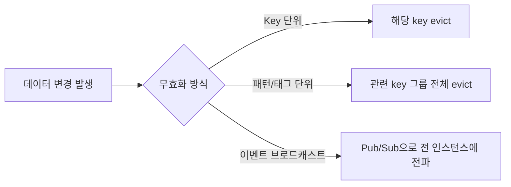

# TTL과 캐시 무효화 전략

## 핵심 정의
TTL(Time To Live)은 캐시에 저장된 데이터가 자동으로 만료(expire)되기까지의 수명을 의미하며, 캐시 무효화(invalidation)는 TTL 만료를 기다리지 않고 원본 데이터 변경 시점에 캐시를 명시적으로 삭제하거나 갱신하는 것을 말한다. 둘은 배타적이지 않고, 대부분의 실무 캐시는 "명시적 무효화를 기본으로 하되, 무효화가 누락되는 경우를 대비한 안전망으로 TTL을 함께 건다."

## 동작 원리 / 구조

### TTL 기반 만료
캐시 저장 시점에 만료 시각을 함께 기록하고, 조회 시점 또는 백그라운드 스윕(sweep)으로 만료 여부를 검사한다.
- Redis: `EXPIRE`, `SET key value EX seconds`. 만료 처리는 lazy expiration(조회 시 확인) + active expiration(주기적으로 랜덤 샘플링해서 청소)을 병행한다.
- Redis 8.4에서 일반 `SET key value`는 기존 키의 TTL을 제거한다. 갱신 후에도 만료시키려면 `EX`/`PX`를 함께 지정하거나 기존 TTL을 유지하는 `KEEPTTL`을 쓴다. `INCR`·`HSET`처럼 기존 값을 부분 변경하는 명령은 키 TTL을 유지한다. `SET` 뒤 별도 `EXPIRE`를 보내는 방식은 두 명령 사이 장애로 만료 없는 키가 남을 수 있다.
- 로컬 캐시(Caffeine): `expireAfterWrite`, `expireAfterAccess` 정책으로 각각 "쓰기 후 N초", "마지막 읽기 또는 쓰기 후 N초" 기준 만료를 설정. 만료 값은 읽기에 반환하지 않지만 실제 메모리 회수는 maintenance 시점까지 늦어질 수 있으며 필요한 경우 Scheduler를 사용한다.

```java
Cache<String, User> cache = Caffeine.newBuilder()
    .expireAfterWrite(Duration.ofMinutes(10))
    .maximumSize(10_000)
    .build();
```

### 명시적 무효화
데이터 변경 이벤트(쓰기, 삭제)에 맞춰 캐시 키를 직접 삭제하거나 갱신한다.



- Key 단위: `cache.evict(id)` — 가장 정밀하지만 연관된 다른 캐시 키(예: 목록 캐시)는 놓치기 쉽다.
- 태그/패턴 단위: `user:123:*` 같은 패턴으로 관련 캐시를 묶어 한 번에 삭제. Redis에서는 운영 환경에 맞게 `SCAN`으로 패턴 매칭 후 점진 삭제하거나, 별도 태그 인덱스(예: `tag:user:123` set에 관련 키들을 등록)를 관리.
- 이벤트 브로드캐스트: 다중 인스턴스에서 로컬 캐시를 쓸 때, 무효화 이벤트를 Redis Pub/Sub이나 Kafka로 전파해 각 인스턴스에 무효화를 전달한다. 동시에 반영되는 보장은 없고 Pub/Sub 단절 시 유실도 가능하다. Kafka 일반 consumer group은 한 그룹 내 분산 소비이므로 인스턴스별 전달이 필요한 구독 구조를 별도로 설계한다.

### TTL Jitter (분산 지터)
동일 시각에 대량 발급된 캐시가 동시에 만료되면 캐시 스탬피드로 이어질 수 있다. TTL에 랜덤 값을 더해 만료 시점을 분산시킨다.

```java
long baseTtlSeconds = 600;
long jitter = ThreadLocalRandom.current().nextLong(60); // 0~59초 랜덤
// TTL을 인자로 받는 애플리케이션 캐시 래퍼의 의사코드다.
// 위 Caffeine Cache.put(K, V)의 API가 아니다.
cache.put(key, value, Duration.ofSeconds(baseTtlSeconds + jitter));
```

### 만료 알림을 업무 타이머로 사용할 때의 경계

Redis의 키 공간 알림(keyspace notification)에서 `expired`는 TTL이 0에 도달하는 순간이 아니라 실제로 만료 키를 제거할 때 발생한다. 조회가 드문 키나 만료 키가 많은 환경에서는 알림이 늦어질 수 있다. Pub/Sub 연결이 끊긴 동안 발생한 알림은 재접속 후 재생되지 않는다. Redis Cluster에서는 알림이 다른 모든 노드로 전파되지 않으므로 전체 키의 이벤트를 받으려면 각 노드에 구독해야 한다. Redis 8.10 기준으로도 단일 연결만으로 클러스터 전체의 만료 알림을 받는다고 가정하지 않는다.

따라서 예약 만료·주문 취소의 유일한 실행 근거를 `expired` 알림에 두지 않는다. 만료 시각과 현재 업무 상태를 DB에 저장하고, 기한이 지난 대상을 주기적으로 찾아 조건부 상태 변경으로 처리하는 복구 경로를 둔다. 알림은 처리를 앞당기는 신호로 사용할 수 있다. 이 설계 권고는 알림의 지연·유실 계약에서 도출한 것이며, 캐시 TTL 자체가 업무 기한의 실행을 보장한다는 뜻이 아니다.

## 실무 관점
- **TTL만으로 충분한 경우**: 데이터 변경 빈도가 낮거나, 약간의 stale이 허용되는 조회성 데이터(설정값, 통계 집계). 무효화 로직을 따로 만들지 않아도 되어 구현 비용이 낮다.
- **명시적 무효화가 필요한 경우**: 사용자가 직접 변경한 데이터를 곧바로 반영해야 하는 화면(내 정보 수정 후 즉시 조회 등). TTL만 믿으면 만료 전까지 stale 데이터가 노출된다.
- **흔한 실수**: 목록/집계 캐시(`user:list`, `dashboard:summary`)를 개별 엔티티 변경 시 함께 무효화하는 것을 누락하는 경우가 매우 흔하다. 개별 캐시는 최신인데 목록 캐시만 stale한 상태로 오래 남는다. 캐시 키 설계 단계에서 "이 데이터가 바뀌면 무효화해야 할 캐시 키 목록"을 명시적으로 정리해두는 것이 좋다.
- **흔한 장애 패턴**: TTL을 모두 동일한 고정값(예: 정각 자정 만료)으로 설정해서 특정 시간대에 캐시가 한꺼번에 비고, 그 순간 몰린 요청이 DB로 쏟아지는 사례. TTL Jitter로 예방한다.
- **캐시 워밍(warming)**: 서비스 배포 직후나 대규모 TTL 만료 직전에 미리 캐시를 채워두는 것도 캐시 재적재 전략으로 함께 다룬다. 배치로 인기 키를 미리 조회해 채우는 방식이 일반적이다.
- 튜닝 포인트: TTL 값은 "데이터 변경 빈도"와 "stale 허용 범위"의 균형으로 결정한다. 너무 짧으면 캐시 효율이 떨어지고, 너무 길면 정합성 문제와 메모리 낭비(Caffeine의 `maximumSize`, Redis의 `maxmemory-policy`)로 이어진다.
- Redis의 `maxmemory-policy`(예: `allkeys-lru`, `volatile-ttl`)는 메모리 부족 시 어떤 키를 먼저 축출(eviction)할지 결정하므로 TTL 전략과 함께 설계해야 한다. TTL이 남은 키도 축출될 수 있다([[Redis 메모리와 축출 정책]]).

## 심화 Q&A

### Q. TTL만 걸어두고 명시적 무효화를 하지 않으면 어떤 문제가 생기는가?
데이터가 변경된 시점과 캐시가 실제로 갱신되는 시점 사이에 해당 구값이 캐시에 남아 읽히는 동안 stale 응답이 생길 수 있다. 캐시 miss·조기 축출·다른 갱신이 있으면 잔여 TTL과 같지는 않다. 조회 빈도가 낮은 데이터라면 문제되지 않지만, 사용자가 방금 수정한 값을 바로 조회하는 화면에서는 "내가 바꾼 게 반영이 안 됐다"는 체감 버그로 이어진다. 따라서 변경 즉시 반영이 필요한 데이터는 TTL과 무관하게 명시적 evict를 병행해야 한다.

### Q. Redis의 lazy expiration과 active expiration의 차이는 무엇이고 왜 둘 다 필요한가?
lazy expiration은 클라이언트가 해당 키에 접근할 때 만료 여부를 확인해 만료됐으면 그 순간 삭제하는 방식이고, active expiration은 Redis 메인 루프의 주기 작업이 만료가 있는 키를 샘플링해 만료된 것을 능동적으로 청소하는 방식이다. lazy만 있으면 한동안 접근되지 않는 만료 키가 메모리에 계속 남아 메모리 누수처럼 보일 수 있어, 두 메커니즘을 함께 사용해 메모리를 회수한다.

### Q. 캐시 무효화와 DB 트랜잭션 커밋 시점을 어떻게 맞춰야 하는가?
캐시 무효화는 DB 트랜잭션이 확실히 커밋된 이후에 수행해야 한다. 커밋 전에 무효화하면 그 사이 들어온 읽기가 아직 반영되지 않은(트랜잭션 격리 수준에 따라 stale하거나 아직 존재하지 않는) 값을 다시 캐시에 채울 수 있고, 트랜잭션이 롤백될 경우 무효화 자체가 불필요했던 것이 된다. Spring에서는 `TransactionSynchronizationManager`로 커밋 후 콜백(`afterCommit`)에 무효화 로직을 등록하는 방식을 쓴다.

### Q. 패턴 기반 무효화(`KEYS user:123:*` 후 삭제)를 프로덕션 Redis에서 피해야 하는 이유는?
`KEYS`는 전체 키스페이스를 스캔하는 O(N) 블로킹 명령이라 키가 많을 때 Redis 이벤트 루프를 오래 점유해 다른 요청의 지연시간이 급증할 수 있다. 대안으로 `SCAN`을 커서 기반으로 점진 실행하거나, 애초에 관련 키들을 Redis Set(`tag:user:123`)에 등록해두고 그 Set만 조회해 무효화 대상을 특정하는 태그 인덱스 방식을 쓴다. SCAN/DEL은 전체적으로 원자적이지 않고 Cluster에서는 노드·슬롯 범위도 고려해야 한다. 버전별 namespace를 바꾸고 이전 키를 TTL로 회수하는 방식도 가능하다.

### Q. TTL Jitter를 적용해도 여전히 남는 위험은 무엇인가?
Jitter는 "동시에 설정된 다수 키가 동시에 만료되는" 문제만 완화할 뿐, 특정 핫키(hot key) 하나가 만료되는 순간 그 키에 대한 동시 요청이 몰리는 캐시 스탬피드 자체는 막지 못한다. 핫키 보호에는 별도로 분산 락이나 논리적 만료(logical expiration, 값 자체에 만료 플래그를 두고 백그라운드에서 갱신) 같은 기법이 필요하다.

### Q. `expireAfterWrite`와 `expireAfterAccess`(Caffeine) 중 무엇을 선택해야 하는가?
`expireAfterWrite`는 데이터의 신선도(freshness)를 보장해야 할 때 적합하다 — 마지막 쓰기로부터 일정 시간이 지나면 접근 여부와 무관하게 무조건 만료시켜 최신 캐시 항목 자체의 나이를 제한한다. 구값을 다시 적재하거나 L2·복제본이 늦으면 DB 변경 기준 stale 상한을 곧바로 보장하지는 않는다. `expireAfterAccess`는 자주 쓰이는 데이터를 오래 살려두고 싶을 때(LRU에 가까운 성격) 적합하지만, 계속 접근이 이어지면 원본이 바뀌어도 영원히 캐시에 남을 수 있어 신선도 보장이 필요한 데이터에는 부적합하다.

## 관련 개념
- [[Cache-Aside와 Write-Through-Behind]]
- [[캐시 스탬피드]]
- [[캐시와 DB 정합성]]
- [[Redis 메모리와 축출 정책]]

## 참고 자료

부분 재검증: 2026-09-23. Redis 8.10 범위의 만료 알림 시점·Pub/Sub 유실·Cluster 노드별 구독을 확인했다. 기존 Redis 8.4 TTL 명령·Caffeine 서술 전체를 재검증한 것은 아니므로 `verified`는 유지했다. Redis 서버·클러스터를 직접 실행하지 않았다.

- [Keyspace Notifications](https://redis.io/docs/latest/develop/pubsub/keyspace-notifications/) — `expired` 생성 시점, 연결 중단 시 이벤트 유실, 노드별 알림 범위.
- [Redis 8.10 notify.c](https://github.com/redis/redis/blob/8.10/src/notify.c) — `notifyKeyspaceEvent`의 로컬 Pub/Sub 발행 경로.

부분 재확인: 2026-09-22. Redis 8.4의 키 TTL 유지·제거 조건과 축출의 차이를 확인하고 Jitter 예제를 애플리케이션 래퍼 의사코드로 명시했다. 기존 전체 확인일은 유지한다.

- [SET](https://redis.io/docs/latest/commands/set/) — `EX`/`PX`와 `KEEPTTL`, 일반 SET의 기존 TTL 제거.

확인일: 2026-09-08. 아래 적용 범위에서 본문·Q&A·예제를 재검증했다. 예제는 문서와 대조했으며 별도 실행 검증은 하지 않았다.

- [EXPIRE](https://redis.io/docs/latest/commands/expire/) — Redis 키 TTL·만료 처리.
- [SCAN](https://redis.io/docs/latest/commands/scan/) — 점진 순회·변경 중 보장 범위.
- [Keyspace Notifications](https://redis.io/docs/latest/develop/pubsub/keyspace-notifications/) — PubSub 유실·만료 이벤트 시간·노드별 범위.
- [Key Eviction](https://redis.io/docs/latest/develop/reference/eviction/) — maxmemory-policy와 TTL의 차이.
- [Caffeine Eviction](https://github.com/ben-manes/caffeine/wiki/Eviction) — Caffeine 공식 wiki: write/access 만료와 maintenance/Scheduler.
