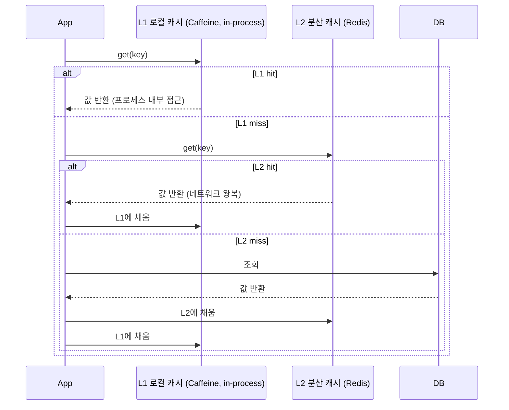
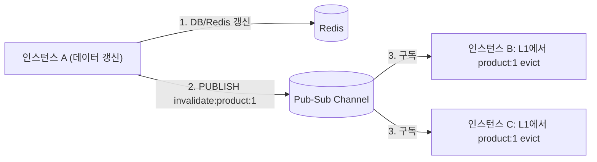

# 로컬 캐시와 멀티레벨 캐시

## 핵심 정의

로컬 캐시(local cache, in-process cache)는 애플리케이션 프로세스(JVM) 내부 메모리에 데이터를 저장하는 캐시로, 네트워크 왕복(round trip) 없이 순수 메모리 접근 속도로 조회할 수 있다. Java/Spring 생태계에서는 Caffeine이 사실상 표준으로 쓰인다. 멀티레벨 캐시(multi-level cache, 계층형 캐시)는 이런 로컬 캐시(L1)와 Redis 같은 원격 분산 캐시(L2)를 함께 두고, L1 미스 시 L2를, L2 미스 시에만 원본 저장소(DB)를 조회하는 계층 구조다. 목적은 로컬 캐시의 속도와 분산 캐시의 정합성/공유 가능성을 동시에 확보하는 것이다.

## 동작 원리 / 구조



### Caffeine 기반 L1 구성

```java
Cache<String, Product> localCache = Caffeine.newBuilder()
    .maximumSize(10_000)
    .expireAfterWrite(Duration.ofSeconds(30))   // 짧은 TTL: L2와의 불일치 창(window) 최소화
    .recordStats()
    .build();

public Product getProduct(String id) {
    Product cached = localCache.getIfPresent(id);
    if (cached != null) return cached;

    Product fromRedis = redisTemplate.opsForValue().get("product:" + id);
    if (fromRedis != null) {
        localCache.put(id, fromRedis);
        return fromRedis;
    }

    Product fromDb = productRepository.findById(id).orElseThrow();
    redisTemplate.opsForValue().set("product:" + id, fromDb, Duration.ofMinutes(10));
    localCache.put(id, fromDb);
    return fromDb;
}
```

예제는 Spring Data 스타일 Repository와 `RedisTemplate<String, Product>`·직렬화 설정을 전제로 한다. getIfPresent 후 put은 동시 로딩을 병합하지 않으므로 고부하에서는 `localCache.get(key, loader)` 등 원자 로딩 API를 검토한다.

Caffeine은 내부적으로 W-TinyLFU(Window Tiny Least Frequently Used) 알고리즘으로 최근성(recency)과 빈도(frequency)를 함께 고려해 축출(eviction) 대상을 정하며, 이는 순수 LRU보다 스캔 저항(scan resistance)이 좋아 일회성 대량 조회에 캐시가 오염되는 것을 줄여준다.

### 정합성 문제: 다중 인스턴스 환경에서의 로컬 캐시 무효화

로컬 캐시의 근본적 난점은 인스턴스마다 독립된 메모리를 갖는다는 점이다. 인스턴스 A에서 데이터를 갱신해도 인스턴스 B, C의 로컬 캐시는 이를 모른다. 해결 방법은 크게 세 가지다.

1. **짧은 TTL로 자연 만료에 맡기기**: 가장 단순하지만 그 TTL 동안은 불일치를 감수해야 한다.
2. **Pub-Sub 기반 무효화 전파**: 데이터 갱신 시 Redis Pub-Sub(또는 Kafka 등)으로 "이 키는 무효화되었다"는 이벤트를 모든 인스턴스에 브로드캐스트하고, 각 인스턴스는 수신 후 L1을 제거한다. 메시지 유실·지연·구독 구조를 함께 다뤄야 한다. Spring 진영에서는 `CacheManager`를 조합하거나, Redis Keyspace Notification(키스페이스 알림)을 구독해 만료/삭제 이벤트를 감지하는 방식도 쓰인다.
3. **버전 태그/생성 시각 비교**: 캐시 값에 버전이나 갱신 시각을 함께 저장해 두고, 최신성이 의심될 때 L2와 버전만 가볍게 비교하는 방식.



### 무효화와 진행 중인 적재의 경쟁

인스턴스가 L2의 구값을 읽는 동안 무효화 이벤트를 받아 L1을 지워도, 이미 진행 중이던 조회가 나중에 끝나면 구값을 L1에 다시 넣을 수 있다. `get(key, loader)`의 단일 로딩은 중복 조회를 줄이는 기능이며 다른 계층의 무효화와 DB 갱신 전체를 원자적으로 묶지는 않는다. 적재 토큰·세대를 기록하고 무효화된 세대의 응답은 버리거나, 데이터와 무효화 순서를 보장하는 클라이언트 프로토콜을 사용한다.

Redis 6.0+의 `CLIENT TRACKING`은 Redis 키 변경에 따른 client-side caching 무효화를 제공한다. DB가 갱신되었어도 Redis 키를 그대로 두면 그 변경을 자동 감지하지 않는다. 무효화 연결을 잃으면 L1을 폐기하고, 복구 직전 진행 중이던 적재가 새 세대의 L1에 들어오지 않도록 처리한다. L1↔L2와 L2↔DB 정합성은 각각 확인한다.

## 실무 관점

- **적용 대상**: 조회 빈도가 매우 높고 변경이 드문 데이터(설정값, 코드 테이블, 상품 카테고리 등 reference data)에 로컬 캐시를 추가하면 Redis 네트워크 왕복 자체를 없애 지연시간(latency)과 Redis 부하를 동시에 줄일 수 있다. 반대로 변경이 잦고 강한 일관성이 필요한 데이터(재고 수량, 계좌 잔액)에는 로컬 캐시를 두지 않거나 아주 짧은 TTL만 허용한다.
- **트레이드오프**: 로컬 캐시는 속도를 얻는 대신 정합성 지연(staleness)과 인스턴스별 메모리 중복 사용이라는 비용을 지불한다. 같은 항목을 각 인스턴스에 보관한다면 전체 메모리 사용량은 인스턴스 수에 따라 늘어난다.
- **흔한 실수**: 로컬 캐시 TTL을 원격 캐시(L2)보다 길게 설정하는 경우. L2가 갱신되어도 L1이 더 오래 stale 값을 들고 있게 되어 계층을 둔 의미가 퇴색된다. 일반적으로 L1 TTL은 L2 TTL보다 짧거나 같게 설정한다.
- **흔한 실수**: 무효화 이벤트 전파(Pub-Sub) 자체가 실패하거나 일부 인스턴스가 이벤트를 놓쳤을 때의 폴백이 없는 경우. Pub-Sub은 저장 보장이 없으므로([[Redis Pub-Sub와 Streams]] 참고), 무효화 전파에만 의존하지 말고 TTL·연결 복구 시 전체 폐기 등 안전망을 둔다. L2도 구값이면 L1 TTL만으로 원본 기준 최대 staleness를 보장하지 않는다.
- **흔한 장애 사례**: 배포 시 모든 인스턴스가 동시에 재시작되며 로컬 캐시가 비워진 상태에서 트래픽이 유입되면, L1이 전부 미스라 사실상 L2(Redis)로 요청이 몰린다. L2 자체도 비어 있었다면 [[캐시 스탬피드]]가 로컬 캐시 계층까지 겹쳐 증폭될 수 있다.
- **모니터링 포인트**: Caffeine의 `recordStats()`로 히트율·축출 수·로딩 비용 등을 측정하고, 원인별 제거 통계는 RemovalListener 등의 cause를 별도로 수집해 캐시 크기/TTL 튜닝의 근거로 삼는다. 히트율이 낮으면 캐시를 두는 실익 자체를 재검토해야 한다.
- **Spring 연동**: `spring-boot-starter-cache` + `CaffeineCacheManager`로 로컬 캐시를, `RedisCacheManager`로 원격 캐시를 각각 `@Cacheable`에 연결할 수 있으며, 실제 L1 미스 → L2 조회·L1 재적재는 별도 Cache 구현이나 서비스 로직으로 작성한다. `CompositeCacheManager`는 캐시 이름을 제공하는 첫 매니저를 선택할 뿐 동일 키 miss에 다음 매니저로 넘어가는 L1/L2 엔진이 아니다. Spring이 기본 제공하는 캐시 추상화 자체에는 L1/L2 자동 동기화 기능이 내장되어 있지 않으므로, 무효화 전파 로직은 애플리케이션이 직접 구현해야 한다.

## 심화 Q&A

### Q. 멀티레벨 캐시를 쓰면 Redis 부하가 항상 줄어드는가?
읽기가 반복되고 L1 값이 유지되는 핫키에서는 크게 줄일 수 있다. L1이 대부분의 조회를 흡수하므로 Redis로 가는 요청이 전체 요청량·인스턴스 수·각 L1 미스율에 따라 줄어든다. 하지만 캐시 대상 키의 카디널리티(cardinality)가 매우 높고 각 키의 조회 빈도가 낮게 분산되어 있다면(롱테일 패턴), L1 히트율 자체가 낮아 이득이 크지 않고 오히려 각 인스턴스가 서로 다른 키를 캐싱하느라 메모리만 낭비할 수 있다. 트래픽 패턴(집중도)을 먼저 확인하고 도입해야 한다.

### Q. L1과 L2의 TTL을 어떻게 조합하는 것이 일반적인가?
L1은 L2보다 짧거나 같게 잡는 것이 기본 원칙이다. 예를 들어 L2(Redis) TTL을 10분으로 두고 L1(Caffeine) TTL을 10~30초로 짧게 두면, 데이터 변경이 있어도 L1 TTL 이후 L2를 재조회하지만 L2가 구값이면 다시 구값을 담는다. 두 계층의 데이터 버전·원본 생성 시각 또는 남은 TTL을 전파해야 원본 기준 stale 상한을 계산할 수 있으며, 무효화 전파 실패에 대한 안전망 역할을 한다. L1 TTL을 얼마나 짧게 할지는 "허용 가능한 최대 staleness"와 "L1 캐시 도입으로 얻는 이득(Redis 부하 감소 폭)" 사이의 트레이드오프로 결정한다.

### Q. Pub-Sub 기반 무효화 전파와 짧은 TTL 안전망 중 하나만 선택해야 한다면?
가능하면 둘 다 쓰는 것이 정답에 가깝다. Pub-Sub 전파는 "평상시 빠른 무효화"를, 짧은 TTL은 "전파가 실패했을 때의 상한선"을 담당해 서로 보완적이다. 굳이 하나만 골라야 한다면, 변경 빈도가 낮고 즉시성이 크게 중요하지 않은 데이터는 TTL만으로 충분하고, 변경 즉시 반영이 중요한 데이터(예: 관리자 설정 값의 즉시 적용)는 신뢰할 수 있는 무효화·검증 경로가 필요하다. 유실 가능한 Pub/Sub만으로 즉시 반영을 보장할 수는 없다.

### Q. 로컬 캐시의 W-TinyLFU 같은 빈도 기반 축출 정책이 단순 LRU보다 나은 구체적인 상황은?
배치 작업이나 관리자 화면에서 대량의 데이터를 한 번씩만 훑는(one-time scan) 접근 패턴이 섞여 있을 때 차이가 두드러진다. 순수 LRU는 이런 스캔이 최근성만으로 캐시 슬롯을 점유해버려, 실제로 반복 조회되는 인기 데이터를 밀어내는 캐시 오염(cache pollution)이 발생한다. 빈도(frequency)를 함께 반영하는 정책은 한 번만 스쳐 지나가는 항목이 오래 캐시에 남지 않도록 해 이런 스캔 저항성을 제공한다.

### Q. 멀티레벨 캐시에서 특정 인스턴스만 오래된 데이터를 반환하는 문제를 어떻게 진단하는가?
증상이 "일부 요청만 stale 데이터를 반환"하는 형태로 나타나면 로드밸런서가 특정 요청을 항상 같은 인스턴스로 보내는 상황(sticky routing)과 결합된 로컬 캐시 불일치를 의심해야 한다. 각 인스턴스의 캐시 통계(적재 시각, 히트율)를 노출하는 엔드포인트를 두고, 문제가 재현되는 인스턴스의 L1 캐시 내용과 L2(Redis)의 실제 값을 직접 비교해 무효화 전파가 그 인스턴스에만 도달하지 못했는지(네트워크 파티션, 구독 재연결 실패 등) 확인하는 것이 표준적인 진단 순서다.

### Q. 로컬 캐시 도입이 오히려 GC 부담을 늘릴 수 있는가?
그렇다. 로컬 캐시에 저장하는 객체 수와 크기가 크면 JVM 힙 사용량이 늘어나고, 특히 축출/삽입이 빈번한 캐시는 짧은 수명의 객체를 대량으로 만들어내 [[가비지 컬렉션 알고리즘]] 부담(Young GC 빈도 증가)을 키울 수 있다. `maximumSize`나 `maximumWeight`로 캐시 크기 상한을 명확히 설정하고, 필요하면 값 객체를 가볍게(불필요한 필드 제거, 원시 타입 활용) 유지해 힙 압박을 관리해야 한다.

다만 Caffeine 3.3.0의 `maximumWeight`는 JVM 힙 크기를 계속 측정하는 장치가 아니다. weight는 캐시에 값을 삽입·갱신할 때 계산한 뒤 유지된다. `List.size()`를 weight로 삼고 1개 원소의 리스트를 넣은 뒤 같은 객체를 직접 20개까지 늘려도 기록된 weight는 1이다. 불변 값·복사 후 교체처럼 캐시 갱신 경로를 거치게 하고, weight 단위가 원소 수인지 추정 바이트인지 명시한다. 교체 시 다시 계산되는 한도와 프로세스 전체 힙 한도를 같은 보장으로 해석하지 않는다.

## 관련 개념
- [[Redis Pub-Sub와 Streams]]
- [[캐시 스탬피드]]
- [[TTL과 캐시 무효화 전략]]
- [[Cache-Aside와 Write-Through-Behind]]

## 참고 자료

확인일: 2026-09-08. 아래 적용 범위에서 본문·Q&A·예제를 재검증했다. 예제는 문서와 대조했으며 별도 실행 검증은 하지 않았다.

- [Caffeine Design](https://github.com/ben-manes/caffeine/wiki/Design) — 현행 공식 wiki: W-TinyLFU와 scan resistance.
- [Caffeine Eviction](https://github.com/ben-manes/caffeine/wiki/Eviction) — 만료·maximumSize/Weight와 유지 관리.
- [Caffeine Statistics](https://github.com/ben-manes/caffeine/wiki/Statistics) — recordStats가 수집하는 지표.
- [Caffeine Population](https://github.com/ben-manes/caffeine/wiki/Population) — get(key, mappingFunction)의 원자 로딩.
- [CompositeCacheManager](https://docs.spring.io/spring-framework/docs/current/javadoc-api/org/springframework/cache/support/CompositeCacheManager.html) — Spring Framework 7.0.9: 캐시 이름 탐색과 fallback.
- [Client-side Caching Reference](https://redis.io/docs/latest/develop/reference/client-side-caching/) — 무효화·연결 단절·stale 응답 경쟁.

부분 재검증: 2026-09-23. Redis client-side caching 공식 문서에서 추적 대상·두 연결의 응답 경쟁·연결 상실 시 로컬 폐기를 확인했다. 적용 범위는 Redis 6.0+ CLIENT TRACKING이며 Caffeine·Spring 기존 구현 전체는 재검증하지 않았다.

부분 재검증: 2026-10-04. Caffeine 3.3.0의 weight 계산 시점을 고정 태그 소스와 공식 Eviction 문서로 확인했다. JDK 25.0.4·Caffeine 3.3.0에서 최대 weight 10·List.size weigher로 실제 실행해 원소 1→20의 직접 변경 후에도 weight 1, 새 리스트로 교체 후 초과 항목 축출을 확인했다(5개 assertion). 단일 스레드 executor·명시적 cleanUp으로 관찰한 결과이며 실제 힙 측정·다중 스레드·Redis/Spring 연동 시험은 아니다. 전체 `verified`는 유지한다.

- [Caffeine 3.3.0 Caffeine.java — weigher](https://github.com/ben-manes/caffeine/blob/v3.3.0/caffeine/src/main/java/com/github/benmanes/caffeine/cache/Caffeine.java#L494-L499) — 캐시 삽입·갱신 시 weight 기록과 수명 중 고정. 위 공식 Eviction 문서도 같은 범위에서 재확인.
