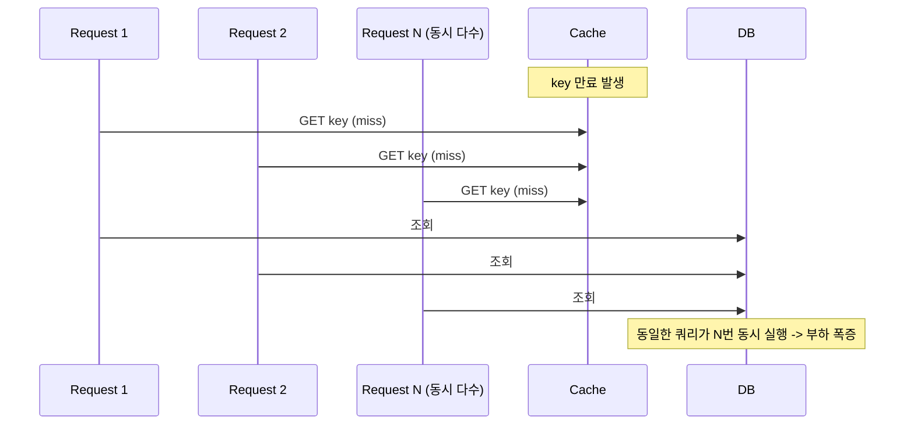

# 캐시 스탬피드

## 핵심 정의
캐시 스탬피드(Cache Stampede, Thundering Herd Problem)는 특정 캐시 키가 만료되거나 무효화되는 순간, 그 키에 대한 대량의 동시 요청이 모두 캐시 미스를 겪고 동시에 원본 저장소(DB 등)로 몰려가는 현상이다. 원본 저장소가 순간적인 부하 폭증을 견디지 못하면 응답 지연이나 장애로 이어지고, 심하면 DB 전체 장애가 다른 서비스로 전이되는 연쇄 장애(cascading failure)로 번질 수 있다.

## 동작 원리 / 구조



특히 조회량이 매우 많은 핫키(hot key, 예: 메인 페이지 인기 상품, 실시간 랭킹)에서 발생 빈도가 높다.

### 방어 기법

**1. 분산 락 + 단일 비행(Single Flight)**
캐시 미스가 발생하면 가장 먼저 락을 획득한 요청만 DB를 조회하고, 나머지는 락 해제(또는 캐시 채워짐)를 기다렸다가 캐시에서 값을 읽는다.

```java
public User getUser(Long id) {
    User cached = cache.get(id);
    if (cached != null) return cached;

    String lockKey = "lock:user:" + id;
    if (redisLock.tryLock(lockKey, Duration.ofSeconds(3))) {
        try {
            cached = cache.get(id); // double-check
            if (cached != null) return cached;
            User user = userRepository.findById(id).orElseThrow();
            cache.put(id, user, Duration.ofMinutes(10));
            return user;
        } finally {
            redisLock.unlock(lockKey);
        }
    } else {
        // 락 획득 실패: 잠깐 대기 후 캐시 재조회, 또는 stale 값 반환
        sleepShort();
        User filled = cache.get(id);
        if (filled != null) return filled;
        throw new IllegalStateException("캐시 재적재 대기 시간 초과");
    }
}
```

예제의 cache/redisLock/sleepShort는 개념 래퍼다. 락은 소유 토큰·TTL·제한된 대기·원자 해제를 구현해야 하며 락 lease가 로딩 중 끝나면 중복 로딩이 가능하다. Spring의 `@Cacheable(sync = true)`는 캐시 제공자에게 동기 로딩을 요청하는 힌트로, 실제 지원 여부와 범위는 구현에 달린다.

**2. 논리적 만료 (Logical Expiration)**
Redis 자체 TTL은 걸지 않거나 아주 길게 두고, 값 안에 "논리적 만료 시각"을 함께 저장한다. 논리적으로 만료된 값을 읽은 요청은 stale한 값을 그대로 즉시 반환하면서, 백그라운드 스레드 하나만 비동기로 갱신을 수행한다. 유효한 stale 값이 있고 갱신 작업을 키별로 한 번만 시작하게 조정하면 빠른 응답과 중복 갱신 억제를 얻는다. 하드 만료 상한·갱신 실패·최초 miss 경로도 정의한다.

**3. Stale-While-Revalidate**
논리적 만료와 유사하게, 만료된 캐시라도 일단 반환하고 백그라운드에서 갱신한다는 개념을 HTTP 캐싱(`Cache-Control: stale-while-revalidate`)에서 차용한 패턴이다.

**4. TTL Jitter**
동시에 설정된 다수 키가 한꺼번에 만료되는 것을 막기 위해 TTL에 랜덤 값을 더한다. (자세한 내용은 [[TTL과 캐시 무효화 전략]] 참고)

**5. 확률적 조기 갱신 (Probabilistic Early Expiration / XFetch)**
만료 시각에 가까워질수록 갱신을 시도할 확률을 높여, 정확히 만료되기 전에 일부 요청이 미리 캐시를 갱신하게 만드는 기법이다.

**6. Null/빈 값 캐싱**
동시 미스 외에도, 존재하지 않는 키에 대한 요청이 반복되며 매번 DB를 때리는 별개의 부하 패턴인 cache penetration(관통)이 있다. 조회 결과가 없어도 짧은 TTL로 "없음" 마커를 캐싱해 DB 요청을 차단한다.

## 실무 관점
- 캐시 스탬피드는 **핫키나 다수 키의 동시 미스에서 실질적 위협**이 된다. 트래픽이 낮은 키는 미스가 동시에 몇 건 겹쳐도 DB가 감당 가능하므로, 모든 키에 락을 거는 것은 과잉 설계이자 오히려 락 자체의 오버헤드(경합, 타임아웃 처리)로 손해다. 트래픽 패턴을 보고 방어 기법 적용 대상을 선별해야 한다.
- **흔한 장애 사례**: 배포 직후 캐시가 완전히 비워진 상태(cold cache)에서 트래픽이 유입되면, 사실상 모든 키가 동시에 미스를 겪는 대규모 스탬피드가 발생한다. 배포 전 캐시 워밍(warming) 배치로 주요 키를 미리 채워두는 것이 예방책이다.
- **흔한 장애 사례 2**: TTL을 초 단위로 딱 떨어지게(정각, 자정 등) 통일해서 설정 -> 특정 시각에 대량 키가 한꺼번에 만료 -> DB 커넥션 풀 고갈로 이어지는 패턴. TTL Jitter로 예방.
- 분산 락 기반 방어를 쓸 때는 락 타임아웃, 락 획득 실패 시 폴백(대기 후 재조회 vs 즉시 stale 반환 vs 에러) 정책을 명확히 정의해야 한다. 락을 무한 대기로 걸면 DB 부하는 막아도 요청 지연시간이 누적되어 타임아웃 연쇄로 이어질 수 있다.
- 논리적 만료 방식은 구현 복잡도가 높은 대신, 허용된 stale 값을 반환하는 경로의 지연을 낮출 수 있어 대규모 트래픽 서비스에서 선호된다.
- 캐시 penetration 방어로 Bloom Filter를 앞단에 두어 "필터에 삽입되지 않은 키"를 먼저 거르는 기법도 검토한다. 이미 삽입된 원소에 false negative는 없지만 DB의 신규 키가 필터에 아직 반영되지 않으면 실제 존재하는 데이터를 거부할 수 있다. 생성·재구축·장애 시 정책이 필요하다.

## 심화 Q&A

### Q. 분산 락 방식과 논리적 만료 방식 중 어떤 상황에서 무엇을 선택하는가?
분산 락은 중복 로딩을 줄이지만 DB 복제 지연·쓰기 경쟁까지 해결해 신선도를 보장하지는 않으며, 락을 기다리는 요청들의 응답 지연시간이 늘어나고 락 자체의 장애(락 해제 실패, 데드락)에 대한 처리가 추가로 필요하다. 논리적 만료는 반환 가능한 stale 값이 남아 있을 때 즉시 응답할 수 있지만 정의상 최신이 아닌 stale 값을 잠깐 반환할 수 있다는 트레이드오프가 있다. 응답 지연시간에 민감하고 약간의 stale이 허용되는 대규모 트래픽 서비스(랭킹, 피드)는 논리적 만료를, 신선도가 중요하고 트래픽이 상대적으로 낮은 경우는 분산 락을 선택하는 경향이 있다.

### Q. `@Cacheable(sync = true)`는 다중 인스턴스로 배포된 환경에서도 스탬피드를 막아주는가?
`sync = true` 자체가 JVM 락을 구현하는 것은 아니며 실제 동기화는 캐시 제공자에게 위임한다. Caffeine 기반 로컬 캐시는 해당 프로세스 범위다. Spring Data Redis는 기본 non-locking writer이므로 애노테이션만으로 분산 단일 로딩을 가정하면 안 된다. locking writer의 범위·버전과 구현을 확인하거나 키별 분산 조정·확률적 갱신 등을 선택한다.

### Q. 캐시 스탬피드와 캐시 penetration(관통)은 어떻게 다른가?
스탬피드는 같은 값을 재계산하는 요청들이 동시 미스 때문에 몰리는 현상이고, penetration은 존재하지 않는 데이터의 반복 요청이 캐시를 통과해 계속 원본에 도달하는 현상이다. 존재하지 않는 키에서도 동시 조회가 폭증할 수 있어 두 현상은 겹친다. 둘 다 DB 부하 폭증으로 이어지지만 원인이 다르므로 방어 기법도 다르다 — 스탬피드는 락/논리적 만료로, penetration은 null 캐싱이나 Bloom Filter로 막는다.

### Q. TTL Jitter만으로 스탬피드를 완전히 막을 수 없는 이유는?
Jitter는 "동시에 설정된 여러 키가 동시에 만료되는" 상황을 분산시켜 완화할 뿐이다. 하지만 하나의 핫키에 대한 요청량이 그 자체로 매우 많다면, 그 키 하나가 만료되는 순간 몰리는 동시 요청은 Jitter로 해결되지 않는다. 핫키 단위의 방어(락, 논리적 만료)가 별도로 필요하다.

### Q. 락 획득에 실패한 요청들에게 무엇을 반환하는 것이 적절한가?
정답은 서비스 요구사항에 따라 다르다. 신선도보다 가용성이 중요하면 캐시에 남아있는 stale 값(만료되었더라도 값 자체는 캐시에 잠깐 더 남겨두는 grace period 설계)을 즉시 반환하는 것이 좋고, 신선도가 중요하면 짧게 폴링하며 락이 풀리기를 기다렸다가 새로 채워진 값을 반환한다. 둘 다 여의치 않으면 명확한 타임아웃과 함께 일시적 오류를 반환해 클라이언트가 재시도하도록 하는 것도 방법이다.

### Q. 확률적 조기 갱신(XFetch) 기법의 핵심 아이디어와 한계는?
캐시 값의 남은 수명이 짧아질수록, 각 요청이 "지금 미리 갱신을 트리거할" 확률을 점점 높여서, 실제 만료 시점 이전에 소수의 요청만 선제적으로 DB를 조회해 캐시를 갱신하게 만드는 기법이다. 직전 재계산 시간·잔여 TTL·난수를 사용해 일찍 재계산할 확률을 조절한다. 동시에 여러 요청이 갱신을 선택할 수 있으므로 정확히 한 번 실행을 보장하지 않는다. 한계는 트래픽이 매우 낮은 키에서는 조기 갱신 기회 자체가 드물어 효과가 제한적이고, 확률 계산에 쓰이는 파라미터(직전 갱신 소요 시간 등)를 함께 추적해야 해서 구현이 단순 TTL보다 복잡하다는 점이다.

### Q. Caffeine refreshAfterWrite를 켜면 주기적인 갱신 작업이 자동으로 도는가?
A. 아니다. Caffeine의 `refreshAfterWrite`는 시간이 지난 항목을 갱신 가능 상태로 만들고, 그 항목이 조회될 때 비동기 갱신을 시작한다. 갱신 중에는 기존 값을 반환하며, 갱신 실패 시에도 기존 값이 유지된다. 따라서 허용 최신성 상한이 있으면 `expireAfterWrite` 등 만료 정책을 함께 정한다. cold miss에는 반환할 기존 값이 없고, 각 JVM은 서로 다른 캐시이므로 다중 인스턴스 전체의 갱신을 한 번으로 묶지는 않는다. DB를 조회하는 갱신 실행기의 동시 실행 수와 대기열도 제한해야 부하를 원본으로 그대로 옮기지 않는다.

## 관련 개념
- [[TTL과 캐시 무효화 전략]]
- [[Cache-Aside와 Write-Through-Behind]]
- [[분산 락]]

## 참고 자료

확인일: 2026-09-08. 아래 적용 범위에서 본문·Q&A·예제를 재검증했다. 예제는 문서와 대조했으며 별도 실행 검증은 하지 않았다.

- [Synchronized Caching](https://docs.spring.io/spring-framework/reference/integration/cache/annotations.html) — Spring Framework 7.0.9: sync의 provider 위임.
- [Redis Cache](https://docs.spring.io/spring-data/redis/reference/redis/redis-cache.html) — Spring Data Redis 공식 문서: 기본 non-locking·cache-level locking.
- [Optimal Probabilistic Cache Stampede Prevention](https://cseweb.ucsd.edu/~avattani/papers/cache_stampede.pdf) — VLDB 2015 원논문: XFetch·확률적 재계산.
- [RFC 5861](https://www.rfc-editor.org/rfc/rfc5861.html) — HTTP stale-while-revalidate 허용 시간과 갱신.
- [Bloom Filter](https://redis.io/docs/latest/develop/data-types/probabilistic/bloom-filter/) — 확률적 멤버십과 실제 삽입 집합의 보장.
- [Distributed Locks](https://redis.io/docs/latest/develop/clients/patterns/distributed-locks/) — TTL·소유자 해제·중복 실행 실패 모델.

부분 재검증: 2026-09-23. Caffeine 공식 Refresh 문서의 조회 기반 갱신·실패 시 구값 유지·만료와의 차이를 확인했다. 공식 wiki의 확인일 기준 계약이며 특정 릴리스의 새 기능 도입 시점은 주장하지 않는다. 스탬피드와 존재하지 않는 키의 경계도 설명상 모순을 교정했다.

- [Caffeine Refresh](https://github.com/ben-manes/caffeine/wiki/Refresh) — refreshAfterWrite·expireAfterWrite 병행, 조회 시 비동기 갱신·실패 처리.
