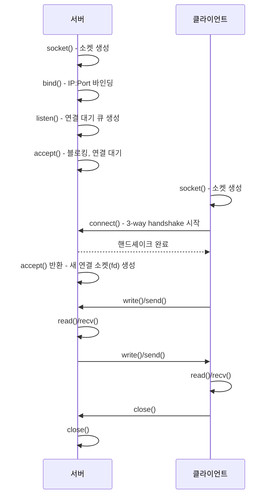

# 소켓 프로그래밍 기초

## 핵심 정의
소켓(socket)은 운영체제가 네트워크 통신을 위해 제공하는 추상화로, 애플리케이션이 파일 디스크립터(file descriptor)와 동일한 방식으로 네트워크 엔드포인트를 다룰 수 있게 해준다. 버클리 소켓(Berkeley sockets) API가 사실상의 표준이며, `socket()`, `bind()`, `listen()`, `accept()`, `connect()`, `read()`/`write()`, `close()` 같은 시스템 콜(system call)의 조합으로 커널의 네트워크 스택(TCP/IP stack)에 접근한다.

인터넷 소켓은 IP·포트·프로토콜을 사용하며 TCP의 연결된 소켓은 로컬/원격 주소 쌍으로 구분한다. UNIX domain 등 다른 address family도 있다. TCP에서는, 서버 소켓(수동적으로 연결을 기다림, passive)과 클라이언트 소켓(능동적으로 연결을 시작함, active)으로 역할이 나뉜다.

## 동작 원리 / 구조

### TCP 서버-클라이언트 소켓 생명주기

핵심은 `listen()`에 사용된 소켓(listening socket)과 `accept()`가 반환하는 소켓(connected socket)이 서로 다른 파일 디스크립터라는 점이다. 리스닝 소켓은 계속 새 연결을 받고, 각 연결마다 별도의 소켓 fd가 생성되어 실제 데이터 송수신은 이 개별 소켓으로 이루어진다.

### 커널 관점의 큐 구조

`listen()`을 호출하면 커널은 두 개의 큐를 준비한다.
- **SYN 큐(incomplete connection queue)**: 3-way handshake의 `SYN` → `SYN-ACK` 상태에서 마지막 `ACK`를 기다리는 연결들이 머무는 곳
- **accept 큐(complete connection queue)**: handshake가 완료되어 `accept()` 호출을 기다리는 연결들이 머무는 곳

애플리케이션이 `accept()`를 충분히 빠르게 호출하지 않으면 accept 큐가 가득 차고, 이후 들어오는 연결은 커널 설정에 따라 드롭되거나 재전송된 SYN으로 처리된다. 이 큐 크기는 `listen(fd, backlog)`의 `backlog` 인자와 리눅스 `net.core.somaxconn` 커널 파라미터 중 작은 값으로 결정된다.

### 소켓 옵션과 주소 구조

| 항목 | 설명 |
|---|---|
| `SOCK_STREAM` | 인터넷 소켓의 일반적인 TCP - 연결지향, 신뢰성 보장, 바이트 스트림 |
| `SOCK_DGRAM` | 인터넷 소켓의 일반적인 UDP - 비연결, 신뢰성 없음, 데이터그램 단위 |
| `SO_REUSEADDR` | bind 주소 재사용 조건 완화; 기존 listener/연결 tuple을 무조건 재사용하지 않음 |
| `SO_REUSEPORT` | 여러 프로세스/스레드가 동일 IP:Port에 바인딩해 커널이 로드밸런싱 (멀티프로세스 서버에서 accept 경합 완화) |
| `TCP_NODELAY` | Nagle 알고리즘 비활성화, Nagle에 의한 작은 전송 지연을 줄임; congestion·flow control은 유지 (지연시간 민감 서비스에서 흔히 설정) |
| `SO_LINGER` | `close()` 시 미전송 데이터 처리 방식(즉시 종료 vs 잔여 데이터 전송 대기) 제어 |

### 소켓 = 파일 디스크립터

유닉스 계열에서 소켓은 파일 디스크립터의 한 종류로 취급된다. 그래서 `read()`/`write()`로 파일과 동일한 인터페이스로 다룰 수 있고, 이것이 뒤에서 다룰 [[I O 멀티플렉싱 select poll epoll]]이 소켓·pipe 등 지원하는 fd를 같은 이벤트 API로 감시할 수 있는 이유이기도 하다. 단, 프로세스당 열 수 있는 fd 개수는 `ulimit -n`(soft/hard limit)으로 제한되며, 대량의 커넥션을 처리하는 서버에서는 이 제한을 늘리는 것이 기본 튜닝 항목이다.

TCP read/write는 메시지 경계를 유지하지 않으므로 길이 prefix·구분자 등 framing과 partial read/write 처리가 필요하다. send 성공은 로컬 송신 버퍼 수락이며 peer 애플리케이션 처리 완료가 아니다. read=0은 요청 크기가 양수일 때 orderly EOF를 의미한다. listen backlog는 Linux의 완료 큐 기준이며 SYN 대기와 syncookie는 별도다. SO_REUSEPORT는 Linux에서 참여 소켓의 bind 전 옵션 설정과 effective UID 제약이 있다. regular file은 select/poll에서 보통 항상 ready이고 epoll 등록은 일반적으로 EPERM이므로 디스크 비동기 완료 감시와 구분한다.

## 실무 관점
- **블로킹 기본값**: 소켓은 기본적으로 블로킹(blocking) 모드다. `accept()`, `read()`는 데이터/연결이 준비될 때까지 호출한 스레드를 재운다. 스레드 하나가 커넥션 하나를 전담하는 "thread-per-connection" 모델은 구현이 단순하지만 커넥션 수가 늘어나면 스레드 생성/컨텍스트 스위칭 비용과 메모리(스레드 스택)가 병목이 된다. Java에서는 Tomcat의 전통적 BIO 커넥터나 가상 스레드(virtual thread) 기반 처리가 이 모델에 해당한다.
- **TIME_WAIT 누적**: 연결을 능동적으로 닫는 쪽(대개 클라이언트, 하지만 서버가 매 요청마다 연결을 끊는 구조라면 서버)이 `TIME_WAIT` 상태로 일정 시간(보통 2×MSL) 머무른다. 짧은 커넥션을 매우 빠르게 반복하는 서버/배치에서 `TIME_WAIT` 소켓이 수만 개 쌓이면 포트 고갈(ephemeral port exhaustion)로 신규 연결이 실패하는 장애가 발생한다. 커넥션 풀링·keep-alive와 목적지별 tuple/포트 사용량을 확인한다. SO_REUSEADDR은 송신 포트 고갈의 일반적인 해결책이 아니다.
- **accept 큐 포화**: 트래픽 급증 시 애플리케이션의 `accept()` 처리 속도가 느리면(예: accept 후 무거운 초기화 로직) accept 큐가 가득 차 정상 클라이언트의 연결 시도가 타임아웃되는 장애 패턴이 흔하다. `backlog` 값과 `somaxconn`을 함께 확인해야 하며, accept 스레드는 최대한 가볍게 유지하고 무거운 처리는 워커에 위임해야 한다.
- **half-close와 리소스 누수**: TCP는 양방향 스트림이라 한쪽만 `shutdown()`으로 쓰기를 종료(half-close)할 수 있다. 애플리케이션이 `close()`와 `shutdown()`을 혼동하거나 에러 경로에서 소켓을 닫지 않으면 fd 누수로 이어져 결국 `ulimit`을 넘겨 `Too many open files` 오류로 서비스가 죽는다.
- **관련 설정/튜닝**: `net.core.somaxconn`(accept 큐 크기), `net.ipv4.tcp_max_syn_backlog`(SYN 큐 크기), `net.ipv4.tcp_tw_reuse`(TIME_WAIT 소켓 재사용), `ulimit -n`(fd 최대 개수), `TCP_NODELAY`(지연시간 민감 API), `SO_REUSEPORT`(멀티코어 활용한 accept 경합 완화).

### 읽기 타임아웃과 요청 전체 마감은 다르다

Linux의 `SO_RCVTIMEO`·`SO_SNDTIMEO`는 소켓 I/O 시스템 콜의 대기를 제한하며 `select`·`poll`·`epoll_wait`의 대기 시간에는 적용되지 않는다. 부분 전송이 있으면 전송량을 반환할 수 있으므로 남은 데이터와 오류를 함께 처리한다. 이벤트 루프는 자신의 대기 타임아웃과 요청 마감(deadline)을 별도로 관리해야 한다.

Java SE 25 `Socket.setSoTimeout`은 해당 소켓 InputStream의 **각 read 대기**를 제한한다. connect·write나 여러 번 읽어 조립하는 응답 전체의 상한이 아니다. 상대가 제한 시간 안에 조금씩 데이터를 보내면 개별 read는 계속 성공하면서 응답 전체는 훨씬 오래 걸릴 수 있다. 연결·각 읽기의 대기 제한과 요청 전체 남은 예산을 분리한다.

`SocketTimeoutException`이 나도 Socket은 유효하지만 이미 읽은 메시지 조각이 취소되거나 되감기는 것은 아니다. 프로토콜의 부분 읽기 상태를 유지해 이어 받을 수 있는지 판단하고, 경계를 복구할 수 없다면 연결을 정리한다. 소켓이 열려 있다는 사실만으로 같은 요청을 처음부터 재전송해도 안전하다고 보지 않는다.

## 심화 Q&A

### Q. `SO_REUSEADDR`와 `SO_REUSEPORT`는 각각 언제 필요한가?
A. Linux의 SO_REUSEADDR는 기존 TIME_WAIT 연결 때문에 재시작한 서버의 bind가 실패하는 상황을 완화하지만, 기존 활성 listener와 겹치는 주소에 무조건 bind하도록 허용하지는 않는다. 이전·새 소켓의 옵션과 wildcard 주소 등의 조건도 적용된다. SO_REUSEPORT는 참여 소켓 모두 bind 전에 설정하고 Linux의 effective UID 조건 등을 충족하면 같은 주소에서 독립 listener를 운영할 수 있게 한다. 커널은 새 연결을 분배하며, 하나의 listener를 공유하는 방식과 성능·분배 정책을 비교한다.

### Q. 서버가 `accept()`를 호출하기 전에 클라이언트가 이미 데이터를 보냈다면 그 데이터는 어떻게 되는가?
A. TCP는 handshake 완료 시점과 애플리케이션의 `accept()` 호출 시점이 분리되어 있다. handshake가 끝나면 그 연결은 accept 큐로 옮겨지고, 클라이언트가 곧바로 보낸 데이터는 커널의 해당 소켓 수신 버퍼(receive buffer)에 쌓인다. 애플리케이션이 나중에 `accept()`를 호출해 fd를 받아도 그 버퍼의 데이터는 그대로 남아 있어 `read()`로 정상적으로 읽을 수 있다. 즉 데이터 유실 없이 커널이 버퍼링해준다.

### Q. `close()`한 소켓인데 왜 `TIME_WAIT` 상태로 계속 보이는가? 이게 왜 문제가 되는가?
A. `TIME_WAIT`는 능동적으로 연결을 종료(active close)한 쪽에서 발생하며, 마지막 ACK가 유실되어 상대방이 FIN을 재전송할 경우에 대응하고, 동일한 4-tuple(src ip/port, dst ip/port)을 가진 지연 패킷이 새 연결에 잘못 전달되는 것을 막기 위한 안전장치다. 문제는 이 상태가 커널 리소스(소켓 구조체)를 계속 점유하면서 로컬 임시 포트(ephemeral port)도 함께 묶어둔다는 점인데, 짧은 연결을 초당 수천 번 맺고 끊는 서버에서는 사용 가능한 포트가 고갈되어 신규 연결이 `EADDRNOTAVAIL`로 실패할 수 있다. Keep-alive로 연결을 재사용하고 포트·목적지 분포를 확인한다. tcp_tw_reuse는 커널 버전별 안전 조건을 검토해야 하며 일반적인 첫 튜닝 수단으로 적용하지 않는다.

### Q. 소켓의 송신/수신 버퍼 크기가 실제로 처리량에 어떤 영향을 주는가?
A. TCP는 수신 측 버퍼 여유량을 윈도우 크기(window size)로 송신 측에 알려 흐름 제어를 한다. 수신 버퍼(`SO_RCVBUF`)가 너무 작으면 대역폭-지연 곱(bandwidth-delay product)이 큰 네트워크(고지연/고대역폭, 예: 대륙 간 통신)에서 윈도우가 금방 닫혀 처리량이 제한된다. 반대로 버퍼를 무작정 키우면 메모리 사용량이 늘고, 버퍼링된 데이터가 많아져 큐잉 지연이 커지는 부작용(bufferbloat)이 생길 수 있다. 자세한 메커니즘은 [[TCP 신뢰성 보장 메커니즘]], [[흐름 제어와 혼잡 제어]] 참고.

### Q. UDP 소켓은 `connect()`를 호출할 수 있는가? 호출하면 어떤 의미가 있는가?
A. 가능하다. UDP는 비연결형 프로토콜이지만 `connect()`를 호출하면 커널 레벨에서 해당 소켓에 목적지 주소를 고정해, 이후 `send()`/`recv()`를 `sendto()`/`recvfrom()` 없이 사용할 수 있고 매 패킷마다 주소를 지정하는 오버헤드를 없앤다. 또한 수신 데이터그램을 지정 peer로 제한한다. ICMP 기반 비동기 오류 전달은 별도 의미이며 peer IP만으로 단순 필터링한다고 설명하면 틀리다. 다만 실제 3-way handshake 같은 연결 수립 과정은 없으며 어디까지나 로컬 소켓의 상태일 뿐이다.

### Q. 왜 리스닝 소켓과 연결된(accepted) 소켓이 같은 포트 번호를 쓰는데 커널은 패킷을 혼동하지 않는가?
A. TCP 연결은 로컬 IP, 로컬 포트, 원격 IP, 원격 포트 4개 값(4-tuple)의 조합으로 식별된다. 리스닝 소켓은 로컬 포트만 고정하고 원격 주소는 와일드카드 상태이며, `accept()`로 생성된 개별 소켓은 특정 클라이언트의 IP:Port까지 결합된 별도의 4-tuple을 가진다. 따라서 같은 서버 포트로 수천 개의 클라이언트가 접속해도 각 연결은 서로 다른 4-tuple로 구분되어 커널이 패킷을 올바른 소켓 버퍼로 라우팅할 수 있다.

### Q. 리스닝 소켓이 논블로킹이면 accept 결과도 논블로킹인가?
A. Linux의 `accept()`가 만든 소켓은 `O_NONBLOCK`을 상속하지 않는다. 필요한 플래그를 명시하거나 `accept4(..., SOCK_NONBLOCK | SOCK_CLOEXEC)`를 사용한다. 이벤트 통지 뒤 다른 스레드가 먼저 연결을 가져갈 수 있으므로, accept 자체를 멈추지 않게 하려면 리스닝 소켓도 논블로킹이어야 한다. 읽기 가능 통지는 작업 소유권 확보가 아니다.

### Q. 논블로킹 connect가 EINPROGRESS를 반환한 뒤 쓰기 가능해지면 연결 성공인가?
A. 쓰기 가능 통지는 연결 시도 완료를 검사할 시점이다. `getsockopt(SOL_SOCKET, SO_ERROR)`로 0인지 확인해 성공과 실패를 구분한다. 실패한 소켓을 그대로 재사용해 재연결할 수 있다고 가정하지 않고, 소켓을 닫고 새로 만든다. 연결 제한 시간과 애플리케이션 요청 제한 시간도 별도로 관리한다.

## 관련 개념
- [[I O 멀티플렉싱 select poll epoll]]
- [[3-way handshake와 4-way handshake]]
- [[TCP 신뢰성 보장 메커니즘]]
- [[흐름 제어와 혼잡 제어]]
- [[시스템 콜과 인터럽트]]

## 참고 자료

- [Linux socket(7)](https://man7.org/linux/man-pages/man7/socket.7.html) — SO_REUSEADDR/PORT·linger·socket종류. 확인: 2026-09-08.
- [Linux listen(2)](https://man7.org/linux/man-pages/man2/listen.2.html) — Linux backlog·SYN/accept·syncookie. 확인: 2026-09-08.
- [Linux udp(7)](https://man7.org/linux/man-pages/man7/udp.7.html) — UDPconnect·async errors. 확인: 2026-09-08.
- [Linux epoll(7)](https://man7.org/linux/man-pages/man7/epoll.7.html) — fd지원과regularfile제약. 확인: 2026-09-08.
- [RFC 9293: TCP](https://www.rfc-editor.org/rfc/rfc9293.html) — 바이트스트림·send/receive·종료. 확인: 2026-09-08.

### 2026-09-23 부분 재검증

Linux man-pages 6.19 accept(2)·connect(2)의 논블로킹 상속·readiness 경쟁·SO_ERROR 완료 검사 계약을 확인했다. 기존 전체 검증일은 유지한다.

- [Linux accept(2)](https://man7.org/linux/man-pages/man2/accept.2.html) — O_NONBLOCK 비상속과 accept4 플래그.
- [Linux connect(2)](https://man7.org/linux/man-pages/man2/connect.2.html) — EINPROGRESS 이후 SO_ERROR 검사·실패 소켓 재생성.

### 부분 재검증: 2026-10-04

Linux man-pages 6.19 socket(7)의 SO_RCVTIMEO/SO_SNDTIMEO 적용 범위와 Java SE 25 Socket의 SO_TIMEOUT 읽기 계약을 확인했다. 기존 전체 `verified`는 유지한다.

- [Linux socket(7)](https://man7.org/linux/man-pages/man7/socket.7.html) — 소켓 I/O 타임아웃의 부분 전송 반환 및 select/poll/epoll_wait 비적용.
- [Java SE 25 Socket.setSoTimeout](https://docs.oracle.com/en/java/javase/25/docs/api/java.base/java/net/Socket.html#setSoTimeout(int)) — 각 InputStream read의 대기 제한, 0의 무한 대기, 타임아웃 후 소켓 유효성.

실행 확인: Oracle JDK 25.0.4+7-LTS-189(macOS AArch64)의 로컬 TCP 연결에서 250ms 읽기 제한을 둔 채 작은 데이터를 나눠 보내 전체 수신에 542ms가 걸려도 각 읽기가 성공함을 관찰했다. 이후 입력 없는 read의 SocketTimeoutException과 같은 연결의 후속 읽기 성공을 확인했다. 이 시간은 예시 관측값이며 성능 수치·상한 보장이 아니다. Linux의 소켓 옵션이나 실제 외부망 장애·프로토콜 재시도는 실행하지 않았다.
