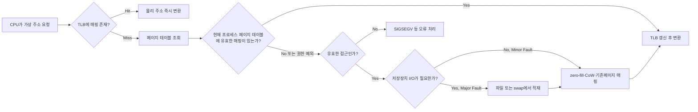

# 가상 메모리와 페이징

## 핵심 정의
가상 메모리(virtual memory)는 프로세스마다 실제 물리 메모리(physical memory) 용량과 무관한 독립적인 주소 공간을 제공하는 메모리 관리 기법이다. 각 프로세스는 자신만 메모리를 독점하는 것처럼 연속된 가상 주소 공간을 사용하지만, 실제로는 운영체제가 MMU(Memory Management Unit)와 페이지 테이블(page table)을 통해 가상 주소를 물리 주소로 변환(address translation)해 준다.

페이징(paging)은 가상 메모리를 구현하는 대표적인 방식으로, 가상 주소 공간과 물리 메모리를 고정 크기 블록인 페이지(page, 가상 측)와 프레임(frame, 물리 측)으로 나누어 관리한다. 프로세스가 필요로 하는 페이지만 물리 메모리에 적재하고 필요한 경우 익명 페이지를 swap에 내보내거나 file-backed 페이지를 원본 파일에서 다시 읽는 방식으로, 프로세스가 실제 물리 메모리보다 큰 주소 공간을 사용할 수 있게 해준다.

## 동작 원리 / 구조

### 주소 변환 흐름

- **TLB(Translation Lookaside Buffer)**: 최근 사용한 가상-물리 주소 매핑을 캐싱하는 하드웨어 캐시. TLB miss가 잦으면 페이지 테이블 워크(page table walk) 비용이 늘어나 성능이 저하된다.
- **페이지 테이블(page table)**: 가상 페이지 번호 → 물리 프레임 번호 매핑을 저장. 프로세스마다 별도로 존재하며, 큰 주소 공간을 효율적으로 다루기 위해 다단계(multi-level) 구조를 사용한다.
- **페이지 폴트(page fault)**: 현재 페이지 테이블로 접근을 완료할 수 없을 때 발생하는 예외. 유효한 demand paging·CoW는 복구하지만 잘못된 주소/권한은 오류 처리한다.
  - Minor fault: 디스크 I/O 없이 처리하는 경우; 새 zero-fill 페이지 할당·CoW 복사·기존 페이지 매핑 포함 (예: 공유 라이브러리, copy-on-write)
  - Major fault: 실제로 디스크 I/O가 필요한 경우로 비용이 훨씬 크다.
- **페이지 교체 알고리즘(page replacement)**: 물리 메모리가 가득 찼을 때 어떤 페이지를 내보낼지 결정. LRU(Least Recently Used), Clock(Second-Chance) 알고리즘 등이 실제 커널에서 근사적으로 구현된다.
- **스래싱(thrashing)**: 워킹 셋(working set, 프로세스가 짧은 시간 동안 실제로 접근하는 페이지 집합)이 물리 메모리 용량을 초과해 페이지 폴트가 과도하게 발생하고 페이지 회수·다시 읽기 및 I/O 대기에 많은 시간이 소모되는 현상.

### 리눅스 관점의 핵심 메커니즘
- **Demand paging**: 프로세스 시작 시 모든 페이지를 로드하지 않고, 실제 접근 시점에 페이지 폴트를 통해 적재한다.
- **Copy-on-write(COW)**: `fork()` 시 부모/자식 프로세스가 페이지를 공유하다가 쓰기 시점에만 복사. fork의 초기 복사 비용을 줄인다. 컨테이너 namespace 격리와 이미지 OverlayFS CoW는 별도 개념이다.
- **OOM Killer**: 전역 또는 cgroup 등의 할당 한계에서 회수로 요구를 충족하지 못하면 리눅스 커널이 특정 프로세스를 강제 종료해 시스템을 보호한다.
- **Huge Pages**: 기본 페이지 크기(보통 4KB)보다 큰 페이지(2MB, 1GB 등)를 사용해 TLB miss를 줄이는 기법. JVM 힙이 크거나 DB 서버처럼 대용량 메모리를 다루는 프로세스에서 유효하다.

swappiness=0은 swap 비활성화가 아니며 메모리 조건에 따라 swap을 시작할 수 있다. swap 사용 가능 여부는 호스트와 cgroup 설정을 함께 본다. Major fault는 file-backed 파일 최초 읽기에도 생겨 그 자체로 swap 압박을 확정하지 않는다. Minor fault도 페이지 할당·zero-fill·복사 비용이 있어 항상 매핑만 추가하는 것은 아니다. 4KiB/2MiB/1GiB는 흔한 x86-64 예이며 아키텍처·페이지 유형별 크기가 다르다.

## 실무 관점
- **JVM 힙과 페이징**: JVM `-Xmx`로 설정한 힙은 논리적 상한일 뿐, 실제 물리 메모리 사용량은 OS 페이징 정책에 좌우된다. 컨테이너 환경에서 `-Xmx`를 컨테이너 메모리 limit에 근접하게 설정하면 메모리 회수·스왑으로 지연이 늘거나, 회수로 요구를 충족하지 못해 OOM Killer가 프로세스를 강제 종료할 수 있다. 메타스페이스·코드 캐시·스택·직접 버퍼·native 사용량을 측정해 여유를 정한다. 모든 서비스에 안전한 고정 힙 비율은 없다.
- **스왑과 GC 지연**: 스왑이 활성화된 환경에서 GC(Garbage Collection)가 스왑 아웃된 힙 페이지를 스캔하면 디스크 I/O가 발생해 GC pause가 급격히 길어진다. 프로덕션 JVM 서버는 swapoff로 비활성화하거나 swappiness로 회수 성향을 조절하는 경우가 많다.
- **컨테이너 메모리 제한과 cgroup**: 제한 도달을 곧바로 프로세스 종료와 동일시하지 않는다. Linux cgroup v2의 `memory.high`는 회수 압박과 throttling 경계이며 그 초과 자체로 OOM Killer를 호출하지 않는다. `memory.max`는 회수로 사용량을 줄이지 못하면 cgroup OOM을 유발하는 한도다. 할당 종류에 따라 종료 대신 할당 실패가 반환될 수도 있다. 실행 중인 cgroup 버전과 JVM의 컨테이너 인식을 함께 확인한다.
- **흔한 장애 패턴**: 힙 외부(오프힙, 네이티브 메모리, Direct ByteBuffer, 스레드 수 과다로 인한 스택 메모리 누적)의 메모리 사용을 힙 설정에만 반영해 컨테이너가 반복적으로 OOMKilled 되는 사례가 흔하다. 스레드 풀 크기를 무분별하게 늘리면 스레드 스택(JDK/OS/-Xss에 따라 다름)만으로도 수백 MB가 소모될 수 있다.
- **튜닝 포인트**: `-XX:MaxRAMPercentage`(컨테이너 메모리 대비 힙 비율), `-Xss`(스레드 스택 크기), `vm.swappiness`(리눅스 스왑 성향), `vm.overcommit_memory`(오버커밋 정책), Transparent Huge Pages(THP) 설정 등이 실무에서 자주 건드리는 파라미터다.

### cgroup 메모리 압박을 읽는 순서
cgroup v2의 `memory.current`는 해당 그룹과 하위 그룹의 사용량이며, 힙이나 단일 프로세스 RSS와 같은 값이 아니다. `memory.stat`에서 `anon`, `file`(페이지 캐시·tmpfs 등), `kernel`을 나눠 본다. `memory.events`의 `high` 증가는 회수 때문에 느려진 단서, `max`는 한도에 부딪힌 단서다. `oom`과 실제 종료 횟수인 `oom_kill`도 구분한다. `memory.events`는 하위 그룹 사건도 포함하므로 해당 그룹 자체의 사건은 `memory.events.local`을 확인한다. 프로세스가 죽지 않았다는 이유로 메모리 압박을 배제하지 않는다.

## 심화 Q&A

### Q. 컨테이너 환경에서 JVM 힙을 limit에 거의 맞춰 설정했더니 애플리케이션이 GC 로그상 여유가 있는데도 갑자기 죽는다. 원인을 어떻게 추정하는가?
힙 자체는 여유가 있어도 메타스페이스, 코드 캐시, 스레드 스택, 다이렉트 버퍼, JIT 컴파일러 버퍼와 해당 cgroup에 계상되는 사용량이 한도에 도달하고 회수로 해결되지 않으면 cgroup OOM이 발생할 수 있다. `dmesg`나 쿠버네티스 이벤트에서 OOMKilled 여부를 확인하고, 실제 상주 메모리와 컨테이너 사용량을 조사한다. HotSpot JDK 27의 `-XX:NativeMemoryTracking=summary`는 시작 시 활성화하고 `jcmd <pid> VM.native_memory`로 JVM 내부 할당을 분해한다. NMT가 모든 JNI·서드파티 네이티브 할당이나 라이브러리 할당을 포괄하지는 않으며 reserved/committed 합계를 RSS와 동일시해서도 안 된다. Linux의 `/proc/<pid>/smaps` 등 OS 자료와 함께 비교한다.

### Q. 페이지 폴트가 애플리케이션 성능에 어떻게 영향을 주는지, minor fault와 major fault를 구분해서 설명하라.
minor fault는 디스크 I/O 없이 해결하는 경우로 상대적으로 저렴하다(예: 공유 라이브러리 최초 접근, COW). major fault는 디스크에서 실제로 페이지를 읽어와야 하므로 마이크로초~밀리초 단위의 지연이 발생하며, 대량 발생 시 스래싱으로 이어져 처리량이 급락한다. 프로세스 시작 직후(콜드 스타트)에 minor fault가 몰리는 것은 정상이지만, 정상 운영 중 major fault가 지속적으로 관찰되면 물리 메모리 부족이나 스왑 활성화를 의심해야 한다.

### Q. 가상 메모리가 없다면 멀티프로세싱 환경에서 어떤 문제가 생기는가?
주소 변환이 없는 시스템에서도 MPU나 base/limit 보호로 프로세스 격리는 가능하다. 다만 각 프로세스에 독립적인 연속 주소 공간을 제공하고 물리 프레임을 유연하게 재배치·공유하는 paging의 이점을 얻기 어렵다. 보호 장치도 없다면 한 프로세스의 잘못된 주소 접근이 다른 프로세스나 커널을 침범할 수 있다. 실제 제약은 하드웨어 보호와 로더·메모리 할당 방식에 달려 있으며, 가상 메모리 부재 자체가 멀티태스킹 불가능을 뜻하지는 않는다.

### Q. Huge Page를 사용하면 무조건 성능이 좋아지는가? 트레이드오프는 무엇인가?
Huge Page는 TLB 엔트리 하나가 커버하는 메모리 범위를 늘려 TLB miss를 줄이고 페이지 테이블 워크 오버헤드를 낮춘다. 반면 페이지 크기가 커지므로 내부 단편화(internal fragmentation)가 심해질 수 있고, 메모리 회수(reclaim) 단위가 커져 메모리 압박 상황에서 유연성이 떨어진다. 또한 Transparent Huge Pages(THP)는 백그라운드 압축(compaction) 과정에서 예측 불가능한 지연 스파이크를 유발한 사례가 많아, 레이턴시에 민감한 서버(DB, 캐시 서버)에서는 THP/madvise·페이지 크기·compaction 설정과 명시적 HugeTLB를 실제 워크로드에서 비교한다.

### Q. 워킹 셋(working set)이라는 개념이 왜 페이지 교체 정책 설계에서 중요한가?
워킹 셋은 특정 시간 구간 동안 프로세스가 실제로 활발히 참조하는 페이지 집합이다. 페이지 교체 정책이 워킹 셋보다 작은 프레임 수를 프로세스에 할당하면, 방금 내보낸 페이지를 곧 다시 요청하는 일이 반복되어 스래싱이 발생한다. 반대로 워킹 셋 크기를 안다면 그만큼의 프레임을 최소 보장해 스래싱을 방지할 수 있다. 이는 JVM에서 힙 크기를 너무 작게 잡아 GC가 살아있는 객체(활성 워킹 셋)를 유지하기 위해 끊임없이 컬렉션을 반복하는 상황과 개념적으로 유사하다.

### Q. 스왑을 아예 비활성화하는 것이 항상 정답인가?
레이턴시에 민감한 JVM 서버에서는 스왑 비활성화가 GC pause 예측 가능성을 높여주지만, 스왑이 없으면 순간적인 메모리 압박 시 즉시 OOM Kill로 이어져 가용성이 떨어질 수 있다. 워크로드 특성상 짧은 메모리 스파이크가 있고 약간의 성능 저하를 감수하더라도 프로세스 생존이 중요하다면 소량의 스왑과 `vm.swappiness`를 낮게 설정하는 절충안이 쓰이기도 한다. 정답은 없고 레이턴시 민감도와 가용성 요구사항 사이의 트레이드오프로 판단해야 한다.

## 관련 개념
- [[캐시 지역성]]
- [[JVM 구조와 클래스 로더]]
- [[가비지 컬렉션 알고리즘]]
- [[프로세스와 스레드]]

## 참고 자료

- [Linux VM sysctl](https://docs.kernel.org/admin-guide/sysctl/vm.html) — swappiness=0 의미·overcommit. 확인: 2026-09-08.
- [Linux THP](https://docs.kernel.org/admin-guide/mm/transhuge.html) — 페이지크기·madvise·compaction. 확인: 2026-09-08.
- [Linux Multi-Gen LRU](https://docs.kernel.org/mm/multigen_lru.html) — 페이지회수 근사정책. 확인: 2026-09-08.
- [Linux getrusage(2)](https://man7.org/linux/man-pages/man2/getrusage.2.html) — minor/major fault. 확인: 2026-09-08.
- [Linux cgroup v2](https://docs.kernel.org/admin-guide/cgroup-v2.html) — memory.max·memory.events·swap. 확인: 2026-09-08.

부분 재검증: 2026-09-22. 아래 확인 범위에 한하며 노트 전체의 기존 verified는 유지한다.

- [JDK 27 Native Memory Tracking](https://docs.oracle.com/en/java/javase/27/vm/native-memory-tracking.html) — 추적 범위·누락·시작 시 활성화·jcmd 조회.
- [Linux proc_pid_smaps(5)](https://man7.org/linux/man-pages/man5/proc_pid_smaps.5.html) — 매핑별 RSS/PSS와 페이지 통계. JVM의 예약/커밋 메모리와 OS 상주 메모리의 측정 범위를 구분했다.

부분 재검증: 2026-10-04. 아래 적용 버전과 확인 범위에 한하며 노트 전체의 기존 verified는 유지한다.

- [Linux cgroup v2 Memory 문서](https://docs.kernel.org/admin-guide/cgroup-v2.html#memory) — 2026-10-04 열람한 memory.high/max, memory.current/stat, memory.events/local 계약. Linux 커널·cgroup v1·Kubernetes의 실제 배포 설정 전체를 재검증한 것은 아니며 메모리 압박·OOM 유도 실험은 하지 않았다. 기존 JDK 27 NMT 검증 기록은 유지했다.
