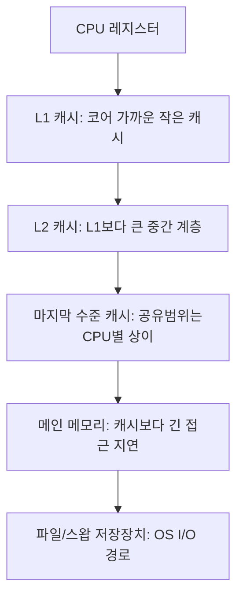

# 캐시 지역성

## 핵심 정의
캐시 지역성(cache locality)은 프로그램이 메모리를 접근하는 패턴이 특정 영역에 집중되는 경향을 활용해 CPU 캐시(L1/L2/L3) 적중률(hit rate)을 높이는 원리를 말한다. CPU와 메인 메모리(RAM) 사이의 속도 차이가 크기 때문에, 자주 접근하는 데이터를 CPU에 더 가깝고 빠른 캐시에 유지하는 것이 시스템 성능에 결정적인 영향을 준다.

지역성은 크게 두 가지로 나뉜다. 시간적 지역성(temporal locality)은 한 번 접근한 데이터를 가까운 미래에 다시 접근할 가능성이 높다는 특성이고, 공간적 지역성(spatial locality)은 한 데이터를 접근하면 그 주변 메모리 주소도 곧 접근될 가능성이 높다는 특성이다. 이 두 성질을 활용해 데이터 구조와 알고리즘을 설계하면 동일한 로직이라도 실행 속도가 수 배 이상 차이 날 수 있다.

## 동작 원리 / 구조

### 메모리 계층 구조와 캐시 라인


- 일반적인 cacheable 메모리에서 캐시는 캐시 라인(cache line, 통상 64바이트) 단위로 읽어온다. 필요한 데이터 1바이트를 요청해도 해당 라인 전체가 캐시에 적재된다.
- 배열처럼 메모리가 연속적으로 배치된 구조는 하나의 캐시 라인 적재로 인접한 여러 원소를 함께 가져와 공간적 지역성을 극대화한다.
- 연결 리스트(linked list)나 해시맵의 버킷 체인처럼 노드가 힙 여기저기 흩어져 있는 구조는 매 접근마다 캐시 미스(cache miss)가 발생하기 쉽다.

### 코드 예시: 배열 순회 순서에 따른 지역성 차이
```java
// Java int[][]는 행 배열에 대한 참조 배열; 각 int[] 행 안의 연속 접근을 비교
int n = 4096;
int[][] matrix = new int[n][n];
long sum = 0;

// 캐시 친화적: 행 우선 접근 (공간적 지역성 활용)
for (int i = 0; i < n; i++) {
    for (int j = 0; j < n; j++) {
        sum += matrix[i][j];
    }
}

// 캐시 비친화적: 열 우선 접근 (다른 행을 반복 참조하여 locality 저하 가능)
for (int j = 0; j < n; j++) {
    for (int i = 0; i < n; i++) {
        sum += matrix[i][j];
    }
}
```
행렬 크기가 커질수록 두 코드의 실행 시간 차이는 캐시 미스 비율 차이로 인해 눈에 띄게 벌어진다.

### 거짓 공유(false sharing)
서로 다른 스레드가 각자 다른 변수를 수정하더라도, 그 변수들이 동일한 캐시 라인에 위치하면 한 스레드의 쓰기가 다른 CPU 코어의 캐시 라인을 무효화(invalidate)시켜 불필요한 캐시 동기화 트래픽이 발생한다. 이는 MESI 같은 캐시 일관성 프로토콜(cache coherence protocol)의 동작 방식 때문이며, 논리적으로 데이터 경합(race)이 없어도 성능이 크게 저하될 수 있다.

캐시 용량·지연·공유 topology·line 크기는 CPU 모델별로 확인하며 64바이트는 보편적 보장이 아니다. Java 코드의 두 순회는 같은 sum에 더하고 측정·소비도 생략한 구조 설명용이므로 그대로 벤치마크 결과로 사용하지 않는다. @Contended는 Java 표준 API가 아닌 HotSpot 내부 기능으로 모듈 export와 RestrictContended 설정·메모리 증가를 검토한다. perf의 cache 이벤트 지원·의미도 PMU마다 다르며 perf c2c 등으로 false sharing 근거를 확인한다.

## 실무 관점
- **자료구조 선택**: `ArrayList`는 내부적으로 연속된 배열을 사용해 순회 시 캐시 지역성이 좋고, `LinkedList`는 노드가 힙에 흩어져 있어 순회 성능이 상대적으로 나쁘다. 단순 순회나 인덱스 접근이 잦다면 `ArrayList`가 이론적 시간복잡도가 같아도 실제로는 더 빠른 경우가 많다.
- **JVM 구현의 거짓 공유 방지**: Java에서는 `@jdk.internal.vm.annotation.Contended`(또는 과거 `sun.misc.Contended`, `-XX:-RestrictContended` 필요) 어노테이션으로 필드 사이에 패딩(padding)을 넣어 거짓 공유를 방지할 수 있다. `LongAdder`, `Striped64` 같은 JDK 내부 클래스도 이 기법으로 멀티스레드 카운터 경합을 줄인다.
- **직렬화/역직렬화 및 DTO 설계**: 자주 함께 접근되는 필드를 인접하게 배치하면(구조체 패킹과 유사한 개념) 지역성이 향상된다. 다만 JVM 객체 레이아웃은 JVM 구현체가 필드 재배열을 수행하므로 완전히 제어하기는 어렵다.
- **캐시 친화적 알고리즘**: 대용량 데이터 처리 시 블록 단위로 나눠 처리하는 캐시 블로킹(cache blocking/tiling) 기법이나, 컬럼 지향(columnar) 데이터 포맷이 캐시 지역성을 극대화해 분석 워크로드 성능을 크게 개선한다. Spring Batch에서 청크(chunk) 단위 처리도 넓게 보면 유사한 원리(메모리와 I/O 지역성 확보)로 이해할 수 있다.
- **흔한 실수**: 멀티스레드 카운터나 통계 값을 배열로 만들어 스레드별 슬롯에 저장했는데, 슬롯 간 간격이 좁아 거짓 공유가 발생해 오히려 단일 변수보다 느려지는 사례가 있다. 스레드별 값 사이에 패딩을 주거나 `LongAdder` 같은 검증된 구현을 쓰는 것이 안전하다.
- **프로파일링**: `perf stat`(리눅스)로 L1/L2/L3 캐시 미스율, IPC(Instructions Per Cycle)를 측정해 캐시 병목을 정량적으로 확인할 수 있다. JVM 레벨에서는 async-profiler 등으로 핫스팟을 찾은 뒤 자료구조 레이아웃을 재검토하는 흐름이 일반적이다.

## 심화 Q&A

### Q. 시간복잡도가 동일한 두 알고리즘이 실제 실행 시간에서 몇 배씩 차이 나는 경우가 있는데, Big-O 분석만으로 이를 설명할 수 없는 이유는 무엇인가?
Big-O는 연산 횟수의 점근적 증가율만 다루고 메모리 접근 패턴이나 캐시 적중률은 반영하지 않는다. 동일한 연산 횟수라도 캐시 친화적으로 메모리에 접근하는 알고리즘은 대부분의 접근이 L1/L2 캐시에서 처리(수 cycle)되지만, 캐시 비친화적인 알고리즘은 메인 메모리 접근(수백 cycle)이 빈번해 실제 실행 시간이 수 배에서 수십 배까지 벌어질 수 있다. 따라서 실무 최적화에서는 이론적 복잡도뿐 아니라 상수 인자(constant factor)와 메모리 접근 패턴을 함께 고려해야 한다.

### Q. 거짓 공유(false sharing)와 실제 공유(true sharing) 및 데이터 레이스(data race)을 어떻게 구분하고, 각각 다른 해법을 적용해야 하는 이유는 무엇인가?
A. True sharing은 같은 데이터 자체를 여러 코어가 사용해 coherence가 필요한 경우이며 올바른 atomic 연산에도 존재한다. Data race는 필요한 동기화 없이 같은 위치를 충돌 접근하는 정합성 문제다. False sharing은 서로 다른 논리 데이터가 한 cache line에 있어 생기는 불필요한 coherence 비용이다. race는 동기화로, true sharing 병목은 분산/집계로, false sharing은 데이터 배치·padding 등으로 다룬다.

### Q. 해시맵을 순회하며 집계하는 코드가 동일한 크기의 배열 기반 집계보다 훨씬 느린 이유를 캐시 관점에서 설명하라.
`HashMap`의 각 엔트리는 별도의 힙 객체로 존재하고 버킷 체인이나 트리 노드로 연결되어 있어, 순회할 때마다 서로 다른 메모리 영역을 참조하게 되어 참조 배열보다 pointer chasing이 많아 locality가 낮을 수 있다. 반면 배열은 원소가 연속된 메모리에 저장되어 있어 캐시 라인 하나로 여러 원소를 한 번에 적재할 수 있다. 데이터 규모가 커질수록 해시맵 순회는 캐시 미스가 누적되어 배열 순회 대비 체감 성능 차이가 커진다.

### Q. 캐시 지역성을 높이기 위한 최적화가 오히려 코드 복잡도나 유지보수성을 해칠 수 있는 상황은 언제이며, 어떻게 균형을 잡아야 하는가?
캐시 블로킹, 필드별 배열(SoA, Structure of Arrays)로의 변환, 수동 메모리 레이아웃 제어 등은 성능은 향상시키지만 코드 가독성을 크게 낮추고 도메인 모델과 물리적 표현이 괴리되는 문제를 낳는다. 실무에서는 프로파일링으로 확인된 핫패스(hot path)에 한정해 이런 최적화를 적용하고, 나머지 코드는 가독성과 유지보수성을 우선하는 것이 일반적인 절충안이다. 근거 없이 전면적으로 저수준 최적화를 적용하는 것은 과도한 엔지니어링(premature optimization)이 될 위험이 크다.

### Q. 멀티코어 환경에서 코어 수를 늘려도 특정 워크로드의 처리량이 기대만큼 늘지 않는 경우, 캐시 계층 관점에서 어떤 원인을 의심할 수 있는가?
L3 캐시는 여러 코어가 공유하는 자원이므로, 코어 수가 늘어나도 L3 캐시 용량과 대역폭은 그대로면 각 코어가 사용할 수 있는 실질적 캐시 공간이 줄어들어 캐시 미스율이 오히려 증가할 수 있다. 또한 거짓 공유나 캐시 일관성 트래픽(coherence traffic)이 코어 수에 비례해 증가하면 메모리 버스 경합이 병목이 되어 스케일이 선형적으로 나지 않는다. 이런 경우 코어당 작업을 독립적인 메모리 영역으로 분할(파티셔닝)하거나 공유 상태를 줄이는 설계가 필요하다.

### Q. JVM 객체가 캐시 지역성 관점에서 원시 배열보다 불리한 근본적인 이유는 무엇인가?
Java의 객체 배열(`Object[]`)은 실제 데이터가 아니라 힙에 흩어진 각 객체에 대한 참조(포인터)만 연속으로 저장한다. 따라서 배열 자체를 순회해도 실제 필드 값을 읽으려면 매번 다른 메모리 주소로 점프(pointer chasing)해야 해 캐시 미스가 발생하기 쉽다. 반면 원시 타입 배열(`int[]`, `long[]` 등)은 값 자체가 연속된 메모리에 저장되어 진정한 공간적 지역성을 얻는다. 이 때문에 성능이 중요한 수치 연산에서는 박싱된 객체 배열보다 원시 타입 배열이나 오프힙 버퍼를 사용하는 것이 유리하다.

### Q. 거짓 공유는 서로 다른 변수를 두 스레드가 모두 쓸 때만 생기는가?
A. 한 코어가 필드 A를 자주 쓰고 다른 코어가 같은 라인의 별도 필드 B를 읽기만 해도 발생할 수 있다. 두 필드가 모두 읽기 전용이면 쓰기로 인한 반복 무효화 문제는 없다. 따라서 읽기 전용 데이터는 모으고, 자주 쓰는 필드와 다른 코어가 자주 읽는 필드는 분리하는 배치를 검토한다. 무조건 모든 필드를 패딩하면 메모리 사용·캐시 용량 손실이 커진다.

### Q. 캐시 미스율이 높다는 측정만으로 false sharing을 확정할 수 있는가?
A. 아니다. 큰 작업 집합, 포인터 추적, 용량·충돌 미스도 원인이다. 지원되는 환경에서 perf c2c로 문제가 되는 캐시 라인의 공유·HITM 접근과 소스 위치를 함께 확인하고 배치 변경 전후를 비교한다. 특정 CPU의 이벤트 이름·라인 크기·측정 결과를 다른 CPU에 그대로 적용하지 않는다. Java 참조 배열의 연속 배치도 실제 참조 대상 객체의 연속 배치를 뜻하지 않는다.

## 관련 개념
- [[가상 메모리와 페이징]]
- [[JVM 구조와 클래스 로더]]
- [[가비지 컬렉션 알고리즘]]
- [[synchronized와 Lock]]

## 참고 자료

- [Linux False sharing](https://docs.kernel.org/kernel-hacking/false-sharing.html) — write+공유cacheline·perf c2c. 확인: 2026-09-08.
- [OpenJDK Striped64 source](https://raw.githubusercontent.com/openjdk/jdk/jdk-25%2B36/src/java.base/share/classes/java/util/concurrent/atomic/Striped64.java) — jdk-25+36·@Contended Cell. 확인: 2026-09-08.
- [JDK25 ArrayList](https://docs.oracle.com/en/java/javase/25/docs/api/java.base/java/util/ArrayList.html) — 배열기반참조·연산비용. 확인: 2026-09-08.

### 2026-09-23 부분 재검증

Linux 커널 False Sharing 문서(조회본 7.3.0-rc4)의 읽기/쓰기 공유 조건·데이터 배치·perf c2c 진단을 확인했다. 특정 CPU의 성능 수치나 PMU 동작은 이번에 실측하지 않았다. 기존 전체 검증일은 유지한다.
