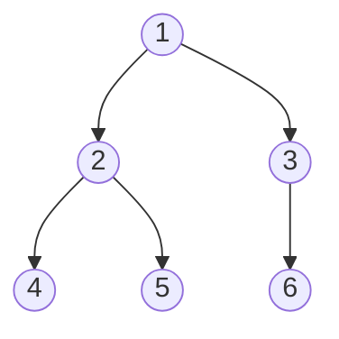

# 그래프 탐색 BFS와 DFS

## 핵심 정의
BFS(너비 우선 탐색, breadth-first search)와 DFS(깊이 우선 탐색, depth-first search)는 그래프(graph)나 트리의 모든 노드를 체계적으로 방문하는 두 가지 기본 순회 전략이다. BFS는 시작 정점에서 가까운 노드부터 레벨(level) 단위로 넓게 퍼져나가고, DFS는 한 방향으로 갈 수 있는 만큼 깊이 들어간 뒤 막히면 되돌아온다(백트래킹, backtracking). 인접 리스트에서 각 정점을 한 번 발견하고 각 인접 항목을 한 번 검사하는 전체 순회는 O(V+E)다(무방향 간선은 양쪽에서 검사). 한 시작점에서는 도달 가능한 정점만 방문하며, 전체 그래프는 미방문 정점마다 탐색을 시작해야 한다. 인접 행렬에서는 O(V²)이고, 방문 순서와 사용 자료구조가 달라 풀 수 있는 문제 유형이 갈린다.

## 동작 원리 / 구조

### 자료구조와 방문 순서
- BFS: 큐(Queue, FIFO)를 사용한다. 시작 노드를 큐에 넣고, 큐에서 하나씩 꺼내며 인접 노드를 모두 큐에 넣는 방식으로 레벨별로 확장한다.
- DFS: 스택(Stack, LIFO) 또는 재귀(recursion, 함수 호출 스택을 암묵적으로 사용)로 구현한다. 한 인접 노드로 깊이 들어갔다가 더 갈 곳이 없으면 이전 분기점으로 되돌아간다.


- BFS 방문 순서: 1 → 2, 3 → 4, 5, 6 (레벨 단위)
- DFS 방문 순서(재귀, 왼쪽 우선): 1 → 2 → 4 → 5 → 3 → 6

### 구현 예시 (Java 9+, 인접 리스트 기반)

BFS는 메서드 본문, DFS는 별도 메서드의 핵심 예제다. n과 start 및 인접 정점은 0..n-1 범위이고 인접 리스트 값은 null이 아니라고 가정한다. 누락된 key는 간선이 없는 정점으로 취급한다.
```java
// BFS: 시작 노드에서 각 노드까지의 최단 거리(간선 수 기준)
Map<Integer, List<Integer>> graph = ...;
Queue<Integer> queue = new ArrayDeque<>();
boolean[] visited = new boolean[n];
int[] distance = new int[n];
Arrays.fill(distance, -1); // 도달하지 못한 정점
distance[start] = 0;
queue.offer(start);
visited[start] = true;
while (!queue.isEmpty()) {
    int cur = queue.poll();
    for (int next : graph.getOrDefault(cur, List.of())) {
        if (!visited[next]) {
            visited[next] = true; // 큐에 넣는 시점에 방문 처리해야 중복 삽입을 막는다
            distance[next] = distance[cur] + 1;
            queue.offer(next);
        }
    }
}

// DFS: 재귀
void dfs(int cur, boolean[] visited, Map<Integer, List<Integer>> graph) {
    visited[cur] = true;
    for (int next : graph.getOrDefault(cur, List.of())) {
        if (!visited[next]) dfs(next, visited, graph);
    }
}
```
BFS는 인접 노드를 "큐에 넣는 시점"에 visited를 표시해야 같은 노드가 큐에 중복으로 쌓이는 것을 막을 수 있다. DFS는 재귀 호출 시점(또는 스택에서 꺼낸 시점)에 표시해도 되지만, 스택 기반 반복 구현에서는 꺼낸 뒤 방문 처리하면 중복 push가 발생할 수 있어 주의가 필요하다.

### 인접 리스트 vs 인접 행렬
| 표현 방식 | 공간 | 인접 노드 순회 | 간선 존재 확인 |
|---|---|---|---|
| 인접 리스트 (adjacency list) | O(V+E) | O(degree) | O(degree) |
| 인접 행렬 (adjacency matrix) | O(V²) | O(V) | O(1) |

희소 그래프(sparse graph, E ≪ V²)에는 인접 리스트가 유리하고, 밀집 그래프(dense graph)나 간선 존재 여부를 자주 O(1)로 확인해야 하면 인접 행렬이 유리하다.

## 실무 관점
- **BFS를 쓰는 경우**: 가중치가 없는(unweighted) 그래프에서 최단 경로/최소 이동 횟수를 구할 때(미로 최단 탈출, SNS에서 몇 단계 건너 친구인지), 레벨 단위 처리가 필요할 때(멀티캐스트 트리 전파 범위 계산).
- **DFS를 쓰는 경우**: 경로별 방문 상태를 되돌리는 백트래킹으로 모든 단순 경로를 열거할 때(출력 개수가 지수적으로 커질 수 있어 일반 순회의 O(V+E)와 구분), 사이클 탐지(cycle detection), 위상 정렬(topological sort), 연결 요소(connected component) 개수 파악, 백트래킹이 필요한 조합 탐색 문제.
- **트레이드오프**: BFS는 분기 계수(branching factor)가 큰 그래프에서 큐 크기가 정점 수에 비례해 커져 메모리를 많이 쓸 수 있다. 재귀 DFS는 그래프 깊이가 매우 깊으면(수만 단계 이상의 체인형 그래프) `StackOverflowError`가 발생할 수 있어, 운영 환경에서 입력 규모가 예측 불가능하다면 명시적 스택을 쓰는 반복형 DFS로 바꿔야 한다.
- **흔한 실수**: 방문 여부(visited) 체크를 누락하면 사이클이 있는 그래프에서 무한 루프에 빠진다. 방향 그래프(directed graph)에서 단순 재방문 체크만으로는 사이클을 정확히 탐지하지 못하고, 현재 재귀 경로 상에 있는지(방문 중 상태, on-stack)까지 별도로 추적해야 한다.
- **튜닝 포인트**: 시작·도착 정점이 정해진 무가중치 그래프에서는 양방향 BFS가 방문 수를 줄일 수 있다. 방향 그래프의 도착점 측은 역방향 간선을 따라야 하며, 레벨 단위 확장과 최단 거리 종료 조건을 지켜야 한다. 임의 순서로 만난 첫 교차점에서 중단하면 최단 경로 보장이 깨질 수 있다.

## 심화 Q&A

### Q. 재귀 DFS 대신 반복(iterative) DFS를 써야 하는 상황과 그 이유는?
A. 그래프의 깊이가 매우 깊거나(예: 편향된 체인 구조), 재귀 호출 스택 크기 제한이 명확한 운영 환경(스레드 스택 크기가 작게 설정된 경우)에서는 재귀 DFS가 `StackOverflowError`를 일으킬 수 있다. 명시적 스택(`Deque`)은 호출 스택의 깊이 제한을 피하지만 힙 용량 제한은 남는다. 방문 표시 시점과 중복 push를 관리하고 최대 메모리를 제한해야 한다.

### Q. 무가중치 그래프에서 DFS의 첫 도착 경로가 최단 경로가 아닌 이유는?
A. DFS는 한 경로를 끝까지 파고든 뒤에야 다른 경로를 탐색하므로, 먼저 도달한 경로가 반드시 가장 짧다는 보장이 없다. 반면 BFS는 레벨 단위로 확장하기 때문에 특정 노드에 처음 도달했을 때의 경로가 항상 최단 경로임이 보장된다(모든 간선의 가중치가 동일하다는 전제하에). 이 성질 때문에 무가중치 최단 경로 문제는 BFS가 표준 해법이다.

### Q. 양방향 BFS는 언제 유리하고, 일반 BFS 대비 이득은 어느 정도인가?
A. 양쪽에서 도달 가능하고 목표가 정해진 경우 유용하다. 일정한 분기 계수 b로 트리처럼 확장되는 모델에서 거리 d까지 단방향 탐색은 약 b^d, 양쪽 절반씩의 탐색은 약 2b^(d/2)개 상태를 만들 수 있다. 이는 효과를 설명하는 모델이며 임의의 유한 그래프에 지수 개선을 보장하지 않는다. 최악 전체 탐색은 여전히 O(V+E)이고, 양방향 거리·방문 집합과 레벨에 맞는 종료 조건을 관리해야 한다.

### Q. 방향 그래프에서 DFS를 이용해 위상 정렬을 구현하는 방법과, 사이클이 있을 때 어떻게 탐지하는가?
A. 각 노드에서 DFS를 수행하고, 그 노드에서 더 이상 갈 곳이 없어 재귀가 종료되는(post-order) 시점에 스택에 push한다. 모든 노드 처리 후 스택에서 LIFO 순서로 pop하면 종료 순서의 역순(reverse postorder), 즉 위상 순서가 된다. 사이클 탐지는 방문 상태를 "미방문/현재 경로에 있음(on-stack)/완전히 처리됨" 세 가지로 나누고, DFS 도중 "현재 경로에 있음" 상태의 노드로 다시 간선이 연결되면 사이클로 판단한다. 사이클이 있는 그래프는 위상 정렬이 애초에 불가능하다.

### Q. 무방향 그래프에서 연결 요소(connected component)의 개수를 구할 때 BFS와 DFS 중 무엇을 써도 상관없는 이유는?
A. 연결 요소 개수를 구하는 문제는 각 정점을 정확히 한 번씩 방문하며 "아직 방문하지 않은 정점에서 새로 탐색을 시작한 횟수"만 세면 되므로, 방문 순서(레벨 단위인지 깊이 우선인지)가 결과에 영향을 주지 않는다. 두 방식 모두 O(V+E)에 전체 정점을 커버하므로 어느 쪽을 써도 동일한 결과와 동일한 점근적 성능을 얻는다.

### Q. 대규모 소셜 그래프에서 BFS로 "N단계 이내 친구"를 구할 때 실무적으로 주의할 점은?
A. 허브 노드(팔로워가 매우 많은 계정 등)를 만나면 한 레벨에서 큐에 쌓이는 노드 수가 폭발적으로 늘어나 메모리와 처리 시간이 급증할 수 있다. 실무에서는 레벨별 최대 확장 수를 제한해 일부 결과 누락을 허용하는 근사 정책을 쓰거나, 배치로 처리하지 않고 그래프 전용 데이터베이스(graph database)나 사전 계산된 인덱스를 활용해 온라인 요청 경로에서 직접 BFS를 돌리지 않는 방식으로 설계하는 경우가 많다.

## 관련 개념
- [[다익스트라와 최단 경로]]
- [[트리와 이진 탐색 트리]]
- [[시간 복잡도와 공간 복잡도]]

## 참고 자료

- [Algorithms 4판: Undirected Graphs](https://algs4.cs.princeton.edu/41graph/) — BFS 최단 간선 수, DFS 경로·연결 요소·인접 리스트 복잡도. 확인: 2026-09-08.
- [Algorithms 4판: Directed Graphs](https://algs4.cs.princeton.edu/42digraph/) — 방향 사이클과 reverse postorder 위상 정렬. 확인: 2026-09-08.

부분 재검증: 2026-09-22. [Princeton Undirected Graphs](https://algs4.cs.princeton.edu/41graph/)의 방문 표시·큐/재귀 원리를 다시 확인했다. 본문 Java BFS·DFS를 추출해 JDK 27에서 임의 방향 그래프 7,959개 출발점의 단위 가중치 최단 거리·도달 가능성을 Floyd-Warshall 결과와 대조했다. 양방향 BFS 등 미구현 변형 전체의 실행 검증은 아니다.
