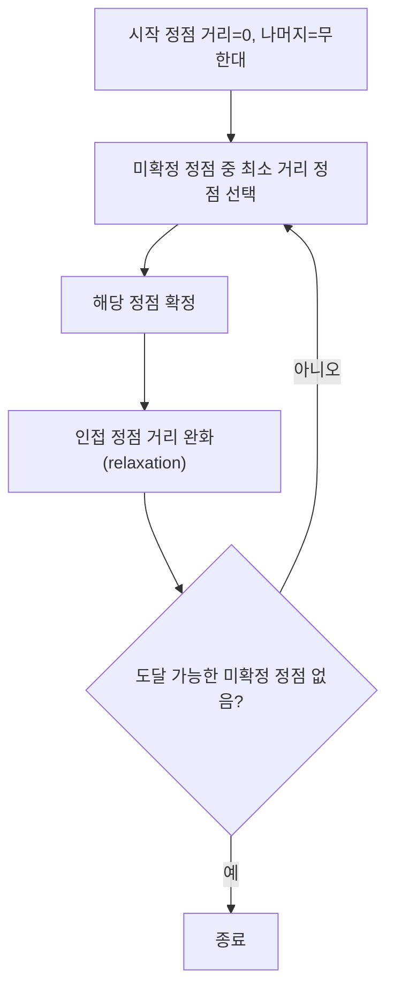

# 다익스트라와 최단 경로

## 핵심 정의
다익스트라(Dijkstra) 알고리즘은 음수 가중치가 없는 그래프에서 하나의 시작 정점(single source)으로부터 다른 모든 정점까지의 최단 경로를 구하는 그리디(greedy) 알고리즘이다. 매 단계마다 아직 확정되지 않은 정점 중 시작점으로부터의 거리 추정치가 가장 작은 정점을 확정하고, 그 정점을 거쳐 갈 수 있는 인접 정점들의 거리를 갱신(완화, relaxation)하는 과정을 도달 가능한 미확정 정점이 없을 때까지 반복한다. 도달할 수 없는 정점의 거리는 무한대로 남긴다. "한 번 확정된 최단 거리는 이후 갱신되지 않는다"는 성질이 음수 가중치가 있으면 깨지기 때문에, 음수 간선이 없다는 전제가 알고리즘의 정확성에 필수적이다.

## 동작 원리 / 구조

### 알고리즘 흐름


완화(relaxation) 조건: `dist[v] > dist[u] + weight(u, v)`이면 `dist[v]`를 갱신한다.

### Java 구현 (우선순위 큐 기반)
```java
// Java 16+; n > 0, 정점은 0..n-1, graph의 리스트/간선은 null이 아님
// graph: Map<Integer, List<int[]>>, 각 edge는 {도착 정점, int 가중치}
record State(int vertex, long distance) {}
for (List<int[]> edges : graph.values()) {
    for (int[] edge : edges) {
        if (edge[1] < 0) throw new IllegalArgumentException("negative edge");
    }
}
long[] dist = new long[n];
Arrays.fill(dist, Long.MAX_VALUE); // 도달 불가
dist[start] = 0;
PriorityQueue<State> pq = new PriorityQueue<>(Comparator.comparingLong(State::distance));
pq.offer(new State(start, 0));

while (!pq.isEmpty()) {
    State cur = pq.poll();
    int u = cur.vertex();
    long d = cur.distance();
    if (d != dist[u]) continue; // 현재 최선 거리와 다른 stale 엔트리
    for (int[] edge : graph.getOrDefault(u, List.of())) {
        int v = edge[0], w = edge[1];
        long candidate = Math.addExact(d, (long) w);
        if (candidate < dist[v]) {
            dist[v] = candidate;
            pq.offer(new State(v, candidate));
        }
    }
}
```
Java `PriorityQueue`는 decrease-key(이미 큐에 있는 원소의 우선순위를 낮추는 연산)를 지원하지 않는다. 그래서 거리가 갱신될 때마다 새 엔트리를 그냥 추가하고, 꺼낼 때 `d != dist[u]`로 오래된(stale) 엔트리를 걸러내는 방식을 쓴다. 이 때문에 큐에는 최대 O(E)개의 엔트리가 쌓일 수 있어 거리 배열 초기화와 간선 검증을 포함한 시간은 O(V+E log(E+1)), 추가 공간은 O(V+E)다. 단순 그래프에서 log E = O(log V)이므로 흔히 O((V+E) log V)로 쓰지만, 다중 간선이 매우 많은 그래프에서는 구분한다.

### 최단 경로 알고리즘 비교
| 알고리즘 | 음수 가중치 | 대상 | 시간 복잡도 | 비고 |
|---|---|---|---|---|
| BFS | 해당 없음(무가중치) | 단일 출발점 | O(V+E) | 모든 간선 가중치가 동일할 때 |
| 다익스트라 (Dijkstra) | 불가 | 단일 출발점 | O((V+E) log V) | decrease-key 가능한 이진 힙 기준; 위 lazy 구현은 본문 참고 |
| 벨만-포드 (Bellman-Ford) | 가능 (음수 사이클 탐지) | 단일 출발점 | O(V·E) | 모든 간선을 V-1번 완화 |
| 플로이드-워셜 (Floyd-Warshall) | 가능 (음수 사이클만 없으면) | 모든 쌍(all-pairs) | O(V³) | 정점 수가 적을 때 |
| A* | 일반적인 비음수 비용 설정 | 단일 출발-도착 쌍 | 휴리스틱에 따라 다름 | 목표 지점을 알 때 탐색 범위 축소 |

## 실무 관점
- **적용 사례**: 네트워크 라우팅 프로토콜(OSPF 등 링크 상태 라우팅의 핵심 계산), 지도/내비게이션 서비스의 경로 탐색, 게임의 유닛 이동 경로(pathfinding), 배달/물류 시스템의 최소 비용 경로 계산.
- **트레이드오프**: 그래프에 음수 가중치 간선이 있으면 다익스트라는 틀린 결과를 낼 수 있으므로 벨만-포드 등 음수 간선을 처리하는 알고리즘을 선택해야 한다. DAG라면 위상 순서에 따른 O(V+E) 완화도 가능하다. 다만 벨만-포드는 O(V·E)로 다익스트라보다 느리므로, 음수 가중치가 없다는 것이 보장된 도메인(물리적 거리, 시간 등 음수가 나올 수 없는 값)이라면 다익스트라를 쓰는 것이 성능상 유리하다.
- **모든 쌍 최단 경로가 필요한 경우**: 정점 수가 적으면(수백 개 이하) 플로이드-워셜이 구현이 간단하고 충분히 빠르다. 정점 수가 많으면 각 정점을 시작점으로 다익스트라를 V번 도는 것이 O(V(V+E) log V)로 플로이드-워셜의 O(V³)보다 유리할 수 있다(희소 그래프일수록 격차가 커진다).
- **A* 도입**: 목표까지의 추정 거리 h를 더해 탐색을 집중시킨다. 과대평가하지 않는 허용성(admissibility)과 h(goal)=0이 중요하다. 이미 확장한 정점을 재개방하지 않는 그래프 탐색에서는 일관성(consistency), 즉 h(u) ≤ w(u,v)+h(v)도 요구한다. 허용적이지만 비일관적인 휴리스틱을 쓰려면 더 좋은 g값을 발견한 정점을 재개방하는 처리가 필요하며, 실제 이득은 탐색 감소와 휴리스틱 계산 비용에 달려 있다.
- **흔한 실수**: PriorityQueue에서 기존 원소를 찾아 remove하는 것은 선형 시간이 들고, 큐 내부 원소의 우선순위 필드를 직접 바꾸면 힙이 자동 재정렬되지 않는다. 새 엔트리를 삽입하고 stale 항목을 건너뛴다. 위처럼 현재 dist를 엄격히 감소시키는 비음수 그래프 구현에서 stale 검사 누락은 보통 불필요한 간선 재탐색을 늘리는 성능 문제이며, 그 자체로 최단 거리 오답이 생긴다고 단정하지 않는다.
- **튜닝 포인트**: 희소 그래프에는 인접 리스트+힙이 적합하다. 밀집 그래프는 O(V²) 배열 기반 구현이 힙의 O(E log V)보다 나을 수 있다. 정점 수만으로 선택하지 말고 간선 밀도, 메모리, 큐 크기를 함께 측정한다.

## 심화 Q&A

### Q. 다익스트라가 음수 가중치에서 정확한 결과를 보장하지 못하는 이유를 구체적 반례로 설명하면?
A. A→B=2, A→C=5, C→B=-4이면 최소 추정치 B=2를 먼저 확정하지만 이후 C를 거친 비용은 1이다. 이미 확정된 정점을 다시 처리하지 않는 구현이나 B를 꺼내자마자 종료하는 구현은 오답을 낸다. 위 코드의 음수 검사를 제거하면 B를 재삽입하여 이 작은 예제는 맞힐 수도 있지만, 이는 비음수 조건에서의 확정 성질과 시간 보장을 잃은 재완화다. 도달 가능한 음수 사이클에서는 종료하지 않을 수 있으므로 음수 간선을 허용하는 근거가 되지 않는다.

### Q. Java `PriorityQueue`가 decrease-key를 지원하지 않는 문제를 실무에서 어떻게 해결하는가?
A. 가장 흔한 방법은 거리가 갱신될 때마다 지우지 않고 새 항목을 그냥 큐에 추가한 뒤, 큐에서 꺼낼 때 현재 알고 있는 최단 거리와 다르면(오래된 값이면) 무시하는 지연 삭제(lazy deletion) 방식이다. 구현이 간단하지만 큐 크기가 O(E)까지 늘어날 수 있다. 정말 decrease-key가 필요하면 인덱스 기반 힙(indexed priority queue)을 직접 구현해야 하지만, 실무에서는 지연 삭제 방식으로 충분한 경우가 대부분이다.

### Q. 다익스트라와 A*의 차이는 무엇이고, A*의 이점이 적은 상황은 언제인가?
A. 다익스트라는 시작점으로부터의 실제 거리(g(n))만으로 우선순위를 매기지만, A*는 실제 거리에 목표까지의 추정 거리(휴리스틱, h(n))를 더한 f(n)=g(n)+h(n)으로 우선순위를 매겨 목표 방향으로 탐색을 집중시킨다. 목표 지점이 정해져 있지 않고 모든 정점까지의 거리가 필요한 경우(단일 출발점 전체 최단 경로), 혹은 정점 간 유의미한 휴리스틱을 설계할 수 없는 추상적 그래프(좌표 개념이 없는 소셜 그래프 등)에서는 탐색 축소 이점이 작을 수 있다. 좌표가 없어도 문제 구조에서 휴리스틱을 만들 수 있고, h=0이면 uniform-cost search로서 목표까지의 Dijkstra와 같은 우선순위를 사용한다.

### Q. 정점 수가 적을 때 플로이드-워셜과, 다익스트라를 여러 번 돌리는 방식 중 무엇을 선택해야 하는가?
A. 정점 수 V가 작으면(대략 수백 개 이하) 플로이드-워셜은 O(V³)로 구현이 단순하고 음수 가중치도 처리할 수 있어 유리하다. 반면 V가 크고 그래프가 희소하면(E가 V²보다 훨씬 작으면) 각 정점에서 다익스트라를 도는 O(V(V+E) log V)가 O(V³)보다 훨씬 빠르다. 판단 기준은 정점 수와 간선 밀도, 그리고 음수 가중치 존재 여부다.

### Q. 이론적으로 피보나치 힙(Fibonacci heap)을 쓰면 다익스트라가 O(E + V log V)로 더 빨라지는데, 실무에서 잘 쓰이지 않는 이유는?
A. 피보나치 힙은 decrease-key를 상각(amortized) O(1)에 처리해 이론적 시간 복잡도가 더 좋지만, 실제 구현이 복잡하고 상수 계수(constant factor)가 커서 일반적인 그래프 크기에서는 이진 힙 기반 구현보다 실측 성능이 떨어지는 경우가 많다. 실무에서는 구현 단순성과 캐시 지역성이 좋은 이진 힙(또는 지연 삭제 방식의 표준 우선순위 큐)이 선호된다.

### Q. 다익스트라 계열 알고리즘이 실제 네트워크 라우팅(OSPF)에서 쓰일 때 발생할 수 있는 운영 이슈는?
A. 링크 상태 변화는 영역별 shortest-path tree와 라우팅 정보 재계산을 유발해 CPU 부하와 수렴 지연을 만들 수 있다. 다만 모든 종류의 LSA 변화가 항상 전체 SPF 재계산을 요구하는 것은 아니며, 구현에 따라 증분 계산이나 SPF 실행 제한 타이머를 사용한다. 플래핑은 경로 변경을 반복시키므로 장애 원인을 해결하고 LSA 전파·SPF 지연 설정과 실제 수렴 시간을 함께 관찰한다.

## 관련 개념
- [[그래프 탐색 BFS와 DFS]]
- [[동적 프로그래밍]]
- [[시간 복잡도와 공간 복잡도]]

## 참고 자료

- [Algorithms 4판: Shortest Paths](https://algs4.cs.princeton.edu/44sp/) — 비음수 가중치 Dijkstra, DAG·Bellman-Ford·음수 사이클 및 힙 복잡도. 확인: 2026-09-08.
- [Algorithms 4판: DijkstraSP.java](https://algs4.cs.princeton.edu/44sp/DijkstraSP.java.html) — 간선 사전 검증·완화·우선순위 큐 알고리즘. 확인: 2026-09-08.
- [UC Berkeley CS188 Fall 2022 Note 2](https://inst.eecs.berkeley.edu/~cs188/fa22/assets/notes/cs188-fa22-note02.pdf) — A* 허용성과 그래프 탐색에서 일관성의 필요성. 확인: 2026-09-08.
- [RFC 2328: OSPF Version 2](https://www.rfc-editor.org/rfc/rfc2328.html) — §16.1 영역별 shortest-path tree 계산 및 토폴로지 변화. 확인: 2026-09-08.

부분 재검증: 2026-09-22. [Princeton Shortest Paths](https://algs4.cs.princeton.edu/44sp/)의 비음수 완화·자기 간선·평행 간선 조건과 본문 Java 구현을 대조했다. Oracle JDK 27+35에서 500개 임의 그래프의 7,959개 출발점에 대해 독립적인 Floyd-Warshall 구현과 거리를 비교했다. 0 가중치·Integer.MAX_VALUE 가중치·도달 불가·중복 간선을 포함했고 음수 간선 거부도 확인했다. OSPF·A* 운영 설명 전체를 재검증한 것은 아니다.
