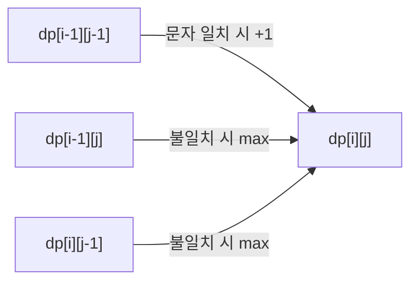

# 동적 프로그래밍

## 핵심 정의
동적 프로그래밍(dynamic programming, DP)은 큰 문제를 작은 부분 문제(subproblem)로 나누되, 그 부분 문제들이 서로 겹치는(중복 부분 문제, overlapping subproblems) 경우 한 번 계산한 결과를 저장해 재사용함으로써 중복 계산을 줄이는 기법이다. 시간은 대략 상태 수×상태당 전이 비용으로 결정되므로 항상 다항 시간(polynomial time)이 되는 것은 아니다. 최적화 문제에서는 최적 부분 구조(optimal substructure), 즉 올바른 상태 정의 아래 전체 최적해를 부분 최적해로 구성할 수 있는 성질을 이용한다. 경우의 수 계산 등 최적화가 아닌 DP도 있으며, 공통적으로 부분 문제의 결과만으로 전이를 결정할 수 있어야 한다. 단순 분할 정복(divide and conquer)과의 차이는 부분 문제가 서로 겹치는지 여부에 있다.

## 동작 원리 / 구조

### 두 가지 구현 방식
| 방식 | 구현 형태 | 장점 | 단점 |
|---|---|---|---|
| 하향식 (top-down, memoization) | 재귀 + 캐시(Map/배열) | 문제를 자연스러운 재귀 형태 그대로 옮길 수 있어 직관적 | 재귀 호출 오버헤드, 깊은 재귀에서 스택 오버플로우 위험 |
| 상향식 (bottom-up, tabulation) | 반복문 + 테이블(배열) | 재귀 호출 오버헤드 없음, 공간 최적화(rolling array) 적용이 쉬움 | 계산 순서(의존 관계)를 먼저 파악해야 함 |

### 예시 1: 피보나치 수 (메모이제이션)
```java
Map<Integer, Long> cache = new HashMap<>();
long fib(int n) {
    if (n < 0 || n > 92) throw new IllegalArgumentException("0 <= n <= 92");
    if (n <= 1) return n;
    if (cache.containsKey(n)) return cache.get(n);
    long result = fib(n - 1) + fib(n - 2);
    cache.put(n, result);
    return result;
}
```
위 캐시는 단일 스레드 예제이며 Java long에 F92까지 표현할 수 있다. 더 큰 n에는 BigInteger 등이 필요하고 덧셈 비용도 비트 길이에 따라 증가한다. 상수 비용 산술 모델에서 단순 재귀는 동일한 `fib(k)`를 지수적으로 반복 계산해 O(2ⁿ)이 걸리지만, 캐시를 두면 각 `n`에 대해 한 번만 계산하므로 O(n)으로 줄어든다.

### 예시 2: 0/1 배낭 문제 (bottom-up)
```java
// weight/value는 1-based, 무게는 양의 int, capacity는 0 이상
// 모든 차원의 배열 할당이 가능한 범위를 전제로 한다.
long[][] dp = new long[items + 1][capacity + 1];
for (int i = 1; i <= items; i++) {
    for (int w = 0; w <= capacity; w++) {
        dp[i][w] = dp[i - 1][w]; // i번째 아이템을 넣지 않는 경우
        if (w >= weight[i]) {
            dp[i][w] = Math.max(dp[i][w], Math.addExact(dp[i - 1][w - weight[i]], (long) value[i]));
        }
    }
}
```
상태 `dp[i][w]`는 "i번째까지의 아이템 중에서 용량 w를 넘지 않게 골랐을 때 최대 가치"로 정의되며, 이전 행(i-1)만 참조하므로 1차원 배열로 공간을 O(items·capacity)에서 O(capacity)로 줄일 수 있다(rolling array 최적화). 단일 배열을 제자리 갱신할 때 w를 capacity부터 weight[i]까지 내림차순으로 순회해야 같은 아이템을 한 번만 사용한다. 오름차순이면 이미 갱신된 값을 재사용해 무제한 배낭의 전이가 된다. 시간 O(items·capacity)는 입력 비트 길이가 아니라 용량의 숫자값에 비례하므로 의사 다항 시간(pseudopolynomial time)이다.

### 상태 전이 흐름 예시 (LCS, 최장 공통 부분수열)


## 실무 관점
- **적용 영역**: 최적화 문제(최소 비용, 최대 이익), 경우의 수 카운팅, 문자열 유사도(편집 거리, 최장 공통 부분수열), 경로 탐색(격자에서 최소 비용 경로) 등에 쓰인다.
- **top-down vs bottom-up 선택 기준**: 부분 문제 중 실제로 필요한 것만 계산하면 되는 경우(전체 상태 공간 중 일부만 도달 가능)에는 top-down이 불필요한 계산을 피할 수 있어 유리하다. 상태 공간을 전부 채워야 하거나 성능이 중요한 경우에는 bottom-up이 재귀 오버헤드 없이 더 빠르고 공간 최적화도 쉽다.
- **캐시 개념과의 연결**: 메모이제이션은 본질적으로 함수 결과를 저장해 재사용하는 캐싱(caching)이다. 애플리케이션 레벨에서 `@Cacheable` 같은 캐시 어노테이션이나 [[TTL과 캐시 무효화 전략]]에서 다루는 캐시 무효화 원리와 개념적으로 동일한 트레이드오프(메모리 사용량 vs 재계산 비용)를 공유한다.
- **흔한 실수**: 상태(state) 정의를 잘못해 부분 문제 간 독립성이 깨지는 경우, 재귀 함수는 정확해 보여도 메모이제이션 키가 상태를 완전히 표현하지 못해(예: 외부 가변 변수에 의존) 잘못된 캐시 히트가 발생한다. 캐시 키로 가변(mutable) 객체를 그대로 사용하면 이후 객체 내용이 변경됐을 때 캐시가 오염될 수 있다.
- **차원의 저주(curse of dimensionality)**: 상태를 표현하는 변수가 늘어날수록 테이블 크기가 곱으로 커진다(예: 각각 n가지 값을 갖는 세 변수의 조합을 모두 저장하면 O(n³) 공간). 실무에서는 필요한 상태만 남기도록 문제를 재정의하거나, 비트마스크(bitmask)로 상태를 압축하거나, 스코프를 줄이는 근사(approximation) 기법으로 대체하는 경우가 많다.
- **튜닝 포인트**: 이전 한두 행/열만 참조하는 DP는 롤링 배열(rolling array)로 공간을 O(n²)에서 O(n)으로 줄일 수 있다. 다만 경로 복원(어떤 선택을 했는지 역추적)이 필요하면 전체 테이블을 유지하거나 별도의 선택 기록 배열을 둬야 한다.

## 심화 Q&A

### Q. 그리디(greedy) 알고리즘과 DP의 차이는 무엇이고, 그리디로는 풀리지 않고 DP가 필요한 대표 사례는?
A. 그리디는 매 단계에서 지역적으로 최선인 선택을 하고 절대 되돌아보지 않지만, 이 선택이 전역 최적해로 이어진다는 보장이 없는 문제에서는 틀린 답을 낸다. 0/1 배낭 문제(아이템을 쪼갤 수 없는 배낭 문제)가 대표적으로, 가치/무게 비율이 높은 아이템부터 그리디하게 담으면 최적해를 놓칠 수 있다(용량 제약 때문에 비율이 낮아도 조합이 더 나은 경우가 존재). 반면 분할 가능한(fractional) 배낭 문제는 그리디로 정확히 풀린다. 이 차이는 "부분 구조가 그리디 선택 성질(greedy choice property)을 만족하는가"로 구분된다.

### Q. 부분 문제가 겹치지 않으면 DP를 적용할 이유가 없다고 하는데, 병합 정렬(merge sort)이 DP가 아닌 이유는?
A. 병합 정렬은 배열을 절반씩 나눠 재귀적으로 정렬하지만, 왼쪽 절반과 오른쪽 절반은 서로 완전히 독립적인 데이터 집합이라 동일한 부분 문제가 반복 등장하지 않는다. 즉 정렬된 부분 결과를 병합할 수 있지만 동일 구간의 중복 부분 문제가 없으므로 캐싱해서 얻을 이득이 없고, 이런 경우는 순수 분할 정복(divide and conquer)으로 분류한다. DP는 "부분 문제가 겹친다"는 조건이 핵심 판별 기준이다.

### Q. top-down(메모이제이션)과 bottom-up(테이블화) 중 실무에서 무엇을 우선 선택해야 하는가?
A. 문제를 처음 분석할 때는 재귀식(점화식)을 세우기 쉬운 top-down으로 먼저 정확성을 검증하고, 이후 성능이나 스택 깊이가 문제가 되면 동일한 점화식을 bottom-up으로 옮기는 순서가 실무적으로 안전하다. 상태 공간 전체를 다 채워야 하고 계산 순서가 명확하다면 처음부터 bottom-up으로 구현해 재귀 오버헤드와 스택 오버플로우 위험을 피하는 것이 낫다.

### Q. DP 상태 공간이 지나치게 커질 때(차원의 저주) 실무적으로 어떻게 대응하는가?
A. 불필요한 상태 변수와 도달 불가능한 상태를 제거하고, 직전 상태만 필요한지 확인한다. 비트마스크는 집합 표현을 간결하게 만들지만 n개의 이진 선택은 여전히 2ⁿ개 상태를 가진다. 외판원 DP의 O(n²·2ⁿ) 시간이 허용되는지는 n과 자원 한도로 판단한다. 정확성이 필요한지에 따라 가지치기·다른 정확 알고리즘 또는 근사·휴리스틱을 검토한다.

### Q. 메모이제이션 캐시가 무한정 커지는 문제는 실무의 어떤 캐시 이슈와 유사하고, 어떻게 제한하는가?
A. 한 번의 DP 계산에서도 유한한 상태가 메모리를 초과할 수 있으므로 상태 수·엔트리 크기·수명을 먼저 산정한다. 서비스의 장기 함수 결과 캐시는 크기 상한·TTL을 사용할 수 있지만, DP 중 계산 결과를 축출하면 같은 상태를 반복 계산해 원래의 시간 복잡도 보장이 사라질 수 있다. 롤링 배열처럼 더 이상 필요 없는 상태만 제거하는 최적화와 임의 만료를 구분한다. 외부 상태에 의존하는 함수는 캐시 키와 무효화가 정확성에도 영향을 준다.

### Q. NP-hard 문제에 DP를 적용해도 다항 시간이 되지 않는 경우가 있는데, 대표적 예시와 그 이유는?
A. 외판원 문제(traveling salesman problem)의 부분집합 DP는 시간 O(n²·2ⁿ), 통상 공간 O(n·2ⁿ)으로 완전 탐색 O(n!)보다 개선되지만 여전히 지수적이다. 실용적인 최대 n은 구현·메모리·시간 예산에 달려 있으며 고정된 숫자로 불가능을 단정하지 않는다. DP는 중복을 없애도 지수적인 상태 공간 자체를 없애지 않는다. 규모가 크면 가지치기를 사용하는 정확 해법이나 근사·메타휴리스틱을 요구 정확도에 맞춰 선택한다.

## 관련 개념
- [[분할 정복 알고리즘]]
- [[다익스트라와 최단 경로]]
- [[그래프 탐색 BFS와 DFS]]
- [[시간 복잡도와 공간 복잡도]]
- [[TTL과 캐시 무효화 전략]]

## 참고 자료

- [MIT 6.006 Fall 2011 Lecture 19](https://ocw.mit.edu/courses/6-006-introduction-to-algorithms-fall-2011/b6d4083131dd16e7d97f56d04b6e858f_MIT6_006F11_lec19.pdf) — 메모이제이션·부분 문제 수×전이 비용, 피보나치·DAG 의존 관계. 확인: 2026-09-08.
- [MIT 6.006 Fall 2011 Lecture 21](https://ocw.mit.edu/courses/6-006-introduction-to-algorithms-fall-2011/3484e876d81aba07911a1109f5b5e81e_MIT6_006F11_lec21.pdf) — 문자열 DP·0/1 배낭 및 용량에 의존하는 의사 다항 시간. 확인: 2026-09-08.

부분 재검증: 2026-09-22. [MIT Lecture 19](https://ocw.mit.edu/courses/6-006-introduction-to-algorithms-fall-2011/b6d4083131dd16e7d97f56d04b6e858f_MIT6_006F11_lec19.pdf)와 [Lecture 21](https://ocw.mit.edu/courses/6-006-introduction-to-algorithms-fall-2011/3484e876d81aba07911a1109f5b5e81e_MIT6_006F11_lec21.pdf)의 메모이제이션·배낭 전이를 확인했다. 본문 Java 코드를 JDK 27에서 추출 실행해 피보나치 0..92를 BigInteger 기준값과, 0/1 배낭 1,000개를 전체 부분집합 탐색과 비교했다. 빈 입력·0 용량·음수 가치를 포함했다. 외판원·LCS 등 나머지 응용 전체의 재검증은 아니다.
