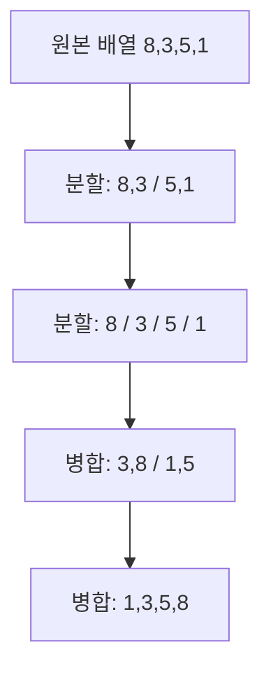

# 정렬 알고리즘 비교

## 핵심 정의
정렬 알고리즘(sorting algorithm)은 원소 집합을 특정 순서(오름차순/내림차순)로 재배열하는 절차다. 같은 문제를 풀어도 시간 복잡도(time complexity), 공간 복잡도(space complexity), 안정성(stability, 동일 키를 가진 원소의 상대적 순서 유지 여부), 적응성(adaptivity, 입력이 부분적으로 정렬돼 있을 때 더 빨라지는 성질) 등의 특성이 크게 갈린다. 실무에서는 알고리즘을 직접 구현할 일보다, 언어/프레임워크가 제공하는 정렬 함수의 내부 동작을 이해하고 상황에 맞게 비교 함수나 정렬 방식을 선택하는 일이 더 많다.

## 동작 원리 / 구조

### 대표 알고리즘 비교표

| 알고리즘 | 평균 | 최선 | 최악 | 공간 | 안정성 | 비고 |
|---|---|---|---|---|---|---|
| 버블 정렬 (Bubble Sort) | O(n²) | O(n) | O(n²) | O(1) | 안정 | 인접 원소 교환 반복, 조기 종료 최적화 시 최선 O(n) |
| 삽입 정렬 (Insertion Sort) | O(n²) | O(n) | O(n²) | O(1) | 안정 | 작은 배열, 거의 정렬된 배열에 유리 |
| 선택 정렬 (Selection Sort) | O(n²) | O(n²) | O(n²) | O(1) | 불안정 | 교환 횟수가 적어 쓰기 비용이 비쌀 때 유리 |
| 병합 정렬 (Merge Sort) | O(n log n) | O(n log n) | O(n log n) | O(n) | 안정 | 외부 정렬, 연결 리스트 정렬에 강함 |
| 퀵 정렬 (Quick Sort) | O(n log n) | O(n log n) | O(n²) | 평균 O(log n), 최악 O(n) | 불안정 | 기본 재귀 구현 기준, 피벗 선택이 관건 |
| 힙 정렬 (Heap Sort) | O(n log n) | O(n log n) | O(n log n) | O(1) | 불안정 | 추가 메모리 없이 최악 보장 |
| 팀소트 (Timsort) | O(n log n) | O(n) | O(n log n) | O(n) | 안정 | 삽입+병합 하이브리드, 실무 표준 |

표는 대표적인 배열 구현과 상수 비용 비교를 가정한다. 퀵 정렬은 작은 파티션만 재귀 호출하고 큰 쪽을 반복 처리하면 최악 스택 공간도 O(log n)으로 제한할 수 있다.

### Java/JDK의 실제 구현 (Java SE 25 / OpenJDK 25+36)
- `Arrays.sort(Object[])`는 팀소트(Timsort) 계열이다. `Collections.sort()`는 `List.sort()`에 위임하며 기본 구현과 ArrayList는 이 객체 배열 정렬을 사용한다. 병합 정렬 계열이라 **안정 정렬**이며, 이미 정렬된 구간(run)을 찾아 병합하기 때문에 부분 정렬된 데이터에서 매우 빠르다.
- Java SE 25의 `Arrays.sort(int[])` 등 기본 타입 정렬은 Dual-Pivot Quicksort 기반 구현으로 문서화되며, 문서는 모든 입력에 O(n log n) 성능을 명시한다. 실제 구현은 타입·크기에 따른 여러 전략을 혼합하므로, 표의 단순 퀵 정렬 최악 O(n²)을 그대로 적용하지 않는다. 기본 값만 비교하는 배열에는 동등 값의 객체 정체성이 없어 안정성의 실익이 없고 박싱 비용도 없다.
- `List.sort(Comparator)`의 기본 구현은 원소를 배열로 복사해 정렬한 뒤 리스트에 다시 기록한다. OpenJDK 25+36 `ArrayList.sort()`는 이를 재정의하여 backing array를 직접 정렬한다. 별도 복사를 생략해도 객체 정렬용 임시 버퍼는 필요할 수 있다.

### 흐름 예시 (병합 정렬)


### 간단 예시 코드 (Comparator 활용)
```java
List<Employee> employees = ...;
employees.sort(
    Comparator.comparing(Employee::getDepartment)
              .thenComparing(Employee::getSalary, Comparator.reverseOrder())
);
```

## 실무 관점
- **안정성이 필요한 경우**: `thenComparing()`은 부서 우선·동일 부서 내 급여순 같은 복합 비교 규칙 자체를 정의하므로 안정 정렬이 필수 조건은 아니다. 하위 키를 먼저 정렬한 뒤 상위 키로 별도 정렬하는 다중 패스 방식에서는 두 번째 정렬의 안정성이 앞선 순서를 보존한다. 모든 비교 키가 같은 객체의 입력 순서 보존도 안정성이 담당한다.
- **트레이드오프**: 퀵 정렬은 좋은 지역성과 작은 보조 공간이 장점이지만 단순 구현은 편향된 분할에서 O(n²)이 된다. 무작위 피벗은 기대 성능을 개선하고 median-of-three는 흔한 편향을 완화하지만 최악 보장은 아니다. 최악 시간까지 제한하려면 깊이 한계에서 힙 정렬로 전환하는 등의 전략이 필요하다.
- **대용량 데이터/DB 정렬**: 메모리에 다 올릴 수 없는 데이터는 외부 정렬(external sort, 병합 정렬 기반)을 쓴다. DB의 `ORDER BY`도 인덱스가 없으면 내부적으로 정렬 버퍼(work_mem, sort_buffer_size 등)를 사용해 유사한 방식으로 처리하며, 버퍼가 부족하면 디스크 스필(spill)이 발생해 성능이 급락한다.
- **흔한 실수**: 
  - `Comparator`에서 `compareTo` 결과를 뺄셈으로 구현(`a.getValue() - b.getValue()`)하면 정수 오버플로우로 부정확한 정렬이 발생할 수 있다. `Integer.compare()`를 쓰는 게 안전하다.
  - List 기본 구현의 전체 참조 배열 복사와 정렬의 임시 버퍼를 구분해 힙을 산정한다. ArrayList처럼 전체 복사를 생략하는 구현도 보조 버퍼 때문에 GC 압박이나 OOM이 발생할 수 있다.
- **튜닝 포인트**: 소규모 컬렉션(수십 개 이하)은 어떤 정렬 알고리즘을 쓰든 성능 차이가 미미하므로 가독성 있는 `Comparator` 체이닝을 우선하고, 대량 배치 처리에서만 정렬 전략(스트리밍 병합, 사전 정렬된 소스 활용 등)을 고민하는 것이 합리적이다.

## 심화 Q&A

### Q. Java 객체 배열 정렬이 병합 정렬 계열(Timsort)을 사용하는 이유는?
A. 객체 배열 정렬은 동률 객체의 입력 순서를 보존하는 안정성 계약과 O(n log n) 최악 성능이 필요하다. Timsort는 기존에 정렬된 run을 활용하므로 부분 정렬 입력에서도 효율적이다. 기본 타입 배열에는 값 외의 객체 정체성을 보존할 필요가 없으며, JDK는 해당 타입에 맞춘 하이브리드 구현을 사용한다. 어느 계열이 언제나 더 빠르다는 선택은 아니다.

### Q. 이미 정렬된 배열을 다시 정렬할 때 어떤 알고리즘이 가장 유리한가?
A. 삽입 정렬은 O(n)까지 떨어지는 적응형 알고리즘이라 이런 상황에 최적이다. Timsort도 기존에 정렬된 run을 그대로 인식해 병합만 하므로 O(n)에 가깝게 동작한다. 반면 표준 퀵 정렬(피벗을 항상 첫/끝 원소로 고정하는 구현)은 오히려 최악의 경우인 O(n²)에 빠질 위험이 있다.

### Q. 힙 정렬이 항상 O(n log n)을 보장하는데도 실무에서 퀵 정렬/Timsort보다 덜 쓰이는 이유는?
A. 힙 정렬은 이론적 보장은 좋지만 배열 내 접근 지역성(locality)이 나빠 캐시 미스가 잦고, 상수 계수가 커서 평균 실측 성능이 퀵 정렬보다 느리다. 대신 최악의 경우에도 안정적인 성능이 필요한 실시간 시스템이나 추가 메모리를 전혀 쓸 수 없는 임베디드 환경에서는 힙 정렬이 선택되기도 한다.

### Q. 정렬 안정성이 실제 장애로 이어질 수 있는 시나리오를 든다면?
A. 페이지네이션(pagination)을 구현할 때 "생성일시로 정렬 후 페이지 단위로 잘라서 반환"하는 로직에서, 생성일시가 동일한 레코드가 여러 개 있고 정렬이 불안정하면 페이지 간 요청마다 순서가 뒤바뀌어 같은 레코드가 중복 노출되거나 누락되는 문제가 생긴다. 안정 정렬은 같은 입력 순서 안의 동률만 보존하므로 요청마다 입력 순서가 달라지면 해결되지 않는다. 고유 ID 같은 보조 키로 전체 순서를 정의하고, 동시 삽입·삭제에 따른 페이지 이동에는 키셋 방식이나 스냅샷 등 일관성 정책도 고려한다.

### Q. 병렬 정렬(parallel sort)은 언제 도입을 고려하는가?
A. `Arrays.parallelSort()`처럼 fork/join으로 작업을 분할하는 정렬은 충분한 병렬성이 있고 비교·병합 작업량이 클 때 고려한다. 객체 배열의 병렬 sort-merge는 common ForkJoinPool을 사용하며, 모든 호출이 새 스레드를 생성하는 것은 아니다. 분할·동기화·병합과 공유 풀 경쟁 비용이 있어 도입 기준을 고정 원소 수로 정하지 말고 타입·비교 비용·CPU 할당·동시 요청 수로 측정한다.

### Q. 비교 기반 정렬의 하한(lower bound)이 Ω(n log n)인 이유와, 이를 깨는 정렬은 어떻게 가능한가?
A. 서로 다른 n개 키를 비교만으로 정렬하려면 결정 트리의 n!개 가능한 순열을 구분해야 한다. 최악 비교 수는 ceil(log₂(n!)) 이상이므로 Ω(n log n) 하한이 성립한다. 계수 정렬은 키 범위 k에 대해 O(n+k), 기수 정렬은 d자리·기수 b에 대해 O(d(n+b))이며 비교만 한다는 모델 밖의 연산을 사용한다. 버킷 정렬은 적절한 분포에서 기대 선형 시간이 가능하지만, 한 버킷에 몰리고 내부를 삽입 정렬하면 최악 O(n²)이 된다.

### Q. 정렬 도중 비교자가 예외를 던지면 원래 순서가 보존되는가?
A. 안정 정렬의 안정성은 정상 완료한 결과에서 동률 원소의 순서를 보존한다는 뜻이며, 실패 시 원복을 보장하지 않는다. OpenJDK 25의 ArrayList는 내부 배열을 직접 정렬하므로 비교자(Comparator)가 중간에 실패하면 일부 순서가 이미 바뀌어 있을 수 있다. 실제로 `[5,4,3,2,1,0,7,6]`을 정렬하다 8번째 비교에서 예외를 던지면 앞의 여섯 값은 오름차순으로 바뀐 상태였다. List의 기본 구현은 임시 배열 정렬이 끝나야 값을 다시 쓰지만, 이를 모든 구현의 실패 원자성으로 일반화할 수 없다.

실패해도 기존 결과를 유지해야 한다면 별도 복사본을 정렬하고 성공한 뒤 게시한다. 복사는 참조 수준이므로 비교자가 원소나 외부 상태를 변경한 부작용까지 취소하지는 않는다. 비교자는 부작용 없이 작성하고, 여러 스레드가 결과를 공유하면 참조 교체에도 안전한 게시 규칙을 적용한다.

## 관련 개념
- [[시간 복잡도와 공간 복잡도]]
- [[자료구조 선택 기준]]
- [[분할 정복 알고리즘]]

## 참고 자료

- [Algorithms 4판: Cheatsheet](https://algs4.cs.princeton.edu/cheatsheet/) — O·Ω·Θ의 점근적 경계와 자료구조·정렬 복잡도. 확인: 2026-09-08.
- [Java SE 25 Arrays](https://docs.oracle.com/en/java/javase/25/docs/api/java.base/java/util/Arrays.html) — 객체 정렬 안정성, 기본 타입 Dual-Pivot 구현 설명, 병렬 정렬. 확인: 2026-09-08.
- [Java SE 25 List.sort](https://docs.oracle.com/en/java/javase/25/docs/api/java.base/java/util/List.html#sort(java.util.Comparator)) — 안정성 계약과 기본 구현의 배열 복사. 확인: 2026-09-08.
- [OpenJDK 25+36 ArrayList 소스](https://github.com/openjdk/jdk/blob/jdk-25%2B36/src/java.base/share/classes/java/util/ArrayList.java) — sort가 backing array를 정렬하는 재정의 구현. 확인: 2026-09-08.
- [PostgreSQL 18: LIMIT and OFFSET](https://www.postgresql.org/docs/18/queries-limit.html) — OFFSET 행 처리 비용 및 고유 정렬 순서. 확인: 2026-09-08.

### 2026-09-23 부분 재검증

- [Java SE 25 List.sort](https://docs.oracle.com/en/java/javase/25/docs/api/java.base/java/util/List.html#sort(java.util.Comparator)), [OpenJDK jdk-25-ga ArrayList](https://raw.githubusercontent.com/openjdk/jdk/jdk-25-ga/src/java.base/share/classes/java/util/ArrayList.java) — 기본 구현의 임시 배열과 ArrayList의 내부 배열 직접 정렬을 대조했다. OpenJDK 25.0.2+10-69에서 비교자 예외 후 ArrayList의 부분 변경, LinkedList의 비교 실패 시 원래 순서 유지, 복사본 정렬의 원본 순서 격리를 재현했다. 예외 시 내부 상태는 관찰한 구현의 동작이며 모든 List에 대한 보장이 아니다. 그 밖의 정렬·DB 설명은 재검증하지 않았다.
