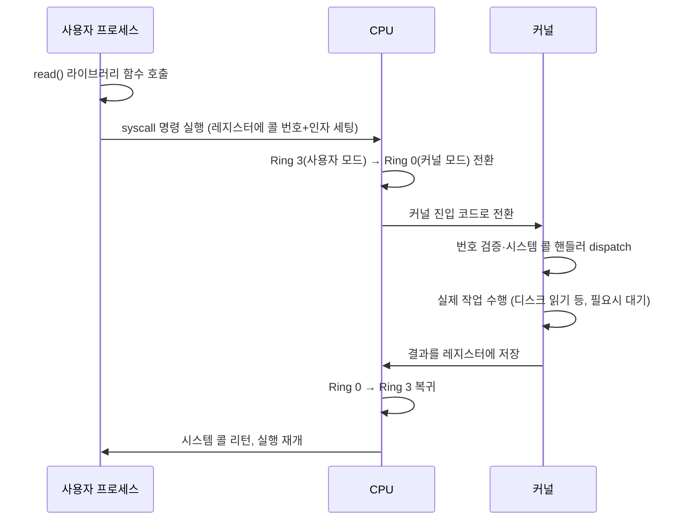

# 시스템 콜과 인터럽트

## 핵심 정의
시스템 콜(system call)은 사용자 공간(user space)에서 실행되는 프로그램이 커널 공간(kernel space)의 기능(파일 입출력, 네트워크, 프로세스 생성, 메모리 할당 등)을 요청하기 위해 사용하는 대표적인 제어 진입점이다. 이미 매핑한 공유 메모리나 vDSO 등 매 작업마다 syscall이 필요하지 않은 경로도 있다. CPU는 보호 모드(protection ring)를 두어 사용자 프로세스가 하드웨어나 커널 메모리에 직접 접근하지 못하게 막는데, 시스템 콜은 이 경계를 안전하게 넘는 제어된 진입점이다.

인터럽트(interrupt)는 CPU가 현재 실행 중인 명령 흐름을 중단하고 미리 정해진 처리 루틴(인터럽트 핸들러)으로 강제 전환되는 이벤트다. 하드웨어 인터럽트(타이머, 디스크 I/O 완료, 네트워크 카드 등 외부 장치가 발생)와 소프트웨어 인터럽트(프로그램이 의도적으로 발생시키는 트랩(trap)/예외)로 나뉘며, 시스템 콜은 소프트웨어 인터럽트(또는 그 후속 메커니즘)를 이용해 구현된다.

## 동작 원리 / 구조

### 시스템 콜 호출 흐름 (x86-64 리눅스 기준)

과거 x86에서는 소프트웨어 인터럽트(`int 0x80`)로 시스템 콜을 구현했지만, 현대 x86-64 리눅스는 이보다 빠른 전용 명령어인 `syscall`/`sysret`을 사용한다. 다만 개념적으로는 여전히 "사용자 모드에서 커널 모드로의 강제 전환 + 지정된 핸들러 실행"이라는 인터럽트/트랩의 틀을 따른다.

### 인터럽트의 종류

| 구분 | 발생 주체 | 예시 | 처리 방식 |
|---|---|---|---|
| 하드웨어 인터럽트 | 외부 장치 | 타이머, 키보드, 네트워크 카드, 디스크 I/O 완료 | 비동기적으로 언제든 발생, CPU가 현재 명령 완료 후 처리 |
| 소프트웨어 인터럽트(트랩) | 실행 중인 프로그램 스스로 | 시스템 콜(`syscall`), `int3`(디버그 브레이크포인트) | 동기적, 실행 흐름 상 특정 지점에서 의도적으로 발생 |
| 예외(exception) | 명령 실행과 연관된 동기적 이벤트 | divide error, 페이지 폴트(page fault); 처리 실패 시 SIGSEGV 등 전달 | 동기적, 요구 페이징·디버깅·오류 등 처리를 커널에 요청 |

페이지 폴트는 예외의 대표 사례로, [[가상 메모리와 페이징]]에서 다루는 디스크 적재 과정이 바로 이 예외 처리 루틴을 통해 이루어진다.

### 컨텍스트 스위칭과의 관계
시스템 콜/인터럽트가 발생한다고 항상 프로세스 컨텍스트 스위칭이 일어나는 것은 아니다. 커널 모드로 전환되는 것과, 실행 중이던 프로세스를 다른 프로세스로 완전히 교체하는 것은 별개다. 예를 들어 `getpid()` 같은 짧은 시스템 콜은 커널 모드에 잠깐 들어갔다가 곧바로 같은 프로세스로 복귀한다. 반면 `read()`가 디스크 I/O를 기다려야 하거나, 타이머 인터럽트가 스케줄러를 깨워 다른 프로세스로 전환하기로 결정하면 진짜 컨텍스트 스위칭(레지스터 저장, 페이지 테이블 교체 등)이 뒤따른다.

### 오버헤드를 줄이는 최신 기법
- **vDSO(virtual Dynamic Shared Object)**: `gettimeofday()`, `clock_gettime()`처럼 커널 상태를 거의 바꾸지 않는 일부 시스템 콜은 커널이 읽기 전용 데이터를 사용자 주소 공간에 매핑해두어, 모드 전환 없이 사용자 공간에서 직접 결과를 계산하게 해준다.
- **io_uring**: 리눅스 5.1부터 도입된 비동기 I/O 인터페이스로, 사용자와 커널이 공유하는 링 버퍼(submission queue/completion queue)에 여러 I/O 요청을 미리 쌓아두고 단 한 번의 시스템 콜로 일괄 제출한다. `SQPOLL` 모드에서는 커널이 별도 스레드로 큐를 폴링해 제출 시점의 시스템 콜 자체를 생략할 수도 있다. 매 요청마다 모드 전환 비용을 내야 했던 전통적 블로킹/논블로킹 I/O 대비, 다수의 소규모 I/O가 몰리는 워크로드에서 시스템 콜 횟수와 컨텍스트 스위칭을 크게 줄인다.
- **Meltdown 완화 패치(KPTI)의 영향**: KPTI(Kernel Page Table Isolation)는 Meltdown 취약점에 대응해 사용자/커널의 페이지 테이블을 완전히 분리한 보안 패치로, 모드 전환마다 CR3 교체 등이 추가되며 PCID 지원은 전체 TLB flush를 줄일 수 있어 시스템 콜 자체의 비용을 높이는 트레이드오프를 가져왔다(참고로 Spectre 계열은 KPTI가 아니라 retpoline, IBRS 같은 별도의 분기 예측 관련 완화 기법으로 대응한다). 이는 시스템 콜을 최대한 배치(batch)하려는 io_uring 같은 설계가 최근 더 주목받는 배경 중 하나다.

x86의 interrupt·fault·trap과 Linux softirq는 서로 다른 용어다. 페이지 폴트는 유효한 demand paging·CoW에도 발생하므로 항상 프로그램 오류나 디스크 I/O를 뜻하지 않는다. Java InputStream은 메모리·버퍼 등 구현에 따라 syscall을 호출하지 않을 수도 있다. io_uring의 요청 완료는 별도 CQE로 확인하며 SQPOLL도 setup·wakeup·대기 등에 syscall이 필요할 수 있다. 모드 전환 수 감소가 다른 task로의 context switch 수 감소와 항상 같지는 않다.

## 실무 관점
- 애플리케이션 개발자가 시스템 콜을 직접 호출할 일은 드물지만, `strace`(리눅스)로 프로세스가 실제로 어떤 시스템 콜을 얼마나 호출하는지 추적하면 성능 문제의 원인을 찾을 수 있다. 예를 들어 로그 라이브러리가 매 줄마다 `write()`를 동기 호출하면 시스템 콜 오버헤드가 누적되어 처리량이 떨어지는데, 버퍼링을 늘려 호출 횟수를 줄이는 것이 표준적인 해결책이다.
- Java의 `InputStream`은 추상 API이므로 매 read마다 시스템 콜이나 OS 대기가 발생하지는 않는다. 메모리 스트림이나 이미 채워진 버퍼는 사용자 공간에서 읽고, 파일·소켓 스트림의 실제 시스템 콜과 대기 경로는 구현·OS·가상 스레드 지원에 따라 달라진다. NIO Selector는 준비 상태 다중화를 추상화하며 Linux epoll 등 플랫폼별 구현으로 한 스레드가 여러 연결을 감시할 수 있다. 리액티브 스택의 처리량은 이 다중화뿐 아니라 이벤트 루프에서 블로킹을 피하는 설계, 배압, 애플리케이션 작업 비용에도 좌우된다.
- 컨테이너 보안 관점에서 syscall 필터링(`seccomp`)은 컨테이너 프로세스가 호출할 수 있는 시스템 콜 목록을 화이트리스트로 제한해 커널 공격 표면을 줄이는 표준적인 기법이다. Docker 기본 프로파일과 Kubernetes RuntimeDefault 설정을 확인한다. Kubernetes는 seccompDefault를 켜지 않고 명시 프로파일도 없으면 기본 Unconfined이며 privileged 컨테이너도 Unconfined다.
- 흔한 오해: 시스템 콜이 느린 이유를 "네트워크 왕복"처럼 생각하기 쉬운데, 실제로는 CPU 모드 전환(ring 전환) 자체의 비용(레지스터 저장/복원, TLB 영향, 보안 완화 패치로 인한 추가 비용)이 핵심이다. 시스템 콜 지연은 종류·커널·하드웨어·대기 여부에 따라 달라지며, 초당 수백만 번 호출되면 그 누적이 무시할 수 없는 CPU 사용률로 이어진다.
- 튜닝/진단 포인트: `strace -c`(시스템 콜별 횟수/시간 집계), `perf stat`(컨텍스트 스위칭, 인터럽트 횟수), 컨테이너의 `seccomp` 프로파일 설정, 고성능 I/O가 필요한 시스템에서 io_uring 지원 여부 확인.

### 짧은 I/O와 재시도 범위를 구분한다
Linux `read()`·`write()`가 요청보다 적은 바이트 수를 반환해도 성공일 수 있다. 프로토콜 메시지 한 건을 syscall 한 번과 동일시하지 않는다. 양수 반환값만큼 버퍼 위치를 전진시키고 남은 부분을 처리해야 하며, 일부 전송 뒤 전체 데이터를 다시 보내면 중복된다. `EINTR`로 실패한 호출은 종료·취소 정책을 확인한 뒤 재시도하고, 논블로킹 fd의 `EAGAIN`/`EWOULDBLOCK`은 준비 상태를 다시 기다려 busy loop를 피한다. Java에서는 사용하는 스트림·채널 계약으로 이 의미를 해석해야 한다.

모든 실패에 같은 재시도 루프를 적용하지 않는다. 특히 Linux의 `close()`는 뒤늦게 오류를 반환해도 fd 번호를 이미 해제했을 수 있다. 그 번호를 다른 스레드가 재사용한 뒤 `close()`를 다시 호출하면 엉뚱한 자원을 닫게 된다. Linux의 `EINTR`도 같은 주의가 필요하다. 이 동작은 다른 OS 및 POSIX.1-2024의 EINTR 규칙과 다를 수 있으므로 Linux 계약으로 한정한다. close 오류는 진단하고, 저장 보장이 필요하면 적절한 시점의 `fsync()` 오류도 별도로 처리한다.

## 심화 Q&A

### Q. 시스템 콜과 일반 함수 호출은 CPU 관점에서 근본적으로 무엇이 다른가?
일반 함수 호출은 같은 권한 수준(ring) 안에서 스택 프레임만 바꾸는 저렴한 연산이다. 시스템 콜은 CPU의 특권 수준을 사용자 모드(ring 3)에서 커널 모드(ring 0)로 전환해야 하므로, 레지스터 상태 저장, 커널 스택으로 전환, 이후 복귀 시 다시 사용자 모드로 되돌리는 하드웨어 수준의 보호 메커니즘을 거친다. 이 전환 자체가 캐시/TLB에 영향을 주고 보안 완화 패치(KPTI 등)로 인해 비용이 더 커졌기 때문에, 같은 "호출"이라도 일반적인 사용자 함수 호출보다 비용이 크지만 고정 배수로 일반화할 수 없다.

### Q. 인터럽트는 항상 하드웨어 이벤트인가?
아니다. 좁은 의미로는 하드웨어 장치가 발생시키는 것만 인터럽트라 부르고, 프로그램이 의도적으로 발생시키는 것은 트랩(trap) 또는 소프트웨어 인터럽트, CPU가 오류를 감지해 발생시키는 것은 예외(exception)로 구분한다. 하지만 셋 모두 "현재 실행 흐름을 중단하고 미리 정해진 핸들러로 전환한다"는 모두 커널 핸들러로 제어를 넘긴다는 공통점이 있어, 넓은 의미로는 모두 인터럽트 메커니즘의 하위 유형으로 묶어 설명하는 경우가 많다.

### Q. `read()` 시스템 콜이 블로킹되어 있는 동안 CPU는 무엇을 하는가?
프로세스가 디스크 I/O 완료를 기다려야 하면, 커널은 그 프로세스를 실행 대기 큐에서 빼서 대기(waiting/blocked) 상태로 옮기고 스케줄러가 다른 실행 가능한 프로세스에게 CPU를 넘긴다. 다른 실행 가능한 작업이 있으면 CPU가 이를 처리하고 없으면 idle 상태로 있다가, I/O 장치가 작업을 끝내면 하드웨어 인터럽트를 발생시켜 커널에 완료를 알리고, 커널이 원래 대기하던 프로세스를 다시 실행 가능(ready) 상태로 옮겨 스케줄러가 나중에 CPU를 배정한다.

### Q. io_uring이 기존 `epoll` 기반 논블로킹 I/O보다 나은 지점은 정확히 어디인가?
`epoll`은 "어떤 파일 디스크립터가 준비되었는지"만 알려주고, 실제 읽기/쓰기는 여전히 별도의 `read()`/`write()` 시스템 콜을 각각 호출해야 한다. io_uring은 읽기/쓰기 요청 자체를 링 버퍼에 미리 등록해두고 커널이 비동기로 처리한 뒤 완료 큐에 결과를 채워주므로, 준비 여부 확인과 실제 작업 수행을 분리하지 않고 한 번의 제출로 다수의 I/O 작업을 완결할 수 있다. 특히 다수의 소규모 I/O가 몰리는 워크로드(파일 서버, DB 엔진)에서 시스템 콜 횟수 자체를 크게 줄이는 것이 핵심 이득이며, 단순 대량 순차 읽기처럼 시스템 콜 오버헤드가 병목이 아닌 경우에는 이점이 크지 않다.

### Q. vDSO는 왜 모든 시스템 콜에 적용할 수 없는가?
vDSO는 커널 메모리의 일부(주로 읽기 전용 데이터)를 사용자 주소 공간에 매핑해, 커널 상태를 변경하지 않고 값을 조회만 하는 연산에 한해 모드 전환 없이 처리할 수 있게 해준다. 하지만 파일 쓰기, 프로세스 생성처럼 커널의 내부 상태(파일 시스템, 프로세스 테이블 등)를 실제로 변경해야 하는 시스템 콜은 커널의 배타적 제어 하에서만 안전하게 수행될 수 있으므로 사용자 공간에서 직접 처리할 수 없다. vDSO export는 아키텍처·커널 버전별로 다르며 대표적인 함수는 `clock_gettime()`, `gettimeofday()`, `time()`, `getcpu()` 등이다. 지원하지 않는 호출/clock source 등은 실제 syscall로 fallback할 수 있다. `getpid()`는 여기 포함되지 않는다 — 옛 glibc가 한때 `getpid()` 결과를 사용자 공간에 캐싱한 적이 있었지만(vDSO와는 무관한 libc 자체 구현이었다), `clone()`을 glibc 래퍼 없이 직접 호출하면 캐시된 값이 stale해지는 버그가 있어 glibc 2.25(2017)에서 제거되었고, 현재 `getpid()`는 매번 실제 시스템 콜로 커널에 진입한다.

### Q. 애플리케이션 레벨에서 시스템 콜 횟수를 줄이는 것이 왜 GC 튜닝만큼 중요하게 취급되기도 하는가?
높은 처리량이 필요한 시스템에서는 시스템 콜 하나하나는 마이크로초 단위라도 초당 호출 횟수가 수백만 건에 달하면 그 누적 비용이 CPU 사용률의 상당 부분을 차지할 수 있다(보안 완화 패치 이후 이 비용은 더 커졌다). 로그를 매 줄마다 flush하거나, 소켓에 매 메시지마다 별도로 `write()`하는 패턴은 애플리케이션 로직상 버그는 아니지만 시스템 콜 오버헤드로 처리량 상한을 낮추는 대표적 사례라, 버퍼링/배치(batching)로 시스템 콜 횟수 자체를 줄이는 것이 GC 튜닝 못지않게 실질적인 성능 개선으로 이어질 수 있다.

## 관련 개념
- [[프로세스와 스레드]]
- [[가상 메모리와 페이징]]
- [[CPU 스케줄링]]
- [[프로세스 간 통신]]

## 참고 자료

- [Linux syscall(2)](https://man7.org/linux/man-pages/man2/syscall.2.html) — 아키텍처별 syscall ABI. 확인: 2026-09-08.
- [Linux vdso(7)](https://man7.org/linux/man-pages/man7/vdso.7.html) — 플랫폼별export·libc fallback. 확인: 2026-09-08.
- [Linux io_uring_setup(2)](https://man7.org/linux/man-pages/man2/io_uring_setup.2.html) — SQPOLL·queue설정·kernel제약. 확인: 2026-09-08.
- [Linux x86 PTI](https://docs.kernel.org/arch/x86/pti.html) — CR3·PCID·TLB. 확인: 2026-09-08.
- [Kubernetes Seccomp](https://kubernetes.io/docs/tutorials/security/seccomp/) — v1.37 RuntimeDefault·Unconfined 조건. 확인: 2026-09-08.

부분 재검증: 2026-09-22. [Java SE 27 InputStream](https://docs.oracle.com/en/java/javase/27/docs/api/java.base/java/io/InputStream.html)과 [ByteArrayInputStream](https://docs.oracle.com/en/java/javase/27/docs/api/java.base/java/io/ByteArrayInputStream.html)의 추상 read·메모리 구현을 대조했다. 모든 InputStream 읽기를 커널 read/대기와 동일시하던 실무 문단을 수정했다. Linux/Kubernetes 설정 전체의 재검증은 아니다.

부분 재검증: 2026-10-04. 아래 적용 버전과 확인 범위에 한하며 노트 전체의 기존 verified는 유지한다.

- [Linux man-pages 6.19 read(2)](https://man7.org/linux/man-pages/man2/read.2.html), [write(2)](https://man7.org/linux/man-pages/man2/write.2.html), [close(2)](https://man7.org/linux/man-pages/man2/close.2.html) — 짧은 성공·EINTR/EAGAIN·부분 쓰기·Linux close 재시도 위험과 OS별 차이. 2026-10-04 문서 대조이며 Linux 네이티브 syscall·디스크 장애는 실행 재현하지 않았다.
