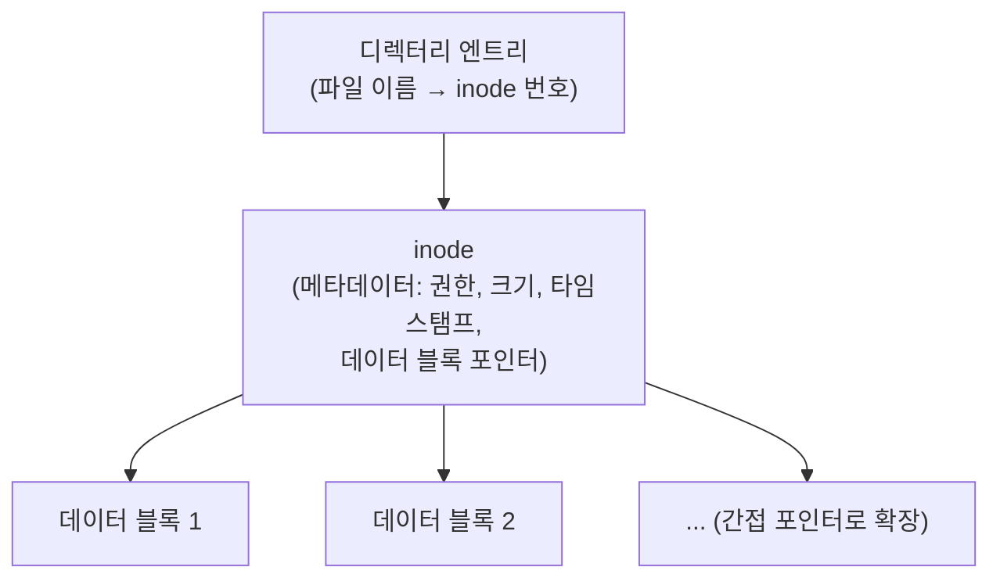
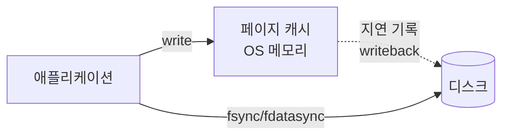

# 파일 시스템 기초

## 핵심 정의
파일 시스템(file system)은 블록 장치(HDD, SSD)·메모리·원격 저장소 등에, 이름을 가진 파일과 디렉터리라는 구조를 얹어 데이터를 저장·검색·관리할 수 있게 해주는 운영체제의 계층이다. 파일 시스템은 "파일 이름 → 실제 데이터가 저장된 디스크 블록"을 매핑하는 메타데이터 구조를 관리하고, 동시에 여러 프로세스가 파일에 접근할 때의 일관성과 장애 시 복구 가능성을 보장하는 책임을 진다.

이 노트는 DB 저장 엔진(InnoDB의 페이지/버퍼풀, WAL 등)이 아니라 그 아래 계층인 OS 범용 파일 시스템(ext4, XFS, NTFS 등)의 구조에 초점을 둔다. DB는 결국 이 파일 시스템 위에 자신만의 파일(데이터 파일, 로그 파일)을 올려 동작하므로, 두 계층의 개념을 구분해서 이해하는 것이 중요하다.

## 동작 원리 / 구조

### inode 기반 구조 (유닉스 계열)

- **inode**: 파일의 실체를 나타내는 자료구조로, 파일 이름은 포함하지 않고 소유자, 권한, 크기, 타임스탬프, 실제 데이터가 있는 디스크 블록 위치(포인터)를 담는다. 파일 이름은 디렉터리 엔트리(디렉터리도 결국 "이름 → inode 번호" 매핑을 담은 특수한 파일)에만 존재한다.
- **하드 링크(hard link)**: 같은 inode를 가리키는 또 다른 디렉터리 엔트리. 원본 파일을 지워도 link count가0이 되고 열린 fd/매핑 등의 참조도 사라질 때까지 저장공간이 유지될 수 있다.
- **심볼릭 링크(symbolic link)**: 다른 파일의 "경로 문자열"을 담은 별도의 파일로, 대상 inode를 직접 공유하지 않는다. 원본이 사라지면 깨진 링크(dangling link)가 된다.
- **파일 디스크립터(file descriptor, fd)**: 프로세스가 연 파일을 가리키는 정수 핸들. 프로세스별 fd 테이블 → 시스템 전역 열린 파일 테이블(open file table, 파일 오프셋 포함) → inode의 3단계 간접 구조로, `fork()` 후 부모/자식이 같은 열린 파일 테이블 엔트리를 공유해 오프셋도 공유하는 이유가 여기서 나온다.

### 페이지 캐시와 쓰기 경로

리눅스는 `write()`로 쓴 데이터를 즉시 디스크에 반영하지 않고 페이지 캐시(page cache)라는 메모리 버퍼에만 우선 반영한 뒤, "더티 페이지(dirty page)"로 표시하고 커널 스레드(`kworker` 등)가 나중에 배치로 디스크에 내려쓴다(writeback). 이 덕분에 쓰기 성능이 크게 향상되지만, 디스크에 실제로 반영되었다는 보장이 필요한 경우 애플리케이션이 `fsync()`(데이터+메타데이터)나 fdatasync()(데이터와 후속읽기에 필요한 metadata)를 명시적으로 호출해 강제로 플러시해야 한다. `write()`가 리턴했다고 해서 데이터가 물리적으로 안전하게 저장되었다는 뜻은 아니다.

### 저널링(journaling)
전원이 갑자기 끊기거나 시스템이 크래시되면, 메타데이터(디렉터리 구조, inode)를 갱신하던 도중 파일 시스템이 일관되지 않은 상태로 남을 수 있다. 저널링 파일 시스템(ext4, XFS, NTFS)은 실제 메타데이터를 변경하기 전에 "무엇을 바꿀지"를 저널(journal, 로그 영역)에 먼저 기록해두고, 크래시 후 재시작 시 저널을 재생(replay)해 일관된 상태로 복구한다. 이는 DB의 [[WAL과 트랜잭션 로그]]와 개념적으로 동일한 원리(선-기록 로그, write-ahead logging)를 파일 시스템 레벨에 적용한 것이다.

| ext4 저널링 모드 | 보호 범위 | 트레이드오프 |
|---|---|---|
| `data=journal` | 메타데이터 + 데이터 전체 | 데이터까지 저널링해 쓰기 비용 증가; 실제 성능은 부하에 따름 |
| `data=ordered` (기본값) | 메타데이터만 저널링, 데이터는 메타데이터 갱신 전에 먼저 디스크에 씀을 순서로 보장 | 안전성과 성능의 절충, 대부분의 배포판 기본값 |
| `data=writeback` | 메타데이터만 저널링, 데이터 쓰기 순서 보장 없음 | 순서제약이 적지만 크래시 시 파일 내용에 오래된 데이터/쓰레기 값이 남을 수 있음 |

### 마운트(mount)와 가상 파일 시스템(VFS)
리눅스는 VFS(Virtual File System)라는 추상 계층을 통해 ext4, XFS, NFS, tmpfs 등 서로 다른 구현체를 동일한 시스템 콜(`open`, `read`, `write`)로 다룰 수 있게 한다. 마운트(mount)는 특정 디바이스나 파일 시스템 이미지를 디렉터리 트리의 한 지점에 연결하는 작업으로, 컨테이너의 볼륨 마운트, 오버레이 파일 시스템(OverlayFS, 도커 이미지 레이어 구조의 기반)도 이 VFS 메커니즘 위에서 동작한다.

원자적 이름 교체와 크래시 후 내구성은 다르다. 임시 파일 write → fsync(file) → 같은 파일시스템 rename → fsync(parent directory) 순서를 고려하고 모든 오류를 처리한다. fsync 성공도 고장난 저장장치가 완료를 잘못 보고하는 상황까지 보장하지는 않는다. Buffered regular-file I/O 설명이며 O_DIRECT/O_SYNC·원격 FS·장치 파일은 별도 계약을 갖는다. 열린 로그를 unlink해도 fd가 남으면 공간을 반환하지 않아 lsof 등으로 열린 삭제파일을 확인한다. ext4의 extent와 inode 내 inline data처럼 실제 block 매핑은 단순 포인터 그림보다 다양하다.

## 실무 관점
- fsync/fdatasync는 반환값과 지연을 반드시 확인한다. EIO·ENOSPC 등 쓰기 실패 후 단순 재호출만으로 손실 데이터가 복원된다고 가정하면 안 된다. 저장 장치·파일시스템·쓰기 경로의 실패를 서비스 상태에 반영하고 원본 데이터를 확보한 복구 절차를 사용한다.
- 컨테이너 이미지의 레이어 구조(OverlayFS)는 파일 시스템의 copy-on-write 계층화를 응용한 것으로, 이미지 빌드 시 레이어가 많아지고 파일 변경/삭제가 얕은 레이어에서 반복되면 실제 사용 용량과 무관하게 이미지 크기가 부풀어 오르는 문제가 흔하다. [[Docker 이미지와 레이어 구조]]에서 다루는 레이어 최소화 전략이 여기서 나온다.
- 애플리케이션 로그 파일을 `mv`(다른 파일시스템 간 이동)로 옮기면 실제로는 복사+삭제가 일어나 시간이 걸리지만, 같은 파일 시스템 안에서 `mv`는 rename 기반의 원자적(atomic) 이름 교체를 수행할 수 있지만 metadata I/O·파일시스템·명령 옵션에 따라 지연은 발생한다. 설정 파일이나 로그 로테이션(logrotate) 도구가 "임시 파일에 쓰고 같은 디렉터리에서 rename"하는 패턴을 쓰는 이유가 이 원자성 때문이다.
- 파일 디스크립터 고갈(too many open files)은 커넥션이나 파일을 닫지 않는 리소스 누수의 전형적인 증상이다. `ulimit -n`(프로세스별 fd 제한)과 `try-with-resources`(Java) 같은 자원 자동 해제 패턴으로 예방한다.
- 대량의 작은 파일을 다루는 워크로드(로그 아카이브, 이미지 스토리지)에서는 파일 시스템의 inode 개수 제한, 디렉터리 하나에 파일이 몰릴 때의 조회 성능 저하(디렉터리 인덱싱 방식에 따라 다름)를 고려해 디렉터리를 해시 기반으로 분산시키는 설계가 흔하다.
- 튜닝/진단 포인트: `df -i`(inode 사용률 확인, 디스크 용량은 남아도 inode가 고갈되면 "No space left on device" 에러 발생), `lsof`(열린 파일 디스크립터 조회), `vm.dirty_ratio`/`vm.dirty_background_ratio`(더티 페이지 writeback 임계치), 마운트 옵션 `noatime`(파일 접근 시각 갱신 생략으로 쓰기 부하 감소).

## 심화 Q&A

### Q. 저널링이 있는데도 왜 "저널링 = 데이터 무손실 보장"이 아닌가?
대부분의 파일 시스템 기본 모드(ext4의 `data=ordered` 등)는 메타데이터의 일관성만 보장하지, 실제 파일 데이터 내용까지 저널링하지는 않는다. 크래시가 나면 저널의 보호 대상인 메타데이터 일관성을 복구할 수 있지만, 아직 디스크에 반영되지 않은 페이지 캐시의 데이터는 유실될 수 있다. "파일 시스템이 손상되지 않는 것"과 "내가 방금 쓴 데이터가 살아남는 것"은 다른 보장이며, 후자를 원하면 애플리케이션이 명시적으로 `fsync()`를 호출해야 한다.

### Q. `data=journal` 모드가 가장 안전한데 왜 기본값으로 쓰지 않는가?
모든 데이터를 저널에 한 번, 실제 위치에 한 번, 총 두 번 쓰기 때문에 쓰기 처리량이 크게 떨어진다. 대부분의 워크로드는 파일 시스템 구조 자체의 무결성만 보장되면 충분하고(데이터 내용의 완전한 저널링까지는 불필요), 데이터 유실이 절대 허용되지 않는 구간은 DB의 WAL처럼 애플리케이션 레벨에서 별도로 강한 보장을 구현하는 것이 더 효율적이다. 그래서 대부분의 배포판은 절충안인 `data=ordered`를 기본값으로 채택한다.

### Q. 하드 링크와 심볼릭 링크의 차이가 실무에서 왜 중요한가?
하드 링크는 같은 inode를 참조하므로 원본 파일이 있던 디렉터리가 사라지거나 원본이 삭제되어도(link count가 0이 될 때까지는) 데이터가 살아있고, 서로 다른 이름의 파일이 물리적으로 동일한 데이터를 완전히 대등하게 공유한다. 반면 심볼릭 링크는 경로 문자열만 가리키므로 원본이 이동/삭제되면 깨진다. 배포 도구가 "현재 버전"을 가리키는 심볼릭 링크(`current -> release-v3`)를 원자적으로 교체해 무중단 배포를 구현하는 패턴은 심볼릭 링크의 이 성질(가벼운 rename만으로 가리키는 대상 교체)을 활용한 것이다. 단, 하드 링크는 같은 파일 시스템(같은 디바이스) 안에서만 만들 수 있고 디렉터리에는 만들 수 없다는 제약이 있다.

### Q. 페이지 캐시에 있는 더티 페이지가 많이 쌓인 상태에서 시스템이 크래시되면 어떤 데이터가 유실되는가?
`write()`를 호출해 애플리케이션이 "썼다"고 생각하는 데이터 중, 아직 커널이 디스크로 writeback하지 않은 부분이 전부 유실될 수 있다. 이는 파일 시스템 저널의 보호 범위 밖에 있는 순수한 메모리 상의 캐시 데이터이기 때문이다. `fsync()`를 호출했다는 사실만으로 내구성이 확보되지는 않는다. Linux에서 성공적으로 반환했다면 그 호출이 동기화한 파일 데이터와 메타데이터가 저장장치에 반영되었다는 계약이다. EIO·ENOSPC·EINTR 등으로 실패했거나 아직 반환하지 않았다면 같은 보장을 주장할 수 없다. 파일 이름의 생성·교체에는 별도의 디렉터리 동기화가 필요할 수 있고, 장치가 완료를 잘못 보고하는 하드웨어 문제는 이 계약으로 해결되지 않는다. 내구성 판단은 호출 여부가 아니라 동기화의 성공적인 완료를 기준으로 한다.

### Q. inode 개수는 남아 있는데 디스크 용량이 부족한 것과, 반대로 디스크 용량은 남아 있는데 "No space left on device" 오류가 나는 상황은 어떻게 구분하는가?
`df -h`는 블록(데이터 용량) 사용률을, `df -i`는 inode(메타데이터 슬롯) 사용률을 보여준다. ext 계열 파일 시스템은 포맷 시 inode 밀도를 정하며 크기 확장 시 증가할 수 있지만 기존 영역의 밀도는 단순 변경하기 어려워, 작은 파일이 극도로 많이 생성되는 워크로드(세션 파일, 캐시 파일 등)에서는 디스크 용량은 넉넉해도 inode를 모두 소진해 새 파일을 못 만드는 상황이 발생할 수 있다. 이 경우 디스크 정리가 아니라 파일 개수를 줄이거나(오브젝트 스토리지로 이관 등) 파일 시스템을 inode 수를 더 크게 잡아 재포맷해야 근본적으로 해결된다.

### Q. 컨테이너의 OverlayFS가 일반 파일 시스템과 근본적으로 다른 점은 무엇인가?
ext4 같은 로컬 블록 파일 시스템과 비교하면, OverlayFS는 여러 개의 읽기 전용 레이어(lower)와 하나의 쓰기 가능한 레이어(upper)를 하나로 합쳐 보여주는 유니온 파일 시스템(union filesystem)이다. 파일을 수정하면 하위 레이어의 원본은 그대로 두고 처음 수정 시 상위 레이어로 파일을 복사하는 copy-up 동작을 하므로, 여러 컨테이너가 같은 베이스 이미지를 읽기 전용으로 공유하면서도 각자 독립적인 쓰기 가능 레이어를 가질 수 있다. 이 구조 때문에 컨테이너 안에서 대용량 파일을 자주 수정하는 워크로드는 하위 파일을 처음 변경할 때 큰 copy-up 비용이 발생할 수 있어 일반 파일 시스템보다 느릴 수 있어, 그런 경로는 별도 볼륨으로 마운트하는 것이 권장된다.

### Q. 로그 파일을 rename했는데 프로세스가 옛 파일에 계속 쓰는 이유는?
A. 열린 fd는 경로 문자열이 아니라 열린 파일 설명(open file description)을 참조한다. 같은 파일시스템의 rename은 디렉터리 이름을 바꾸며 기존 fd를 새로 만든 로그 파일로 전환하지 않는다. 애플리케이션이 파일을 다시 열도록 연동해야 한다. 기존 fd가 살아 있는 파일을 unlink해도 공간이 곧바로 반환되지 않을 수 있다.

### Q. 임시 파일 fsync 후 rename했다면 기존 독자도 즉시 새 내용을 읽는가?
A. 경로로 새로 여는 독자는 교체된 파일을 보지만 기존 파일을 열어 둔 독자는 이전 파일을 계속 읽을 수 있다. 원자적 이름 교체는 모든 열린 fd의 원자적 전환이 아니다. 또한 파일 fsync는 디렉터리 엔트리의 내구성을 별도로 보장하지 않으므로, Linux 로컬 파일시스템에서 같은 디렉터리 교체를 내구성 있게 완료하려면 부모 디렉터리 fsync까지 고려한다.

## 관련 개념
- [[가상 메모리와 페이징]]
- [[WAL과 트랜잭션 로그]]
- [[Docker 이미지와 레이어 구조]]
- [[프로세스 간 통신]]

## 참고 자료

- [Linux fsync(2)](https://man7.org/linux/man-pages/man2/fsync.2.html) — 데이터·필요metadata·부모directory fsync. 확인: 2026-09-08.
- [Linux rename(2)](https://man7.org/linux/man-pages/man2/rename.2.html) — 원자적이름교체·EXDEV. 확인: 2026-09-08.
- [Linux unlink(2)](https://man7.org/linux/man-pages/man2/unlink.2.html) — linkcount0+열린참조 종료. 확인: 2026-09-08.
- [Linux OverlayFS](https://docs.kernel.org/filesystems/overlayfs.html) — 최초 copy_up·upper 직접수정. 확인: 2026-09-08.
- [Linux ext4](https://docs.kernel.org/admin-guide/ext4.html) — data=ordered/journal/writeback. 확인: 2026-09-08.

### 2026-09-23 부분 재검증

Linux man-pages 6.19 rename(2)·fsync(2)의 열린 fd 유지와 파일/디렉터리 내구성 범위를 재확인했다. 원격 파일시스템과 전원 장애 실험은 이번 검증에 포함하지 않았다. 기존 전체 검증일은 유지한다.

부분 재검증: 2026-10-04. [Linux man-pages 6.19 fsync(2)](https://man7.org/linux/man-pages/man2/fsync.2.html)의 완료 대기·성공 반환값 0·EIO/ENOSPC/EINTR 및 디렉터리 엔트리의 별도 동기화 범위를 확인했다. Q&A의 호출 시점만으로 안전하다는 표현을 성공적인 완료로 교정했다. Linux 실행·전원 장애·장치 캐시·원격 파일시스템 시험은 하지 않았으며 기존 `verified`는 유지한다.
