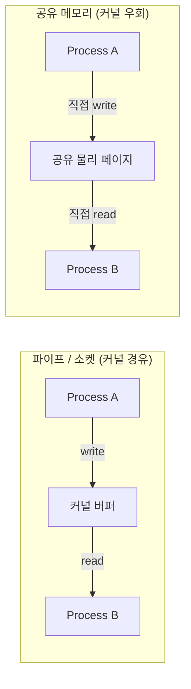

# 프로세스 간 통신

## 핵심 정의
프로세스 간 통신(Inter-Process Communication, IPC)은 메모리 공간이 격리된 서로 다른 프로세스가 데이터를 주고받거나 서로의 실행을 동기화하기 위해 운영체제가 제공하는 메커니즘의 총칭이다. [[프로세스와 스레드]]에서 다루듯 프로세스는 기본적으로 독립된 가상 주소 공간을 가지므로, 한 프로세스의 메모리를 다른 프로세스가 직접 읽거나 쓸 수 없다. IPC는 커널을 매개로 이 격리를 의도적으로 뚫어주는 통로다.

IPC는 크게 "데이터를 전달"하는 방식(파이프, 메시지 큐, 소켓, 공유 메모리)과 "상태를 통지"하는 방식(시그널, 세마포어)으로 나눌 수 있다. 어떤 방식을 쓰든 커널이 개입해 두 프로세스 사이의 주소 공간 경계를 안전하게 넘나들게 해준다는 공통점이 있다.

## 동작 원리 / 구조

### 주요 메커니즘 비교

| 메커니즘 | 통신 범위 | 특징 |
|---|---|---|
| 익명 파이프(anonymous pipe) | 상속·fd 전달로 연결한 프로세스 | 단방향 바이트 스트림, 커널 버퍼(용량 조회·조정 가능)를 경유, `fork()` 이후 파일 디스크립터 상속으로 연결 |
| 네임드 파이프(named pipe, FIFO) | 관계없는 프로세스도 가능 | 파일시스템에 이름이 존재해 무관한 프로세스가 경로로 열어 연결 |
| 메시지 큐(message queue) | 관계없는 프로세스 | 커널이 메시지 단위로 큐잉, 프로세스가 죽어도 큐는 유지됨(파이프와 차이) |
| 공유 메모리(shared memory) | 관계없는 프로세스 | 같은 물리 메모리를 여러 프로세스의 가상 주소 공간에 매핑, 설정 후 데이터 접근에서 시스템 콜·복사를 줄일 수 있지만 동기화(세마포어 등)를 애플리케이션이 직접 책임져야 함 |
| 유닉스 도메인 소켓(Unix domain socket) | 같은 호스트의 프로세스 | 파일시스템 경로로 주소를 지정하는 소켓, TCP 소켓과 API는 거의 동일하지만 루프백(loopback) TCP보다 커널 오버헤드가 적고 pathname 권한·peer credential로 접근 제어 가능 |
| 시그널(signal) | 관계없는 프로세스(권한 필요) | 비동기 이벤트 통지, 주로 상태 변화 통지; sigqueue/실시간 signal은 제한된 부가값 가능 |
| 소켓(네트워크 소켓) | 같은 호스트 또는 원격 호스트 | 표의 방식 중 원격 네트워크 통신을 직접 제공, TCP/UDP 프로토콜 스택을 거침 |

### 공유 메모리 vs 파이프의 데이터 흐름 차이



파이프/소켓은 데이터가 커널 버퍼를 한 번 거치므로(사용자 공간 → 커널 공간 → 사용자 공간) 시스템 콜과 보통 메모리 복사 비용이 든다. 모드 전환이 반드시 다른 task로의 context switch를 뜻하지 않으며 splice 등 복사 회피 경로도 있다. 공유 메모리는 두 프로세스가 같은 물리 페이지를 매핑해 놓고 커널을 거치지 않고 직접 읽고 쓰므로 복사 비용을 줄일 수 있지만, "언제 다 썼는지"를 알려주는 동기화 메커니즘(세마포어, 뮤텍스, 컨디션 변수)이 반드시 별도로 필요하다.

### Java에서의 IPC 접근

```java
// 1) ProcessBuilder + 표준 입출력 파이프 (부모-자식 IPC)
Process process = new ProcessBuilder("some-cli").start();
process.getOutputStream(); // 자식 프로세스 stdin으로 연결된 파이프

// 2) 유닉스 도메인 소켓 (JEP 380, Java 16+)
var address = UnixDomainSocketAddress.of("/tmp/app.sock");
try (var server = ServerSocketChannel.open(StandardProtocolFamily.UNIX)) {
    server.bind(address);
}

// 3) 메모리 매핑 파일 기반 IPC(유사 공유 메모리)
// fileChannel은 미리 열어둔 FileChannel, size는 매핑할 바이트 길이라고 가정
MappedByteBuffer buf = fileChannel.map(FileChannel.MapMode.READ_WRITE, 0, size);
```

JVM은 진정한 의미의 POSIX 공유 메모리(`shm_open`)를 표준 API로 직접 노출하지 않는 대신, 메모리 매핑 파일(`MappedByteBuffer`, `FileChannel.map`)로 유사한 효과를 낸다. Java 16부터는 `java.nio.channels`가 유닉스 도메인 소켓을 정식 지원해, 같은 호스트의 프로세스 간 통신에서 TCP 루프백보다 가볍고 파일 권한으로 접근 제어까지 가능한 채널을 표준 라이브러리만으로 쓸 수 있다.

Linux pipe 기본 용량은 일반적으로16페이지지만 사용자별 제한 등에 따라 낮아질 수 있어 F_GETPIPE_SZ로 확인한다. PIPE_BUF 이내 write의 원자성과 전체 pipe 용량은 별개다. UDS abstract namespace는 파일 권한을 적용하지 않으며 peer credential 등 별도 통제가 필요하다. Java mmap 파일 공유에는 표준 JVM 간 happens-before 보장이 없으므로 프로세스 간 동기화와 플랫폼 visibility 계약을 설계한다. ProcessBuilder 출력은 별도 소비 외에도 inheritIO·파일 리다이렉트 등으로 pipe 정체를 피할 수 있다.

## 실무 관점
- 마이크로서비스 간 통신은 대부분 네트워크 소켓(HTTP, gRPC) 기반이지만, 같은 호스트/파드 안의 사이드카(sidecar) 패턴에서는 유닉스 도메인 소켓을 쓰는 경우가 늘고 있다. Envoy 프록시와 애플리케이션 컨테이너를 같은 파드에 둘 때 TCP 루프백 대신 유닉스 도메인 소켓으로 연결하면 불필요한 TCP/IP 스택 오버헤드(체크섬 계산, 포트 관리)를 줄일 수 있다.
- 공유 메모리 기반 IPC는 초저지연이 필요한 시스템(고빈도 트레이딩, 실시간 로그 파이프라인)에서 쓰이지만, 동기화 버그가 나면 디버깅이 매우 어렵다. 일반적인 백엔드 서비스 개발에서는 복잡도 대비 이득이 크지 않아 잘 쓰이지 않는다.
- Redis는 unixsocket 설정을 지원한다. Kafka의 일반 클라이언트 프로토콜을 UDS로 접속할 수 있다고 일반화하지 말고 서버/드라이버 지원을 확인한다. pathname UDS는 파일 권한(chmod)·디렉터리 접근 권한과 peer credential로 로컬 접근을 통제할 수 있다. TCP 루프백보다 자동으로 안전한 것은 아니며 공유 볼륨의 권한, 소켓 파일 교체, 프로세스 인증을 설계해야 한다. abstract namespace에는 파일 권한이 적용되지 않는다.
- 흔한 실수: 파이프의 커널 버퍼가 가득 찬 상태에서 읽는 쪽이 없으면 쓰는 쪽이 블로킹되는데, 부모/자식 프로세스가 서로 상대방의 출력을 기다리며 교착상태에 빠지는 패턴(`Process.waitFor()`를 출력 스트림을 다 읽기 전에 호출)이 대표적이다. 기본 파이프를 사용하는 `ProcessBuilder`에서는 표준 출력/에러를 함께 소비하거나 리다이렉트해 버퍼 정체를 피한다. 출력 하나를 EOF까지 읽은 뒤 다른 하나를 읽는 순서도 나머지 파이프가 먼저 차면 멈출 수 있다.
- 메시지 큐(System V/POSIX message queue) 방식의 IPC는 리눅스 환경에서는 실무 백엔드보다 임베디드/시스템 프로그래밍에서 더 흔하고, 애플리케이션 레벨 메시징은 대부분 Kafka/RabbitMQ 같은 네트워크 기반 미들웨어로 대체된다.

### Java 자식 프로세스의 대기와 종료는 별개다
Java 25의 `Process.waitFor(timeout, unit)`이 `false`를 반환해도 자식은 계속 실행 중일 수 있다. `onExit()`가 반환한 `CompletableFuture`를 취소해도 프로세스는 종료되지 않는다. 외부 명령에 시간 제한을 두려면 출력 소비와 함께 별도의 종료 정책을 구현한다. 정상 종료를 요청할지, 유예 시간 뒤 `destroyForcibly()`를 사용할지 정하고 이후 `waitFor` 등으로 실제 종료를 확인한다. `destroyForcibly()` 호출 직후에도 잠시 `isAlive()`가 true일 수 있다.

자식이 stdin의 EOF를 기다리는 프로토콜이면 전송을 마친 부모가 `getOutputStream()`을 닫아야 대기가 끝난다. 부모의 `getInputStream()`은 자식 stdout이므로 방향도 구분한다. 종료·예외 경로에서 열린 스트림과 출력 소비 작업을 함께 정리하고, 종료 코드와 제한 시간 초과를 별도 결과로 남긴다. 출력 소비 자체가 무한 대기하는 경우까지 프로세스의 timed wait 하나로 해결되지는 않는다.

## 심화 Q&A

### Q. 공유 메모리가 가장 빠른데 왜 모든 IPC를 공유 메모리로 하지 않는가?
공유 메모리는 설정 후 데이터 교환에서 복사·커널 진입을 줄일 수 있지만, "누가 언제 썼는지/읽었는지"에 대한 동기화를 전적으로 애플리케이션이 책임져야 한다. 파이프나 소켓은 커널이 읽기/쓰기 순서와 블로킹을 알아서 관리해주므로(자연스러운 흐름 제어 포함) 개발이 훨씬 단순하다. 성능이 병목인 극히 일부 구간에만 공유 메모리를 쓰고, 나머지는 안전성이 검증된 파이프/소켓을 쓰는 것이 일반적인 절충이다.

### Q. 유닉스 도메인 소켓이 TCP 루프백(127.0.0.1)보다 빠른 이유는 구체적으로 무엇인가?
TCP 루프백도 물리 네트워크 인터페이스를 거치지는 않지만, 여전히 TCP/IP 프로토콜 스택(체크섬 계산, 혼잡 제어, 시퀀스 번호 관리, 포트 기반 라우팅)을 완전히 통과해야 한다. 유닉스 도메인 소켓은 파일시스템 경로로 로컬 커널 내부의 소켓 버퍼를 직접 연결하는 방식이라 이 프로토콜 스택 처리를 생략한다. 또한 파일 권한(permission bit)으로 접근을 제어할 수 있어 포트 스캔이나 다른 사용자의 접근을 막기도 쉽다.

### Q. 파이프와 메시지 큐는 둘 다 커널 버퍼를 쓰는데 언제 메시지 큐를 선택하는가?
파이프는 바이트 스트림이라 메시지 경계가 없어 수신 측이 직접 구분자를 파싱해야 하고, 모든 참조 fd가 닫히면 익명 파이프가 사라지며, 모든 writer가 닫힌 뒤 버퍼를 비우면 reader가 EOF를 본다. 메시지 큐는 커널이 메시지 단위(경계 유지)로 관리하고, 큐 자체가 커널 객체로 독립적으로 존재해 생산자/소비자 프로세스가 각자 다른 시점에 뜨고 죽어도 큐에 쌓인 메시지가 유지된다. 다만 이런 지속성과 재부팅 후 내구성·브로드캐스트·재시도 같은 요구가 있다면 실무에서는 커널 메시지 큐보다 Kafka/RabbitMQ 같은 네트워크 기반 메시지 브로커를 쓰는 것이 훨씬 일반적이다.

### Q. `fork()` 이후 부모/자식이 파일 디스크립터를 공유한다는 것이 IPC에 어떤 의미를 갖는가?
`fork()`는 자식 프로세스에 부모의 열린 파일 디스크립터 테이블을 복사하는데, 이때 파이프처럼 이미 열려 있는 디스크립터도 함께 복사되어 부모와 자식이 같은 커널 파이프 객체를 가리키게 된다. 이 덕분에 파이프를 만든 뒤 `fork()`만 하면 별도의 이름이나 주소 없이도 부모-자식 간 통신 채널이 자동으로 열린다. 반대로 관계없는 프로세스끼리는 이 상속 경로가 없으므로 네임드 파이프, 메시지 큐, 소켓처럼 이름/주소로 찾아갈 수 있는 IPC가 필요하다.

### Q. 컨테이너 환경(도커/쿠버네티스)에서 IPC는 기본적으로 왜 격리되어 있는가?
리눅스 IPC namespace는 System V IPC와 POSIX message queue를 격리한다. Docker의 기본 개별 컨테이너와 Kubernetes Pod 모델은 다르며 같은 Pod의 컨테이너는 IPC namespace를 공유한다. shareProcessNamespace는 PID namespace 설정으로 IPC 공유 스위치가 아니다. pathname UDS나 파일 mmap에는 동일 경로를 볼 수 있는 볼륨 공유·파일 권한을 별도 구성한다. POSIX shm의 /dev/shm 가시성도 mount 구성을 확인한다.

### Q. 시그널은 왜 "데이터 전달"이 아니라 "통지" 전용으로 설계되었는가?
시그널은 비동기적으로 아무 때나 프로세스 실행을 인터럽트해 전달되므로, 임의의 크기의 데이터를 안전하게 실어 보내려면 수신 측이 어느 실행 지점에서든 그 데이터를 처리할 준비가 되어 있어야 하는데 이는 비현실적이다. 그래서 시그널은 정수 번호(SIGTERM, SIGKILL 등)와 최소한의 부가 정보만 전달하도록 제한되어 있고, 실제 데이터 교환이 필요하면 시그널로 "이벤트가 발생했다"는 사실만 알리고 뒤이어 파이프/소켓/공유 메모리로 데이터를 주고받는 조합이 일반적이다.

## 관련 개념
- [[프로세스와 스레드]]
- [[시스템 콜과 인터럽트]]
- [[교착상태]]
- [[Pub-Sub와 Point-to-Point]]

## 참고 자료

- [Linux pipe(7)](https://man7.org/linux/man-pages/man7/pipe.7.html) — 용량·PIPE_BUF·EOF. 확인: 2026-09-08.
- [Linux unix(7)](https://man7.org/linux/man-pages/man7/unix.7.html) — pathname/abstract·SCM_RIGHTS. 확인: 2026-09-08.
- [Linux signal(7)](https://man7.org/linux/man-pages/man7/signal.7.html) — 실시간signal·sigqueue. 확인: 2026-09-08.
- [Linux ipc_namespaces(7)](https://man7.org/linux/man-pages/man7/ipc_namespaces.7.html) — SystemV/POSIX 큐 namespace. 확인: 2026-09-08.
- [Kubernetes Pods](https://kubernetes.io/docs/concepts/workloads/pods/) — Pod 내IPC namespace 공유. 확인: 2026-09-08.
- [JDK25 MappedByteBuffer](https://docs.oracle.com/en/java/javase/25/docs/api/java.base/java/nio/MappedByteBuffer.html) — 다른프로세스변경 visibility·force 범위. 확인: 2026-09-08.

부분 재검증: 2026-09-22. [Linux unix(7)](https://man7.org/linux/man-pages/man7/unix.7.html)의 pathname 권한·abstract namespace·peer credential을 확인했다. UDS 보안을 전송 방식만으로 일반화하던 표현과 공유 메모리 성능의 절대 표현을 조정했다. 다른 IPC·컨테이너 계약은 기존 검증 날짜를 유지한다.

부분 재검증: 2026-10-04. 아래 적용 버전과 확인 범위에 한하며 노트 전체의 기존 verified는 유지한다.

- [Java SE 25 Process](https://docs.oracle.com/en/java/javase/25/docs/api/java.base/java/lang/Process.html), [Linux pipe(7)](https://man7.org/linux/man-pages/man7/pipe.7.html) — timed wait·onExit 취소·강제 종료 후 대기·파이프 EOF. Oracle JDK 25.0.4 macOS AArch64에서 직접 생성한 Java 자식의 wait timeout 후 생존, onExit 취소 후 생존, 부모 stdin 파이프 닫기 후 정상 종료, destroyForcibly 후 종료 대기를 확인했다. Linux pipe 포화·프로세스 트리 전체 종료는 재현하지 않았다.
