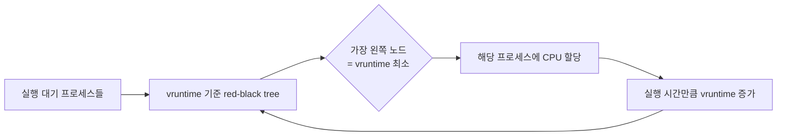

# CPU 스케줄링

## 핵심 정의
CPU 스케줄링(CPU scheduling)은 실행 준비가 된 여러 프로세스/스레드 중 어떤 것에게 CPU를 할당할지 결정하는 운영체제의 정책과 메커니즘이다. 목표는 CPU 활용률, 처리량(throughput), 응답 시간(response time), 대기 시간(waiting time), 공정성(fairness) 등 서로 상충하는 지표를 상황에 맞게 균형 있게 최적화하는 것이다.

스케줄링은 크게 선점형(preemptive, 실행 중인 프로세스를 강제로 중단시킬 수 있음)과 비선점형(non-preemptive, 스스로 CPU를 반납할 때까지 기다림)으로 나뉘며, 현대 범용 OS(Linux, Windows)는 대부분 선점형 스케줄링을 사용한다.

## 동작 원리 / 구조

### 주요 스케줄링 알고리즘

| 알고리즘 | 방식 | 특징 |
|---|---|---|
| FCFS (First-Come First-Served) | 도착 순서대로 처리 | 구현 단순, convoy effect(짧은 작업이 긴 작업 뒤에서 대기) 발생 |
| SJF (Shortest Job First) | 실행 시간이 짧은 작업 우선 | 동시 도착·burst 길이 기지 등 가정에서 평균 대기 시간 최소화, 실행 시간 예측 필요, 기아(starvation) 가능 |
| Round Robin | 고정된 타임 슬라이스(time quantum)만큼 순환 할당 | 준비 큐에 순환 실행 기회 제공, 타임 슬라이스가 너무 작으면 컨텍스트 스위칭 오버헤드 증가, 너무 크면 FCFS와 유사해짐 |
| Priority Scheduling | 우선순위가 높은 프로세스 우선 | 우선순위 역전(priority inversion), 낮은 우선순위 기아 문제 → 에이징(aging)으로 보완 |
| Multilevel Feedback Queue | 여러 큐를 두고 CPU 사용 패턴에 따라 큐 간 이동 | CPU 바운드/I/O 바운드를 동적으로 구분해 처리, 대표적인 교육·설계 모델; OS별 구현 상이 |
| CFS (Completely Fair Scheduler) | Linux의 이전 fair scheduler, vruntime(가상 실행 시간) 기준 red-black tree로 관리 | 각 프로세스가 "공정한 몫"의 CPU 시간을 받도록 vruntime이 가장 작은 프로세스를 선택 |

### Linux CFS와 EEVDF

CFS는 nice 값(우선순위, -20~19)에 따라 가중치를 부여해 vruntime 증가 속도를 조절한다. nice 값이 낮을수록(우선순위 높음) vruntime이 천천히 증가해 더 자주 선택된다.

### 스케줄링 지표
- Turnaround time = 완료 시각 − 도착 시각
- Waiting time = Turnaround time − CPU 실행 시간 − I/O 등 blocked 시간(단일 CPU burst·I/O 없음 모델이면 burst만 뺌)
- Response time = 첫 실행 시작 시각 − 도착 시각

위 그림은 이전 CFS 선택 모델이다. Linux 6.6부터 fair class에 EEVDF(Earliest Eligible Virtual Deadline First) 기반 선택이 도입되었고 이후 세부 정책이 발전하고 있다. EEVDF는 CPU 몫을 덜 받은 eligible task 중 virtual deadline이 빠른 task를 선택해 공정성과 지연을 함께 다룬다. nice 가중치·per-CPU runqueue·bandwidth 제어 개념은 계속 쓰이며 CFS 설명을 최신 task 선택 규칙과 혼동하지 않는다. Linux에는 fair 외에도 FIFO/RR/DEADLINE 등 정책이 있어 nice만으로 모든 task의 실행 순서를 설명할 수 없다.

## 실무 관점
- 애플리케이션 개발자가 OS 스케줄러 알고리즘을 직접 바꿀 일은 거의 없지만, **스레드 우선순위 설정, 컨테이너 CPU 쿼터(cgroup) 설정, 스레드 풀 크기**를 통해 사실상 스케줄링에 영향을 준다.
- 컨테이너 환경(쿠버네티스)에서 resources.limits.cpu을 너무 낮게 잡으면 CFS bandwidth controller에 의해 스로틀링(throttling)되어, CPU 사용률 그래프상으로는 여유가 있어 보여도 애플리케이션 레이턴시가 튀는 현상이 발생한다. 이는 실무에서 흔히 겪는 "CPU는 안 바쁜데 응답이 느린" 장애의 대표 원인 중 하나다.
- Java 애플리케이션에서 GC 스레드나 JIT 컴파일 스레드가 애플리케이션 스레드와 CPU를 경쟁하면 응답 시간 튐(jitter)이 발생할 수 있다. 컨테이너의 CPU 코어 수를 낮게 잡았는데 JVM이 호스트의 전체 코어 수를 오인식(구버전 JVM/컨테이너 인식 이슈)해 GC 스레드 수를 과도하게 설정하는 문제가 과거에 있었다(최신 JVM은 cgroup 인식 개선으로 대부분 해결됨).
- 우선순위 역전(priority inversion) 사례: 낮은 우선순위 스레드가 락을 잡고 있는데 높은 우선순위 스레드가 그 락을 기다리며 중간 우선순위 스레드에게 계속 CPU를 뺏기는 상황. 이를 막기 위한 기법이 우선순위 상속(priority inheritance)이다.

## 심화 Q&A

### Q. Round Robin에서 타임 슬라이스(time quantum)를 어떻게 정해야 하는가?
너무 작으면 컨텍스트 스위칭 오버헤드가 지배적이 되어 처리량이 떨어지고, 너무 크면 응답 시간이 나빠져 사실상 FCFS와 비슷해진다. 작업 길이 분포·응답 목표·전환 비용을 함께 측정해 결정한다. 모든 OS에 공통인 고정 비율 가이드는 없다.

### Q. SJF가 이론적으로 평균 대기 시간이 최적인데 왜 범용 OS는 그대로 쓰지 않는가?
SJF는 각 프로세스의 향후 실행 시간(burst time)을 미리 알아야 하는데 이는 일반적으로 예측 불가능하다(과거 실행 패턴으로 추정하는 근사 방식은 있지만 정확도가 낮다). 또한 짧은 작업이 계속 들어오면 긴 작업이 무한정 밀리는 기아 문제가 발생해 공정성이 깨진다.

### Q. Linux CFS는 "우선순위 스케줄링"과 어떻게 다른가?
전통적 우선순위 스케줄링은 우선순위가 낮으면 아예 실행 기회를 못 받을 수 있는 반면, CFS는 nice 값을 가중치로만 사용해 vruntime 증가 속도를 조절할 뿐 모든 프로세스가 결국 CPU 시간을 나눠 받는다. 즉 CFS는 "완전히 배제"가 아니라 "공정한 비율 분배"를 지향한다.

### Q. 멀티코어 환경에서 스케줄링은 단일 큐 방식보다 왜 코어별 큐(per-CPU run queue)를 선호하는가?
단일 큐를 모든 코어가 공유하면 큐 접근 시 락 경합(lock contention)이 심해지고, 프로세스가 매번 다른 코어로 옮겨 다니며 CPU 캐시 지역성이 깨진다. 코어별 큐를 두고 필요할 때만 로드 밸런싱(work stealing 등)으로 작업을 옮기면 캐시 친화성과 확장성을 동시에 얻을 수 있다. Linux CFS도 코어별 red-black tree를 두는 구조다.

### Q. 컨테이너의 CPU 쿼터 스로틀링과 OS 레벨 스케줄링 지연은 어떻게 구분해서 진단하는가?
컨테이너 스로틀링은 cgroup의 cpu.stat(v2: nr_throttled·throttled_usec, v1: throttled_time)으로 확인 가능하며, 실제 코어가 남아 있어도 할당된 쿼터를 다 써서 인위적으로 멈춰지는 것이다. 반면 OS 레벨 스케줄링 지연은 실행 대기 큐 길이(run queue length, `vmstat`의 `r` 컬럼)나 `sar -q`로 확인하며 CPU 경합·affinity·priority·cgroup 계층 등으로 실행을 기다리는 상황이다. 단순한 물리 코어 부족만으로 단정하지 않는다. 전자는 쿼터·병렬도·상위 cgroup 제한을, 후자는 CPU 경합·affinity·우선순위·대기열을 확인한다. 스케일 아웃만으로 상위 쿼터나 잘못된 affinity가 해결되지는 않는다.

### Q. 우선순위 역전을 애플리케이션 레벨(예: Java 락)에서는 어떻게 완화하는가?
OS 레벨의 우선순위 상속과 달리 JVM 레벨 락(`synchronized`, `ReentrantLock`)은 기본적으로 우선순위 상속을 지원하지 않는다. 실무에서는 스레드 우선순위 자체를 세밀하게 나누지 않고 동일하게 두거나, 락을 잡는 임계 구역을 최소화해 역전이 발생할 여지 자체를 줄이는 방식으로 대응한다.

### Q. CPU limit가 1이면 항상 코어 하나에서만 실행되는가?
A. CPU 대역폭 한도와 CPU 배치 제한은 다르다. 예를 들어 `cpu.max = 100000 100000`은 주기당 합산 CPU 시간 예산을 뜻한다. cpuset이 여러 CPU를 허용하면 여러 스레드가 병렬로 예산을 빠르게 소비하고, 남은 주기에는 스로틀링될 수 있다. 순간 병렬도와 평균 CPU 한도를 혼동하지 않는다. 상위 cgroup의 예산 소진도 하위 작업을 멈출 수 있다.

EEVDF의 가상 마감 시각(virtual deadline)은 실시간 완료 보장이나 `SCHED_DEADLINE` 정책과 다르다. fair class 안에서 실행 대상을 고르는 기준이며, 자격(lag ≥ 0)이 있는 작업 중 마감 시각이 빠른 작업을 고른다.

## 관련 개념
- [[프로세스와 스레드]]
- [[교착상태]]

## 참고 자료

- [Linux EEVDF](https://docs.kernel.org/scheduler/sched-eevdf.html) — Linux6.6부터 fair scheduler 전환. 확인: 2026-09-08.
- [Linux CFS](https://docs.kernel.org/scheduler/sched-design-CFS.html) — 이전 vruntime 기반 선택 구조. 확인: 2026-09-08.
- [Linux cgroup v2](https://docs.kernel.org/admin-guide/cgroup-v2.html) — cpu.max·cpu.stat·throttled_usec. 확인: 2026-09-08.
- [Linux sched(7)](https://man7.org/linux/man-pages/man7/sched.7.html) — 정책·nice·실시간 스케줄링. 확인: 2026-09-08.
- [OSTEP CPU Scheduling](https://pages.cs.wisc.edu/~remzi/OSTEP/cpu-sched.pdf) — SJF 전제·response/turnaround·RR. 확인: 2026-09-08.

### 2026-09-23 부분 재검증

Linux 커널 EEVDF·CFS bandwidth 및 cgroup v2 문서의 가상 마감·CPU 시간 예산·계층적 제한을 확인했다. EEVDF 도입 범위는 Linux 6.6 이후이며 배포 커널의 세부 패치는 별도 확인 대상이다. 기존 전체 검증일은 유지한다.

- [Linux CFS Bandwidth Control](https://docs.kernel.org/scheduler/sched-bwc.html) — 다중 CPU에서 합산 쿼터 소비·계층적 throttle; 파일명 예시는 v1이고 본문의 cpu.max는 v2.
