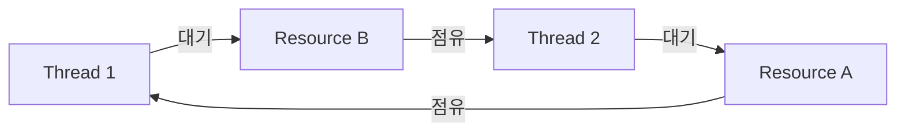

# 교착상태

## 핵심 정의
교착상태(deadlock)는 여러 프로세스/스레드가 서로의 자원을, 또는 하나의 실행 흐름이 자신이 재획득할 수 없는 자원을 기다리며 무한정 대기해, 어느 쪽도 더 이상 진행하지 못하는 상태다. 자원에는 락, 커넥션, 파일 핸들, 세마포어 등 배타적으로 점유되는 모든 것이 포함된다.

교착상태가 성립하려면 아래 4가지 필요조건(코프만 조건, Coffman conditions)이 동시에 만족되어야 한다.
1. 상호 배제(mutual exclusion) - 자원을 한 번에 하나의 프로세스만 사용 가능
2. 점유 대기(hold and wait) - 자원을 점유한 채로 다른 자원을 추가로 기다림
3. 비선점(no preemption) - 자원을 강제로 뺏을 수 없고 점유자가 스스로 반납해야 함
4. 순환 대기(circular wait) - 프로세스들이 원형으로 서로의 자원을 기다림

## 동작 원리 / 구조

### 순환 대기 예시



Thread 1은 Resource A를 잡고 B를 기다리고, Thread 2는 B를 잡고 A를 기다리는 전형적인 순환 대기 구조다.

### Java 코드로 본 전형적인 교착상태

```java
// Thread 1: lockA -> lockB 순서로 획득
synchronized (lockA) {
    Thread.sleep(50);
    synchronized (lockB) { /* ... */ }
}

// Thread 2: lockB -> lockA 순서로 획득 (반대 순서!)
synchronized (lockB) {
    Thread.sleep(50);
    synchronized (lockA) { /* ... */ }
}
```
두 스레드가 락을 서로 다른 순서로 획득하면 순환 대기가 성립할 수 있다.

### 탐지/처리 전략 비교

| 전략 | 방식 | 트레이드오프 |
|---|---|---|
| 예방(prevention) | 코프만 조건 중 하나를 원천 차단(예: 락 순서 고정으로 순환 대기 제거) | 설계 복잡도 증가, 처리량 저하 가능 |
| 회피(avoidance) | 은행원 알고리즘(Banker's Algorithm) 등으로 안전 상태(safe state)만 허용 | 자원 요구량을 미리 알아야 해 현실 적용이 제한적 |
| 탐지 후 회복(detection & recovery) | 대기 관계를 분석해 교착을 판정한 뒤 프로세스 강제 종료/롤백 | 탐지 오버헤드, 강제 종료로 인한 부작용 |
| 무시(ostrich algorithm) | 발생 빈도가 낮으면 그냥 방치하고 재시작으로 대응 | 범용 OS가 모든 사용자 락의 교착을 일괄 해결하지 않는다는 의미; 커널 진단·DB 탐지와는 별개 |

코프만 조건은 전통적인 재사용 가능 자원 모델의 필요조건이며, 자원 종류당 여러 instance가 있으면 자원 할당 그래프의 cycle만으로 교착을 확정할 수 없다. 예제는 별도 두 스레드의 코드 발췌로 lock 정의와 InterruptedException 처리가 필요하며 sleep은 교착을 보장하지 않는다. Java ThreadMXBean의 deadlock 탐지는 플랫폼 스레드 monitor/ownable synchronizer 범위이며 가상 스레드·커넥션 풀·분산 대기를 모두 찾지 못한다. DB retry는 새 transaction에서 전체 작업을 재실행하고 외부 부작용의 멱등성을 확인한다. 트랜잭션 timeout이 Java monitor 대기나 모든 원격 작업을 즉시 중단시키지는 않는다.

## 실무 관점
- DB 트랜잭션 교착상태가 실무에서 가장 흔하다. 예: 트랜잭션 A가 row 1을 잠그고 row 2를 기다리는데, 트랜잭션 B가 row 2를 잠그고 row 1을 기다리는 경우. MySQL InnoDB나 PostgreSQL 등은 자체적으로 데드락 탐지기를 두어 한쪽 트랜잭션을 강제 롤백(제품별 deadlock 예외)시킨다. 애플리케이션은 이 예외를 잡아 재시도(retry) 로직을 두는 것이 일반적 대응이다.
- 예방 관점에서 가장 실용적인 규칙은 **락(또는 DB row) 획득 순서를 코드 전체에서 일관되게 정렬**하는 것이다. 예를 들어 계좌 이체 로직에서 두 계좌를 잠글 때 항상 ID가 작은 계좌부터 잠그도록 강제하면 순환 대기 자체가 발생하지 않는다.
- 분산 환경(마이크로서비스, 분산 락)에서는 자원 할당 그래프를 한눈에 볼 수 없어 탐지가 더 어렵다. Redis 기반 분산 락(Redlock 등)이나 DB 락을 여러 서비스가 함께 쓸 때는 타임아웃을 반드시 설정해, 교착상태를 회복 불가능하게 만들지 말고 일정 시간 후 강제로 실패시키는 방식(락 획득 타임아웃, `@Transactional` 타임아웃)으로 완화한다.
- 커넥션 풀 교착상태도 흔한 패턴이다. 하나의 트랜잭션 안에서 커넥션 풀에서 커넥션을 두 개 이상 얻으려 하는데 풀이 가득 찬 경우, 모든 스레드가 서로 커넥션을 기다리며 멈추는 상황이 발생할 수 있다. HikariCP 등은 `connectionTimeout`을 설정해 무한 대기를 막는다.
- 진단 도구: `jstack`(Java 지원되는 플랫폼 스레드 락 사이클은 Found one Java-level deadlock 등으로 확인 가능), `SHOW ENGINE INNODB STATUS`(MySQL 데드락 로그), 분산 환경은 락 타임아웃 로그와 트레이싱(APM)으로 추적한다.

## 심화 Q&A

### Q. 코프만 조건 4가지 중 실무에서 가장 깨기 쉬운 조건은 무엇이고 왜인가?
순환 대기(circular wait)가 가장 실용적으로 깨기 쉽다. 상호 배제는 자원의 본질상 없앨 수 없는 경우가 많고(락이 필요한 이유 자체), 비선점을 깨려면 자원의 강제 회수와 복구가 가능해야 하며, 점유 대기를 없애려면 필요한 자원을 한 번에 모두 획득해야 해 설계가 크게 바뀐다. 반면 순환 대기는 자원 획득 순서를 전역적으로 정렬하는 규칙만으로 제거할 수 있어 코드 변경 비용이 가장 낮다.

### Q. `tryLock`으로 타임아웃을 두는 것이 교착상태를 "해결"한다고 볼 수 있는가?
엄밀히는 예방이 아니라 회복(recovery)에 가깝다. 순환 대기 자체는 여전히 발생할 수 있지만, 일정 시간 안에 락을 못 얻으면 스스로 포기하고 이미 잡은 자원을 자발적으로 반납하는 방식이다. 다른 소유자의 락을 선점하는 것은 아니며 timeout 처리에서 반납하지 않으면 해결되지 않는다. 데드락을 원천 차단하지는 못해도 시스템이 영구적으로 멈추는 것은 막아준다는 점에서 실무적으로 널리 쓰인다.

### Q. 은행원 알고리즘(Banker's Algorithm)이 이론적으로는 우수한데 실제 OS/애플리케이션에서 거의 안 쓰이는 이유는?
각 프로세스가 앞으로 요구할 최대 자원량을 미리 선언해야 안전 상태 판단이 가능한데, 현실의 애플리케이션은 실행 중 동적으로 자원 요구가 바뀌는 경우가 대부분이라 사전 선언 자체가 불가능하거나 부정확하다. 또한 프로세스 수와 자원 종류가 많아지면 안전성 검사 알고리즘의 계산 비용도 커진다.

### Q. 데드락(deadlock)과 라이브락(livelock), 기아(starvation)는 어떻게 구분하는가?
데드락은 관련된 스레드들이 아예 멈춰서 상태 변화가 없는 것이고, 라이브락은 스레드들이 계속 실행되며 상태를 바꾸지만(예: 서로 양보만 반복) 실질적인 진행이 없는 것이다. 기아는 특정 스레드가 자원을 얻을 자격은 있지만 스케줄링/우선순위 문제로 계속 뒤로 밀려 진행이 안 되는 것으로, 반드시 순환 대기가 필요하지는 않다. 세 가지 모두 "진행이 안 된다"는 공통점이 있지만 원인과 해결책이 다르다.

### Q. 분산 락에서 교착상태 탐지가 단일 프로세스보다 훨씬 어려운 이유는?
단일 프로세스/단일 머신에서는 자원 할당 그래프를 메모리 안에서 전역적으로 파악할 수 있지만, 분산 환경에서는 각 노드가 자신이 아는 부분 그래프만 가지고 있어 전체 사이클을 보려면 노드 간 통신(예: edge-chasing 알고리즘)이 필요하고 네트워크 지연/장애로 정보가 항상 최신이 아니다. 그래서 실무에서는 정밀 탐지 대신 타임아웃 기반의 낙관적 회복 전략을 주로 쓴다.

### Q. DB 데드락이 발생했을 때 애플리케이션이 무조건 재시도하면 되는가?
아니다. DB가 자동으로 한쪽 트랜잭션을 롤백시켜주므로 재시도 자체는 합리적이지만, 재시도 로직 없이 예외를 그대로 전파하면 사용자 요청이 실패한다. 다만 무조건적인 즉시 재시도는 같은 락 경합 패턴을 다시 유발해 재차 데드락이 날 수 있으므로, 지수 백오프(exponential backoff)나 지터(jitter)를 섞어 재시도 타이밍을 분산시키는 것이 안전하다. 근본적으로는 락 획득 순서를 정렬해 데드락 발생 빈도 자체를 줄이는 것이 우선이다.

### Q. 락 사이클이 없는데 고정 스레드 풀의 모든 작업이 멈출 수 있는가?
A. 부모 작업들이 워커를 모두 점유한 채 같은 풀에 제출한 자식 Future.get을 기다리면, 자식이 실행될 슬롯이 없어 진행하지 못한다. 이는 락 순서만으로 해결되지 않는 실행 자원 의존성이다. 동기 대기를 제거해 작업을 조합하거나 실행 경계를 나누고 동시성 한도를 설계한다. 풀을 조금 늘리는 것은 다음 부하에서 같은 구조가 재발할 수 있다.

### Q. 재진입 가능한 읽기/쓰기 락이면 읽기에서 쓰기로도 바로 승격되는가?
A. Java SE 25 ReentrantReadWriteLock은 읽기 락을 보유한 채 쓰기 락 획득을 시도하는 승격을 지원하지 않는다. 읽기 락을 놓고 쓰기 락을 얻은 후 보호 조건을 다시 검사해야 한다. 반대로 쓰기를 보유한 채 읽기를 얻고 쓰기를 놓는 하향 전환은 가능하다. 재진입 가능성과 모드 전환 가능성은 별개다.

## 관련 개념
- [[프로세스와 스레드]]
- [[CPU 스케줄링]]

## 참고 자료

- [OSTEP Concurrency bugs](https://pages.cs.wisc.edu/~remzi/OSTEP/threads-bugs.pdf) — Coffman·ordering·trylock·livelock. 확인: 2026-09-08.
- [JDK25 ThreadMXBean](https://docs.oracle.com/en/java/javase/25/docs/api/java.management/java/lang/management/ThreadMXBean.html) — platform thread deadlock 탐지 범위. 확인: 2026-09-08.
- [JDK25 ReentrantLock](https://docs.oracle.com/en/java/javase/25/docs/api/java.base/java/util/concurrent/locks/ReentrantLock.html) — timed tryLock·unlock. 확인: 2026-09-08.
- [PostgreSQL18 Explicit locking](https://www.postgresql.org/docs/18/explicit-locking.html) — deadlock victim rollback·재시도. 확인: 2026-09-08.

### 2026-09-23 부분 재검증

Java SE 25 ThreadPoolExecutor의 내부 의존 작업·큐 정책과 ReentrantReadWriteLock의 승격 금지·하향 전환 계약을 확인했다. 기존 전체 검증일은 유지한다.

- [Java SE 25 ThreadPoolExecutor](https://docs.oracle.com/en/java/javase/25/docs/api/java.base/java/util/concurrent/ThreadPoolExecutor.html) — 작업 의존성과 큐 정책.
- [Java SE 25 ReentrantReadWriteLock](https://docs.oracle.com/en/java/javase/25/docs/api/java.base/java/util/concurrent/locks/ReentrantReadWriteLock.html) — reader→writer 승격 불가·downgrade.
