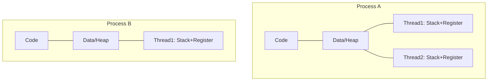

# 프로세스와 스레드

## 핵심 정의
프로세스(process)는 운영체제가 자원을 할당하는 기본 단위로, 독립된 주소 공간(코드/데이터/힙/스택), 파일 디스크립터, 시그널 핸들러 등을 소유한 실행 중인 프로그램의 인스턴스다. 스레드(thread)는 하나의 프로세스 안에서 실행되는 흐름의 단위로, 같은 프로세스 내 스레드들은 코드/데이터/힙 영역과 파일 디스크립터를 공유하고 스택·레지스터(프로그램 카운터 등), 스레드 ID·시그널 마스크·스레드 로컬 저장소 등을 개별적으로 가진다. 스택도 같은 주소 공간에 있으므로 다른 스레드에서 접근 자체가 차단되는 것은 아니다.

프로세스는 자원 격리 단위, 스레드는 실행(스케줄링) 단위라고 구분하면 이해하기 쉽다. 한 프로세스에는 최소 하나의 스레드(메인 스레드)가 존재하며, 멀티스레드 프로그램은 하나의 프로세스 안에 여러 실행 흐름을 두어 자원을 공유하면서 병렬성/동시성을 얻는다.

## 동작 원리 / 구조

### 메모리 관점 비교



- 프로세스 간에는 기본적으로 메모리가 격리되어 있어 서로 직접 접근할 수 없고, IPC(파이프, 소켓, 공유 메모리, 메시지 큐 등)로만 통신한다.
- 같은 프로세스의 스레드들은 힙/전역 변수를 공유하므로 통신은 쉽지만, 동시 접근 시 race condition을 막기 위한 동기화(lock, synchronized, volatile 등)가 필요하다.

### 컨텍스트 스위칭 비용
- 프로세스 전환: 주소 공간 전환 비용이 추가될 수 있다. PCID/ASID 등으로 TLB 엔트리를 유지할 수 있어 항상 전체 TLB를 비우는 것은 아니다.
- 스레드 전환(같은 프로세스 내): 주소 공간을 공유하므로 주소 공간 전환을 피하지만 레지스터·커널 상태 저장과 cache locality 손실은 남는다.
- 커널 스레드 vs 사용자 스레드: 커널 스레드는 OS 스케줄러가 직접 관리(1:1 모델)하고, 사용자 스레드는 런타임이 다수의 사용자 스레드를 소수의 커널 스레드에 매핑(M:N 모델)해 컨텍스트 스위칭 비용을 줄인다.

### Java의 스레드 모델
Java의 전통적인 `Thread`는 OS 네이티브 스레드(플랫폼 스레드, platform thread)를 1:1로 감싼 것으로, 스택 예약량은 JDK·OS·아키텍처·-Xss에 따라 달라지며 예약 주소 공간과 실제 resident memory도 다르고 생성/컨텍스트 스위칭 비용이 크다. Java 21(JEP 444)에서 정식 도입된 가상 스레드(virtual thread)는 JVM이 관리하는 경량 스레드로, 소수의 캐리어 스레드(carrier thread) 위에 수천~수백만 개를 얹어 M:N으로 스케줄링한다. 블로킹 I/O를 만나면 가상 스레드는 캐리어 스레드에서 언마운트(unmount)되어 다른 가상 스레드가 그 캐리어를 쓸 수 있게 하고, I/O가 끝나면 다시 마운트된다. 단, `synchronized` 블록이나 네이티브 메서드 안에서는 캐리어 스레드에 고정(pinning)되는 문제가 있었는데, JDK 24(JEP 491)에서 `synchronized` 관련 피닝이 크게 개선되었다.

```java
// 가상 스레드 생성 (Java 21+)
Thread.startVirtualThread(() -> {
    // 지원되는 블로킹 I/O는 대기 중 carrier를 양보할 수 있음
    callBlockingApi();
});
```

JDK24의 JEP491은 synchronized로 인한 가상 스레드 pinning을 제거했다. 최신 JDK에서도 native/foreign 호출 등 별도 제약과 synchronized 자체의 직렬화는 남는다. CPU-bound 스레드 수는 물리/논리 코어·cgroup quota·작업 특성에 맞춰 측정하며 무조건 코어 수와 같아야 하는 규칙은 아니다. Java 예제의 callBlockingApi는 설명용 사용자 메서드다.

## 실무 관점
- Spring MVC의 일반적인 Tomcat 플랫폼 스레드 구성은 요청 처리에 worker를 할당한다. 최대 worker 수는 동시에 실행하는 blocking handler의 한도이며 연결 수·큐·비동기 요청·WebFlux·가상 스레드 구성과 구분한다. I/O 대기가 긴 워크로드에서는 이 한계가 병목이 되어, 가상 스레드나 리액티브 스택(WebFlux)을 검토하게 된다.
- 프로세스 기반 격리(예: 별도 컨테이너/JVM 프로세스로 배포)는 장애 격리(주소 공간의 오류 전파를 줄임; 공유 자원·의존 서비스 장애는 전파 가능)에 유리하지만 배포/자원 오버헤드가 크고, 스레드 기반 확장은 가볍지만 하나의 버그(예: 무한루프, 메모리 누수)가 전체 프로세스에 영향을 준다.
- 흔한 장애 패턴: 공유 자원(캐시, 커넥션 풀, static 변수)에 대한 동기화 누락으로 인한 race condition, 스레드 풀 고갈(모든 스레드가 외부 API 응답을 블로킹 대기)로 인한 전체 서비스 지연, `ThreadLocal` 미정리로 인한 스레드 풀 재사용 시 데이터 오염(특히 톰캣 스레드 풀에서 요청 간 컨텍스트 누수).
- 튜닝 포인트: 톰캣 `server.tomcat.threads.max`, HikariCP maximumPoolSize(DB 처리 용량과 transaction 시간에 맞춤; 작은 풀도 대기/고갈 가능), 가상 스레드 사용 시 `spring.threads.virtual.enabled=true`(Spring Boot 3.2+, Java 21+ 전제).

### fork 뒤에 분리되는 것과 남는 공유
Linux `fork()`의 자식은 별도 주소 공간과 파일 디스크립터 테이블을 갖지만, 복사된 각 디스크립터는 부모와 같은 열린 파일 상태(open file description)을 가리킨다. 따라서 파일 오프셋과 파일 상태 플래그는 공유될 수 있다. 프로세스가 다르다는 이유만으로 상속한 파일을 각자 독립적인 위치에서 읽는다고 가정하지 않는다. 파이프 끝의 불필요한 디스크립터를 닫지 않으면 EOF도 지연될 수 있다([[프로세스 간 통신]]).

멀티스레드 프로세스가 `fork()`하면 자식에는 호출 스레드만 남고, 다른 스레드가 잠근 뮤텍스의 메모리 상태는 복사된다. 잠금을 풀던 스레드는 자식에 없으므로 그 락을 사용하는 라이브러리 호출이 멈출 수 있다. Linux/POSIX 규칙상 자식은 `execve()` 전까지 비동기 시그널 안전(async-signal-safe) 함수만 호출해야 한다. 이는 직접 네이티브 fork를 다룰 때의 규칙이며, Java `ProcessBuilder`가 모든 플랫폼에서 단순 fork로 구현된다는 뜻은 아니다.

## 심화 Q&A

### Q. 가상 스레드를 도입하면 커넥션 풀 크기도 늘려야 할까?
아니다. 가상 스레드는 블로킹 I/O 대기의 스레드 점유 비용을 줄일 뿐, DB 커넥션처럼 물리적으로 제한된 자원의 개수를 늘려주지 않는다. 오히려 동시에 실행되는 가상 스레드 수가 폭증하면 DB 커넥션 풀이나 외부 API의 동시 연결 제한에 먼저 부딪히므로, 세마포어나 커넥션 풀 크기로 별도 동시성 제어가 필요하다.

### Q. 멀티프로세스와 멀티스레드 중 어떤 것이 항상 더 안전한가?
정답은 없고 트레이드오프다. 멀티프로세스는 메모리 격리 덕분에 한 프로세스의 크래시가 다른 프로세스에 전파되지 않아 안정성이 높지만, IPC 오버헤드와 배포 복잡도가 커진다. 멀티스레드는 자원 공유로 효율적이지만 동기화 실수 하나가 프로세스 전체를 오염시킬 수 있다. Nginx가 워커 프로세스 모델을, 대부분의 WAS가 스레드 풀 모델을 쓰는 이유가 각각 다르다.

### Q. Java에서 `synchronized`로 가상 스레드를 막으면 왜 문제가 되는가?
JDK21–23에서는 가상 스레드가 synchronized 블록에 진입한 상태에서 블로킹 I/O를 만나면 언마운트되지 못하고 캐리어 스레드를 계속 점유(pinning)한다. 캐리어 스레드 수는 보통 CPU 코어 수만큼으로 제한되므로, 다수의 가상 스레드가 동시에 피닝되면 가상 스레드의 이점이 사라지고 오히려 캐리어 스레드 부족으로 데드락처럼 보이는 지연이 발생할 수 있다. `ReentrantLock` 등으로 대체하거나 JDK 24 이상으로 올리는 것이 완화책이다.

### Q. 프로세스의 좀비(zombie)/고아(orphan) 상태는 스레드에도 존재하는가?
프로세스의 좀비는 종료 상태를 부모가 `wait()` 계열로 수거하지 않은 상태이고, 고아는 부모가 먼저 종료된 관계를 말한다. POSIX 스레드에도 종료한 joinable 스레드를 `pthread_join()`하지 않고 detach하지 않아 자원이 남는 문제가 있으며, Linux 매뉴얼은 이를 zombie thread라고 부른다. 부모가 수거해야 하는 프로세스 좀비와 동일한 객체·수거 규칙은 아니다.

Java의 `Thread.join()`은 종료 대기와 happens-before를 위한 API다. 종료된 Java 스레드마다 join을 호출해야 OS 자원이 해제된다는 POSIX joinable 규칙을 그대로 적용하지 않는다. 별개로 종료되지 않은 non-daemon 플랫폼 스레드나 미종료 실행기는 JVM의 정상 종료를 막을 수 있다.

### Q. 같은 프로세스의 스레드 전환이 유리할 수 있는 이유와 예외는?
프로세스 전환은 가상 주소 공간이 바뀌므로 TLB(Translation Lookaside Buffer)를 무효화(flush)해야 하는 경우가 많아 이후 TLB miss에서 페이지 테이블을 조회하는 비용이 발생한다. 같은 프로세스의 스레드 간 전환은 주소 공간이 동일해 TLB를 유지할 수 있어 캐시 적중률 손실이 적다. 다만 스레드 수가 코어 수보다 훨씬 많아지면 스레드 전환도 캐시 지역성(locality)을 해쳐 성능이 떨어질 수 있다.

### Q. I/O 바운드 작업과 CPU 바운드 작업에서 스레드 수를 늘리는 전략이 왜 달라지는가?
I/O 바운드는 대기 시간 동안 CPU를 놀리므로 스레드 수를 코어 수보다 훨씬 많이 늘려 대기 중인 스레드가 CPU를 양보하게 하는 것이 유리하다(또는 가상 스레드/논블로킹 I/O로 전환). CPU 바운드는 가용 CPU 병렬성 부근을 시작점으로 삼고, 그 이상 늘릴 때 실제 처리량과 지연을 측정한다. 무조건 물리 코어 수와 일치해야 하는 것은 아니며 SMT, cgroup CPU quota, 메모리 대기와 작업 혼합에 따라 결과가 달라진다. 과도한 경쟁은 스케줄링·캐시 비용을 키울 수 있다.

## 관련 개념
- [[CPU 스케줄링]]
- [[교착상태]]

## 참고 자료

- [Linux pthreads(7)](https://man7.org/linux/man-pages/man7/pthreads.7.html) — POSIX 공유·개별 스레드 속성. 확인: 2026-09-08.
- [JDK25 Virtual Threads](https://docs.oracle.com/en/java/javase/25/core/virtual-threads.html) — 플랫폼/가상스레드·carrier·pinning. 확인: 2026-09-08.
- [Linux x86 PTI](https://docs.kernel.org/arch/x86/pti.html) — PCID와TLB flush 최적화. 확인: 2026-09-08.
- [Spring Boot Virtual threads](https://docs.spring.io/spring-boot/reference/features/spring-application.html#features.spring-application.virtual-threads) — 4.1.1·Java21+·가상스레드설정. 확인: 2026-09-08.

부분 재검증: 2026-09-22. 아래 범위를 추가 확인했으며, 그 밖의 본문은 기존 검증 날짜를 유지한다.

- [Linux man-pages 6.15 pthread_join(3)](https://man7.org/linux/man-pages/man3/pthread_join.3.html) — joinable 스레드를 join/detach하지 않을 때의 자원 누수.
- [Java SE 27 Thread](https://docs.oracle.com/en/java/javase/27/docs/api/java.base/java/lang/Thread.html) — join 및 JVM 종료 조건. 프로세스 좀비·POSIX 스레드 자원 수거·Java 종료 대기를 구분했다.

부분 재검증: 2026-10-04. 아래 적용 버전과 확인 범위에 한하며 노트 전체의 기존 verified는 유지한다.

- [Linux man-pages 6.19 fork(2)](https://man7.org/linux/man-pages/man2/fork.2.html), [pipe(7)](https://man7.org/linux/man-pages/man7/pipe.7.html) — 단일 호출 스레드만 남는 자식, 뮤텍스 상태, exec 전 호출 제약, 열린 파일 상태와 EOF 수명. Linux fork·락 교착은 실행하지 않았다. CPU 작업의 스레드 수는 실측으로 결정한다는 본문과 Q&A의 모순도 조정했다.
- [Linux cgroup v2 CPU controller](https://docs.kernel.org/admin-guide/cgroup-v2.html#cpu) — cpu.max의 대역폭 제한을 확인했다. 스레드 수의 성능 판단은 벤치마크 수치가 아닌 측정 시 고려할 기준이다.
