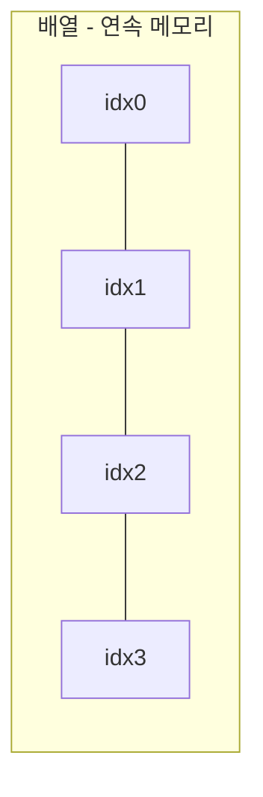
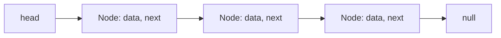

# 배열과 연결 리스트

## 핵심 정의
배열(array)은 동일한 크기의 원소들을 메모리상에 연속(contiguous)으로 배치하고 인덱스(index)로 직접 접근하는 자료구조다. 연결 리스트(linked list)는 각 노드(node)가 데이터와 다음(혹은 이전) 노드에 대한 참조를 갖는 형태로, 메모리상에 흩어져 존재하며 참조를 따라가야 원하는 원소에 도달할 수 있다. 두 구조 모두 선형(linear) 자료구조지만 메모리 배치 방식의 차이가 접근 속도, 삽입/삭제 비용, 캐시 효율에 근본적인 차이를 만든다.

## 동작 원리 / 구조

**배열**
- 시작 주소 + (인덱스 × 원소 크기)로 임의 접근(random access)이 O(1)에 가능하다.
- Java의 `ArrayList`는 내부적으로 `Object[]` 배열을 감싸고, 용량이 부족하면 OpenJDK25 구현에서 보통 약1.5배를 선호하되 최소 필요 용량·배열 한도를 반영해 새 배열을 만들어 복사(reallocation)한다. 이 복사 비용 때문에 끝에 추가는 상환(amortized) O(1)이지만 순간적으로 O(n)이 발생할 수 있다.
- 중간 삽입/삭제 시 뒤 원소들을 한 칸씩 이동해야 하므로 O(n)이다.

**연결 리스트**
- 단일 연결 리스트(singly linked list)는 `next` 포인터만, 이중 연결 리스트(doubly linked list)는 `next`와 `prev`를 모두 가진다. Java의 `LinkedList`는 이중 연결 리스트로 구현되어 있다.
- 특정 위치에 접근하려면 head(또는 tail)부터 순차 탐색해야 하므로 임의 접근이 O(n)이다.
- 이중 연결 리스트에서 해당 노드를 알고 있거나 단일 리스트에서 필요한 이전 노드 참조까지 있으면 포인터 조작은 O(1)이다 (탐색 비용은 별도).

| 연산 | 배열 (ArrayList) | 연결 리스트 (LinkedList) |
|---|---|---|
| 임의 접근 get(i) | O(1) | O(n) |
| 끝에 추가 | 상환 O(1) | O(1) |
| 중간 삽입/삭제 | O(n) | O(1) (참조 확보 후) |
| 메모리 오버헤드 | 배열 여유 용량·참조·헤더 비용 | 높음 (참조 필드만큼 추가) |
| 캐시 지역성 | 우수 | 낮음 |

Java ArrayList/LinkedList의 Node는 공개되지 않으므로 인덱스 add/remove는 위치 탐색 비용까지 포함한다. ListIterator로 이미 찾은 LinkedList 위치에서의 삽입/삭제와 구분한다. Object[]는 객체 자체가 아니라 참조가 연속적이며 primitive 배열과 locality·boxing 비용이 다르다.

## 실무 관점
- **캐시 지역성(cache locality)이 실무 성능에 미치는 영향이 이론적 시간복잡도보다 큰 경우가 많다.** 연결 리스트는 노드가 힙(heap)에 흩어져 있어 순회 시 캐시 미스(cache miss)가 빈번하다. 실제 벤치마크에서 순차 순회조차 `ArrayList`가 `LinkedList`보다 빠른 경우가 대부분이라, "삽입이 잦으니 LinkedList"라는 통념은 실측 없이 적용하면 오히려 손해를 볼 수 있다.
- Java에서는 대부분의 경우 `ArrayList`가 기본 선택지다. `LinkedList`는 큐/덱(Deque)으로 사용하거나 `Iterator`를 통해 순회 중 삭제를 반복하는 특수한 경우에만 고려한다. 실제로 큐가 필요하면 `ArrayDeque`가 배열 기반 원형 버퍼(circular buffer)로 구현되어 `LinkedList`보다 대체로 빠르다.
- `ArrayList` 초기 용량(initial capacity)을 예측 가능한 경우 생성자에서 지정하면 불필요한 리사이즈(resize)와 배열 복사를 줄일 수 있다. 대량 데이터를 반복 추가하는 배치 작업에서 효과가 크다.
- 흔한 실수: 반복문 안에서 `List.remove(int index)`를 배열 기반 리스트에 반복 호출하면 매번 O(n) 이동이 발생해 전체가 O(n²)로 폭발한다. ArrayList의 Iterator.remove()도 원소를 이동하므로 반복하면 O(n²)일 수 있다. JDK25 ArrayList.removeIf의 일괄 압축이나 새 결과 배열을 활용한다.
- 흔한 실수: 멀티스레드 환경에서 `ArrayList`에 동시 쓰기가 발생하면 데이터 손상이 생기거나 best-effort fail-fast가 ConcurrentModificationException을 던질 수 있다. 예외 발생은 보장되지 않는다. `CopyOnWriteArrayList`(읽기 위주) 또는 명시적 동기화로 대응한다.

## 심화 Q&A

### Q. ArrayList의 용량 증가 배율이 1.5배인 이유는 무엇이고, 2배로 하면 어떤 문제가 생기는가?
A. 성장 배율이 클수록 복사 빈도는 줄고 사용하지 않는 용량이 늘 수 있다. OpenJDK25의 preferred growth는 oldCapacity >> 1이지만 이는 API 계약이 아니다. JVM GC·allocator를 무시한 황금비 메모리 재사용 논리로 1.5배의 채택 이유나 2배 성장의 문제를 단정할 수 없다. 전체 복사량·최대 일시 메모리·latency를 함께 평가한다.

### Q. 연결 리스트에서 사이클(cycle)을 O(1) 추가 공간으로 탐지하는 방법은?
Floyd의 토끼와 거북이(tortoise and hare) 알고리즘을 사용한다. 느린 포인터는 한 칸씩, 빠른 포인터는 두 칸씩 이동시켜 둘이 다시 만나면 사이클이 존재한다. 만난 지점과 head에서 각각 한 칸씩 이동시키면 사이클의 시작점도 찾을 수 있다.

### Q. 배열 기반 큐를 원형 버퍼(circular buffer)로 구현하지 않으면 어떤 문제가 생기는가?
단순 배열로 큐를 구현하면 dequeue 시 front 인덱스만 증가시키고 실제 메모리는 이동하지 않으므로, 앞쪽 공간이 비어도 재사용되지 않아 결국 배열이 꽉 찬 것처럼 보이는 문제가 생긴다. 원형 버퍼는 인덱스를 모듈러 연산으로 순환시켜 이 공간을 재사용한다. `ArrayDeque`가 이 방식으로 구현되어 있다.

### Q. 단일 연결 리스트 기반 스택은 왜 head를 사용하는가?
tail에 추가/삭제하려면 이전 노드를 알아야 삭제 후 새 tail을 갱신할 수 있는데, 단일 연결 리스트는 이전 노드에 대한 참조가 없어 O(n) 탐색이 필요하다. head는 항상 참조를 들고 있으므로 O(1)로 삽입/삭제가 가능하다. 이중 연결 리스트라면 tail에서도 O(1)이 가능하다.

### Q. 배열의 크기를 미리 알 수 있는 상황에서도 ArrayList 대신 순수 배열(T[])을 쓰는 것이 유리한 경우는?
박싱(boxing) 오버헤드를 피해야 하는 기본형(primitive) 대량 데이터(예: `int[]`)를 다룰 때다. `ArrayList<Integer>`는 원소를 Integer 참조로 보관해(값 캐시·재사용 여부에 따라 객체는 공유 가능) 메모리 사용량과 GC 부담이 크게 늘어난다. 성능이 민감한 수치 연산 코드에서는 원시 배열이나 `IntStream`, 외부 라이브러리의 primitive collection을 고려한다.

### Q. 연결 리스트 기반 구조가 배열보다 유리한 실무 시나리오를 하나 든다면?
LRU 캐시(Least Recently Used cache) 구현에서 이중 연결 리스트 + 해시맵 조합이 표준적으로 쓰인다. 접근된 노드를 리스트의 맨 앞으로 옮기고 맨 뒤 노드를 제거하는 연산이 모두 O(1) 포인터 조작으로 끝나기 때문이다. 배열 기반으로는 이 재배치 비용이 O(n)이 된다.

## 관련 개념
- [[자료구조 선택 기준]]
- [[해시 테이블]]
- [[트리와 이진 탐색 트리]]

## 참고 자료

- [JDK25 ArrayList](https://docs.oracle.com/en/java/javase/25/docs/api/java.base/java/util/ArrayList.html) — amortized append·failfast. 확인: 2026-09-08.
- [OpenJDK ArrayList source](https://github.com/openjdk/jdk/blob/jdk-25%2B36/src/java.base/share/classes/java/util/ArrayList.java) — jdk-25+36·grow·removeIf·remove. 확인: 2026-09-08.
- [JDK25 LinkedList](https://docs.oracle.com/en/java/javase/25/docs/api/java.base/java/util/LinkedList.html) — doubly linked·ListIterator. 확인: 2026-09-08.
- [JDK25 ArrayDeque](https://docs.oracle.com/en/java/javase/25/docs/api/java.base/java/util/ArrayDeque.html) — Deque 연산. 확인: 2026-09-08.
