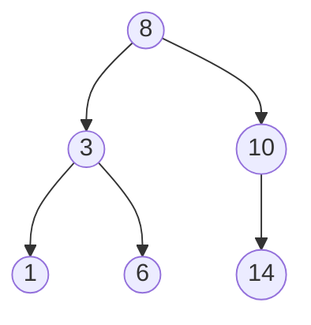

# 트리와 이진 탐색 트리

## 핵심 정의
트리(tree)는 노드(node)들이 부모-자식 관계로 연결되어 사이클 없이 계층 구조를 이루는 비선형(non-linear) 자료구조다. 이진 탐색 트리(binary search tree, BST)는 각 노드가 최대 두 개의 자식을 가지며, 왼쪽 서브트리의 모든 값은 부모보다 작고 오른쪽 서브트리의 모든 값은 부모보다 크다는 정렬 불변식(invariant)을 유지하는 트리다. 여기서는 중복 키를 별도 노드로 두지 않는 BST를 가정한다. 탐색·삽입·삭제는 높이(height) h에 대해 O(h)이며, 무작위 삽입 순서 등의 분포 가정에서 평균 O(log n)이다. 비교 결과가 같은 키는 값을 교체하거나 개수를 저장하는 등 정책을 정해야 한다.

## 동작 원리 / 구조

**기본 탐색/삽입 로직**: 루트에서 시작해 찾는 값이 현재 노드보다 작으면 왼쪽, 크면 오른쪽으로 이동한다. 삽입도 동일한 방식으로 빈 자리를 찾아 새 노드를 붙인다.

**순회(traversal) 방식**
- 중위 순회(in-order): 왼쪽 → 노드 → 오른쪽. BST에서는 오름차순 정렬된 결과를 얻는다.
- 전위 순회(pre-order): 노드 → 왼쪽 → 오른쪽. 트리 구조 복제/직렬화에 사용.
- 후위 순회(post-order): 왼쪽 → 오른쪽 → 노드. 노드 삭제(하위부터 정리)나 디렉터리 크기 계산에 사용.

**BST의 치명적 약점**: 정렬된 데이터를 순서대로 삽입하면 트리가 한쪽으로만 뻗어나가는 편향 트리(skewed tree)가 되어 사실상 연결 리스트와 같아지고, 모든 연산이 O(n)으로 퇴화한다.

**균형 트리(self-balancing tree)로 보완**
- AVL 트리: 삽입/삭제마다 좌우 서브트리 높이 차를 1 이하로 유지하도록 회전(rotation)한다. 조회가 빈번한 경우 유리하다.
- 레드-블랙 트리(red-black tree): 색상 규칙으로 느슨하게 균형을 유지한다. 회전과 재색칠로 높이를 제한하며, AVL과의 읽기·쓰기 성능 차이는 구현과 워크로드에 달려 있다. Java의 `TreeMap`/`TreeSet`이 레드-블랙 트리로 구현되어 있다.
- B-트리(B-tree) / B+트리: 노드 하나가 여러 자식과 여러 키를 가져 디스크 I/O 횟수를 줄인다. 대부분의 RDBMS 인덱스(index)가 B+트리 기반이다.

| 구조 | 평균 탐색 | 최악 탐색 | 대표 사용처 |
|---|---|---|---|
| 비균형 BST | O(log n), 무작위 삽입 가정 | O(n) | 교육용, 소규모 데이터 |
| AVL 트리 | O(log n) | O(log n) | 조회 위주 워크로드 |
| 레드-블랙 트리 | O(log n) | O(log n) | `TreeMap`, `TreeSet`, 리눅스 스케줄러 |
| B+트리 | O(log n) | O(log n) | RDBMS 인덱스, 파일시스템 |

## 실무 관점
- Java `TreeMap`/`TreeSet`은 키 정렬(natural ordering 또는 `Comparator`)이 필요할 때 사용한다. `ceilingKey`, `floorKey`, `headMap`, `tailMap` 등 범위 질의(range query)가 필요하면 `HashMap`보다 이 구조가 명확히 유리하다.
- `HashMap`과 `TreeMap` 선택 기준: 순서가 필요 없고 O(1) 평균 접근만 필요하면 `HashMap`, 정렬 순서 유지나 범위 검색이 필요하면 `TreeMap`. Java SE 25 `TreeMap`은 `get`·`put`·`remove`·`containsKey`에 O(log n)을 보장한다. 전체 순회는 O(n), k개 결과를 읽는 범위 조회는 통상 O(log n+k)이므로 모든 연산을 O(log n)이라고 하지 않는다. 실제 조회 성능은 키 비교 비용과 워크로드로 측정한다.
- RDBMS 인덱스는 조회 선택도, 데이터 분포, 정렬·커버링 여부에 따라 효과가 달라진다. 낮은 카디널리티만으로 무용하다고 판단하지 않는다. 복합 B-tree는 선두 열의 동등 조건과 다음 열의 범위 조건이 탐색 범위를 줄이는 데 유리하지만, PostgreSQL 18의 skip scan처럼 선두 열 조건 없이도 후속 열 조건을 활용하는 예외가 있다. 실행 계획으로 확인한다.
- 흔한 실수: 재귀(recursion)로 트리를 순회하는 코드는 깊이가 매우 깊은 트리(수만 노드 이상의 편향 트리 등)에서 `StackOverflowError`를 유발할 수 있다. 운영 환경에서 사용자 입력에 따라 트리 깊이가 커질 수 있다면 반복문 + 명시적 스택으로 전환을 고려한다.
- 흔한 실수: BST에 이미 정렬된 데이터를 그대로 삽입해 편향 트리를 만드는 경우. 셔플(shuffle)은 기대 높이를 낮추지만 최악의 경우를 없애지는 못한다. 높이 보장이 필요하면 균형 트리 구현체를 쓴다.
- 트리 삭제 로직에서 자식이 두 개인 노드를 삭제할 때는 중위 후속자(in-order successor, 오른쪽 서브트리의 최소값) 또는 중위 선행자(in-order predecessor)로 대체하는 것이 표준 패턴이다.

## 심화 Q&A

### Q. 레드-블랙 트리가 AVL 트리보다 삽입/삭제에 유리한 이유를 구조적으로 설명하면?
AVL은 좌우 높이 차를 1 이하로 제한해 더 엄격한 높이 균형을 유지한다. 레드-블랙 트리는 색상 불변식으로 최장 루트-리프 경로가 최단 경로의 두 배 이하가 되도록 한다. 삽입·삭제의 회전 횟수와 재색칠·높이 갱신 비용은 구현에 따라 다르며, 회전이 적다고 전체 갱신 비용이 O(1)이 되는 것은 아니다. 두 구조 모두 기본 연산은 O(log n)이고, 읽기/쓰기 비율만으로 항상 어느 쪽이 빠르다고 결론 내리지 않는다.

### Q. RDBMS 인덱스에 이진 탐색 트리 대신 B+트리를 쓰는 이유는?
저장장치 접근은 페이지 단위이며 버퍼 캐시에 없는 페이지를 읽는 비용이 크다. 이진 트리는 노드당 자식이 둘뿐이라 높이가 커지기 쉽다. B+트리는 한 페이지에 여러 키와 자식 포인터를 담아 fan-out을 높여 탐색에 필요한 페이지 수를 줄이고, 리프를 순서대로 연결해 범위 스캔을 지원한다. 실제 높이는 페이지 크기·키 폭·채움률·데이터 규모에 따라 달라지므로 3~4로 고정하지 않는다.

### Q. BST에서 최악의 경우 O(n)으로 퇴화하는 시나리오와 이를 방지하는 실무적 방법은?
정렬된 순서(오름차순 또는 내림차순)로 데이터를 연속 삽입하면 각 노드가 한쪽 자식만 가지는 편향 트리가 된다. 완화책은 (1) 삽입 전 데이터를 무작위로 섞어 기대 높이를 낮춘다(최악 보장 없음), (2) 처음부터 AVL/레드-블랙 같은 자가 균형 트리를 사용한다, (3) 언어/프레임워크가 제공하는 검증된 구현체(`TreeMap` 등)를 쓴다.

### Q. 중위 순회로 BST를 검증(validate)하는 방법과 그 한계는?
중복 키가 없고 비교자가 전순서를 정의한다면, 중위 순회 결과가 엄격한 증가 순서인지 확인하는 것은 BST 불변식 검증에 충분하다. 왼쪽 손자가 조부모보다 큰 위반도 순서가 역전되어 검출된다. 중복을 한쪽 서브트리에만 허용하는 정책은 비감소 순서만으로 위치까지 검증할 수 없으므로, 노드별 상·하한과 경계 포함 여부를 전달하는 범위 검증을 쓴다. TreeMap은 비교 결과가 0인 키를 같은 키로 취급하므로 Comparator와 equals의 일관성도 확인한다.

### Q. 트리의 높이(height)와 노드 수(n)의 관계가 시간복잡도 논의에서 왜 중요한가?
균형 트리는 h = O(log n)이지만 편향 트리는 h = O(n)이다. 탐색/삽입/삭제의 시간복잡도가 실제로는 "O(log n)"이 아니라 "O(h)"이며, 균형이 보장될 때만 이것이 O(log n)으로 좁혀진다는 점을 구분해야 한다. 이 구분이 왜 자가 균형 트리가 필요한지의 핵심 근거다.

### Q. HashMap이 평균 O(1)인데도 TreeMap을 선택해야 하는 구체적 상황은?
범위 질의(특정 값 이상/이하 조회), 정렬된 순서로 순회해야 하는 경우, 최솟값/최댓값을 자주 조회하는 경우(`firstKey`/`lastKey`)에는 TreeMap이 적합하다. 예를 들어 시계열 데이터에서 특정 타임스탬프 이전의 가장 가까운 이벤트를 찾는 `floorKey` 연산은 HashMap으로는 O(n) 전수 조사 없이는 구현할 수 없다.

## 관련 개념
- [[자료구조 선택 기준]]
- [[배열과 연결 리스트]]
- [[해시 테이블]]

## 참고 자료

- [Algorithms 4판: Binary Search Trees](https://algs4.cs.princeton.edu/32bst/) — BST 불변식, 임의 삽입 순서의 평균 성능, 순회와 O(h) 연산. 확인: 2026-09-08.
- [Algorithms 4판: Balanced Search Trees](https://algs4.cs.princeton.edu/33balanced/) — 균형·회전·재색칠 및 로그 높이. 확인: 2026-09-08.
- [Java SE 25 TreeMap](https://docs.oracle.com/en/java/javase/25/docs/api/java.base/java/util/TreeMap.html) — 레드-블랙 트리, 기본 연산 보장 및 비교자 계약. 확인: 2026-09-08.
- [PostgreSQL 18: Multicolumn Indexes](https://www.postgresql.org/docs/18/indexes-multicolumn.html) — 복합 B-tree 인덱스의 선두 열 조건과 skip scan 예외. 확인: 2026-09-08.
