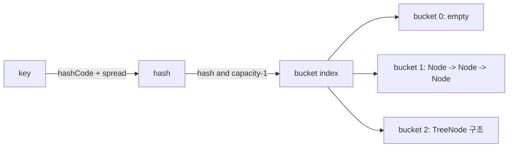

# 해시 테이블

## 핵심 정의
해시 테이블(hash table)은 키(key)를 해시 함수(hash function)로 변환한 값을 인덱스로 사용해 배열의 특정 버킷(bucket)에 데이터를 저장하는 자료구조다. 해시가 적절히 분산되고 부하율을 관리하며 키 연산 비용을 상수로 볼 때 삽입·삭제·조회가 평균 O(1)에 수행되어 순서를 신경 쓰지 않는 키-값 매핑에서 가장 널리 쓰인다. 다만 서로 다른 키가 같은 해시값을 갖는 해시 충돌(hash collision)이 필연적으로 발생하며, 이를 어떻게 처리하느냐가 구현의 핵심이다.

## 동작 원리 / 구조

**해시 충돌 해결 방식**
- 체이닝(separate chaining): 같은 버킷에 매핑된 원소들을 연결 리스트(또는 트리)로 묶어 저장한다. Java `HashMap`이 이 방식이다.
- 개방 주소법(open addressing): 충돌 시 다른 빈 슬롯을 탐사(probing)해 저장한다. 선형 탐사(linear probing), 이차 탐사(quadratic probing), 이중 해싱(double hashing) 등이 있다.

**Java HashMap 내부 동작 (OpenJDK25+36 확인)**
1. `key.hashCode()` 결과에 상위 비트를 하위 비트와 XOR하는 보조 해시 함수(spread)를 적용해 분포를 개선한다.
2. `hash & (capacity - 1)` 연산으로 버킷 인덱스를 구한다. 용량(capacity)이 항상 2의 거듭제곱이라 이 연산이 나머지 연산(`%`)보다 빠르다.
3. TREEIFY_THRESHOLD=8, MIN_TREEIFY_CAPACITY=64를 사용한다. 일반 putVal 경로는 기존8개 버킷에9번째를 추가할 때 treeify를 시도하고 작은 table은 resize한다. UNTREEIFY_THRESHOLD=6은 resize split에서 쓰며 일반 remove는 트리 형태 등으로 전환을 판단한다. 상세는 [[HashMap 내부 구조]]를 참고한다.
4. 원소 수가 `capacity × loadFactor`(기본 0.75)를 초과하면 테이블 크기를 2배로 늘리고 모든 원소를 재배치(rehashing)한다.

| 항목 | 값 | 비고 |
|---|---|---|
| 기본 초기 용량 | 16 | 2의 거듭제곱 유지 |
| 기본 부하율(load factor) | 0.75 | 공간-시간 트레이드오프의 균형점 |
| 트리화(treeify) 임계값 | 상수8·최소용량64; put 경로의 시도 시점 확인 | 비교 가능한 키 등 조건에서 성능 완화 |
| 역트리화(untreeify) 임계값 | resize split:6 이하; 일반 remove는별도판정 | 오버헤드 회수 |

HashMap 기본16은 기본 생성 후 첫 table 할당의 용량이며 생성 순간 배열을 반드시 할당하는 것은 아니다. HashMap.newHashMap(expectedSize)는 Java19+ API다. record도 내부에 가변 객체를 담으면 깊은 불변을 보장하지 않는다. equals 계약을 지키는 같은 키의 put은 값 교체이고 hash collision인 다른 키는 공존한다. hashCode/equals·compare 비용이 키 길이에 비례하면 연산 비용 분석에 이를 포함한다.

## 실무 관점
- **`equals()`와 `hashCode()`는 반드시 함께 오버라이드**해야 한다. 두 메서드의 계약이 깨지면(같은 것으로 판단되는 두 객체가 다른 해시값을 반환하면) `HashMap`/`HashSet`에서 값이 조회되지 않는 은근한 버그가 생긴다. 실무에서 자주 겪는 사례: 엔티티 클래스에서 `equals`만 오버라이드하고 `hashCode`는 기본 identity 기반 그대로 두는 실수.
- **키의 equals/hashCode에 쓰는 상태를 저장 중 변경하면 안 된다.** 키를 넣은 뒤 해당 객체의 필드를 변경하면 해시값이 달라져 원래 버킷에서 찾을 수 없게 된다. 불변(immutable) 객체(`String`, `Long`, 값이 고정된 record/DTO)를 키로 쓰는 것이 안전하다.
- 초기 용량을 예측 가능하면 생성자에서 지정해 리해싱 횟수를 줄인다. 예: `HashMap.newHashMap(expectedSize)`처럼 부하율을 고려해 계산하면 불필요한 재해싱을 피할 수 있다.
- 동시 수정에는 HashMap을 외부 동기화 없이 사용하면 안 된다. 안전하게 공개한 뒤 변경하지 않는 map의 동시 읽기는 가능하다. `Collections.synchronizedMap`은 전체를 락(lock)으로 감싸 경합이 심하고, `ConcurrentHashMap`은 버킷 단위(또는 CAS 기반) 동시성 제어로 훨씬 높은 처리량을 낸다. 실무에서는 특별한 이유가 없으면 `ConcurrentHashMap`이 기본 선택지다.
- 해시 분포가 나쁜 커스텀 `hashCode()`(예: 항상 상수를 반환)는 모든 원소가 같은 버킷에 몰려 사실상 연결 리스트/트리 성능(O(log n) 또는 O(n))으로 퇴화시킨다. 실제 장애 사례로, 특정 필드만 사용해 해시를 계산했는데 그 필드 값 분포가 편중되어 있어 트리화 임계값을 넘기며 지연이 튄 경우가 있다.
- 캐시 키 설계 시 해시 테이블 기반 캐시(로컬 캐시, Redis 등)의 키 카디널리티(cardinality)를 고려해야 한다. 재사용 대비 키 수가 많으면 적중률·용량이 악화될 수 있다. 서로 다른 요청을 같은 논리 키로 매핑하는 설계 오류와 서로 다른 키의 hash collision은 구분한다.

## 심화 Q&A

### Q. HashMap의 기본 부하율이 왜 0.75인가?
부하율이 낮을수록 충돌 확률은 줄지만 메모리 낭비가 커지고, 높을수록 메모리 효율은 좋아지지만 충돌과 성능 저하 위험이 커진다. 0.75는 시간(time)과 공간(space) 비용의 경험적 균형점으로 선택된 값이며, 대부분의 범용 사용 사례에서 합리적인 절충안으로 알려져 있다. 조회 성능이 극도로 중요하고 메모리 여유가 있다면 더 낮은 부하율을, 메모리가 제약이라면 더 높은 부하율을 명시적으로 지정할 수 있다.

### Q. HashMap과 ConcurrentHashMap은 동시성 처리 방식에서 근본적으로 어떻게 다른가?
`HashMap`은 동시성을 전혀 고려하지 않아 멀티스레드 환경에서 무한 루프(Java 7 이전 리해싱 버그)나 데이터 유실이 발생할 수 있다. `ConcurrentHashMap`은 세그먼트(segment) 단위로 락을 분산시키거나(Java 7, 기본 concurrencyLevel 16개의 `Segment`가 각각 `ReentrantLock`을 상속) CAS(Compare-And-Swap) 연산과 필요한 경우에만 노드(버킷의 첫 번째 노드) 단위 동기화를 사용해(Java 8 이후) 여러 스레드가 서로 다른 세그먼트/버킷에 동시에 쓰기를 수행할 수 있게 한다. 단, `size()`처럼 전체를 집계하는 연산은 여전히 근사치이거나 추가 비용이 든다는 점은 유의해야 한다.

### Q. 해시 충돌 공격(hash collision DoS)이란 무엇이고 어떻게 방어하는가?
A. 공격자는 같은 버킷으로 몰리는 키를 만들어 연산 비용을 높일 수 있다. JDK25 HashMap은 tree bin을 사용하지만 모든 키에 최악 O(log n)을 보장하지 않는다. 동일 hash이며 비교로 순서를 정할 수 없는 키는 TreeNode.find가 양쪽 가지를 탐색해 O(n)이 될 수 있다. 현재 String.hashCode가 기본적으로 무작위 seed를 쓴다는 설명도 틀리다. 입력 크기·키 길이·요청 자원 한도와 검증을 함께 적용한다.

### Q. 개방 주소법과 체이닝 중 어떤 상황에서 어떤 방식이 유리한가?
체이닝은 부하율이 1을 넘어도 동작하고 삭제가 단순하지만, 포인터를 따라가야 해 캐시 지역성이 떨어진다. 개방 주소법은 모든 데이터가 배열 안에 있어 캐시 지역성이 좋고 메모리 오버헤드(포인터)가 없지만, 부하율이 높아질수록 탐사 클러스터링(clustering)으로 성능이 급격히 나빠지고 삭제 시 탐사 경로가 끊기지 않도록 특별한 처리(tombstone 등)가 필요하다. 메모리 효율과 캐시 성능이 중요한 시스템 프로그래밍에서는 개방 주소법을, 범용 컬렉션에서는 구현 단순성 때문에 체이닝을 선호하는 경향이 있다.

### Q. HashMap 리사이징(rehashing) 도중 반복(iteration)을 수행하면 왜 위험한가?
리사이징은 모든 원소를 새 버킷 배열로 재배치하는 과정이라, 이 시점에 다른 스레드가 동시에 읽거나 쓰면(단일 스레드용 `HashMap`을 동시성 환경에서 사용) 데이터 정합성이 깨지거나 특정 Java 버전에서는 연결 리스트가 순환 참조를 이루어 무한 루프에 빠지는 문제가 보고된 바 있다. 이것이 멀티스레드 환경에서 `HashMap` 대신 `ConcurrentHashMap`을 써야 하는 핵심 이유 중 하나다.

### Q. TreeMap과 HashMap의 순서 보장 차이를 내부 구조로 설명하면?
`HashMap`은 키를 해시값 기반 버킷에 분산시키므로 삽입 순서나 값의 크기 순서와 무관하게 저장되어 순회 순서가 사실상 정의되지 않는다(같은 JVM, 같은 실행에서도 리해싱 시점에 따라 순서가 바뀔 수 있다). `LinkedHashMap`은 별도의 연결 리스트로 삽입 순서(또는 접근 순서)를 유지해 순서를 보장하고, `TreeMap`은 레드-블랙 트리 구조 자체가 키의 정렬 순서를 유지하므로 중위 순회만으로 오름차순 결과를 얻는다.

## 관련 개념
- [[자료구조 선택 기준]]
- [[배열과 연결 리스트]]
- [[트리와 이진 탐색 트리]]
- [[HashMap 내부 구조]]

## 참고 자료

- [JDK25 HashMap](https://docs.oracle.com/en/java/javase/25/docs/api/java.base/java/util/HashMap.html) — 부하율·newHashMap·동시성·iterator. 확인: 2026-09-08.
- [OpenJDK HashMap source](https://github.com/openjdk/jdk/blob/jdk-25%2B36/src/java.base/share/classes/java/util/HashMap.java) — jdk-25+36·putVal·treeifyBin·TreeNode.find/split/remove. 확인: 2026-09-08.
